# 02 — تقرير المراجعة الشاملة للحالة الراهنة (Full As-Is Audit Report)

**النظام:** Nile Pharma ERP · **التاريخ:** 2026-10-01 · **المراجِع:** Claude (تحليل ساكن) · **الحالة:** مسودة للمراجعة المشتركة قبل أي تنفيذ.

---

## 1. الغرض والنطاق والمنهجية

**الغرض:** فهم النظام كما هو فعليًا — من المعمارية إلى العمليات التجارية والتشغيل والإدارة — وتحديد الفجوات بين الأعمال والكود وقاعدة البيانات والتشغيل والنشر. ليس code review ولا قائمة bugs فقط.

**مصادر الأدلة:**

| الرمز | المصدر | الطبيعة |
|---|---|---|
| S1 `[B]` | أرشيف `git archive` لـ`89c2c31` (2026-09-26) | committed فقط؛ checksum OK |
| S2 `[C]` | أرشيف `git archive` لـ`fa40270` (HEAD وقت التصدير) | committed فقط؛ checksum OK |
| S3 `[R]` | `evidence/runtime.txt` | خام؛ حاوية accounting فقط |
| S4 `[R]` | `evidence/git-and-schema.txt`, `accounting-migration-history.txt` | خام من git على السيرفر |
| S5 `[U]` | `NilePharma_Audit.docx` | ملاحظات تشغيل منقولة بلا مخرجات خام |
| S6 | `Nile_Pharma_As_Is_Findings_20261001.md` | تقرير سابق — أُعيد تقييمه (`16`) |
| S7 | تشغيل ساكن لـ`validate-schema-migrations.cjs` و`node --check` + أدوات استخراج كتبتها (`tools/`) | قراءة ملفات فقط |

**المنهجية:** فك الحزمة والتحقق من الـchecksums → استخراج آلي حتمي (Prisma schemas → قاموس بيانات وERDs وفروق؛ decorators → جرد 553 route مع الحراس والـmounting واستخدام الواجهة) → مراجعة معمّقة لسبعة محاور بقراءة الكود في النسختين → تحقق مستقل من أدلة أهم النتائج (عينة: ACC-02، ACC-04، ACC-06، SAL-01، SEC-01، SEC-02، OPS-03، OPS-05) → توحيد 127 نتيجة بتصنيف ودرجة خطورة مبررة.

**التصنيف:** Verified (رأيته في الكود/الدليل) · Inferred (استنتاج من الكود بلا تنفيذ) · Unknown (لا دليل). "الكود يفعل X" ≠ "الإنتاج يفعل X".

**حدود التفويض المحترمة:** لا تعديل، لا تثبيت، لا بناء، لا تشغيل، لا اتصال بالسيرفر أو القاعدة، لا طباعة أسرار، لا فتح محتوى `Data/`.

## 2. ثلاث نسخ من "الحقيقة"

| | الكود المرجّح للإنتاج (B 89c2c31) | الكود الأحدث (C fa40270) | التشغيل المثبت/المبلغ |
|---|---|---|---|
| الصورة | — | — | `nile-pharma-erp/accounting:release-89c2c31` (tag محلي) `[R]` |
| migrations المحاسبة | 30 | 41 | حتى `bank_reconciliation` (= 41) `[U]` |
| جداول المحاسبة | 36+1 | 49+1 | 50 `[U]` |
| GL | لا يوجد | 3 تنفيذات متعارضة | جداول GL موجودة غالبًا بلا كاتب في B |
| قاعدة البيانات في الوثائق | Neon | Neon | `nile-postgres` PG18 محلي `[R]`+`[U]` |
| النشر | يدوي `--no-deps` + بناء محلي | آلي بالـdigest + Neon | استرداد يدوي بملف `/tmp` |

**الاستنتاج (Inferred):** الإنتاج اليوم = صور مسماة `89c2c31` (محتواها غير مثبت) فوق قاعدة تشير إفادات غير مثبتة إلى أنها رُحّلت إلى ما بعد BASELINE (أعداد الجداول لا تثبت الإصدار [تصحيح 34]). تحليل الـmigrations يشير إلى أن كود BASELINE يعمل فوق الـschema الأحدث (كل الإضافات إضافية)، وأن الجداول الجديدة فارغة. E-05 (محتوى `dist` داخل الحاوية) **يضيّق الاحتمالات ولا يحسم commit بعينه**؛ حالة القاعدة تُحسم بـE-03/E-04. [تصحيح 34]

## 3. المعمارية (ملخص `03`)
- **المكونات:** web (Next.js BFF) + iam + organization + products + inventory + crm + sales + accounting + incentives + audit-aggregator + Redpanda + Postgres واحد بتسع قواعد. التفاصيل والمسؤوليات وملكية البيانات في `03`.
- **الاتصال المتزامن:** المتصفح → NPM → web (rewrites مخبوزة) → الخدمة؛ اقترانات HTTP بين الخدمات أهمها accounting→inventory/products/sales وsales↔crm، كلها بتوكن المستخدم.
- **الاتصال غير المتزامن:** 68 نوع حدث على 70 موضوعًا؛ saga للطلب (Sales↔Inventory↔Accounting) والتحصيل (Accounting→Sales/Incentives)؛ audit-aggregator يستهلك كل شيء.
- **الفرق بين الموثق والكود والتشغيل:** `03` §6 — أهمه Neon مقابل Postgres المحلي، ومسار النشر الفعلي غير الموثق.

## 4. كيف يعمل النظام (ملخص `04`)
- **البدء:** redpanda → db-migrate (بوابة schema ثم ترحيل تسلسلي ثم seed) → الخدمات (تنتظر نجاح db-migrate) → web. فعليًا تُشغّل بـ`--no-deps`.
- **الطلب:** JWT HS256 (900ث) يحمل الصلاحيات؛ Throttler بالـIP؛ PermissionsGuard لكل controller؛ لا tenant ولا فرع.
- **المعاملات والأحداث:** SERIALIZABLE مع retry في المسارات الحرجة؛ النشر غالبًا بعد الـcommit (dual-write)؛ dedup بعلامة بعد المعالج؛ DLQ مركزي مع إعادة نشر.
- **الخلفية:** 8 مهام مجدولة بقفل advisory + 3 outbox relays.
- **المراقبة:** healthchecks؛ لا metrics ولا تنبيهات؛ Sentry غالبًا غير فعّال.

## 5. الـAPI (ملخص `05`)
553 route في CURRENT (475 في B)؛ 548 بصلاحية على مستوى الدالة و5 عامة (auth). **CURRENT:** 35 route غير مفعّلة، الواجهة تستدعي 12 منها، و4 controllers بلا حارس صلاحيات. التوجيه الخارجي `/api/<alias>/*` ← الداخلي `/api/*`. جرد كامل قابل للفرز في `api-inventory.csv` مع حدود تغطية معلنة (عقود الاستجابة وحقول التحقق لكل DTO لم تُجرد).

## 6. البيانات (ملخص `06`، `07`، `09`)
- 175 model؛ قاموس بيانات كامل لكل حقل؛ ERDs لكل مجال (المحاسبة مقسمة لأربعة).
- **الدقة المالية جيدة** (Decimal بدقة صريحة)؛ لا FK عبر الخدمات (217 مرجعًا منطقيًا) ولا أدوات مطابقة.
- **فجوات:** شكلان متعارضان لجداول GL وsupplier_payments؛ 22 تعارضًا Prisma↔SQL في محاسبة CURRENT؛ لا CHECK على أرصدة المخزون؛ status نصي في 7 مواضع؛ لا سياسة احتفاظ.
- **القاعدة الفعلية: Unknown** — لا تصنيف drift دون E-03/E-04.

## 7. العمليات التجارية (ملخص `08`)
25 عملية موثقة بالخطوات والحالات والضوابط والـAPIs والجداول والأحداث والاستثناءات، مع swimlanes ومخططات حالات. أبرز ما يميز التصميم: **الفاتورة تُنشأ عند حجز المخزون لا عند الشحن** (قرار موثق)، والمحاسبة في B **دفاتر فرعية بلا قيد مزدوج**.

## 8. فجوات الأعمال (ملخص `10`)
- لا baseline متطلبات معتمد؛ من 87 متطلبًا/قرارًا: ~27 منفذ في النسختين، ~8 في CURRENT فقط، ~10 جزئي، ~9 غير منفذ، ~15 مفتوح.
- **حلقات مكسورة:** الشحن→التكلفة، التحصيل المباشر→الائتمان، المرتجع بعد السداد→AR، الاستلام→السداد (B)، HR→المحاسبة، الجودة→المخزون (بلا ضمان تسليم).
- **ضوابط ناقصة:** سقف الخصم (B)، maker-checker لحد الائتمان، SoD للقيود اليدوية (C)، فحص السلطة عند تعديل المستخدمين، SoD الأدوار كشفي فقط.
- مصفوفة تتبع Requirement → UI → API → Service → Data → Control → Test في `10` §9.

## 9. الأمن والاعتمادية وقابلية الصيانة

### 9.1 ثغرات/عيوب مثبتة في الكود (Verified)
| ID | الوصف | النسخة |
|---|---|---|
| SEC-01 | إعادة تعيين كلمة مرور أي مستخدم (بما فيهم SUPER_ADMIN) بصلاحية `iam.users.update` | BOTH |
| SEC-03 | بيانات أعمال حقيقية في git | BOTH |
| SEC-02 | seed معطوب يكسر الكتالوج والإصدار | CURRENT |
| SEC-10/11 | SoD كشفي بأكواد غير موجودة؛ توقيع إلكتروني ضعيف | BOTH |
| ACC-06, SAL-01, SAL-03, SAL-04, ACC-18 | عيوب سلامة مالية/حالات | BOTH/B |

### 9.2 مخاطر محتملة (Inferred / تحتاج ظرفًا)
SEC-04 (حراس مفقودة كامنة)، SEC-05 (تأخر سحب الصلاحية)، SEC-06 (توكنات في localStorage)، SEC-07 (throttling خلف الوكيل)، SEC-08 (سر مشترك)، INT-01..03 (اتساق الأحداث)، SAL-02 (سباق الإلغاء)، INV-03 (فقد أحداث الجودة)، OPS-02 (حذف حاوية القاعدة).

### 9.3 تحسينات اختيارية
هوية خدمات (ARC-06)، MFA، إصدار عقود الأحداث (INT-06)، فهارس (DB-06)، سياسة احتفاظ (DB-11)، صور non-root (OPS-10).

### 9.4 الاعتمادية
نقطة فشل واحدة لكل من: المضيف، Postgres، Redpanda؛ لا نسخ احتياطي آلي مثبت؛ أحداث بلا outbox؛ معالجات غير ذرية؛ لا مراقبة. **إيجابي:** retries وidempotency في المسارات المالية الأساسية، DLQ وإعادة نشر، سلسلة تدقيق.

### 9.5 قابلية الصيانة
- ~170 ألف سطر؛ 222 ملف اختبار (لم تُشغّل) — بعضها يتخطى نفسه بلا DB، وبعضها يحاكي SQL فيفوّت العيوب (INV-06)، وبعضها يتحقق من المجاميع لا الاتجاه (ACC-04).
- **ثلاثة تنفيذات لـGL ونسختان لسداد الموردين** في CURRENT، ووحدات مكتملة غير مسجلة، وأداة CI تتحقق من نص الـdecorator لا من الحارس → مؤشرات على عملية تطوير متعددة الوكلاء بلا تكامل نهائي.
- وثائق كثيرة (55+ في `docs/`) متقادمة أو متعارضة، وتقارير حالة تصدّق نفسها.
- تاريخ git يُظهر موجات "إصلاح البناء" بعد الدمج (commits `fix(build)`، `restore the build`) — هشاشة في التكامل المستمر.

## 10. النشر والتشغيل (ملخص `11`)
- النشر الفعلي يدوي وغير موثق للحالة الأخيرة؛ مسار CURRENT الآلي معطوب ساكنًا ويستهدف Neon.
- تعريف Postgres وNPM خارج git؛ لا نسخ آلي؛ DR على الورق وبأدلة اصطناعية.
- لا حدود موارد، لا تنبيهات؛ Redpanda أثقل مكون ذاكرةً.
- مصفوفة المسؤوليات التشغيلية الكاملة في `11` §10.

## 11. أهم النتائج (High/Critical) — التفاصيل في `12`

| ID | العنوان المختصر | النسخة | التحقق | الخطورة |
|---|---|---|---|---|
| ACC-02 | GL في CURRENT يفشل ويوقف الفوترة والتحصيل | C | Verified | Critical (كامن) |
| ARC-01 | هوية الكود العامل غير مثبتة | RUNTIME | Verified/Unknown | High |
| ARC-02 | مؤشرات على تقدم القاعدة على BASELINE (غير مثبت) | RUNTIME | Inferred | High |
| ARC-03 | تعريف Postgres خارج git | BOTH | Verified | High |
| DB-01 | تدخل يدوي في تاريخ الترحيل + تعديل migrations مطبقة | RUNTIME/C | Verified/Inferred | High |
| DB-02 | بوابة الـschema ترفض CURRENT (exit 3) | C | Verified | High |
| DB-03 | شكلان متنافسان لجداول GL/AP | C/RUNTIME | Inferred | High |
| ACC-01 | لا GL في BASELINE | B | Verified | High |
| ACC-06 | العكس لا يمس الخزينة | BOTH | Verified | High |
| ACC-10 | لا سداد موردين (B) / غير مفعّل (C) | BOTH | Verified | High |
| ACC-18 | مرتجع الفاتورة المسددة | BOTH | Verified | High |
| SAL-01/02/03/04 | حالة PAID، سباق الإلغاء، تعرض الائتمان، سقف الخصم | BOTH/B | Verified/Inferred | High |
| SAL-07 | العمولة لكل دفعة | BOTH | Verified/سؤال | High |
| INV-01/02/03 | طبقات التكلفة، تعويض الصرف، أحداث الجودة | C/C/BOTH | Verified | High |
| SEC-01/02/03 | كلمة مرور المدير، seed، بيانات في git | BOTH/C/BOTH | Verified | High |
| INT-01 | dual-write لأغلب الأحداث | BOTH | Verified/Inferred | High |
| OPS-01..04 | Neon، remove-orphans، CI معطوب، نسخ احتياطي غير مثبت | C/C/C/BOTH | Verified/Inferred | High |
| ARC-05, ACC-03/04/05 | وحدات غير مفعّلة، GL داخل التحصيل، عكس GL خاطئ | C | Verified | High |

## 12. BASELINE مقابل CURRENT — ماذا يعني نشر CURRENT؟
- **يضيف:** GL، سداد موردين، تسوية بنكية، شحنات استيراد، أدوات مالية، FIFO، outbox للمخزون، سقف الخصم، قرارات 09-28، Copilot موسع، pipeline digest.
- **لكن:** 18 مانعًا للإصدار (السجل `12` عمود RB) تشمل: فشل GL الشامل، seed IAM، بوابة الـschema، pipeline، أدوات Neon، وحدات غير مفعّلة، طبقات التكلفة.
- **ولا يغير:** الـsaga، الائتمان، المرتجعات، الحوافز، الأحداث، المصادقة — فعيوبها في BOTH.

## 13. التوصيات
مرتبة حسب الأثر والاعتماديات في `14` (للمناقشة فقط). الخطوة الأولى بلا منازع: **أدلة P1 (قراءة فقط) لتثبيت الحقيقة التشغيلية**، ثم تجميد النشر، ثم قرارات المالك.

## 14. القيود
- لا أدلة DB؛ تشغيل غير المحاسبة من ملاحظات منقولة.
- لم تُشغّل الاختبارات ولا التطبيق؛ كل الآثار التشغيلية للعيوب Inferred.
- عقود الاستجابة وحقول التحقق لكل DTO لم تُجرد بالكامل؛ الحسابات التفصيلية للرواتب والضرائب المصرية وFX لم تُراجع سطرًا بسطر.
- إعدادات NPM وGitHub وcron المضيف خارج الأدلة.
- التغطية التفصيلية في `15`.
