# 03 — جرد النظام والبنية المعمارية (System Inventory & Architecture)

> **النطاق:** النسختان BASELINE `89c2c31` (المرشحة للإنتاج) وCURRENT `fa40270` (HEAD الحالي، غير منشور) + مخرجات التشغيل المتاحة. كل ما يخص التشغيل الفعلي موسوم بمصدره: `[R]` خام، `[U]` منقول من المستخدم.
> **التصنيف:** Verified = رأيته مباشرة في الكود/الدليل · Inferred = استنتاج من الكود دون تنفيذ · Unknown = لا دليل.

---

## 1. لمحة سريعة بالأرقام (Verified — قياس آلي على المصدر)

| البند | BASELINE 89c2c31 | CURRENT fa40270 | المصدر |
|---|---|---|---|
| تطبيقات (`apps/*`) | 11 (9 NestJS + web + redpanda Dockerfile) | 11 | `ls apps` |
| حزم مشتركة (`packages/*`) | 8 | 9 (+`export-kit`) | `ls packages` |
| Prisma models (كل الخدمات) | 159 | 175 | `data/schema_*.json` |
| Migrations (accounting / inventory / organization / crm) | 30 / 16 / 5 / 15 | 41 / 19 / 6 / 17 | `find …/migrations -type d` |
| HTTP routes معرّفة | 475 (كلها mounted) | 553 (518 mounted، **35 غير mounted**) | `tools/routes.py` + 13 route من `packages/scheduler` وoutbox → `05-API-Inventory-and-Routing.md` |
| صفحات الويب `app/dashboard/**` | 95 | 105 | ملاحظات web |
| أنواع الأحداث / المواضيع | 67 / 69 | 68 / 70 | `packages/contracts` |
| مهام مجدولة | 8 | 8 | `packages/scheduler` + `modules/jobs` |
| سطور TS/JS تقريبية (بدون generated) | — | ~170K (web ≈66K، accounting ≈19K، sales ≈13K، iam ≈12K) | `wc -l` |
| الفرق بين النسختين | — | 270 ملفًا، +90,037 / −1,250 سطرًا | [U] docx.txt:139-141 |

## 2. جرد المكونات ومسؤولياتها

### 2.1 التطبيقات (Verified)

| المكون | التقنية | منفذ (حاوية / مضيف) | قاعدة البيانات | المسؤولية | يستهلك أحداث | ينشر أحداث |
|---|---|---|---|---|---|---|
| `web` | Next.js 15 App Router، `output: standalone` لكنه يعمل بـ`next start` | 3000 / `127.0.0.1:3000` | لا يوجد | واجهة المستخدم + **BFF**: rewrites لـ`/api/<svc>/*` و13 route تجميعية (`app/api/*`) | — | — |
| `iam` | NestJS + Prisma 5.22 | 3000 / 3001 | `nile_iam` | الدخول وJWT والجلسات والأدوار والصلاحيات وSoD الكشفي والتوقيع الإلكتروني والإشعارات وإعدادات AI وCopilot | إشعارات من 7+ مواضيع | `iam.user.*`, `iam.role.assigned`, `iam.permission.changed` |
| `organization` | NestJS | 3000 / 3002 | `nile_organization` | الهيكل والموظفون والعقود والحضور والإجازات والمصروفات وهدايا العملاء والرواتب والمناطق وتغطية المندوبين (CURRENT) | — | `org.department.*`, `org.territory.*`, `org.contract.*` |
| `products` | NestJS | 3000 / 3003 | `nile_products` | المنتجات والأسعار والدفعات وQC والموردين (مالك master الموردين) ووحدات القياس وقوائم الأسعار والتسلسل | — | `products.price.changed`, `quality.*`, `inventory.batch.*` |
| `inventory` | NestJS | 3000 / 3004 | `nile_inventory` | المخازن والأرصدة بالـpools والحجز FEFO والصرف والتحويل والأمانة والحجر والتسويات وطبقات التكلفة (CURRENT) | `inventory.stock.reserve-requested`, `sales.order.*`, `sales.return.created`, `quality.*` | `inventory.stock.*`, `inventory.goods.received`, … |
| `crm` | NestJS | 3000 / 3005 | `nile_crm` | العملاء والـonboarding والعملاء المحتملون والزيارات الميدانية والمقترحات والدعم وحدود الائتمان | لا شيء | `crm.account.created` (outbox), `crm.credit-limit.updated` |
| `sales` | NestJS | 3000 / 3006 | `nile_sales` | الطلبات والـsaga ونموذج الائتمان المحلي والمرتجعات والشحن وإثبات التسليم والتعريفة والاستدعاء وإعدادات التسعير | 13 نوعًا (stock, finance, crm, products, quality) | `sales.*`, `inventory.stock.reserve-requested` |
| `accounting` | NestJS | 3000 / 3007 | `nile_accounting` | الفواتير والتحصيل والدفاتر الفرعية والخزينة والشراء والمطابقة والضرائب والأصول والـFX؛ وفي CURRENT: GL وسداد الموردين والتسوية البنكية (جزء كبير غير mounted) | 7 مواضيع (+`inventory.stock.issued` CURRENT) | `finance.*` (المدفوعات عبر outbox، الفواتير مباشرة) |
| `incentives` | NestJS | 3000 / 3008 | `nile_incentives` | قواعد العمولات ومحركها وسجلها ولوحة المتصدرين | `finance.payment.received/reversed` | `incentives.*` |
| `audit-aggregator` | NestJS | 3000 / 3009 | `nile_audit` | سجل تدقيق مركزي بسلسلة hash لكل المواضيع + إدارة DLQ وإعادة التشغيل | **كل** المواضيع و`.dlq` | — |
| `redpanda` | Redpanda (Kafka API) عقدة واحدة | 9092 داخلي | volume | ناقل الأحداث | — | — |
| `db-migrate` | صورة iam + `scripts/production-migrate.sh` | — | الكل | بوابة schema ثم `prisma migrate deploy` للتسع قواعد ثم seed لـIAM | — | — |
| `nile-postgres` | postgres:18 [U] | لا منفذ منشور | 9 قواعد | قاعدة الإنتاج — **تعريفها خارج git** (ARC-03) | — | — |

### 2.2 الحزم المشتركة (Verified)

| الحزمة | الوظيفة | ملاحظات |
|---|---|---|
| `@nile/events` | kafkajs publisher/consumer، توقيع HMAC، dedup عبر `processed_events`، DLQ، `runInInboxTransaction`، `JsonLogger` | publisher يعيد 3 مرات ثم `.dlq` ثم يرمي الخطأ؛ consumer `fromBeginning:false` |
| `@nile/contracts` | AsyncAPI → أنواع الأحداث وأسماء المواضيع، DTOs | بلا version للـenvelope (INT-06) |
| `@nile/scheduler` | `JobRunner` بقفل advisory + `job_runs` + `system.job.completed` | TZ Africa/Cairo |
| `@nile/audit` | تصنيف أحداث التدقيق وسلسلة hash | يستخدمه audit-aggregator |
| `@nile/security` | `requireManagedSession` (introspection لـIAM) و`assertPasswordChangeNotRequired` | متطابق في النسختين |
| `@nile/import-kit` / `@nile/export-kit` | استيراد/تصدير CSV/XLSX (export-kit في CURRENT فقط) | |
| `@nile/config`, `@nile/ui` | stub فارغ تقريبًا | لا يوجد config موحد |

### 2.3 الجهات الفاعلة والأنظمة الخارجية

- **المستخدمون (من كتالوج الصلاحيات، Verified):** مندوبو المبيعات والزيارات الميدانية، مديرو المبيعات والائتمان، المحاسبون ومديرو المالية، أمناء المخازن وQA، الموارد البشرية/الرواتب، المسؤولون (SUPER_ADMIN). لا يوجد تعدد مستأجرين أو عزل فروع؛ التقييد الوحيد هو "مندوب يرى عملاءه" عبر صلاحيات `.any` (Verified).
- **أنظمة خارجية مُدمجة فعليًا في الكود:** مزودو LLM (Gemini/Groq/OpenAI) عبر IAM؛ Sentry (اختياري، DSN غالبًا فارغ)؛ OpenStreetMap tiles.
- **غير مُدمجة:** منظومة الفاتورة الإلكترونية ETA (مؤجلة بقرار)، أي نظام محاسبة رسمي خارجي، مزودو SMS/WhatsApp (قرار مفتوح)، البنوك (التسوية البنكية في CURRENT استيراد يدوي وغير mounted).

## 3. الرسومات

### 3.1 System Context

المصدر: `diagrams/01-system-context.mmd`. يوضح أن النظام يُستخدم عبر المتصفح فقط عبر نطاق واحد، وأن التكاملات الخارجية الفعلية محدودة؛ الخطوط المتقطعة تمثل تكاملات غائبة أو غير مثبتة.

### 3.2 Container / Service Architecture (كما ثبت في التشغيل + الكود)

المصدر: `diagrams/02-container-architecture-runtime.mmd`. نمط **database-per-service داخل خادم PostgreSQL واحد** (Verified من compose + `[R]` DATABASE_URL للمحاسبة + `[U]` لبقية القواعد). المتصفح لا يصل للخدمات إلا عبر `web` (حسب `[U]` إعداد NPM الحالي).

### 3.3 Service Dependency Map (اعتماديات متزامنة HTTP)

المصدر: `diagrams/04-service-dependency-map.mmd`. أهم نقاط الاقتران المتزامن:
- `accounting → inventory` (صرف/إلغاء صرف مباشر للفواتير المباشرة) و`accounting → products` (الأسعار العامة) و`accounting → sales` (عرض سعر الشحن) — كلها بتوكن المستخدم (`invoices.service.ts:149, 240, 273, 314, 365`).
- `sales ↔ crm` في الاتجاهين (تحقق العميل/الزيارة، وربط الطلبات بالزيارات).
- كل الخدمات → `iam` لفحص الجلسة **فقط** إذا كان التوكن يحمل `sid` أو `SESSION_IDLE_ENFORCEMENT=true`.
- CURRENT: `iam` (Copilot) → accounting/crm/products/inventory.

### 3.4 Data & Event Flow

المصدر: `diagrams/06-event-flow-map.mmd`, `05-data-ownership-and-flow.mmd`. الـsaga الأساسية: `Sales → StockReserveRequested → Inventory → StockReserved → (Sales + Accounting) → InvoiceGenerated → Sales`؛ والتحصيل: `Accounting → PaymentReceived → (Sales + Incentives)`. **ملاحظة جوهرية:** الفاتورة تُنشأ عند **الحجز** لا عند الشحن (Verified، `saga-listener.service.ts:102-182`) — وهذا قرار موثق (DECISIONS-2026-09-25 ر) لكنه يفسر عدة فجوات (SAL-06).

### 3.5 Component diagrams للموديولات الأساسية
- Accounting (CURRENT؛ المتقطع = موجود وغير mounted): 
- Sales/CRM/Incentives: 
- Inventory/Products: 

## 4. حدود الخدمات وملكية البيانات

| الكيان | المالك (DB) | المستهلكون (مراجع منطقية بلا FK) | آلية المزامنة |
|---|---|---|---|
| العميل (`accounts`) | crm | sales (`account_id`، `account_credit`)، accounting (`invoices.account_id`, `ledger_entries.account_id`)، incentives | حدث `crm.account.created` (outbox) و`crm.credit-limit.updated` (مباشر)؛ وطلبات HTTP |
| المنتج/الدفعة | products | inventory, sales (`product_prices` projection), accounting (`invoice_lines`) | `products.price.changed`, `quality.*` (مباشر، بلا outbox — INV-03) |
| المورد | products | accounting (PO, vendor invoices, supplier ledger)، inventory | لا مزامنة ولا تحقق (INV-08) |
| المستخدم/المندوب | iam | كل الخدمات (`rep_id`, `actor_id`)، organization (`linkedUserId`) | من التوكن |
| الطلب | sales | inventory (حجوزات)، accounting (`invoices.order_id` فريد) | الـsaga |
| المخزون | inventory | accounting (COGS في CURRENT)، web BFF | أحداث + HTTP |
| الفاتورة/الدفعة | accounting | sales (حالة الطلب والائتمان)، incentives | أحداث |

**ملاحظة (Verified):** لا يوجد أي اتصال مباشر من خدمة بقاعدة بيانات خدمة أخرى في الكود (كل خدمة تتصل بـ`DATABASE_URL` الخاص بها فقط)، باستثناء `db-migrate` الذي يملك وصولًا للتسع قواعد. لكن قاعدة واحدة (`nile_admin` يملك كل القواعد حسب `[U]` docx.txt:370-373) تعني أن العزل منطقي لا أمني — يحتاج تأكيد أدوار DB (E-29).

## 5. التقنيات والإصدارات (حسب الأدلة)

| التقنية | الإصدار | المصدر | التصنيف |
|---|---|---|---|
| Node.js | 20 (`node:20-slim` بالـtag) | Dockerfiles | Verified (كود) |
| pnpm | 9.1.0 | `package.json` | Verified |
| Turborepo | ^2.0.6 | `package.json` | Verified |
| NestJS / Prisma | Prisma 5.22.0 (CLI على المضيف) | [R] F09، package.json | Verified |
| Next.js | 15.5 | ملاحظات web | Verified |
| PostgreSQL | 18 إنتاج، 16 dev/CI | [U] docx.txt:198؛ compose | Verified (code) / [U] |
| Redpanda | `v26.1.14` افتراضي BASELINE؛ CURRENT يتطلب digest؛ `latest` في 09-25 | compose؛ SERVER-STEPS §5 | Unknown (runtime) |
| Docker Compose | 5.5.1 (label) | [R] runtime.txt | Verified |
| المضيف | Ubuntu 24.04.5، 8 vCPU EPYC، 31GiB، بلا swap، UFW | [U] docx.txt:755-767 | [U] |

## 6. الفرق بين البنية الموثقة وبنية الكود والبنية المثبتة تشغيليًا

| الجانب | الموثق | في الكود | المثبت في التشغيل | الحكم |
|---|---|---|---|---|
| قاعدة البيانات | Neon مُدار، "لا Postgres على الـVPS" (`README.md:97`, `PRODUCTION-LAST-MILE.md:35-41`) | compose بلا خدمة postgres؛ تعليقات "Neon direct connection string" | `[R]` `nile-postgres:5432/nile_accounting`؛ `[U]` postgres:18 + volume `nile_postgres_data` | **تعارض** (ARC-04, OPS-01) |
| الاستضافة | Hostinger compose؛ وثائق أقدم: Railway وVercel | compose على VPS | `[R]` مشروع compose في `/opt/codeandcanvas/apps/nile-pharma-erp` | الوثائق القديمة متقادمة |
| الصور | CURRENT: GHCR بالـdigest | BASELINE: بناء محلي `nile-pharma-erp/<svc>:${IMAGE_TAG}` | `[R]` tag محلي `release-89c2c31` + ملف env مؤقت | لا يطابق أي مسار موثق تمامًا (ARC-01) |
| التوجيه | قالب `deploy/nginx` بمسارات لكل خدمة | rewrites في web + BFF | `[U]` NPM → web فقط؛ ملفات NPM قديمة كانت توجه مباشرة | الحالي = BFF (متسق مع الكود) |
| الـmigrations | خط نشر بوابة توافق + Neon snapshot | db-migrate يرفض CURRENT (exit 3) | `[U]` db-migrate Exited(3)، وmigrations CURRENT مطبقة يدويًا | انحراف (DB-01, ARC-02) |
| GL | "لا محرك قيود" (DECISIONS-09-25:122) ↔ "GL مكتمل" (ACCOUNTING-AUDIT-09-28) | BASELINE بلا GL؛ CURRENT بـ3 تنفيذات | جداول GL موجودة غالبًا في القاعدة لكن بلا كود يكتبها في BASELINE | ACC-01, ACC-02 |

## 7. ملخص معماري تقييمي

1. **النمط سليم في جوهره:** microservices بحدود مجال واضحة، DB لكل خدمة، saga عبر أحداث، BFF للتجميع، وضوابط أمن أساسية متسقة (Verified).
2. **الهشاشة في التكامل لا في التقسيم:** أغلب الأحداث بلا outbox (INT-01)، dedup غير ذري (INT-02)، عقدة Redpanda واحدة (INT-04)، ولا أدوات مطابقة عبر القواعد.
3. **الحقيقة التشغيلية منقسمة إلى ثلاث نسخ:** كود مرجح للإنتاج (89c2c31)، قاعدة بيانات تشير مؤشرات غير مثبتة إلى أنها على مستوى أحدث [تصحيح 34]، ووثائق تصف منصة ثالثة (Neon). هذا هو الخطر المعماري الأول قبل أي defect وظيفي.
