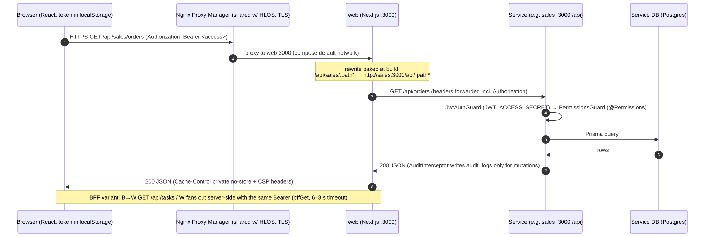
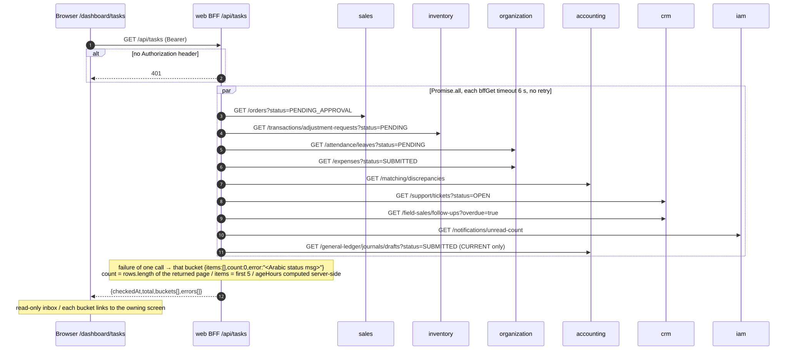
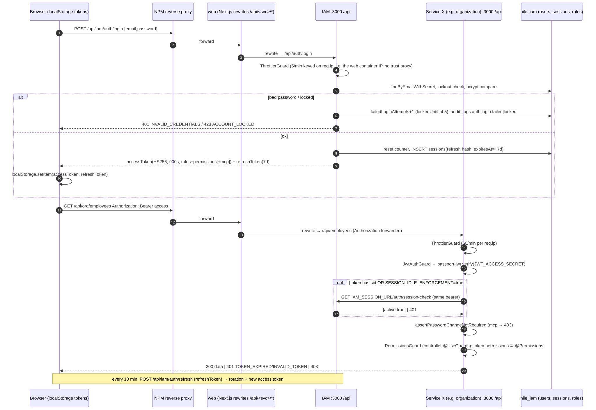
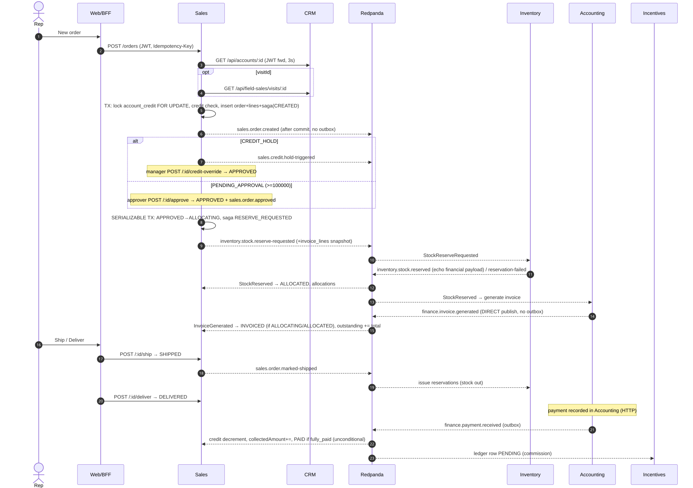
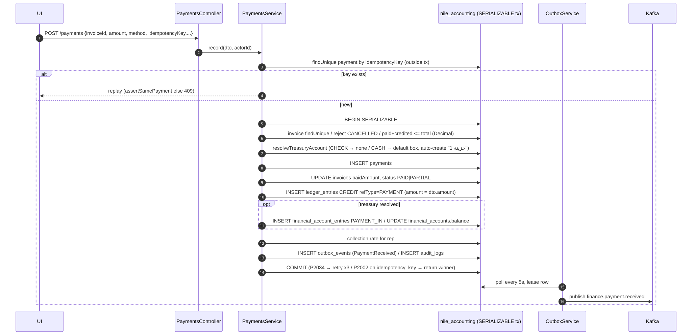
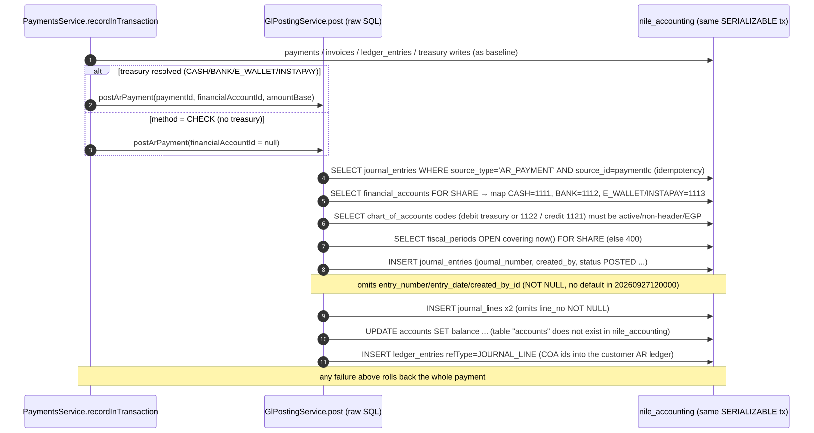

# 04 — كيف يعمل النظام فعليًا (How the System Runs)

> كل ما يلي مستخرج من الكود (قراءة ساكنة). "الكود يفعل X" لا يعني "الإنتاج يفعل X" ما لم يُذكر دليل تشغيل. المسارات `[C]` = CURRENT و`[B]` = BASELINE، وما لم يُذكر فهو متطابق في النسختين.

---

## 1. بدء التشغيل (Startup)

**ترتيب Compose كما هو معرّف (Verified، `[B]/[C] docker-compose.production.yml`):**
1. `redpanda` (healthcheck `rpk cluster health`).
2. `db-migrate` (one-shot، `restart: "no"`): ينفذ `scripts/production-migrate.sh`:
   - يرفض روابط pooled (exit 2).
   - يشغّل `validate-schema-migrations.cjs` لكل الخدمات — رفض = **exit 3** (`production-migrate.sh:95-100`).
   - `prisma migrate deploy` بالتسلسل: iam → organization → products → inventory → crm → sales → accounting → incentives → audit.
   - `prisma db seed` لـIAM إذا `RUN_IAM_SEED=true` (افتراضي).
3. الخدمات التسع: `depends_on: db-migrate: service_completed_successfully` + `redpanda: service_healthy` → مع `up` عادي **لا تبدأ أي خدمة إذا فشل db-migrate**.
4. `web`: `depends_on` الخدمات بـ`service_started`.
- كل خدمة: `command: ["node","dist/main.js"]` (يتجاوز CMD الـDockerfile الذي ينفذ `prisma migrate deploy` تلقائيًا — OPS-10)، `init: true`، `no-new-privileges`، healthcheck `fetch http://127.0.0.1:3000/health` كل 30s، `restart: unless-stopped`، logs json-file 20MB×5. **لا حدود موارد.**

**ما حدث فعليًا (Inferred من `[R]` و`[U]`):** حاوية المحاسبة `depends_on=""` (متسق مع `up --no-deps`)، أنشئت 2026-09-29 بملفي env `.env` و`/tmp/nile-recovery-release.env`، وdb-migrate خرج بـ3 → التشغيل الحالي تم بإجراء استرداد يدوي يتجاوز تبعيات compose، وهو مطابق لنمط runbook `SERVER-STEPS-2026-09-25-ar.md` (`--no-deps`) لا لأداة النشر في CURRENT.

**داخل كل خدمة NestJS (Verified، `apps/*/src/main.ts` و`app.module.ts`):**
- تحميل env: `config/env.ts` يقرأ dotenv من cwd و`../..` بالترتيب `.env.test.local`, `.env.local`, `.env.<NODE_ENV>`, `.env` (لا يطغى على متغيرات البيئة الموجودة)، ثم `resolveEnv('<SVC>_DATABASE_URL','DATABASE_URL')` ويفشل فورًا إن غابا. **لكن** Prisma في 7 خدمات يقرأ `DATABASE_URL` فقط (`schema.prisma: url = env("DATABASE_URL")`)؛ iam وorganization فقط يمرران `env.databaseUrl` (OPS-13). في الإنتاج compose يمرر `DATABASE_URL` فقط، فالمساران متفقان (`[R]` runtime.txt).
- أولوية المتغيرات الفعلية في compose: قيمة `environment:` في الملف ← تُستبدل `${VAR}` من `--env-file` أو `.env` في مجلد المشروع (Compose interpolation). حاوية المحاسبة سجّلت `.env,/tmp/nile-recovery-release.env` → القيم في الملف الثاني تطغى على الأول عند التعارض (سلوك Compose: آخر ملف يفوز) — Inferred.
- `app.setGlobalPrefix('api')`، `helmet` (CSP مغلق للـAPI)، `ValidationPipe({whitelist, forbidNonWhitelisted, transform})`، CORS من `CORS_ORIGINS` (إلزامي في compose).
- Guards عامة: `JwtAuthGuard` + `ThrottlerGuard` (60 طلبًا/60ث لكل IP). `PermissionsGuard` **لكل controller** عبر `@UseGuards` (ليس عامًا).
- Interceptors: Correlation (`x-correlation-id`)، Audit (يكتب `audit_logs` بعد الاستجابة الناجحة للتعديلات فقط، fire-and-forget)، Filter موحد للأخطاء.
- `EventsModule.forRoot`: publisher + consumer واحد لكل خدمة؛ الإنتاج يرفض الإقلاع بدون `EVENT_SIGNATURE_PEPPER`.
- `/health` و`/health/details` على الـadapter مباشرة خارج `/api` وبلا مصادقة: `SELECT 1` (3ث) + حالة Kafka؛ Kafka down → 503 في accounting/audit/incentives/inventory/sales و200 "degraded" في البقية.
- المجدول يبدأ مهامه (cron بتوقيت القاهرة) ما لم يكن `SCHEDULER_ENABLED=false`؛ Outbox relays تبدأ في `onModuleInit` (accounting كل 5ث، crm كل 10ث، inventory CURRENT كل 2ث).

## 2. مسار الطلب من المتصفح إلى قاعدة البيانات

1. المتصفح يرسل `Authorization: Bearer <access>` المخزن في `localStorage` (`apps/web/lib/api.ts:40-43`).
2. NPM (TLS) يوجه `nile-erp.codeandcanvas.net` كاملًا إلى `nile-pharma-erp-web-1:3000` `[U]`.
3. Next.js يطابق `/api/<alias>/:path*` مع rewrite **مخبوز وقت البناء** في `.next/routes-manifest.json` (`next.config.js:51-68`؛ Dockerfile يفشل البناء إن لم تكن 9 rewrites غير localhost) ويمرر الطلب كما هو إلى `http://<svc>:3000/api/:path*`.
4. الخدمة: Throttler → JwtAuthGuard (تحقق HS256 بـ`JWT_ACCESS_SECRET`، بلا iss/aud) → `requireManagedSession` (اختياري) → رفض توكنات `mcp:true` → PermissionsGuard (يجب امتلاك **كل** الأكواد) → handler → Prisma → DB الخاصة.
5. الاستجابة تعود بنفس المسار؛ web يضيف `Cache-Control: private, no-store` ورؤوس الأمن.

**مسار BFF البديل:** `GET /api/tasks|dashboard|search|…` يُنفذ داخل web على الخادم ويوزع طلبات متوازية بنفس التوكن (`lib/bff.ts:16-29`، مهلة 6-8ث، بلا retry، فشل جزئي = حقل `error` لكل قسم). التفاصيل في `05-API-Inventory-and-Routing.md` §2.

## 3. المصادقة والتفويض وسياق المستخدم

| الجانب | السلوك (Verified) | المرجع |
|---|---|---|
| الدخول | `POST /api/iam/auth/login` (5/دقيقة لكل IP)، bcrypt cost 12، قفل 15 دقيقة بعد 5 محاولات | `apps/iam/src/modules/auth/auth.service.ts:14-15, 96-115` |
| التوكنات | access HS256 900s يحمل `roles[]` و`permissions[]`؛ refresh 7 أيام مع تدوير وكشف إعادة استخدام؛ صف `sessions` بـ`expiresAt = +7d` ثابت | `auth.service.ts:132-144, 188-317` |
| الجلسات المُدارة | عند `SESSION_IDLE_ENFORCEMENT=true` يُضاف `sid` وتفحص الخدمات IAM في كل طلب؛ **الافتراضي false** | `packages/security/src/index.ts:9-38`؛ compose:59 |
| تغيير كلمة المرور الإلزامي | `mcp:true` يمنع كل شيء عدا change-password/logout | `jwt.strategy.ts:24,39` |
| التفويض | الصلاحيات من التوكن لا من DB؛ 548/553 route بصلاحية على مستوى method؛ 5 routes عامة (auth) | `05-API-Inventory-and-Routing.md` |
| سياق المستخدم/المؤسسة | **لا يوجد tenant أو فرع**. نطاق البيانات = "خاص بالمندوب" ما لم يملك صلاحية `.any` | ملاحظات IAM §3.2 |
| بين الخدمات | توكن المستخدم يُمرر (لا هوية خدمة)؛ الأحداث موقعة HMAC بـ`EVENT_SIGNATURE_PEPPER` | ARC-06 |

## 4. دورة حياة الطلب والمعاملة والحدث

### 4.1 المعاملة (Transaction)
- أغلب الكتابات المالية والمخزنية داخل `prisma.$transaction` بعزل **SERIALIZABLE** مع إعادة المحاولة على `P2034` (حتى 3 مرات) — مثال الدفعات `payments.service.ts` والحجز `allocation.engine.ts:667-709`.
- **حدود المعاملة لا تشمل النشر:** في معظم الخدمات يُنشر الحدث **بعد** commit (dual write). الاستثناءات: accounting (المدفوعات، FX) وcrm (onboarding) وinventory (CURRENT: GoodsReceived/StockIssued) عبر outbox داخل نفس المعاملة.
- استدعاءات HTTP المتزامنة تحدث أحيانًا **قبل** المعاملة (الفاتورة المباشرة تصرف المخزون عبر HTTP ثم تفتح معاملتها، مع تعويض `rollback-direct` عند الفشل — `invoices.service.ts:316, 366`).

### 4.2 الحدث (Event)
1. **النشر:** `EventPublisher.publish` — مفتاح الرسالة = `event_id`، توقيع HMAC، 3 محاولات (200/400ms)، ثم إرسال لـ`<topic>.dlq` و**رمي خطأ** للمستدعي (`publisher.ts:241-270`).
2. **الاستهلاك:** consumer group واحد لكل خدمة، `fromBeginning:false`؛ تحقق التوقيع (رفض = إسقاط صامت — INT-03) → `processed_events.seen(event_id)` → المعالج (1+3 محاولات داخل العملية) → `mark()` **بعد** المعالج وخارج معاملته (INT-02) → عند الفشل النهائي: نسخة إلى `<topic>.dlq` ويتقدم الـoffset.
3. **DLQ:** audit-aggregator يلتقط كل `.dlq` في `dead_letter_messages`؛ المشغّل بصلاحية `audit.events.manage` يعيد النشر (`POST /api/audit/dlq/:id/replay`) بنفس `event_id`، فتتجاهله المجموعات التي عالجته.
4. **التدقيق المركزي:** كل حدث يُكتب في `audit_events` بسلسلة `sha256(prev_hash + content)` مع trigger يمنع UPDATE/DELETE.

### 4.3 Retries / Failures / Timeouts / Idempotency (ملخص)

| الآلية | أين توجد | أين تغيب |
|---|---|---|
| Idempotency-Key على HTTP | إنشاء الطلب (`sales_orders.idempotency_key`)، الدفعات (`payments.idempotency_key` + مقارنة الحمولة)، الفواتير المباشرة، التحويلات، مذكرة تسليم الأمانة، onboarding العميل (`requestId + hash`)، القيود المالية للخزينة | الاستلام، مرتجع المورد، التسويات، تحميل الأمانة الفردي، الشطب (INV-09)؛ المرتجعات |
| Dedup للأحداث | `processed_events` في كل مستهلك؛ incentives يكتب العلامة داخل معاملته؛ supplier-ledger (CURRENT) يستخدم `runInInboxTransaction` | البقية: العلامة بعد المعالج (INT-02) |
| Timeouts | HTTP بين الخدمات 3-10ث (مثلاً sales→crm 3ث)؛ BFF 4-8ث؛ DB health 3ث؛ AI 20ث | rewrites بلا مهلة خاصة |
| Retries | DB: P2034 ×3؛ Kafka publish ×3؛ consumer handler ×3؛ outbox بـbackoff في accounting وcrm | inventory outbox بلا backoff (INV-17)؛ لا retry في BFF |
| تعويض (compensation) | `rollback-direct` للمخزون؛ `release()` عند نقص الحجز؛ `voidForCancelledOrder` | لا تعويض لطبقات التكلفة ولا لـStockIssued (INV-02)؛ لا استرداد بعد إلغاء الاستدعاء (SAL-16) |

## 5. المعالجة الخلفية والمهام المجدولة

| الخدمة | المهمة | الجدول (القاهرة) | الأثر | ملاحظات |
|---|---|---|---|---|
| products | `expire-batches` | 00:15 يوميًا | RELEASED منتهية → EXPIRED + `BatchExpired` | |
| products | `near-expiry-digest` | 06:30 | تقرير | |
| inventory | `stale-reservations` | كل ساعة | تقرير (لا إفراج تلقائي — متسق مع القرار) | عتبة 72س |
| inventory | `disposal-candidates` | 07:00 | تقرير | |
| inventory | `stock-conservation` | 03:30 | مقارنة الأرصدة بالحركات | **انحراف كاذب** (INV-06) |
| accounting | `fx-rate-reminder` | 09:00 | `FxRateStale` | |
| accounting | `nightly-reconciliation` | 02:00 | فحوص انحراف (CURRENT يضيف GL/AP) | CURRENT بإشارات متعاكسة (ACC-23) |
| sales | `sales-reconciliation` | 03:00 | انحرافات saga/المرتجعات | لا يظهر في شاشة المهام (WEB-03) |
| relays | outbox accounting/crm/inventory | 5ث/10ث/2ث | نشر الأحداث | |

القفل: `pg_try_advisory_xact_lock` لكل (خدمة، مهمة)، نسخة واحدة لكل خدمة حاليًا. `[U]` `nile_inventory.job_runs≈39` يدل على أن المجدول يعمل في inventory.

## 6. السجلات والمراقبة والفحص الصحي ومعالجة الأخطاء

- **Logging:** Nest Logger نصي إلى stdout → Docker json-file. `JsonLogger` موجود غير مستخدم. correlation id يمر عبر HTTP والأحداث.
- **Errors:** `AllExceptionsFilter` موحد؛ الويب يحول رموز الحالة إلى رسائل عربية ولا يعرض جسم الخطأ upstream.
- **Sentry:** backend عبر `SENTRY_DSN` (افتراضي فارغ)؛ الويب غير موصول فعليًا (لا `instrumentation.ts`) — WEB-04.
- **Metrics/Alerts:** لا يوجد (لا Prometheus/OTel). التنبيهات معرّفة على الورق فقط (`docs/runbooks/alerts-and-metrics.md:4`).
- **Health:** healthcheck لكل حاوية؛ `restart: unless-stopped` لا يعيد تشغيل حاوية unhealthy. شاشة `/dashboard/system/health` تغفل organization.

## 7. مسارات ممثلة (Sequence diagrams من الكود)

| # | المسار | الرسم | endpoints | جداول | أحداث |
|---|---|---|---|---|---|
| 1 | الدخول ثم طلب مصادَق | `12-seq-login-and-authenticated-request` | `POST /api/iam/auth/login`, `GET /api/org/employees` | users, sessions, audit_logs | — |
| 2 | Order-to-cash saga | `14-seq-order-to-cash-saga` | `POST /api/sales/orders`, `/:id/ship`, `/:id/deliver`, `POST /api/accounting/payments` | sales_orders, order_sagas, account_credit, inventory_reservations, invoices, ledger_entries, payments | OrderCreated, StockReserveRequested, StockReserved, InvoiceGenerated, OrderMarkedShipped, PaymentReceived |
| 3 | تحصيل فاتورة — BASELINE | `15-seq-customer-payment-BASELINE` | `POST /api/accounting/payments` | payments, invoices, ledger_entries, financial_account_entries, outbox_events, audit_logs | PaymentReceived (outbox) |
| 4 | تحصيل فاتورة مع GL — CURRENT | `16-seq-customer-payment-GL-CURRENT` | نفسه | + journal_entries/lines (**يفشل** — ACC-02) | نفسه |
| 5 | تجميع المهام في BFF | `17-seq-bff-tasks-fanout` | `GET /api/tasks` | — (قراءة من 6 خدمات) | — |

**قراءة المسار 3 (المرجح أنه العامل):** التحصيل في BASELINE يكتب ثلاثة سجلات أحادية الجانب: دائن في دفتر العميل (`ledger_entries`)، حركة خزينة (`financial_account_entries` + رصيد مخزن)، وحدث outbox. **لا يوجد قيد مزدوج** (ACC-01). العكس لاحقًا لا يعكس الخزينة (ACC-06).
