# 05 — جرد الـAPI والتوجيه (API Inventory & Routing)

## 1. كيف تُوجَّه الطلبات

| الطبقة | الآلية | الدليل | التصنيف |
|---|---|---|---|
| Edge | NPM يوجه النطاق كله إلى `web:3000`؛ ملفات NPM قديمة (`4.conf.bak` …) كانت توجه لكل خدمة | `[U]` docx.txt:591-674 | User-reported |
| Web rewrites | `/api/iam|org|products|inventory|crm|sales|accounting|incentives|audit/:path*` → `http://<svc>:3000/api/:path*`، مخبوزة وقت البناء | `[C]/[B] apps/web/next.config.js:51-68`؛ `apps/web/Dockerfile` | Verified |
| Web BFF | 13 route في `apps/web/app/api/*/route.ts` تقرأ عناوين الخدمات وقت التشغيل | `lib/bff.ts:14-29` | Verified |
| الخدمة | `setGlobalPrefix('api')` ثم الـcontroller | `apps/*/src/main.ts:27` | Verified |
| قالب nginx في المستودع | `deploy/nginx/nile-pharma-erp.conf` بمسارات `/iam/` … لكل خدمة على `api.example.com` | ملاحظات الأمن SEC-07 | Verified (غير مستخدم حسب `[U]`) |

**الاسم الخارجي ≠ الداخلي:** المسار الخارجي `/api/<alias>/<controller>/<path>` يصبح داخليًا `/api/<controller>/<path>`. الـalias يختلف عن اسم الخدمة في حالتين: `org` → organization، و`audit` → audit-aggregator.

## 2. BFF routes (طبقة التجميع في الويب)

| Route | الخدمات المستدعاة | مهلة | الفشل الجزئي | الملاحظات |
|---|---|---|---|---|
| `GET /api/dashboard` | sales, products, accounting, inventory, audit | 8ث | errors{} لكل widget | قيمة المخزون من أول 200 رصيد وبسعر master (WEB-01) |
| `GET /api/tasks` | sales, inventory, organization×2, accounting (+GL drafts في CURRENT), crm×2, iam | 6ث | error لكل bucket | العدادات = طول الصفحة؛ غير مخصص للمعتمِد |
| `GET /api/search` | crm, sales, products, accounting | 8ث | قائمة فارغة صامتة | |
| `GET /api/system-health` | /health لثماني خدمات (organization مفقودة) | 4ث | offline | يكفي وجود header (SEC-14) |
| `GET/POST /api/system-jobs` | products, inventory, accounting (sales مفقودة) | 6ث / 120ث | errors | |
| `GET /api/credit-exposure` | crm, sales, accounting (حلقة صفحات) | 8ث | 502 كلي | أول 200 عميل أبجديًا |
| `GET /api/customer-reports` | crm, sales, accounting | 8ث | لكل قسم | |
| `GET /api/inventory-overview` / `inventory-reports` / `inventory-shrinkage` | inventory, products | 8ث | لكل قسم / shrinkage: 500 كلي | معاملات from/to غير مرمّزة |
| `GET /api/sales-reports` | sales | 8ث | لكل قسم | |
| `GET /api/order-detail/[id]` | sales, accounting, audit | 8ث | لكل قسم | id غير مرمّز |
| `GET /api/recall-trace/[batchId]` | products, inventory, sales×2 | 8ث | لكل قسم | |

كل BFF routes تمرر header `Authorization` كما هو وتعيد 401 إن غاب، ولا تتحقق من JWT بنفسها (الخدمات تتحقق). لا retries.

## 3. نتائج مقارنة الواجهة بالخدمات (Verified، آلي)

- **CURRENT:** 35 route في 8 controllers محاسبية غير mounted (`AuditTimeline`, `BankReconciliation`, `FinanceDashboard`, `GlWorkbench`, `ImportShipments`, `Instruments`, `SupplierPayments`×2)؛ الواجهة تستدعي 12 منها → 404 (ARC-05؛ الجدول الآلي أدناه يُظهر 14 صفًا لأن مساري supplier-payments يطابقان controllerين متطابقي المسار). أربعة منها بلا `PermissionsGuard` (SEC-04).
- **BASELINE:** كل الـ462 route mounted؛ لا استدعاءات واجهة إلى مسارات غير موجودة (عدا مراجع Sentry غير وظيفية).
- لم يُحذف أي route بين النسختين؛ CURRENT أضاف 78 route (أغلبها exports وGL وAP).
- `GET /api/products/products/price-lists` من الواجهة → داخليًا `/api/products/price-lists` الذي غالبًا يلتقطه `GET /api/products/:id` المسجل قبله (INV-12، Inferred).
- صفحة `general-ledger` (CURRENT) تستدعي `fetch` بلا Authorization (WEB-02).
- اختلافات في الصلاحيات: `products/public-prices` يتطلب `accounting.invoices.create`؛ `inventory/allocation/issue-direct` كذلك (INV-13)؛ `auth/change-password` يعلن صلاحية لا تُفرض (IAM-09).

## 4. حدود التغطية في هذا الجرد (صريحة)

| العمود المطلوب | التغطية | كيف |
|---|---|---|
| Method, external/internal route, controller/handler, file:line | **كاملة** لكل 540 route | استخراج آلي من decorators (`tools/routes.py`) |
| Permissions / Guard / Public | **كاملة** | decorators `@Permissions`, `@UseGuards`, `@Public` + فحص mounting عبر شجرة imports من `AppModule` |
| Request DTO | **كاملة للـ@Body ذي النوع**؛ query/params بالأسماء فقط | من توقيع الـhandler |
| قواعد validation داخل كل DTO | **جزئية** — الإعداد العام مثبت (`whitelist`, `forbidNonWhitelisted`)؛ الحقول لكل DTO لم تُجرد | — |
| Response contract | **غير مجرد لكل route**؛ الخدمات تعيد كيانات Prisma مباشرة غالبًا؛ `packages/contracts/src/api.ts` لم يُراجع | فجوة معلنة |
| الجداول/الأحداث/المعاملات | **على مستوى الـcontroller** (اتحاد ما تلمسه الخدمات المحقونة: writes/reads/`$transaction`/events/raw SQL)؛ **تفصيل لكل handler فقط للمسارات الحرجة** في `08-Business-Process-Catalogue.md` | تقريب آلي |
| Error cases / idempotency | للمسارات الحرجة فقط (`04` §4.3 و`08`) | — |
| استخدام الواجهة | عدد مواضع الاستدعاء النصية في `apps/web` | مطابقة نصية تقريبية؛ المسارات الديناميكية قد لا تُطابق |

الملف القابل للفرز: `api-inventory.csv` (كل الأعمدة أعلاه لكل route).

## 5. routes خارج ملفات `*.controller.ts` (أضيفت يدويًا بعد التحقق — غير موجودة في الجداول الآلية أدناه)

| Method | External | الخدمات | Controller | Permission / Guard | B/C |
|---|---|---|---|---|---|
| GET | `/api/<svc>/jobs` | products, inventory, accounting, sales | `packages/scheduler/src/jobs.controller.ts:14` | `system.jobs.read` / `JobsPermissionsGuard` | ✓/✓ |
| GET | `/api/<svc>/jobs/runs` | نفسها | `jobs.controller.ts:17` | `system.jobs.read` | ✓/✓ |
| POST | `/api/<svc>/jobs/:name/run` | نفسها | `jobs.controller.ts:23` | `system.jobs.run` | ✓/✓ |
| GET | `/api/accounting/outbox/status` | accounting | `apps/accounting/src/modules/outbox/outbox.module.ts:5-13` (controller داخل ملف الـmodule) | `accounting.fx.manage` / PermissionsGuard | ✓/✓ |

**الإجمالي المصحح:** CURRENT = 540 + 13 = **553** route (518 mounted)؛ BASELINE = 462 + 13 = **475**. الاستخراج الآلي لم يغطِّ هذه لأنها خارج نمط `apps/*/src/**/*.controller.ts` — حدّ معلن للأداة.

---

**Tables/Tx/Events** على مستوى الـcontroller (اتحاد ما تلمسه الـservices المحقونة) — تقريب لا يحدد handler بعينه. التفاصيل الدقيقة لكل handler موثقة للمسارات الحرجة في Process Catalogue.

## ملخص
| Service | Alias | Routes CURRENT | Unmounted | Routes BASELINE | Public |
|---|---|---|---|---|---|
| accounting | /api/accounting | 146 | 35 | 92 | 0 |
| audit-aggregator | /api/audit | 11 | 0 | 11 | 0 |
| crm | /api/crm | 65 | 0 | 62 | 0 |
| iam | /api/iam | 54 | 0 | 54 | 5 |
| incentives | /api/incentives | 11 | 0 | 10 | 0 |
| inventory | /api/inventory | 42 | 0 | 37 | 0 |
| organization | /api/org | 76 | 0 | 72 | 0 |
| products | /api/products | 60 | 0 | 51 | 0 |
| sales | /api/sales | 75 | 0 | 73 | 0 |
| **Total** | | **540** | **35** | **462** | |

## Routes موجودة في BASELINE وأُزيلت/تغيّر مسارها في CURRENT

- لا يوجد

## استدعاءات Web لا تطابق أي route مُعرّف (CURRENT)
| Method | Path | Caller |
|---|---|---|
| ? | `/api/iam/auth` | `apps/web/sentry.client.config.ts:18` |
| ? | `/api/iam/auth` | `apps/web/sentry.server.config.ts:16` |
| ? | `/api/accounting/general-ledger/statements/:p` | `apps/web/app/dashboard/general-ledger/page.tsx:6` |
| GET | `/api/products/serialization/trace` | `apps/web/lib/api.ts:1372` |
| ? | `/api/org/*` | `apps/web/lib/api.ts:2336` |

## استدعاءات Web إلى routes غير mounted (ستعيد 404) — CURRENT
| Method | External | Controller | Web caller |
|---|---|---|---|
| GET | `/api/accounting/audit-timeline` | AuditTimelineController | `apps/web/lib/api.ts:2483` |
| GET | `/api/accounting/finance-dashboard` | FinanceDashboardController | `apps/web/lib/api.ts:2477` |
| GET | `/api/accounting/gl-workbench` | GlWorkbenchController | `apps/web/lib/api.ts:264` |
| GET | `/api/accounting/gl-workbench/:id` | GlWorkbenchController | `apps/web/lib/api.ts:266` |
| POST | `/api/accounting/gl-workbench` | GlWorkbenchController | `apps/web/lib/api.ts:267` |
| POST | `/api/accounting/gl-workbench/:id/submit` | GlWorkbenchController | `apps/web/lib/api.ts:268` |
| POST | `/api/accounting/gl-workbench/:id/approve` | GlWorkbenchController | `apps/web/lib/api.ts:269` |
| POST | `/api/accounting/gl-workbench/:id/reject` | GlWorkbenchController | `apps/web/lib/api.ts:270` |
| POST | `/api/accounting/gl-workbench/:id/post` | GlWorkbenchController | `apps/web/lib/api.ts:271` |
| POST | `/api/accounting/gl-workbench/:id/reverse` | GlWorkbenchController | `apps/web/lib/api.ts:272` |
| POST | `/api/accounting/supplier-payments` | SupplierPaymentsController | `apps/web/lib/api.ts:2652` |
| POST | `/api/accounting/supplier-payments/:id/reverse` | SupplierPaymentsController | `apps/web/lib/api.ts:2653` |
| POST | `/api/accounting/supplier-payments` | SupplierPaymentsController | `apps/web/lib/api.ts:2652` |
| POST | `/api/accounting/supplier-payments/:id/reverse` | SupplierPaymentsController | `apps/web/lib/api.ts:2653` |

## accounting

### AuditTimelineController — `apps/accounting/src/modules/audit-timeline/audit-timeline.controller.ts` ⚠️ **NOT MOUNTED**
- Writes: — | Reads: auditLog | `$transaction`: no | events/outbox: no | raw SQL: no

| Method | External | Internal | Handler | Perm | Body DTO | Guard | B | Web |
|---|---|---|---|---|---|---|---|---|
| GET | `/api/accounting/audit-timeline` | `/api/audit-timeline` | list (L7) | accounting.audit.read | — | JWT only | **new** | 1 |

### BankReconciliationController — `apps/accounting/src/modules/bank-reconciliation/bank-reconciliation.controller.ts` ⚠️ **NOT MOUNTED**
- Writes: — | Reads: — | `$transaction`: yes | events/outbox: no | raw SQL: yes

| Method | External | Internal | Handler | Perm | Body DTO | Guard | B | Web |
|---|---|---|---|---|---|---|---|---|
| GET | `/api/accounting/bank-reconciliation/statements` | `/api/bank-reconciliation/statements` | statements (L10) | accounting.payments.read | — | Perm | **new** | 0 |
| GET | `/api/accounting/bank-reconciliation/statements/:id` | `/api/bank-reconciliation/statements/:id` | statement (L11) | accounting.payments.read | — | Perm | **new** | 0 |
| POST | `/api/accounting/bank-reconciliation/statements/import` | `/api/bank-reconciliation/statements/import` | importStatement (L12) | accounting.payments.read | any | Perm | **new** | 0 |
| POST | `/api/accounting/bank-reconciliation/lines/:id/match` | `/api/bank-reconciliation/lines/:id/match` | match (L13) | accounting.payments.read | any | Perm | **new** | 0 |
| POST | `/api/accounting/bank-reconciliation/lines/:id/unmatch` | `/api/bank-reconciliation/lines/:id/unmatch` | unmatch (L14) | accounting.payments.read | — | Perm | **new** | 0 |
| POST | `/api/accounting/bank-reconciliation/statements/:id/reconcile` | `/api/bank-reconciliation/statements/:id/reconcile` | reconcile (L15) | accounting.payments.read | — | Perm | **new** | 0 |

### CashBanksController — `apps/accounting/src/modules/cash-banks/cash-banks.controller.ts`
- Writes: — | Reads: account, ledgerEntry, payment, supplierLedgerEntry | `$transaction`: no | events/outbox: no | raw SQL: no

| Method | External | Internal | Handler | Perm | Body DTO | Guard | B | Web |
|---|---|---|---|---|---|---|---|---|
| GET | `/api/accounting/cash-banks/overview` | `/api/cash-banks/overview` | overview (L16) | accounting.payments.read | — | Perm | ✓ | 2 |
| GET | `/api/accounting/cash-banks/accounts/:accountId/movements` | `/api/cash-banks/accounts/:accountId/movements` | movements (L26) | accounting.payments.read | — | Perm | ✓ | 2 |

### CoaController — `apps/accounting/src/modules/coa/coa.controller.ts`
- Writes: account | Reads: — | `$transaction`: no | events/outbox: no | raw SQL: yes

| Method | External | Internal | Handler | Perm | Body DTO | Guard | B | Web |
|---|---|---|---|---|---|---|---|---|
| GET | `/api/accounting/coa` | `/api/coa` | list (L23) | accounting.coa.read | — | Perm | ✓ | 2 |
| GET | `/api/accounting/coa/tree` | `/api/coa/tree` | tree (L37) | accounting.coa.read | — | Perm | ✓ | 2 |
| GET | `/api/accounting/coa/trial-balance` | `/api/coa/trial-balance` | trialBalance (L43) | accounting.coa.read | — | Perm | ✓ | 2 |
| GET | `/api/accounting/coa/export.csv` | `/api/coa/export.csv` | exportCsv (L49) | accounting.coa.read | — | Perm | **new** | 0 |
| GET | `/api/accounting/coa/:id` | `/api/coa/:id` | get (L71) | accounting.coa.read | — | Perm | ✓ | 6 |
| POST | `/api/accounting/coa` | `/api/coa` | create (L77) | accounting.coa.manage | CreateAccountDto | Perm | ✓ | 2 |
| PATCH | `/api/accounting/coa/:id` | `/api/coa/:id` | update (L83) | accounting.coa.manage | UpdateAccountDto | Perm | ✓ | 2 |
| POST | `/api/accounting/coa/seed-defaults` | `/api/coa/seed-defaults` | seedDefaults (L89) | accounting.coa.manage | — | Perm | ✓ | 2 |

### CollectionController — `apps/accounting/src/modules/collection/collection.controller.ts`
- Writes: — | Reads: invoice, payment, paymentAllocation | `$transaction`: no | events/outbox: no | raw SQL: no

| Method | External | Internal | Handler | Perm | Body DTO | Guard | B | Web |
|---|---|---|---|---|---|---|---|---|
| GET | `/api/accounting/collection/unallocated-credit` | `/api/collection/unallocated-credit` | unallocatedCredit (L15) | accounting.collection.read | — | Perm | ✓ | 2 |
| GET | `/api/accounting/collection/by-rep` | `/api/collection/by-rep` | byRep (L20) | accounting.collection.read | — | Perm | ✓ | 2 |
| GET | `/api/accounting/collection/rep-collections` | `/api/collection/rep-collections` | repCollections (L27) | accounting.collection.read | — | Perm | ✓ | 2 |
| GET | `/api/accounting/collection/aging` | `/api/collection/aging` | aging (L50) | accounting.collection.read | — | Perm | ✓ | 2 |
| GET | `/api/accounting/collection/outstanding-by-account` | `/api/collection/outstanding-by-account` | outstandingByAccount (L58) | accounting.collection.read | — | Perm | ✓ | 2 |
| GET | `/api/accounting/collection/summary` | `/api/collection/summary` | summary (L66) | accounting.collection.read | — | Perm | ✓ | 2 |
| GET | `/api/accounting/collection/receivables` | `/api/collection/receivables` | receivables (L74) | accounting.collection.read | — | Perm | ✓ | 2 |

### CreditNotesController — `apps/accounting/src/modules/credit-notes/credit-notes.controller.ts`
- Writes: creditNote, taxEntry | Reads: — | `$transaction`: yes | events/outbox: no | raw SQL: yes

| Method | External | Internal | Handler | Perm | Body DTO | Guard | B | Web |
|---|---|---|---|---|---|---|---|---|
| GET | `/api/accounting/credit-notes` | `/api/credit-notes` | list (L16) | accounting.credit-notes.read | — | Perm | ✓ | 2 |
| GET | `/api/accounting/credit-notes/:id` | `/api/credit-notes/:id` | get (L25) | accounting.credit-notes.read | — | Perm | ✓ | 2 |

### FinanceDashboardController — `apps/accounting/src/modules/finance-dashboard/finance-dashboard.controller.ts` ⚠️ **NOT MOUNTED**
- Writes: — | Reads: financialAccount, fiscalPeriod, invoice, journalEntry, vendorInvoice | `$transaction`: no | events/outbox: no | raw SQL: no

| Method | External | Internal | Handler | Perm | Body DTO | Guard | B | Web |
|---|---|---|---|---|---|---|---|---|
| GET | `/api/accounting/finance-dashboard` | `/api/finance-dashboard` | summary (L7) | accounting.finance-dashboard.read | — | JWT only | **new** | 1 |

### FinancialAccountsController — `apps/accounting/src/modules/financial-accounts/financial-accounts.controller.ts`
- Writes: financialAccount, financialAccountEntry, financialAccountReconciliation | Reads: currency | `$transaction`: yes | events/outbox: no | raw SQL: no

| Method | External | Internal | Handler | Perm | Body DTO | Guard | B | Web |
|---|---|---|---|---|---|---|---|---|
| GET | `/api/accounting/financial-accounts` | `/api/financial-accounts` | list (L28) | accounting.financial-accounts.read | — | Perm | ✓ | 2 |
| GET | `/api/accounting/financial-accounts/:id` | `/api/financial-accounts/:id` | one (L33) | accounting.financial-accounts.read | — | Perm | ✓ | 2 |
| GET | `/api/accounting/financial-accounts/:id/entries` | `/api/financial-accounts/:id/entries` | entries (L38) | accounting.financial-accounts.read | — | Perm | ✓ | 2 |
| GET | `/api/accounting/financial-accounts/:id/reconcile-ledger` | `/api/financial-accounts/:id/reconcile-ledger` | reconcileLedger (L44) | accounting.financial-accounts.read | — | Perm | ✓ | 2 |
| GET | `/api/accounting/financial-accounts/:id/reconciliations` | `/api/financial-accounts/:id/reconciliations` | reconciliations (L49) | accounting.financial-accounts.reconcile | — | Perm | ✓ | 2 |
| POST | `/api/accounting/financial-accounts` | `/api/financial-accounts` | create (L54) | accounting.financial-accounts.manage | CreateFinancialAccountDto | Perm | ✓ | 2 |
| PATCH | `/api/accounting/financial-accounts/:id` | `/api/financial-accounts/:id` | update (L59) | accounting.financial-accounts.manage | UpdateFinancialAccountDto | Perm | ✓ | 2 |
| POST | `/api/accounting/financial-accounts/entries` | `/api/financial-accounts/entries` | recordEntry (L64) | accounting.financial-accounts.manage | RecordEntryDto | Perm | ✓ | 2 |
| POST | `/api/accounting/financial-accounts/transfers` | `/api/financial-accounts/transfers` | transfer (L69) | accounting.financial-accounts.manage | TransferDto | Perm | ✓ | 2 |
| POST | `/api/accounting/financial-accounts/reconciliations` | `/api/financial-accounts/reconciliations` | recordCount (L75) | accounting.financial-accounts.reconcile | RecordCountDto | Perm | ✓ | 2 |

### FiscalPeriodsController — `apps/accounting/src/modules/fiscal-periods/fiscal-periods.controller.ts`
- Writes: account, auditLog, fiscalPeriod | Reads: — | `$transaction`: yes | events/outbox: no | raw SQL: yes

| Method | External | Internal | Handler | Perm | Body DTO | Guard | B | Web |
|---|---|---|---|---|---|---|---|---|
| GET | `/api/accounting/fiscal-periods` | `/api/fiscal-periods` | list (L22) | accounting.periods.read | — | Perm | ✓ | 2 |
| GET | `/api/accounting/fiscal-periods/:id` | `/api/fiscal-periods/:id` | get (L28) | accounting.periods.read | — | Perm | ✓ | 2 |
| POST | `/api/accounting/fiscal-periods` | `/api/fiscal-periods` | create (L34) | accounting.periods.manage | CreatePeriodDto | Perm | ✓ | 2 |
| POST | `/api/accounting/fiscal-periods/generate-year` | `/api/fiscal-periods/generate-year` | generateYear (L40) | accounting.periods.manage | GenerateYearPeriodsDto | Perm | ✓ | 2 |
| GET | `/api/accounting/fiscal-periods/:id/close-checks` | `/api/fiscal-periods/:id/close-checks` | closeChecks (L46) | accounting.periods.read | — | Perm | **new** | 1 |
| POST | `/api/accounting/fiscal-periods/:id/close` | `/api/fiscal-periods/:id/close` | close (L50) | accounting.periods.close | ClosePeriodDto | Perm | ✓ | 2 |
| POST | `/api/accounting/fiscal-periods/:id/reopen` | `/api/fiscal-periods/:id/reopen` | reopen (L60) | accounting.periods.reopen | ReopenPeriodDto | Perm | ✓ | 2 |
| POST | `/api/accounting/fiscal-periods/year-end-closing` | `/api/fiscal-periods/year-end-closing` | yearEndClose (L70) | accounting.periods.close | YearEndCloseDto | Perm | ✓ | 2 |

### FixedAssetsController — `apps/accounting/src/modules/fixed-assets/fixed-assets.controller.ts`
- Writes: depreciationEntry, fixedAsset | Reads: — | `$transaction`: yes | events/outbox: no | raw SQL: yes

| Method | External | Internal | Handler | Perm | Body DTO | Guard | B | Web |
|---|---|---|---|---|---|---|---|---|
| POST | `/api/accounting/fixed-assets` | `/api/fixed-assets` | create (L16) | accounting.coa.manage | CreateFixedAssetDto | Perm | ✓ | 2 |
| GET | `/api/accounting/fixed-assets` | `/api/fixed-assets` | findAll (L22) | accounting.ledger.read | — | Perm | ✓ | 2 |
| GET | `/api/accounting/fixed-assets/:id` | `/api/fixed-assets/:id` | findOne (L31) | accounting.ledger.read | — | Perm | ✓ | 2 |
| POST | `/api/accounting/fixed-assets/run-monthly` | `/api/fixed-assets/run-monthly` | runMonthly (L37) | accounting.periods.close | RunMonthlyDepreciationDto | Perm | ✓ | 2 |
| POST | `/api/accounting/fixed-assets/:id/dispose` | `/api/fixed-assets/:id/dispose` | dispose (L43) | accounting.coa.manage | DisposeAssetDto | Perm | ✓ | 2 |

### FxController — `apps/accounting/src/modules/fx/fx.controller.ts`
- Writes: auditLog, currency, exchangeRate, fxSnapshot, outboxEvent, supplierLedgerEntry | Reads: — | `$transaction`: yes | events/outbox: no | raw SQL: no

| Method | External | Internal | Handler | Perm | Body DTO | Guard | B | Web |
|---|---|---|---|---|---|---|---|---|
| GET | `/api/accounting/fx/currencies` | `/api/fx/currencies` | listCurrencies (L14) | accounting.fx.read | — | Perm | ✓ | 2 |
| POST | `/api/accounting/fx/currencies` | `/api/fx/currencies` | createCurrency (L20) | accounting.fx.manage | CurrencyInputDto | Perm | ✓ | 2 |
| GET | `/api/accounting/fx/rates` | `/api/fx/rates` | getRate (L27) | accounting.fx.read | — | Perm | ✓ | 2 |
| GET | `/api/accounting/fx/rates/history` | `/api/fx/rates/history` | listRates (L33) | accounting.fx.read | — | Perm | ✓ | 2 |
| POST | `/api/accounting/fx/rates` | `/api/fx/rates` | createRate (L44) | accounting.fx.manage | CreateRateDto | Perm | ✓ | 2 |
| POST | `/api/accounting/fx/revalue` | `/api/fx/revalue` | revalue (L51) | accounting.fx.revalue | RevalueDto | Perm | ✓ | 2 |
| GET | `/api/accounting/fx/exposure` | `/api/fx/exposure` | getExposure (L58) | accounting.fx.read | — | Perm | ✓ | 2 |

### GeneralLedgerController — `apps/accounting/src/modules/general-ledger/general-ledger.controller.ts`
- Writes: — | Reads: account, fiscalPeriod | `$transaction`: yes | events/outbox: no | raw SQL: yes

| Method | External | Internal | Handler | Perm | Body DTO | Guard | B | Web |
|---|---|---|---|---|---|---|---|---|
| POST | `/api/accounting/general-ledger/journals/drafts` | `/api/general-ledger/journals/drafts` | createDraft (L10) | accounting.ledger.create | CreateJournalDto | Perm | **new** | 1 |
| GET | `/api/accounting/general-ledger/journals/drafts` | `/api/general-ledger/journals/drafts` | workflows (L11) | accounting.ledger.read.any | — | Perm | **new** | 1 |
| GET | `/api/accounting/general-ledger/journals/drafts/:id` | `/api/general-ledger/journals/drafts/:id` | workflow (L12) | accounting.ledger.read.any | — | Perm | **new** | 1 |
| POST | `/api/accounting/general-ledger/journals/drafts/:id/submit` | `/api/general-ledger/journals/drafts/:id/submit` | submit (L13) | accounting.ledger.create | — | Perm | **new** | 1 |
| POST | `/api/accounting/general-ledger/journals/drafts/:id/approve` | `/api/general-ledger/journals/drafts/:id/approve` | approve (L14) | accounting.ledger.approve | — | Perm | **new** | 1 |
| POST | `/api/accounting/general-ledger/journals/drafts/:id/reject` | `/api/general-ledger/journals/drafts/:id/reject` | reject (L15) | accounting.ledger.approve | string, | Perm | **new** | 1 |
| POST | `/api/accounting/general-ledger/journals/drafts/:id/post` | `/api/general-ledger/journals/drafts/:id/post` | postDraft (L16) | accounting.ledger.post | — | Perm | **new** | 1 |
| GET | `/api/accounting/general-ledger/journals` | `/api/general-ledger/journals` | journals (L17) | accounting.ledger.read.any | — | Perm | **new** | 2 |
| GET | `/api/accounting/general-ledger/journals/:id` | `/api/general-ledger/journals/:id` | journal (L18) | accounting.ledger.read.any | — | Perm | **new** | 2 |
| POST | `/api/accounting/general-ledger/journals` | `/api/general-ledger/journals` | post (L19) | accounting.coa.manage | CreateJournalDto | Perm | **new** | 1 |
| GET | `/api/accounting/general-ledger/trial-balance` | `/api/general-ledger/trial-balance` | trial (L20) | accounting.ledger.read.any | — | Perm | **new** | 1 |
| GET | `/api/accounting/general-ledger/statements/pnl` | `/api/general-ledger/statements/pnl` | pnl (L21) | accounting.ledger.read.any | — | Perm | **new** | 0 |
| GET | `/api/accounting/general-ledger/statements/balance-sheet` | `/api/general-ledger/statements/balance-sheet` | balance (L22) | accounting.ledger.read.any | — | Perm | **new** | 0 |
| GET | `/api/accounting/general-ledger/statements/cash-flow` | `/api/general-ledger/statements/cash-flow` | cashFlow (L23) | accounting.ledger.read.any | — | Perm | **new** | 0 |
| GET | `/api/accounting/general-ledger/statements/equity` | `/api/general-ledger/statements/equity` | equity (L24) | accounting.ledger.read.any | — | Perm | **new** | 0 |

### GeneralPurchasesController — `apps/accounting/src/modules/general-purchases/general-purchases.controller.ts`
- Writes: generalPurchase, generalPurchaseRevision | Reads: — | `$transaction`: yes | events/outbox: no | raw SQL: yes

| Method | External | Internal | Handler | Perm | Body DTO | Guard | B | Web |
|---|---|---|---|---|---|---|---|---|
| GET | `/api/accounting/general-purchases` | `/api/general-purchases` | list (L15) | accounting.general-purchases.read | — | Perm | ✓ | 2 |
| GET | `/api/accounting/general-purchases/:id/history` | `/api/general-purchases/:id/history` | history (L20) | accounting.general-purchases.history | — | Perm | ✓ | 2 |
| GET | `/api/accounting/general-purchases/:id` | `/api/general-purchases/:id` | get (L23) | accounting.general-purchases.read | — | Perm | ✓ | 0 |
| POST | `/api/accounting/general-purchases` | `/api/general-purchases` | create (L26) | accounting.general-purchases.create | CreateGeneralPurchaseDto | Perm | ✓ | 2 |
| PATCH | `/api/accounting/general-purchases/:id` | `/api/general-purchases/:id` | update (L29) | accounting.general-purchases.update | UpdateGeneralPurchaseDto | Perm | ✓ | 2 |

### GlWorkbenchController — `apps/accounting/src/modules/gl-workbench/gl-workbench.controller.ts` ⚠️ **NOT MOUNTED**
- Writes: account, auditLog, journalEntry, ledgerEntry | Reads: fiscalPeriod, journalLine | `$transaction`: yes | events/outbox: no | raw SQL: no

| Method | External | Internal | Handler | Perm | Body DTO | Guard | B | Web |
|---|---|---|---|---|---|---|---|---|
| GET | `/api/accounting/gl-workbench` | `/api/gl-workbench` | list (L9) | accounting.gl.read | — | JWT only | **new** | 1 |
| GET | `/api/accounting/gl-workbench/:id` | `/api/gl-workbench/:id` | get (L11) | accounting.gl.read | — | JWT only | **new** | 1 |
| POST | `/api/accounting/gl-workbench` | `/api/gl-workbench` | create (L13) | accounting.gl.create | any | JWT only | **new** | 1 |
| POST | `/api/accounting/gl-workbench/:id/submit` | `/api/gl-workbench/:id/submit` | submit (L15) | accounting.gl.submit | — | JWT only | **new** | 1 |
| POST | `/api/accounting/gl-workbench/:id/approve` | `/api/gl-workbench/:id/approve` | approve (L17) | accounting.gl.approve | — | JWT only | **new** | 1 |
| POST | `/api/accounting/gl-workbench/:id/reject` | `/api/gl-workbench/:id/reject` | reject (L19) | accounting.gl.approve | string, | JWT only | **new** | 1 |
| POST | `/api/accounting/gl-workbench/:id/post` | `/api/gl-workbench/:id/post` | post (L21) | accounting.gl.post | — | JWT only | **new** | 1 |
| POST | `/api/accounting/gl-workbench/:id/reverse` | `/api/gl-workbench/:id/reverse` | reverse (L23) | accounting.gl.reverse | string, | JWT only | **new** | 1 |

### ImportShipmentsController — `apps/accounting/src/modules/import-shipments/import-shipments.controller.ts` ⚠️ **NOT MOUNTED**
- Writes: — | Reads: — | `$transaction`: yes | events/outbox: no | raw SQL: yes

| Method | External | Internal | Handler | Perm | Body DTO | Guard | B | Web |
|---|---|---|---|---|---|---|---|---|
| GET | `/api/accounting/import-shipments` | `/api/import-shipments` | list (L11) | accounting.imports.read | — | Perm | **new** | 0 |
| GET | `/api/accounting/import-shipments/:id` | `/api/import-shipments/:id` | get (L12) | accounting.imports.read | — | Perm | **new** | 0 |
| POST | `/api/accounting/import-shipments` | `/api/import-shipments` | create (L13) | accounting.imports.manage | any | Perm | **new** | 0 |
| POST | `/api/accounting/import-shipments/:id/transition` | `/api/import-shipments/:id/transition` | transition (L14) | accounting.imports.manage | any | Perm | **new** | 0 |
| POST | `/api/accounting/import-shipments/:id/documents` | `/api/import-shipments/:id/documents` | document (L15) | accounting.imports.manage | any | Perm | **new** | 0 |
| POST | `/api/accounting/import-shipments/:id/regulatory` | `/api/import-shipments/:id/regulatory` | regulatory (L16) | accounting.imports.manage | any | Perm | **new** | 0 |

### InstrumentsController — `apps/accounting/src/modules/instruments/instruments.controller.ts` ⚠️ **NOT MOUNTED**
- Writes: auditLog, financialInstrument | Reads: invoice, payment | `$transaction`: yes | events/outbox: no | raw SQL: no

| Method | External | Internal | Handler | Perm | Body DTO | Guard | B | Web |
|---|---|---|---|---|---|---|---|---|
| GET | `/api/accounting/instruments` | `/api/instruments` | list (L12) | accounting.instruments.read | — | Perm | **new** | 0 |
| GET | `/api/accounting/instruments/due-soon` | `/api/instruments/due-soon` | dueSoon (L16) | accounting.instruments.read | — | Perm | **new** | 0 |
| GET | `/api/accounting/instruments/stuck` | `/api/instruments/stuck` | stuck (L18) | accounting.instruments.read | — | Perm | **new** | 0 |
| POST | `/api/accounting/instruments/:id/deposit` | `/api/instruments/:id/deposit` | deposit (L20) | accounting.instruments.manage | — | Perm | **new** | 0 |
| POST | `/api/accounting/instruments/:id/clear` | `/api/instruments/:id/clear` | clear (L22) | accounting.instruments.manage | — | Perm | **new** | 0 |
| POST | `/api/accounting/instruments/:id/bounce` | `/api/instruments/:id/bounce` | bounce (L24) | accounting.instruments.manage | string, | Perm | **new** | 0 |
| POST | `/api/accounting/instruments/:id/replace` | `/api/instruments/:id/replace` | replace (L26) | accounting.instruments.manage | { instrumentNumber: string; dueDate: string; amount?: number; bankName?: string }, | Perm | **new** | 0 |

### InvoicesController — `apps/accounting/src/modules/invoices/invoices.controller.ts`
- Writes: auditLog, cancelledOrder, invoice, ledgerEntry | Reads: — | `$transaction`: yes | events/outbox: yes | raw SQL: yes

| Method | External | Internal | Handler | Perm | Body DTO | Guard | B | Web |
|---|---|---|---|---|---|---|---|---|
| GET | `/api/accounting/invoices/export` | `/api/invoices/export` | exportFile (L15) | accounting.invoices.read | — | Perm | **new** | 0 |
| GET | `/api/accounting/invoices` | `/api/invoices` | list (L29) | accounting.invoices.read | — | Perm | ✓ | 2 |
| GET | `/api/accounting/invoices/shipping/catalog` | `/api/invoices/shipping/catalog` | shippingCatalog (L41) | accounting.invoices.create | — | Perm | ✓ | 2 |
| POST | `/api/accounting/invoices/shipping/quote` | `/api/invoices/shipping/quote` | quoteShipping (L45) | accounting.invoices.create | InvoiceShippingDto | Perm | ✓ | 2 |
| GET | `/api/accounting/invoices/:id` | `/api/invoices/:id` | get (L50) | accounting.invoices.read | — | Perm | ✓ | 2 |
| POST | `/api/accounting/invoices` | `/api/invoices` | create (L62) | accounting.invoices.create | CreateInvoiceDto | Perm | ✓ | 2 |
| POST | `/api/accounting/invoices/:id/cancel` | `/api/invoices/:id/cancel` | cancel (L70) | accounting.invoices.cancel | CancelInvoiceDto | Perm | ✓ | 2 |
| POST | `/api/accounting/invoices/:id/reissue` | `/api/invoices/:id/reissue` | reissue (L73) | accounting.invoices.reissue | ReissueInvoiceDto | Perm | ✓ | 2 |

### LandedCostController — `apps/accounting/src/modules/landed-cost/landed-cost.controller.ts`
- Writes: landedCostVoucher | Reads: — | `$transaction`: no | events/outbox: no | raw SQL: no

| Method | External | Internal | Handler | Perm | Body DTO | Guard | B | Web |
|---|---|---|---|---|---|---|---|---|
| POST | `/api/accounting/landed-cost/simulate` | `/api/landed-cost/simulate` | simulate (L12) | accounting.fx.read | CreateLandedCostDto | Perm | ✓ | 2 |
| POST | `/api/accounting/landed-cost` | `/api/landed-cost` | create (L18) | accounting.fx.manage | CreateLandedCostDto | Perm | ✓ | 2 |
| GET | `/api/accounting/landed-cost` | `/api/landed-cost` | findAll (L24) | accounting.fx.read | — | Perm | ✓ | 2 |
| GET | `/api/accounting/landed-cost/:id` | `/api/landed-cost/:id` | findOne (L30) | accounting.fx.read | — | Perm | ✓ | 2 |

### LedgerController — `apps/accounting/src/modules/ledger/ledger.controller.ts`
- Writes: — | Reads: invoice, ledgerEntry | `$transaction`: no | events/outbox: no | raw SQL: no

| Method | External | Internal | Handler | Perm | Body DTO | Guard | B | Web |
|---|---|---|---|---|---|---|---|---|
| GET | `/api/accounting/ledger/:accountId` | `/api/ledger/:accountId` | entries (L10) | accounting.ledger.read | — | Perm | ✓ | 2 |
| GET | `/api/accounting/ledger/:accountId/balance` | `/api/ledger/:accountId/balance` | balance (L19) | accounting.ledger.read | — | Perm | ✓ | 2 |

### MatchingController — `apps/accounting/src/modules/matching/matching.controller.ts`
- Writes: auditLog, purchaseOrder, purchaseOrderLine, purchaseOrderReceipt, threeWayMatch, vendorInvoice | Reads: vendorInvoiceLine | `$transaction`: yes | events/outbox: no | raw SQL: yes

| Method | External | Internal | Handler | Perm | Body DTO | Guard | B | Web |
|---|---|---|---|---|---|---|---|---|
| GET | `/api/accounting/matching/matches` | `/api/matching/matches` | listMatches (L22) | accounting.matching.read | — | Perm | ✓ | 2 |
| GET | `/api/accounting/matching/discrepancies` | `/api/matching/discrepancies` | listDiscrepancies (L28) | accounting.matching.read | — | Perm | ✓ | 2 |
| POST | `/api/accounting/matching/purchase-orders` | `/api/matching/purchase-orders` | createPO (L34) | accounting.matching.manage | CreatePurchaseOrderDto | Perm | ✓ | 2 |
| GET | `/api/accounting/matching/purchase-orders` | `/api/matching/purchase-orders` | listPurchaseOrders (L49) | accounting.matching.read | — | Perm | ✓ | 2 |
| GET | `/api/accounting/matching/purchase-orders/:id` | `/api/matching/purchase-orders/:id` | getPurchaseOrder (L63) | accounting.matching.read | — | Perm | ✓ | 2 |
| POST | `/api/accounting/matching/vendor-invoices` | `/api/matching/vendor-invoices` | createVendorInvoice (L69) | accounting.matching.manage | CreateVendorInvoiceDto | Perm | ✓ | 2 |
| POST | `/api/accounting/matching/purchase-orders/:id/submit` | `/api/matching/purchase-orders/:id/submit` | submitPO (L89) | accounting.matching.manage | — | Perm | ✓ | 2 |
| POST | `/api/accounting/matching/purchase-orders/:id/approve` | `/api/matching/purchase-orders/:id/approve` | approvePO (L95) | accounting.matching.approve | — | Perm | ✓ | 2 |
| POST | `/api/accounting/matching/purchase-orders/:id/reject` | `/api/matching/purchase-orders/:id/reject` | rejectPO (L101) | accounting.matching.approve | OverrideMatchDto | Perm | ✓ | 2 |
| POST | `/api/accounting/matching/purchase-orders/:id/cancel` | `/api/matching/purchase-orders/:id/cancel` | cancelPO (L111) | accounting.matching.manage | OverrideMatchDto | Perm | ✓ | 2 |
| POST | `/api/accounting/matching/matches/:id/override` | `/api/matching/matches/:id/override` | overrideMatch (L122) | accounting.matching.override | OverrideMatchDto | Perm | ✓ | 2 |
| POST | `/api/accounting/matching/matches/:id/reject` | `/api/matching/matches/:id/reject` | rejectMatch (L132) | accounting.matching.override | OverrideMatchDto | Perm | ✓ | 2 |

### PaymentsController — `apps/accounting/src/modules/payments/payments.controller.ts`
- Writes: auditLog, fieldCollectionPosting, financialAccount, financialAccountEntry, invoice, ledgerEntry, outboxEvent, payment, paymentAllocation | Reads: — | `$transaction`: yes | events/outbox: no | raw SQL: yes

| Method | External | Internal | Handler | Perm | Body DTO | Guard | B | Web |
|---|---|---|---|---|---|---|---|---|
| GET | `/api/accounting/payments/export` | `/api/payments/export` | exportFile (L22) | accounting.payments.read | — | Perm | **new** | 0 |
| GET | `/api/accounting/payments` | `/api/payments` | list (L33) | accounting.payments.read | — | Perm | ✓ | 2 |
| GET | `/api/accounting/payments/checks` | `/api/payments/checks` | checks (L41) | accounting.payments.read | — | Perm | ✓ | 2 |
| POST | `/api/accounting/payments/from-field-proposal` | `/api/payments/from-field-proposal` | fromField (L48) | accounting.payments.create, crm.field-sales.review | FieldCollectionDto | Perm | ✓ | 0 |
| POST | `/api/accounting/payments` | `/api/payments` | record (L53) | accounting.payments.create | RecordPaymentDto | Perm | ✓ | 2 |
| POST | `/api/accounting/payments/allocations` | `/api/payments/allocations` | recordAllocations (L63) | accounting.payments.create | RecordPaymentDto | Perm | ✓ | 2 |
| POST | `/api/accounting/payments/checks/:id/status` | `/api/payments/checks/:id/status` | updateCheck (L65) | accounting.payments.update | string, | Perm | ✓ | 2 |
| POST | `/api/accounting/payments/:id/reverse` | `/api/payments/:id/reverse` | reverse (L67) | accounting.payments.reverse | ReversePaymentDto | Perm | ✓ | 2 |

### SupplierLedgerController — `apps/accounting/src/modules/supplier-ledger/supplier-ledger.controller.ts`
- Writes: auditLog, supplierLedgerEntry | Reads: vendorInvoice | `$transaction`: no | events/outbox: no | raw SQL: no

| Method | External | Internal | Handler | Perm | Body DTO | Guard | B | Web |
|---|---|---|---|---|---|---|---|---|
| GET | `/api/accounting/supplier-ledger/payables` | `/api/supplier-ledger/payables` | payables (L16) | accounting.supplier-ledger.read | — | Perm | ✓ | 2 |
| GET | `/api/accounting/supplier-ledger/payables/:supplierId` | `/api/supplier-ledger/payables/:supplierId` | supplierPayables (L35) | accounting.supplier-ledger.read | — | Perm | ✓ | 2 |
| GET | `/api/accounting/supplier-ledger/:supplierId` | `/api/supplier-ledger/:supplierId` | entries (L40) | accounting.supplier-ledger.read | — | Perm | ✓ | 4 |
| GET | `/api/accounting/supplier-ledger/:supplierId/balance` | `/api/supplier-ledger/:supplierId/balance` | balance (L42) | accounting.supplier-ledger.read | — | Perm | ✓ | 2 |

### SupplierPaymentsController — `apps/accounting/src/modules/supplier-ledger/supplier-payments.controller.ts` ⚠️ **NOT MOUNTED**
- Writes: supplierLedgerEntry | Reads: — | `$transaction`: yes | events/outbox: no | raw SQL: yes

| Method | External | Internal | Handler | Perm | Body DTO | Guard | B | Web |
|---|---|---|---|---|---|---|---|---|
| GET | `/api/accounting/supplier-payments/proposal` | `/api/supplier-payments/proposal` | proposal (L10) | accounting.payables.pay | — | JWT only | **new** | 0 |
| GET | `/api/accounting/supplier-payments` | `/api/supplier-payments` | list (L14) | accounting.supplier-ledger.read | — | JWT only | **new** | 0 |
| POST | `/api/accounting/supplier-payments` | `/api/supplier-payments` | pay (L20) | accounting.payables.pay | any | JWT only | **new** | 1 |
| POST | `/api/accounting/supplier-payments/:id/reverse` | `/api/supplier-payments/:id/reverse` | reverse (L30) | accounting.payments.reverse, accounting.payables.pay | string, | JWT only | **new** | 1 |

### SupplierPaymentsController — `apps/accounting/src/modules/supplier-payments/supplier-payments.controller.ts` ⚠️ **NOT MOUNTED**
- Writes: supplierLedgerEntry | Reads: — | `$transaction`: yes | events/outbox: no | raw SQL: yes

| Method | External | Internal | Handler | Perm | Body DTO | Guard | B | Web |
|---|---|---|---|---|---|---|---|---|
| POST | `/api/accounting/supplier-payments` | `/api/supplier-payments` | create (L12) | accounting.payables.pay | any | Perm | **new** | 1 |
| POST | `/api/accounting/supplier-payments/:id/reverse` | `/api/supplier-payments/:id/reverse` | reverse (L18) | accounting.payables.pay | string, | Perm | **new** | 1 |

### TaxController — `apps/accounting/src/modules/tax/tax.controller.ts`
- Writes: taxEntry | Reads: — | `$transaction`: no | events/outbox: no | raw SQL: no

| Method | External | Internal | Handler | Perm | Body DTO | Guard | B | Web |
|---|---|---|---|---|---|---|---|---|
| GET | `/api/accounting/tax/vat-summary` | `/api/tax/vat-summary` | getVatSummary (L19) | accounting.tax.read | — | Perm | ✓ | 2 |
| GET | `/api/accounting/tax/form-41` | `/api/tax/form-41` | getForm41 (L25) | accounting.tax.form41 | — | Perm | ✓ | 2 |
| POST | `/api/accounting/tax/entries` | `/api/tax/entries` | recordTaxEntry (L34) | accounting.tax.manage | CreateTaxEntryDto | Perm | ✓ | 2 |
| POST | `/api/accounting/tax/form-41/mark-reported` | `/api/tax/form-41/mark-reported` | markReported (L40) | accounting.tax.form41 | GenerateForm41Dto | Perm | ✓ | 2 |

## audit-aggregator

### AuditEventsController — `apps/audit-aggregator/src/modules/audit-events/audit-events.controller.ts`
- Writes: — | Reads: auditEvent | `$transaction`: no | events/outbox: no | raw SQL: no

| Method | External | Internal | Handler | Perm | Body DTO | Guard | B | Web |
|---|---|---|---|---|---|---|---|---|
| GET | `/api/audit/audit-events` | `/api/audit-events` | recent (L11) | audit.events.read | — | Perm | ✓ | 1 |
| GET | `/api/audit/audit-events/critical` | `/api/audit-events/critical` | critical (L38) | audit.events.read | — | Perm | ✓ | 1 |
| GET | `/api/audit/audit-events/alerts` | `/api/audit-events/alerts` | alerts (L41) | audit.events.read | — | Perm | ✓ | 1 |
| GET | `/api/audit/audit-events/returns` | `/api/audit-events/returns` | returns (L44) | audit.events.read | — | Perm | ✓ | 1 |
| GET | `/api/audit/audit-events/verify` | `/api/audit-events/verify` | verify (L53) | audit.events.read | — | Perm | ✓ | 1 |

### DlqController — `apps/audit-aggregator/src/modules/dlq/dlq.controller.ts`
- Writes: deadLetterMessage | Reads: — | `$transaction`: no | events/outbox: yes | raw SQL: no

| Method | External | Internal | Handler | Perm | Body DTO | Guard | B | Web |
|---|---|---|---|---|---|---|---|---|
| GET | `/api/audit/dlq` | `/api/dlq` | list (L21) | audit.events.read | — | Perm | ✓ | 1 |
| GET | `/api/audit/dlq/stats` | `/api/dlq/stats` | stats (L27) | audit.events.read | — | Perm | ✓ | 1 |
| GET | `/api/audit/dlq/:id` | `/api/dlq/:id` | get (L33) | audit.events.read | — | Perm | ✓ | 2 |
| POST | `/api/audit/dlq/:id/replay` | `/api/dlq/:id/replay` | replay (L39) | audit.events.manage | — | Perm | ✓ | 1 |
| POST | `/api/audit/dlq/replay-batch` | `/api/dlq/replay-batch` | replayBatch (L45) | audit.events.manage | BatchReplayDto | Perm | ✓ | 1 |
| POST | `/api/audit/dlq/:id/discard` | `/api/dlq/:id/discard` | discard (L51) | audit.events.manage | DiscardDlqDto | Perm | ✓ | 1 |

## crm

### AccountsController — `apps/crm/src/modules/accounts/accounts.controller.ts`
- Writes: account, auditLog, customerAddress, customerAssignment, customerContact, customerCreationRequest, customerEventOutbox, customerNote | Reads: lead, visit | `$transaction`: yes | events/outbox: yes | raw SQL: yes

| Method | External | Internal | Handler | Perm | Body DTO | Guard | B | Web |
|---|---|---|---|---|---|---|---|---|
| GET | `/api/crm/accounts/export` | `/api/accounts/export` | exportFile (L20) | crm.accounts.read | — | Perm | **new** | 0 |
| GET | `/api/crm/accounts` | `/api/accounts` | list (L34) | crm.accounts.read | — | Perm | ✓ | 5 |
| GET | `/api/crm/accounts/summary` | `/api/accounts/summary` | summary (L52) | crm.accounts.read | — | Perm | ✓ | 1 |
| GET | `/api/crm/accounts/:id` | `/api/accounts/:id` | get (L60) | crm.accounts.read | — | Perm | ✓ | 4 |
| POST | `/api/crm/accounts` | `/api/accounts` | create (L69) | crm.accounts.create | OnboardCustomerDto | Perm | ✓ | 4 |
| POST | `/api/crm/accounts/bulk` | `/api/accounts/bulk` | bulkUpdate (L73) | crm.accounts.manage | BulkUpdateAccountsDto | Perm | ✓ | 1 |
| POST | `/api/crm/accounts/import` | `/api/accounts/import` | import (L85) | crm.accounts.create | ImportAccountsDto | Perm | ✓ | 1 |
| POST | `/api/crm/accounts/import/file` | `/api/accounts/import/file` | importFile (L91) | crm.accounts.create | — | Perm | **new** | 0 |
| PATCH | `/api/crm/accounts/:id` | `/api/accounts/:id` | update (L102) | crm.accounts.manage | UpdateAccountDto | Perm | ✓ | 3 |
| DELETE | `/api/crm/accounts/:id` | `/api/accounts/:id` | archive (L115) | crm.accounts.manage | — | Perm | ✓ | 3 |
| POST | `/api/crm/accounts/:id/addresses` | `/api/accounts/:id/addresses` | address (L125) | crm.accounts.manage | CustomerAddressDto | Perm | ✓ | 1 |
| POST | `/api/crm/accounts/:id/notes` | `/api/accounts/:id/notes` | addNote (L127) | crm.accounts.manage | CustomerNoteDto | Perm | ✓ | 1 |
| PATCH | `/api/crm/accounts/:id/notes/:noteId` | `/api/accounts/:id/notes/:noteId` | editNote (L129) | crm.accounts.manage | EditCustomerNoteDto | Perm | ✓ | 0 |
| PATCH | `/api/crm/accounts/:id/profile` | `/api/accounts/:id/profile` | profile (L132) | crm.accounts.manage | CustomerProfileDto | Perm | ✓ | 1 |
| PATCH | `/api/crm/accounts/:id/credit-limit` | `/api/accounts/:id/credit-limit` | updateCreditLimit (L137) | crm.accounts.credit-limit.update | UpdateCreditLimitDto | Perm | ✓ | 1 |

### FieldOperationsController — `apps/crm/src/modules/field-operations/operations.controller.ts`
- Writes: auditLog, fieldProposal, visit, visitRescheduleRequest | Reads: account | `$transaction`: yes | events/outbox: no | raw SQL: no

| Method | External | Internal | Handler | Perm | Body DTO | Guard | B | Web |
|---|---|---|---|---|---|---|---|---|
| GET | `/api/crm/field-operations/report` | `/api/field-operations/report` | report (L32) | crm.field-sales.read | — | Perm | ✓ | 1 |
| POST | `/api/crm/field-operations/visits/:id/reschedule` | `/api/field-operations/visits/:id/reschedule` | reschedule (L38) | crm.field-sales.visit.complete | RescheduleDto | Perm | ✓ | 2 |
| GET | `/api/crm/field-operations/reschedules` | `/api/field-operations/reschedules` | pending (L47) | crm.field-sales.read | — | Perm | ✓ | 1 |
| POST | `/api/crm/field-operations/reschedules/:id/decision` | `/api/field-operations/reschedules/:id/decision` | decide (L52) | crm.field-sales.visit.complete | DecisionDto | Perm | ✓ | 1 |
| POST | `/api/crm/field-operations/visits/:id/gps-review` | `/api/field-operations/visits/:id/gps-review` | gps (L61) | crm.field-sales.review | GpsReviewDto | Perm | ✓ | 1 |
| GET | `/api/crm/field-operations/proposals` | `/api/field-operations/proposals` | list (L68) | crm.field-sales.read | — | Perm | ✓ | 3 |
| GET | `/api/crm/field-operations/proposals/:id` | `/api/field-operations/proposals/:id` | get (L73) | crm.field-sales.read | — | Perm | ✓ | 0 |
| POST | `/api/crm/field-operations/proposals` | `/api/field-operations/proposals` | submit (L79) | crm.field-sales.visit.complete | CreateProposalDto | Perm | ✓ | 3 |
| PUT | `/api/crm/field-operations/proposals/:id` | `/api/field-operations/proposals/:id` | revise (L85) | crm.field-sales.visit.complete | ReviseProposalDto | Perm | ✓ | 0 |
| POST | `/api/crm/field-operations/proposals/:id/convert` | `/api/field-operations/proposals/:id/convert` | convert (L92) | crm.field-sales.review | — | Perm | ✓ | 1 |
| POST | `/api/crm/field-operations/proposals/:id/review` | `/api/field-operations/proposals/:id/review` | review (L99) | crm.field-sales.review | ReviewProposalDto | Perm | ✓ | 1 |

### FieldSalesController — `apps/crm/src/modules/field-sales/field-sales.controller.ts`
- Writes: account, auditLog, customerAssignment, customerInteraction, followUp, repTarget, supportCategory, supportTicket, ticketParticipant, visit, visitPlan | Reads: customerAddress | `$transaction`: yes | events/outbox: no | raw SQL: no

| Method | External | Internal | Handler | Perm | Body DTO | Guard | B | Web |
|---|---|---|---|---|---|---|---|---|
| GET | `/api/crm/field-sales/dashboard` | `/api/field-sales/dashboard` | dashboard (L32) | crm.field-sales.read | — | Perm | ✓ | 1 |
| GET | `/api/crm/field-sales/my-day` | `/api/field-sales/my-day` | myDay (L44) | crm.field-sales.read | — | Perm | ✓ | 1 |
| GET | `/api/crm/field-sales/interactions/calls` | `/api/field-sales/interactions/calls` | calls (L50) | crm.field-sales.read | — | Perm | ✓ | 1 |
| POST | `/api/crm/field-sales/interactions/calls` | `/api/field-sales/interactions/calls` | createCall (L62) | crm.field-sales.visit.complete | CreateCallDto | Perm | ✓ | 1 |
| GET | `/api/crm/field-sales/visits` | `/api/field-sales/visits` | visits (L68) | crm.field-sales.read | — | Perm | ✓ | 1 |
| GET | `/api/crm/field-sales/visits/:id` | `/api/field-sales/visits/:id` | visit (L82) | crm.field-sales.read | — | Perm | ✓ | 1 |
| POST | `/api/crm/field-sales/visits` | `/api/field-sales/visits` | createVisit (L88) | crm.field-sales.manage | CreateFieldVisitDto | Perm | ✓ | 1 |
| POST | `/api/crm/field-sales/visits/:id/start` | `/api/field-sales/visits/:id/start` | startVisit (L94) | crm.field-sales.visit.start | StartVisitDto | Perm | ✓ | 1 |
| POST | `/api/crm/field-sales/visits/:id/complete` | `/api/field-sales/visits/:id/complete` | completeVisit (L100) | crm.field-sales.visit.complete | CompleteVisitDto | Perm | ✓ | 1 |
| POST | `/api/crm/field-sales/visits/:id/complaint` | `/api/field-sales/visits/:id/complaint` | createComplaint (L114) | crm.field-sales.complaints.create | CreateSupportTicketDto | Perm | ✓ | 1 |
| POST | `/api/crm/field-sales/visits/:id/link-order` | `/api/field-sales/visits/:id/link-order` | linkOrder (L121) | crm.field-sales.visit.complete | string, | Perm | ✓ | 1 |
| POST | `/api/crm/field-sales/visits/:id/cancel` | `/api/field-sales/visits/:id/cancel` | cancelVisit (L132) | crm.field-sales.visit.complete | CancelVisitDto | Perm | ✓ | 1 |
| POST | `/api/crm/field-sales/visits/:id/missed` | `/api/field-sales/visits/:id/missed` | missVisit (L138) | crm.field-sales.visit.complete | MissVisitDto | Perm | ✓ | 1 |
| GET | `/api/crm/field-sales/plans` | `/api/field-sales/plans` | plans (L144) | crm.field-sales.read | — | Perm | ✓ | 2 |
| POST | `/api/crm/field-sales/plans` | `/api/field-sales/plans` | createPlan (L156) | crm.field-sales.manage | CreateVisitPlanDto | Perm | ✓ | 3 |
| PATCH | `/api/crm/field-sales/plans/:id/status` | `/api/field-sales/plans/:id/status` | updatePlanStatus (L162) | crm.field-sales.manage | UpdateVisitPlanStatusDto | Perm | ✓ | 1 |
| GET | `/api/crm/field-sales/assignments` | `/api/field-sales/assignments` | assignments (L168) | crm.field-sales.read | — | Perm | ✓ | 1 |
| POST | `/api/crm/field-sales/assignments` | `/api/field-sales/assignments` | createAssignment (L179) | crm.field-sales.manage | CreateAssignmentDto | Perm | ✓ | 2 |
| GET | `/api/crm/field-sales/targets` | `/api/field-sales/targets` | targets (L185) | crm.field-sales.read | — | Perm | ✓ | 1 |
| POST | `/api/crm/field-sales/targets` | `/api/field-sales/targets` | createTarget (L197) | crm.field-sales.manage | CreateTargetDto | Perm | ✓ | 1 |
| GET | `/api/crm/field-sales/follow-ups` | `/api/field-sales/follow-ups` | followUps (L203) | crm.field-sales.read | — | Perm | ✓ | 1 |
| POST | `/api/crm/field-sales/assignments/:id/next-visit` | `/api/field-sales/assignments/:id/next-visit` | createNextVisit (L215) | crm.field-sales.manage | — | Perm | ✓ | 1 |
| POST | `/api/crm/field-sales/follow-ups` | `/api/field-sales/follow-ups` | createFollowUp (L221) | crm.field-sales.visit.complete | CreateFollowUpDto | Perm | ✓ | 1 |
| PATCH | `/api/crm/field-sales/follow-ups/:id/complete` | `/api/field-sales/follow-ups/:id/complete` | completeFollowUp (L227) | crm.field-sales.visit.complete | CompleteFollowUpDto | Perm | ✓ | 1 |
| PATCH | `/api/crm/field-sales/follow-ups/:id/cancel` | `/api/field-sales/follow-ups/:id/cancel` | cancelFollowUp (L233) | crm.field-sales.visit.complete | CancelFollowUpDto | Perm | ✓ | 1 |

### LeadsController — `apps/crm/src/modules/leads/leads.controller.ts`
- Writes: lead | Reads: account | `$transaction`: no | events/outbox: no | raw SQL: no

| Method | External | Internal | Handler | Perm | Body DTO | Guard | B | Web |
|---|---|---|---|---|---|---|---|---|
| GET | `/api/crm/leads` | `/api/leads` | list (L15) | crm.leads.read | — | Perm | ✓ | 1 |
| POST | `/api/crm/leads` | `/api/leads` | create (L21) | crm.leads.create | CreateLeadDto | Perm | ✓ | 1 |
| PATCH | `/api/crm/leads/:id` | `/api/leads/:id` | update (L27) | crm.leads.manage | UpdateLeadDetailsDto | Perm | **new** | 0 |
| PATCH | `/api/crm/leads/:id/status` | `/api/leads/:id/status` | updateStatus (L35) | crm.leads.manage | UpdateLeadDto | Perm | ✓ | 1 |

### SupportController — `apps/crm/src/modules/support/support.controller.ts`
- Writes: supportCategory, supportTicket, ticketParticipant | Reads: account, visit | `$transaction`: yes | events/outbox: no | raw SQL: no

| Method | External | Internal | Handler | Perm | Body DTO | Guard | B | Web |
|---|---|---|---|---|---|---|---|---|
| POST | `/api/crm/support/tickets` | `/api/support/tickets` | create (L28) | crm.accounts.manage | CreateSupportTicketDto | Perm | ✓ | 1 |
| GET | `/api/crm/support/tickets` | `/api/support/tickets` | findAll (L34) | crm.accounts.read | — | Perm | ✓ | 1 |
| GET | `/api/crm/support/tickets/sla-stats` | `/api/support/tickets/sla-stats` | getSlaStats (L56) | crm.accounts.read | — | Perm | ✓ | 1 |
| GET | `/api/crm/support/tickets/:id` | `/api/support/tickets/:id` | findOne (L62) | crm.accounts.read | — | Perm | ✓ | 2 |
| PATCH | `/api/crm/support/tickets/:id/status` | `/api/support/tickets/:id/status` | updateStatus (L68) | crm.accounts.manage | UpdateTicketStatusDto | Perm | ✓ | 1 |
| GET | `/api/crm/support/categories` | `/api/support/categories` | listCategories (L82) | crm.accounts.read | — | Perm | ✓ | 3 |
| POST | `/api/crm/support/categories` | `/api/support/categories` | createCategory (L91) | crm.accounts.manage | CreateSupportCategoryDto | Perm | ✓ | 3 |
| PATCH | `/api/crm/support/categories/:id` | `/api/support/categories/:id` | updateCategory (L97) | crm.accounts.manage | UpdateSupportCategoryDto | Perm | ✓ | 1 |

### VisitsController — `apps/crm/src/modules/visits/visits.controller.ts`
- Writes: visit | Reads: account | `$transaction`: no | events/outbox: yes | raw SQL: no

| Method | External | Internal | Handler | Perm | Body DTO | Guard | B | Web |
|---|---|---|---|---|---|---|---|---|
| GET | `/api/crm/visits` | `/api/visits` | list (L13) | crm.visits.read | — | Perm | ✓ | 1 |
| POST | `/api/crm/visits` | `/api/visits` | create (L24) | crm.visits.create | CreateVisitDto | Perm | ✓ | 1 |

## iam

### AiSettingsController — `apps/iam/src/modules/ai-settings/ai-settings.controller.ts`
- Writes: aiProviderSetting, auditLog | Reads: — | `$transaction`: yes | events/outbox: no | raw SQL: no

| Method | External | Internal | Handler | Perm | Body DTO | Guard | B | Web |
|---|---|---|---|---|---|---|---|---|
| GET | `/api/iam/workspace/ai-settings` | `/api/workspace/ai-settings` | status (L20) | iam.security.manage | — | Perm | ✓ | 1 |
| PUT | `/api/iam/workspace/ai-settings` | `/api/workspace/ai-settings` | save (L26) | iam.security.manage | SaveAiSettingsDto | Perm | ✓ | 1 |
| POST | `/api/iam/workspace/ai-settings/discover` | `/api/workspace/ai-settings/discover` | discover (L33) | iam.security.manage | DiscoverAiModelsDto | Perm | ✓ | 0 |
| POST | `/api/iam/workspace/ai-settings/test` | `/api/workspace/ai-settings/test` | test (L41) | iam.security.manage | — | Perm | ✓ | 0 |

### AuditController — `apps/iam/src/modules/audit/audit.controller.ts`
- Writes: — | Reads: auditLog | `$transaction`: no | events/outbox: no | raw SQL: no

| Method | External | Internal | Handler | Perm | Body DTO | Guard | B | Web |
|---|---|---|---|---|---|---|---|---|
| GET | `/api/iam/audit` | `/api/audit` | query (L11) | iam.audit.read | — | Perm | ✓ | 1 |

### AuthController — `apps/iam/src/modules/auth/auth.controller.ts`
- Writes: auditLog, session, user | Reads: securityPolicy | `$transaction`: no | events/outbox: no | raw SQL: no

| Method | External | Internal | Handler | Perm | Body DTO | Guard | B | Web |
|---|---|---|---|---|---|---|---|---|
| POST | `/api/iam/auth/login` | `/api/auth/login` | login (L21) | — | LoginDto | Public | ✓ | 0 |
| POST | `/api/iam/auth/refresh` | `/api/auth/refresh` | refresh (L38) | — | RefreshDto | Public | ✓ | 0 |
| GET | `/api/iam/auth/session-check` | `/api/auth/session-check` | session (L52) | — | — | Public | ✓ | 1 |
| POST | `/api/iam/auth/extend` | `/api/auth/extend` | extend (L60) | — | RefreshDto | Public | ✓ | 1 |
| POST | `/api/iam/auth/logout` | `/api/auth/logout` | logout (L65) | — | RefreshDto | Public | ✓ | 0 |
| POST | `/api/iam/auth/change-password` | `/api/auth/change-password` | changePassword (L71) | iam.users.update | ChangePasswordDto | JWT only | ✓ | 0 |

### NotificationsController — `apps/iam/src/modules/notifications/notifications.controller.ts`
- Writes: notification, user | Reads: userRole | `$transaction`: yes | events/outbox: no | raw SQL: no

| Method | External | Internal | Handler | Perm | Body DTO | Guard | B | Web |
|---|---|---|---|---|---|---|---|---|
| GET | `/api/iam/notifications` | `/api/notifications` | list (L22) | notifications.read | — | Perm | ✓ | 1 |
| GET | `/api/iam/notifications/unread-count` | `/api/notifications/unread-count` | unread (L31) | notifications.read | — | Perm | ✓ | 1 |
| GET | `/api/iam/notifications/catalogue` | `/api/notifications/catalogue` | catalogue (L36) | notifications.send | — | Perm | ✓ | 1 |
| GET | `/api/iam/notifications/preferences` | `/api/notifications/preferences` | preferences (L41) | notifications.read | — | Perm | ✓ | 1 |
| PATCH | `/api/iam/notifications/preferences` | `/api/notifications/preferences` | updatePreferences (L46) | notifications.read | UpdateNotificationPreferencesDto | Perm | ✓ | 1 |
| POST | `/api/iam/notifications/read-all` | `/api/notifications/read-all` | readAll (L51) | notifications.read | — | Perm | ✓ | 1 |
| POST | `/api/iam/notifications/:id/read` | `/api/notifications/:id/read` | markRead (L56) | notifications.read | — | Perm | ✓ | 1 |
| POST | `/api/iam/notifications` | `/api/notifications` | send (L62) | notifications.send | SendNotificationDto | Perm | ✓ | 1 |
| POST | `/api/iam/notifications/broadcast` | `/api/notifications/broadcast` | broadcast (L72) | notifications.bulk.send | BroadcastNotificationDto | Perm | ✓ | 1 |
| POST | `/api/iam/notifications/dispatch` | `/api/notifications/dispatch` | dispatch (L84) | notifications.send | — | Perm | ✓ | 1 |
| GET | `/api/iam/notifications/channels` | `/api/notifications/channels` | channels (L94) | notifications.send | — | Perm | ✓ | 1 |
| GET | `/api/iam/notifications/queue-stats` | `/api/notifications/queue-stats` | queueStats (L100) | notifications.send | — | Perm | ✓ | 1 |

### PermissionsController — `apps/iam/src/modules/permissions/permissions.controller.ts`
- Writes: — | Reads: permission | `$transaction`: no | events/outbox: no | raw SQL: no

| Method | External | Internal | Handler | Perm | Body DTO | Guard | B | Web |
|---|---|---|---|---|---|---|---|---|
| GET | `/api/iam/permissions` | `/api/permissions` | list (L11) | iam.permissions.read | — | Perm | ✓ | 0 |

### RolesController — `apps/iam/src/modules/roles/roles.controller.ts`
- Writes: role, rolePermission | Reads: permission, userRole | `$transaction`: yes | events/outbox: yes | raw SQL: no

| Method | External | Internal | Handler | Perm | Body DTO | Guard | B | Web |
|---|---|---|---|---|---|---|---|---|
| GET | `/api/iam/roles` | `/api/roles` | list (L15) | iam.roles.read | — | Perm | ✓ | 0 |
| GET | `/api/iam/roles/:id` | `/api/roles/:id` | get (L21) | iam.roles.read | — | Perm | ✓ | 0 |
| POST | `/api/iam/roles` | `/api/roles` | create (L27) | iam.roles.create | CreateRoleDto | Perm | ✓ | 0 |
| POST | `/api/iam/roles/:id/permissions` | `/api/roles/:id/permissions` | assign (L33) | iam.roles.update | AssignPermissionsDto | Perm | ✓ | 0 |
| PATCH | `/api/iam/roles/:id` | `/api/roles/:id` | update (L44) | iam.roles.update | UpdateRoleDto | Perm | ✓ | 0 |
| DELETE | `/api/iam/roles/:id` | `/api/roles/:id` | remove (L50) | iam.roles.delete | — | Perm | ✓ | 0 |
| DELETE | `/api/iam/roles/:id/permissions/:code` | `/api/roles/:id/permissions/:code` | revokePermission (L56) | iam.roles.update | — | Perm | ✓ | 0 |

### SignaturesController — `apps/iam/src/modules/signatures/signatures.controller.ts`
- Writes: electronicSignature | Reads: — | `$transaction`: no | events/outbox: no | raw SQL: no

| Method | External | Internal | Handler | Perm | Body DTO | Guard | B | Web |
|---|---|---|---|---|---|---|---|---|
| POST | `/api/iam/signatures/create` | `/api/signatures/create` | create (L14) | iam.signatures.create | CreateSignatureDto | Perm | ✓ | 0 |
| POST | `/api/iam/signatures/verify` | `/api/signatures/verify` | verify (L20) | iam.signatures.read | VerifySignatureDto | Perm | ✓ | 0 |
| GET | `/api/iam/signatures/:id` | `/api/signatures/:id` | get (L26) | iam.signatures.read | — | Perm | ✓ | 0 |

### SodController — `apps/iam/src/modules/sod/sod.controller.ts`
- Writes: — | Reads: role, user | `$transaction`: no | events/outbox: no | raw SQL: no

| Method | External | Internal | Handler | Perm | Body DTO | Guard | B | Web |
|---|---|---|---|---|---|---|---|---|
| GET | `/api/iam/sod/rules` | `/api/sod/rules` | getRules (L15) | iam.roles.read | — | Perm | ✓ | 0 |
| GET | `/api/iam/sod/scan` | `/api/sod/scan` | scanViolations (L21) | iam.roles.manage | — | Perm | ✓ | 0 |
| GET | `/api/iam/sod/evaluate/:userId/:roleId` | `/api/sod/evaluate/:userId/:roleId` | evaluateAssignment (L27) | iam.roles.read | — | Perm | ✓ | 0 |

### UsersController — `apps/iam/src/modules/users/users.controller.ts`
- Writes: session, user, userRole | Reads: role | `$transaction`: yes | events/outbox: yes | raw SQL: no

| Method | External | Internal | Handler | Perm | Body DTO | Guard | B | Web |
|---|---|---|---|---|---|---|---|---|
| GET | `/api/iam/users` | `/api/users` | list (L15) | iam.users.read | — | Perm | ✓ | 0 |
| GET | `/api/iam/users/account-assignees` | `/api/users/account-assignees` | accountAssignees (L21) | crm.accounts.read | — | Perm | ✓ | 3 |
| GET | `/api/iam/users/:id` | `/api/users/:id` | get (L27) | iam.users.read | — | Perm | ✓ | 3 |
| POST | `/api/iam/users` | `/api/users` | create (L33) | iam.users.create | CreateUserDto | Perm | ✓ | 0 |
| PATCH | `/api/iam/users/:id` | `/api/users/:id` | update (L43) | iam.users.update | UpdateUserDto | Perm | ✓ | 3 |
| DELETE | `/api/iam/users/:id` | `/api/users/:id` | remove (L49) | iam.users.delete | — | Perm | ✓ | 3 |
| POST | `/api/iam/users/:id/roles` | `/api/users/:id/roles` | assignRole (L55) | iam.users.roles.manage | AssignRoleDto | Perm | ✓ | 0 |
| DELETE | `/api/iam/users/:id/roles/:roleId` | `/api/users/:id/roles/:roleId` | removeRole (L66) | iam.users.roles.manage | — | Perm | ✓ | 0 |

### WorkspaceController — `apps/iam/src/modules/workspace/workspace.controller.ts`
- Writes: auditLog, securityPolicy, session, workspaceDraft | Reads: aiProviderSetting | `$transaction`: yes | events/outbox: no | raw SQL: yes

| Method | External | Internal | Handler | Perm | Body DTO | Guard | B | Web |
|---|---|---|---|---|---|---|---|---|
| GET | `/api/iam/workspace/session-policy` | `/api/workspace/session-policy` | policy (L41) | iam.security.manage | — | Perm | ✓ | 2 |
| PUT | `/api/iam/workspace/session-policy` | `/api/workspace/session-policy` | updatePolicy (L47) | iam.security.manage | PolicyDto | Perm | ✓ | 2 |
| GET | `/api/iam/workspace/drafts/:namespace/:key` | `/api/workspace/drafts/:namespace/:key` | draft (L53) | workspace.drafts.manage | — | Perm | ✓ | 2 |
| PUT | `/api/iam/workspace/drafts/:namespace/:key` | `/api/workspace/drafts/:namespace/:key` | save (L63) | workspace.drafts.manage | DraftDto | Perm | ✓ | 2 |
| POST | `/api/iam/workspace/copilot` | `/api/workspace/copilot` | explain (L80) | copilot.read | CopilotDto | Perm | ✓ | 2 |
| GET | `/api/iam/workspace/copilot/tools` | `/api/workspace/copilot/tools` | listTools (L95) | copilot.read | — | Perm | ✓ | 0 |
| GET | `/api/iam/workspace/copilot/ai-health` | `/api/workspace/copilot/ai-health` | aiHealth (L101) | copilot.read | — | Perm | ✓ | 0 |
| POST | `/api/iam/workspace/copilot/tools/draft` | `/api/workspace/copilot/tools/draft` | draftTool (L108) | copilot.read | CopilotToolCallDto | Perm | ✓ | 0 |
| POST | `/api/iam/workspace/copilot/tools/execute` | `/api/workspace/copilot/tools/execute` | executeTool (L123) | copilot.read | CopilotToolExecuteDto | Perm | ✓ | 1 |

## incentives

### IncentiveLedgerController — `apps/incentives/src/modules/ledger/ledger.controller.ts`
- Writes: incentiveLedger, repScore | Reads: — | `$transaction`: yes | events/outbox: yes | raw SQL: no

| Method | External | Internal | Handler | Perm | Body DTO | Guard | B | Web |
|---|---|---|---|---|---|---|---|---|
| GET | `/api/incentives/ledger/export` | `/api/ledger/export` | exportFile (L13) | incentives.ledger.read | — | Perm | **new** | 0 |
| GET | `/api/incentives/ledger` | `/api/ledger` | list (L24) | incentives.ledger.read | — | Perm | ✓ | 1 |
| POST | `/api/incentives/ledger/:id/approve` | `/api/ledger/:id/approve` | approve (L26) | incentives.ledger.approve | — | Perm | ✓ | 1 |
| POST | `/api/incentives/ledger/:id/pay` | `/api/ledger/:id/pay` | pay (L28) | incentives.ledger.approve | — | Perm | ✓ | 1 |
| POST | `/api/incentives/ledger/:id/reverse` | `/api/ledger/:id/reverse` | reverse (L30) | incentives.ledger.approve | ReverseDto | Perm | ✓ | 1 |

### LeaderboardController — `apps/incentives/src/modules/leaderboard/leaderboard.controller.ts`
- Writes: — | Reads: repScore | `$transaction`: no | events/outbox: no | raw SQL: no

| Method | External | Internal | Handler | Perm | Body DTO | Guard | B | Web |
|---|---|---|---|---|---|---|---|---|
| GET | `/api/incentives/leaderboard` | `/api/leaderboard` | ranking (L9) | incentives.ledger.read | — | Perm | ✓ | 1 |
| GET | `/api/incentives/leaderboard/summary` | `/api/leaderboard/summary` | summary (L10) | incentives.ledger.read | — | Perm | ✓ | 1 |

### RulesController — `apps/incentives/src/modules/rules/rules.controller.ts`
- Writes: ruleSet | Reads: — | `$transaction`: yes | events/outbox: no | raw SQL: no

| Method | External | Internal | Handler | Perm | Body DTO | Guard | B | Web |
|---|---|---|---|---|---|---|---|---|
| GET | `/api/incentives/rules` | `/api/rules` | list (L9) | incentives.rules.read | — | Perm | ✓ | 2 |
| GET | `/api/incentives/rules/active` | `/api/rules/active` | active (L10) | incentives.rules.read | — | Perm | ✓ | 1 |
| POST | `/api/incentives/rules` | `/api/rules` | create (L11) | incentives.rules.manage | CreateRuleSetInput | Perm | ✓ | 1 |
| POST | `/api/incentives/rules/:version/activate` | `/api/rules/:version/activate` | activate (L12) | incentives.rules.manage | — | Perm | ✓ | 1 |

## inventory

### AllocationController — `apps/inventory/src/modules/allocation/allocation.controller.ts`
- Writes: — | Reads: — | `$transaction`: no | events/outbox: no | raw SQL: no

| Method | External | Internal | Handler | Perm | Body DTO | Guard | B | Web |
|---|---|---|---|---|---|---|---|---|
| POST | `/api/inventory/allocation/preview` | `/api/allocation/preview` | preview (L26) | inventory.allocation.read | AllocationRequestDto | Perm | ✓ | 1 |
| POST | `/api/inventory/allocation/preview-direct` | `/api/allocation/preview-direct` | previewDirect (L37) | accounting.invoices.create | AllocationRequestDto | Perm | ✓ | 1 |
| POST | `/api/inventory/allocation/validate-batch` | `/api/allocation/validate-batch` | validateBatch (L42) | accounting.invoices.create | BatchValidationRequestDto | Perm | ✓ | 0 |
| POST | `/api/inventory/allocation/issue-direct` | `/api/allocation/issue-direct` | issueDirect (L59) | accounting.invoices.create | DirectInvoiceStockDto | Perm | ✓ | 0 |
| POST | `/api/inventory/allocation/rollback-direct` | `/api/allocation/rollback-direct` | rollbackDirect (L65) | accounting.invoices.create | DirectInvoiceStockRollbackDto | Perm | ✓ | 0 |

### ConsignmentController — `apps/inventory/src/modules/consignment/consignment.controller.ts`
- Writes: consignmentAgreement, consignmentStock, inventoryTransaction, stockBalance | Reads: blockedBatch | `$transaction`: yes | events/outbox: yes | raw SQL: no

| Method | External | Internal | Handler | Perm | Body DTO | Guard | B | Web |
|---|---|---|---|---|---|---|---|---|
| GET | `/api/inventory/consignment/agreements` | `/api/consignment/agreements` | agreements (L16) | inventory.consignment.read | — | Perm | ✓ | 1 |
| GET | `/api/inventory/consignment/customer/:customerId` | `/api/consignment/customer/:customerId` | customer (L17) | inventory.consignment.read | — | Perm | ✓ | 1 |
| POST | `/api/inventory/consignment/agreements` | `/api/consignment/agreements` | createAgreement (L18) | inventory.consignment.create | CreateAgreementDto | Perm | ✓ | 1 |
| POST | `/api/inventory/consignment/stock` | `/api/consignment/stock` | addStock (L20) | inventory.consignment.create | AddConsignmentStockDto | Perm | ✓ | 1 |
| POST | `/api/inventory/consignment/deliveries` | `/api/consignment/deliveries` | addStockBulk (L23) | inventory.consignment.create | AddConsignmentStockBulkDto | Perm | ✓ | 1 |
| POST | `/api/inventory/consignment/return` | `/api/consignment/return` | returnStock (L25) | inventory.consignment.update | ReturnConsignmentStockDto | Perm | ✓ | 1 |
| POST | `/api/inventory/consignment/write-off` | `/api/consignment/write-off` | writeOff (L27) | inventory.consignment.writeoff.create | WriteOffConsignmentStockDto | Perm | ✓ | 1 |

### QuarantineController — `apps/inventory/src/modules/quarantine/quarantine.controller.ts`
- Writes: inventoryTransaction, stockBalance | Reads: inventoryReservation | `$transaction`: yes | events/outbox: no | raw SQL: no

| Method | External | Internal | Handler | Perm | Body DTO | Guard | B | Web |
|---|---|---|---|---|---|---|---|---|
| GET | `/api/inventory/quarantine` | `/api/quarantine` | list (L13) | inventory.stock.read | — | Perm | ✓ | 1 |
| GET | `/api/inventory/quarantine/summary` | `/api/quarantine/summary` | summary (L16) | inventory.stock.read | — | Perm | ✓ | 1 |
| POST | `/api/inventory/quarantine/:batchId/move` | `/api/quarantine/:batchId/move` | move (L20) | inventory.transactions.receive-released | MoveBatchDto | Perm | ✓ | 1 |

### StockController — `apps/inventory/src/modules/stock/stock.controller.ts`
- Writes: — | Reads: blockedBatch, consignmentStock, inventoryReservation, inventoryTransaction, stockBalance | `$transaction`: no | events/outbox: no | raw SQL: yes

| Method | External | Internal | Handler | Perm | Body DTO | Guard | B | Web |
|---|---|---|---|---|---|---|---|---|
| GET | `/api/inventory/stock/export` | `/api/stock/export` | exportFile (L11) | inventory.stock.read | — | Perm | **new** | 0 |
| GET | `/api/inventory/stock` | `/api/stock` | overview (L20) | inventory.stock.read | — | Perm | ✓ | 1 |
| GET | `/api/inventory/stock/valuation` | `/api/stock/valuation` | valuation (L31) | inventory.stock.read | — | Perm | **new** | 0 |
| GET | `/api/inventory/stock/by-warehouse` | `/api/stock/by-warehouse` | byWarehouse (L32) | inventory.stock.read | — | Perm | ✓ | 1 |
| GET | `/api/inventory/stock/summary` | `/api/stock/summary` | summary (L33) | inventory.stock.read | — | Perm | ✓ | 0 |
| GET | `/api/inventory/stock/by-product` | `/api/stock/by-product` | byProduct (L34) | inventory.stock.read | — | Perm | ✓ | 0 |
| GET | `/api/inventory/stock/shrinkage` | `/api/stock/shrinkage` | shrinkage (L35) | inventory.adjustments.read | — | Perm | ✓ | 0 |
| GET | `/api/inventory/stock/movement-trend` | `/api/stock/movement-trend` | movementTrend (L39) | inventory.stock.read | — | Perm | ✓ | 0 |
| GET | `/api/inventory/stock/trace/:batchId` | `/api/stock/trace/:batchId` | trace (L41) | inventory.stock.read | — | Perm | ✓ | 0 |

### TransactionsController — `apps/inventory/src/modules/transactions/transactions.controller.ts`
- Writes: adjustmentRequest, inventoryCostLayer, inventoryTransaction, stockBalance | Reads: — | `$transaction`: yes | events/outbox: yes | raw SQL: no

| Method | External | Internal | Handler | Perm | Body DTO | Guard | B | Web |
|---|---|---|---|---|---|---|---|---|
| GET | `/api/inventory/transactions` | `/api/transactions` | list (L14) | inventory.transactions.read | — | Perm | ✓ | 1 |
| POST | `/api/inventory/transactions/goods-receipt` | `/api/transactions/goods-receipt` | receipt (L23) | inventory.transactions.create | GoodsReceiptDto | Perm | ✓ | 1 |
| POST | `/api/inventory/transactions/adjustment` | `/api/transactions/adjustment` | adjust (L26) | inventory.adjustments.create | StockAdjustmentDto | Perm | ✓ | 1 |
| POST | `/api/inventory/transactions/supplier-return` | `/api/transactions/supplier-return` | supplierReturn (L31) | inventory.supplier-returns.create | SupplierReturnDto | Perm | ✓ | 1 |
| POST | `/api/inventory/transactions/:id/reverse` | `/api/transactions/:id/reverse` | reverse (L34) | inventory.adjustments.reverse | ReverseAdjustmentDto | Perm | ✓ | 1 |
| GET | `/api/inventory/transactions/adjustment-requests` | `/api/transactions/adjustment-requests` | listAdjustmentRequests (L41) | inventory.adjustments.read | — | Perm | ✓ | 1 |
| POST | `/api/inventory/transactions/adjustment-requests/:id/approve` | `/api/transactions/adjustment-requests/:id/approve` | approveAdjustmentRequest (L44) | inventory.adjustments.large.create | string | Perm | ✓ | 1 |
| POST | `/api/inventory/transactions/adjustment-requests/:id/reject` | `/api/transactions/adjustment-requests/:id/reject` | rejectAdjustmentRequest (L49) | inventory.adjustments.large.create | string | Perm | ✓ | 1 |

### TransfersController — `apps/inventory/src/modules/transfers/transfers.controller.ts`
- Writes: inventoryTransaction, stockBalance, transfer | Reads: — | `$transaction`: yes | events/outbox: yes | raw SQL: no

| Method | External | Internal | Handler | Perm | Body DTO | Guard | B | Web |
|---|---|---|---|---|---|---|---|---|
| GET | `/api/inventory/transfers` | `/api/transfers` | list (L13) | inventory.transfers.read | — | Perm | ✓ | 1 |
| GET | `/api/inventory/transfers/:id` | `/api/transfers/:id` | get (L16) | inventory.transfers.read | — | Perm | ✓ | 1 |
| POST | `/api/inventory/transfers` | `/api/transfers` | create (L23) | inventory.transfers.create | CreateTransferDto | Perm | ✓ | 1 |

### WarehousesController — `apps/inventory/src/modules/warehouses/warehouses.controller.ts`
- Writes: auditLog, binLocation, warehouse | Reads: — | `$transaction`: no | events/outbox: no | raw SQL: no

| Method | External | Internal | Handler | Perm | Body DTO | Guard | B | Web |
|---|---|---|---|---|---|---|---|---|
| GET | `/api/inventory/warehouses/export` | `/api/warehouses/export` | exportFile (L13) | inventory.warehouses.read | — | Perm | **new** | 0 |
| GET | `/api/inventory/warehouses` | `/api/warehouses` | list (L22) | inventory.warehouses.read | — | Perm | ✓ | 1 |
| GET | `/api/inventory/warehouses/:id` | `/api/warehouses/:id` | get (L23) | inventory.warehouses.read | — | Perm | ✓ | 1 |
| POST | `/api/inventory/warehouses` | `/api/warehouses` | create (L24) | inventory.warehouses.create | CreateWarehouseDto | Perm | ✓ | 1 |
| PATCH | `/api/inventory/warehouses/:id` | `/api/warehouses/:id` | update (L25) | inventory.warehouses.update | UpdateWarehouseDto | Perm | ✓ | 1 |
| POST | `/api/inventory/warehouses/:id/bins` | `/api/warehouses/:id/bins` | addBin (L30) | inventory.warehouses.update | { code: string; zone?: string } | Perm | **new** | 1 |
| DELETE | `/api/inventory/warehouses/:id/bins/:binId` | `/api/warehouses/:id/bins/:binId` | deleteBin (L35) | inventory.warehouses.update | — | Perm | **new** | 1 |

## organization

### AttendanceController — `apps/organization/src/modules/attendance/attendance.controller.ts`
- Writes: attendanceRecord, leaveBalance, leaveRequest | Reads: employee | `$transaction`: no | events/outbox: no | raw SQL: no

| Method | External | Internal | Handler | Perm | Body DTO | Guard | B | Web |
|---|---|---|---|---|---|---|---|---|
| GET | `/api/org/attendance/report` | `/api/attendance/report` | report (L21) | org.attendance.read | — | Perm | ✓ | 0 |
| GET | `/api/org/attendance/leaves` | `/api/attendance/leaves` | leaves (L31) | org.leaves.read | — | Perm | ✓ | 0 |
| GET | `/api/org/attendance/leaves/balance/:employeeId` | `/api/attendance/leaves/balance/:employeeId` | balance (L41) | org.leaves.read | — | Perm | ✓ | 0 |
| GET | `/api/org/attendance/tax-calc` | `/api/attendance/tax-calc` | taxCalc (L53) | org.attendance.read | — | Perm | ✓ | 0 |
| POST | `/api/org/attendance/record` | `/api/attendance/record` | record (L65) | org.attendance.record | RecordAttendanceDto | Perm | ✓ | 0 |
| POST | `/api/org/attendance/leaves/apply` | `/api/attendance/leaves/apply` | applyLeave (L71) | org.leaves.apply | ApplyLeaveDto | Perm | ✓ | 0 |
| POST | `/api/org/attendance/leaves/:id/approve` | `/api/attendance/leaves/:id/approve` | approveLeave (L77) | org.leaves.approve | — | Perm | ✓ | 0 |
| POST | `/api/org/attendance/leaves/:id/reject` | `/api/attendance/leaves/:id/reject` | rejectLeave (L83) | org.leaves.approve | RejectLeaveDto | Perm | ✓ | 0 |

### BranchesController — `apps/organization/src/modules/branches/branches.controller.ts`
- Writes: branch | Reads: — | `$transaction`: no | events/outbox: no | raw SQL: no

| Method | External | Internal | Handler | Perm | Body DTO | Guard | B | Web |
|---|---|---|---|---|---|---|---|---|
| GET | `/api/org/branches` | `/api/branches` | list (L12) | org.branches.read | — | Perm | ✓ | 0 |
| GET | `/api/org/branches/:id` | `/api/branches/:id` | get (L15) | org.branches.read | — | Perm | ✓ | 0 |
| POST | `/api/org/branches` | `/api/branches` | create (L18) | org.branches.create | CreateBranchDto | Perm | ✓ | 0 |

### ContractsController — `apps/organization/src/modules/contracts/contracts.controller.ts`
- Writes: employmentContract | Reads: department, employee, jobTitle | `$transaction`: yes | events/outbox: yes | raw SQL: no

| Method | External | Internal | Handler | Perm | Body DTO | Guard | B | Web |
|---|---|---|---|---|---|---|---|---|
| GET | `/api/org/contracts` | `/api/contracts` | list (L25) | org.contracts.read | — | Perm | ✓ | 0 |
| GET | `/api/org/contracts/expiring` | `/api/contracts/expiring` | expiring (L46) | org.contracts.read | — | Perm | ✓ | 0 |
| GET | `/api/org/contracts/by-employee/:employeeId` | `/api/contracts/by-employee/:employeeId` | byEmployee (L52) | org.contracts.read | — | Perm | ✓ | 0 |
| GET | `/api/org/contracts/:id` | `/api/contracts/:id` | get (L58) | org.contracts.read | — | Perm | ✓ | 0 |
| POST | `/api/org/contracts` | `/api/contracts` | create (L64) | org.contracts.create | CreateContractDto | Perm | ✓ | 0 |
| PATCH | `/api/org/contracts/:id` | `/api/contracts/:id` | update (L70) | org.contracts.update | UpdateContractDto | Perm | ✓ | 0 |
| POST | `/api/org/contracts/:id/renew` | `/api/contracts/:id/renew` | renew (L80) | org.contracts.renew | RenewContractDto | Perm | ✓ | 0 |
| POST | `/api/org/contracts/:id/terminate` | `/api/contracts/:id/terminate` | terminate (L90) | org.contracts.terminate | TerminateContractDto | Perm | ✓ | 0 |

### CustomerGiftsController — `apps/organization/src/modules/customer-gifts/customer-gifts.controller.ts`
- Writes: customerGift | Reads: — | `$transaction`: no | events/outbox: no | raw SQL: no

| Method | External | Internal | Handler | Perm | Body DTO | Guard | B | Web |
|---|---|---|---|---|---|---|---|---|
| GET | `/api/org/customer-gifts` | `/api/customer-gifts` | findAll (L23) | organization.customer-gifts.read | — | Perm | ✓ | 0 |
| GET | `/api/org/customer-gifts/:id` | `/api/customer-gifts/:id` | findOne (L28) | organization.customer-gifts.read | — | Perm | ✓ | 0 |
| POST | `/api/org/customer-gifts` | `/api/customer-gifts` | create (L31) | organization.customer-gifts.create | CreateCustomerGiftDto | Perm | ✓ | 0 |
| POST | `/api/org/customer-gifts/:id/submit` | `/api/customer-gifts/:id/submit` | submit (L34) | organization.customer-gifts.create | — | Perm | ✓ | 0 |
| POST | `/api/org/customer-gifts/:id/manager-approve` | `/api/customer-gifts/:id/manager-approve` | managerApprove (L37) | organization.customer-gifts.approve | — | Perm | ✓ | 0 |
| POST | `/api/org/customer-gifts/:id/reject` | `/api/customer-gifts/:id/reject` | reject (L40) | organization.customer-gifts.approve | RejectCustomerGiftDto | Perm | ✓ | 0 |
| POST | `/api/org/customer-gifts/:id/finance-approve` | `/api/customer-gifts/:id/finance-approve` | financeApprove (L43) | organization.customer-gifts.finance | — | Perm | ✓ | 0 |
| POST | `/api/org/customer-gifts/:id/pay` | `/api/customer-gifts/:id/pay` | pay (L46) | organization.customer-gifts.finance | PayCustomerGiftDto | Perm | ✓ | 0 |

### DepartmentsController — `apps/organization/src/modules/departments/departments.controller.ts`
- Writes: department | Reads: — | `$transaction`: no | events/outbox: yes | raw SQL: no

| Method | External | Internal | Handler | Perm | Body DTO | Guard | B | Web |
|---|---|---|---|---|---|---|---|---|
| GET | `/api/org/departments` | `/api/departments` | list (L13) | org.departments.read | — | Perm | ✓ | 0 |
| GET | `/api/org/departments/tree` | `/api/departments/tree` | tree (L16) | org.departments.read | — | Perm | ✓ | 0 |
| GET | `/api/org/departments/:id` | `/api/departments/:id` | get (L19) | org.departments.read | — | Perm | ✓ | 0 |
| POST | `/api/org/departments` | `/api/departments` | create (L22) | org.departments.create | CreateDepartmentDto | Perm | ✓ | 0 |
| PATCH | `/api/org/departments/:id` | `/api/departments/:id` | update (L25) | org.departments.update | UpdateDepartmentDto | Perm | ✓ | 0 |

### EmployeesController — `apps/organization/src/modules/employees/employees.controller.ts`
- Writes: employee | Reads: branch, department, jobTitle | `$transaction`: no | events/outbox: no | raw SQL: no

| Method | External | Internal | Handler | Perm | Body DTO | Guard | B | Web |
|---|---|---|---|---|---|---|---|---|
| GET | `/api/org/employees/export` | `/api/employees/export` | exportFile (L14) | org.employees.read | — | Perm | **new** | 0 |
| GET | `/api/org/employees` | `/api/employees` | list (L29) | org.employees.read | — | Perm | ✓ | 0 |
| GET | `/api/org/employees/:id` | `/api/employees/:id` | get (L35) | org.employees.read | — | Perm | ✓ | 0 |
| POST | `/api/org/employees` | `/api/employees` | create (L41) | org.employees.create | CreateEmployeeDto | Perm | ✓ | 0 |
| PATCH | `/api/org/employees/:id` | `/api/employees/:id` | update (L47) | org.employees.update | UpdateEmployeeDto | Perm | ✓ | 0 |
| POST | `/api/org/employees/:id/terminate` | `/api/employees/:id/terminate` | terminate (L53) | org.employees.terminate | — | Perm | ✓ | 0 |

### ExpensesController — `apps/organization/src/modules/expenses/expenses.controller.ts`
- Writes: expenseClaim | Reads: — | `$transaction`: no | events/outbox: no | raw SQL: no

| Method | External | Internal | Handler | Perm | Body DTO | Guard | B | Web |
|---|---|---|---|---|---|---|---|---|
| POST | `/api/org/expenses` | `/api/expenses` | create (L27) | organization.employees.read | CreateExpenseClaimDto | Perm | ✓ | 0 |
| GET | `/api/org/expenses` | `/api/expenses` | findAll (L34) | organization.employees.read | — | Perm | ✓ | 0 |
| GET | `/api/org/expenses/:id` | `/api/expenses/:id` | findOne (L44) | organization.employees.read | — | Perm | ✓ | 0 |
| POST | `/api/org/expenses/:id/submit` | `/api/expenses/:id/submit` | submit (L50) | organization.employees.read | — | Perm | ✓ | 0 |
| POST | `/api/org/expenses/:id/manager-approve` | `/api/expenses/:id/manager-approve` | managerApprove (L57) | organization.departments.manage | — | Perm | ✓ | 0 |
| POST | `/api/org/expenses/:id/finance-approve` | `/api/expenses/:id/finance-approve` | financeApprove (L64) | accounting.payments.create | — | Perm | ✓ | 0 |
| POST | `/api/org/expenses/:id/reject` | `/api/expenses/:id/reject` | reject (L71) | organization.departments.manage | RejectExpenseClaimDto | Perm | ✓ | 0 |
| POST | `/api/org/expenses/:id/pay` | `/api/expenses/:id/pay` | markPaid (L82) | accounting.payments.create | string, | Perm | ✓ | 0 |

### LookupsController — `apps/organization/src/modules/lookups/lookups.controller.ts`
- Writes: lookupTable | Reads: — | `$transaction`: no | events/outbox: no | raw SQL: no

| Method | External | Internal | Handler | Perm | Body DTO | Guard | B | Web |
|---|---|---|---|---|---|---|---|---|
| GET | `/api/org/lookups` | `/api/lookups` | list (L12) | org.lookups.read | — | Perm | ✓ | 0 |
| GET | `/api/org/lookups/categories` | `/api/lookups/categories` | categories (L15) | org.lookups.read | — | Perm | ✓ | 0 |
| POST | `/api/org/lookups` | `/api/lookups` | create (L18) | org.lookups.create | CreateLookupDto | Perm | ✓ | 0 |

### PayrollController — `apps/organization/src/modules/payroll/payroll.controller.ts`
- Writes: compensationProfile, payrollAdjustment, payrollApproval, payrollEntry, payrollPeriod, payrollRun, salaryComponent | Reads: employee, leaveRequest | `$transaction`: yes | events/outbox: no | raw SQL: no

| Method | External | Internal | Handler | Perm | Body DTO | Guard | B | Web |
|---|---|---|---|---|---|---|---|---|
| GET | `/api/org/payroll/components` | `/api/payroll/components` | listComponents (L22) | payroll.components.read | — | Perm | ✓ | 0 |
| POST | `/api/org/payroll/components` | `/api/payroll/components` | createComponent (L27) | payroll.components.manage | CreateSalaryComponentDto | Perm | ✓ | 0 |
| PATCH | `/api/org/payroll/components/:id` | `/api/payroll/components/:id` | updateComponent (L32) | payroll.components.manage | UpdateSalaryComponentDto | Perm | ✓ | 0 |
| GET | `/api/org/payroll/profiles` | `/api/payroll/profiles` | listProfiles (L38) | payroll.profiles.read | — | Perm | ✓ | 0 |
| GET | `/api/org/payroll/profiles/:employeeId` | `/api/payroll/profiles/:employeeId` | employeeProfiles (L43) | payroll.profiles.read | — | Perm | ✓ | 0 |
| POST | `/api/org/payroll/profiles/:employeeId` | `/api/payroll/profiles/:employeeId` | setProfile (L48) | payroll.profiles.manage | SetCompensationProfileDto | Perm | ✓ | 0 |
| GET | `/api/org/payroll/periods` | `/api/payroll/periods` | listPeriods (L54) | payroll.periods.read | — | Perm | ✓ | 0 |
| POST | `/api/org/payroll/periods` | `/api/payroll/periods` | createPeriod (L59) | payroll.periods.create | CreatePayrollPeriodDto | Perm | ✓ | 0 |
| POST | `/api/org/payroll/periods/current` | `/api/payroll/periods/current` | currentPeriod (L64) | payroll.periods.create | — | Perm | ✓ | 0 |
| GET | `/api/org/payroll/runs` | `/api/payroll/runs` | listRuns (L70) | payroll.runs.read | — | Perm | ✓ | 0 |
| GET | `/api/org/payroll/summary` | `/api/payroll/summary` | summary (L75) | payroll.runs.read | — | Perm | ✓ | 0 |
| GET | `/api/org/payroll/runs/:id` | `/api/payroll/runs/:id` | findRun (L80) | payroll.runs.read | — | Perm | ✓ | 0 |
| POST | `/api/org/payroll/runs` | `/api/payroll/runs` | createRun (L85) | payroll.runs.calculate | CreatePayrollRunDto | Perm | ✓ | 0 |
| POST | `/api/org/payroll/runs/:id/calculate` | `/api/payroll/runs/:id/calculate` | calculate (L91) | payroll.runs.calculate | — | Perm | ✓ | 0 |
| POST | `/api/org/payroll/runs/:id/approve` | `/api/payroll/runs/:id/approve` | approve (L96) | payroll.runs.approve | DecidePayrollRunDto | Perm | ✓ | 0 |
| POST | `/api/org/payroll/runs/:id/reject` | `/api/payroll/runs/:id/reject` | reject (L105) | payroll.runs.approve | DecidePayrollRunDto | Perm | ✓ | 0 |
| POST | `/api/org/payroll/runs/:id/finalize` | `/api/payroll/runs/:id/finalize` | finalize (L114) | payroll.runs.finalize | — | Perm | ✓ | 0 |
| POST | `/api/org/payroll/runs/:id/mark-paid` | `/api/payroll/runs/:id/mark-paid` | markPaid (L119) | payroll.runs.finalize | — | Perm | ✓ | 0 |
| POST | `/api/org/payroll/runs/:id/cancel` | `/api/payroll/runs/:id/cancel` | cancel (L124) | payroll.runs.calculate | — | Perm | ✓ | 0 |
| POST | `/api/org/payroll/entries/:id/adjust` | `/api/payroll/entries/:id/adjust` | adjust (L130) | payroll.entries.adjust | AdjustPayrollEntryDto | Perm | ✓ | 0 |

### TerritoriesController — `apps/organization/src/modules/territories/territories.controller.ts`
- Writes: repCoverage, territory | Reads: employee | `$transaction`: no | events/outbox: yes | raw SQL: no

| Method | External | Internal | Handler | Perm | Body DTO | Guard | B | Web |
|---|---|---|---|---|---|---|---|---|
| GET | `/api/org/territories` | `/api/territories` | list (L16) | org.territories.read | — | Perm | ✓ | 0 |
| GET | `/api/org/territories/rep-coverages` | `/api/territories/rep-coverages` | repCoverages (L19) | org.territories.read | — | Perm | **new** | 0 |
| POST | `/api/org/territories/rep-coverages` | `/api/territories/rep-coverages` | createRepCoverage (L22) | org.territories.update | CreateRepCoverageDto | Perm | **new** | 0 |
| PATCH | `/api/org/territories/rep-coverages/:coverageId/deactivate` | `/api/territories/rep-coverages/:coverageId/deactivate` | deactivateRepCoverage (L25) | org.territories.update | — | Perm | **new** | 0 |
| GET | `/api/org/territories/:id` | `/api/territories/:id` | get (L28) | org.territories.read | — | Perm | ✓ | 0 |
| POST | `/api/org/territories` | `/api/territories` | create (L31) | org.territories.create | CreateTerritoryDto | Perm | ✓ | 0 |
| POST | `/api/org/territories/:id/assign-rep` | `/api/territories/:id/assign-rep` | assign (L34) | org.territories.update | AssignRepDto | Perm | ✓ | 0 |

## products

### BatchesController — `apps/products/src/modules/batches/batches.controller.ts`
- Writes: batch, batchQcRecord | Reads: — | `$transaction`: no | events/outbox: yes | raw SQL: no

| Method | External | Internal | Handler | Perm | Body DTO | Guard | B | Web |
|---|---|---|---|---|---|---|---|---|
| GET | `/api/products/batches` | `/api/batches` | list (L14) | products.batches.read | — | Perm | ✓ | 1 |
| GET | `/api/products/batches/near-expiry` | `/api/batches/near-expiry` | nearExpiry (L17) | products.batches.read | — | Perm | ✓ | 1 |
| GET | `/api/products/batches/quarantine-queue` | `/api/batches/quarantine-queue` | quarantineQueue (L19) | products.batches.read | — | Perm | ✓ | 1 |
| GET | `/api/products/batches/:id` | `/api/batches/:id` | get (L21) | products.batches.read | — | Perm | ✓ | 2 |
| GET | `/api/products/batches/:id/qc` | `/api/batches/:id/qc` | listQc (L24) | products.batches.read | — | Perm | ✓ | 1 |
| POST | `/api/products/batches/:id/qc` | `/api/batches/:id/qc` | createQc (L26) | products.batches.qc | CreateQcRecordDto | Perm | ✓ | 1 |
| PATCH | `/api/products/batches/:id/qc/:qcId` | `/api/batches/:id/qc/:qcId` | updateQc (L28) | products.batches.qc | UpdateQcRecordDto | Perm | ✓ | 1 |
| POST | `/api/products/batches/:id/reject` | `/api/batches/:id/reject` | reject (L30) | products.batches.release | RejectBatchDto | Perm | ✓ | 1 |
| POST | `/api/products/batches` | `/api/batches` | create (L32) | products.batches.create | CreateBatchDto | Perm | ✓ | 1 |
| POST | `/api/products/batches/:id/release` | `/api/batches/:id/release` | release (L34) | products.batches.release | ReleaseBatchDto | Perm | ✓ | 1 |
| POST | `/api/products/batches/:id/quarantine` | `/api/batches/:id/quarantine` | quarantine (L36) | products.batches.release | QuarantineBatchDto | Perm | ✓ | 1 |
| POST | `/api/products/batches/:id/recall` | `/api/batches/:id/recall` | recall (L38) | products.batches.recall | RecallBatchDto | Perm | ✓ | 1 |

### CategoriesController — `apps/products/src/modules/categories/categories.controller.ts`
- Writes: — | Reads: productBrand, productCategory, productManufacturer | `$transaction`: no | events/outbox: no | raw SQL: no

| Method | External | Internal | Handler | Perm | Body DTO | Guard | B | Web |
|---|---|---|---|---|---|---|---|---|
| GET | `/api/products/categories` | `/api/categories` | categories (L16) | products.products.read | — | Perm | ✓ | 1 |
| GET | `/api/products/brands` | `/api/brands` | brands (L19) | products.products.read | — | Perm | ✓ | 1 |
| GET | `/api/products/manufacturers` | `/api/manufacturers` | manufacturers (L22) | products.products.read | — | Perm | ✓ | 1 |

### PriceListsController — `apps/products/src/modules/price-lists/price-lists.controller.ts`
- Writes: auditLog, priceList, priceListItem | Reads: product | `$transaction`: yes | events/outbox: no | raw SQL: no

| Method | External | Internal | Handler | Perm | Body DTO | Guard | B | Web |
|---|---|---|---|---|---|---|---|---|
| GET | `/api/products/products/price-lists/export.csv` | `/api/products/price-lists/export.csv` | exportLists (L16) | products.price-lists.read | — | Perm | **new** | 0 |
| GET | `/api/products/products/price-lists` | `/api/products/price-lists` | listLists (L29) | products.price-lists.read | — | Perm | ✓ | 1 |
| POST | `/api/products/products/price-lists` | `/api/products/price-lists` | createList (L32) | products.price-lists.manage | CreatePriceListDto | Perm | ✓ | 1 |
| PATCH | `/api/products/products/price-lists/:id` | `/api/products/price-lists/:id` | updateList (L35) | products.price-lists.manage | UpdatePriceListDto | Perm | ✓ | 1 |
| GET | `/api/products/products/price-lists/:id/items/export.csv` | `/api/products/price-lists/:id/items/export.csv` | exportItems (L38) | products.price-lists.read | — | Perm | **new** | 0 |
| GET | `/api/products/products/price-lists/:id/items` | `/api/products/price-lists/:id/items` | listItems (L51) | products.price-lists.read | — | Perm | ✓ | 1 |
| POST | `/api/products/products/price-lists/:id/items` | `/api/products/price-lists/:id/items` | setItem (L55) | products.price-lists.manage | SetPriceListItemDto | Perm | ✓ | 1 |
| DELETE | `/api/products/products/price-lists/:id/items/:productId` | `/api/products/price-lists/:id/items/:productId` | removeItem (L58) | products.price-lists.manage | — | Perm | ✓ | 1 |
| POST | `/api/products/products/price-lists/:id/items/bulk-adjust` | `/api/products/price-lists/:id/items/bulk-adjust` | bulkAdjust (L63) | products.price-lists.manage | BulkAdjustPriceListDto | Perm | ✓ | 1 |
| POST | `/api/products/products/price-lists/:id/items/import` | `/api/products/price-lists/:id/items/import` | importItems (L66) | products.price-lists.manage | ImportPriceListItemsDto | Perm | ✓ | 1 |
| POST | `/api/products/products/price-lists/:id/items/import/file` | `/api/products/price-lists/:id/items/import/file` | importItemsFile (L75) | products.price-lists.manage | — | Perm | **new** | 0 |

### ProductsController — `apps/products/src/modules/products/products.controller.ts`
- Writes: product, productPriceHistory | Reads: — | `$transaction`: yes | events/outbox: yes | raw SQL: no

| Method | External | Internal | Handler | Perm | Body DTO | Guard | B | Web |
|---|---|---|---|---|---|---|---|---|
| GET | `/api/products/products/export` | `/api/products/export` | exportFile (L18) | products.products.read | — | Perm | **new** | 0 |
| GET | `/api/products/products` | `/api/products` | list (L28) | products.products.read | — | Perm | ✓ | 2 |
| GET | `/api/products/products/public-prices` | `/api/products/public-prices` | publicPrices (L48) | accounting.invoices.create | — | Perm | ✓ | 0 |
| GET | `/api/products/products/:id` | `/api/products/:id` | get (L53) | products.products.read | — | Perm | ✓ | 2 |
| GET | `/api/products/products/:id/price-history` | `/api/products/:id/price-history` | priceHistory (L57) | products.products.read | — | Perm | ✓ | 1 |
| POST | `/api/products/products` | `/api/products` | create (L62) | products.products.create | CreateProductDto | Perm | ✓ | 1 |
| PATCH | `/api/products/products/:id` | `/api/products/:id` | update (L65) | products.products.update | UpdateProductDto | Perm | ✓ | 1 |
| POST | `/api/products/products/:id/archive` | `/api/products/:id/archive` | archive (L68) | products.products.archive | — | Perm | ✓ | 1 |
| POST | `/api/products/products/:id/activate` | `/api/products/:id/activate` | activate (L71) | products.products.archive | — | Perm | ✓ | 1 |
| POST | `/api/products/products/bulk-update` | `/api/products/bulk-update` | bulkUpdate (L77) | products.products.update | BulkUpdateProductsDto | Perm | ✓ | 1 |
| POST | `/api/products/products/bulk-import` | `/api/products/bulk-import` | bulkImport (L80) | products.products.import | BulkImportProductsDto | Perm | ✓ | 1 |
| POST | `/api/products/products/import-prices` | `/api/products/import-prices` | importPrices (L86) | products.products.import | ImportPricesDto | Perm | ✓ | 1 |
| POST | `/api/products/products/bulk-adjust-prices` | `/api/products/bulk-adjust-prices` | bulkAdjustPrices (L92) | products.products.update | BulkAdjustPricesDto | Perm | ✓ | 1 |
| POST | `/api/products/products/publish-price-catalog` | `/api/products/publish-price-catalog` | publishPriceCatalog (L97) | products.products.update | — | Perm | ✓ | 1 |

### SerializationController — `apps/products/src/modules/serialization/serialization.controller.ts`
- Writes: serializedUnit | Reads: batch | `$transaction`: yes | events/outbox: no | raw SQL: no

| Method | External | Internal | Handler | Perm | Body DTO | Guard | B | Web |
|---|---|---|---|---|---|---|---|---|
| GET | `/api/products/serialization` | `/api/serialization` | list (L11) | products.serialization.read | — | Perm | ✓ | 1 |
| GET | `/api/products/serialization/trace/:serial` | `/api/serialization/trace/:serial` | trace (L13) | products.serialization.read | — | Perm | ✓ | 1 |
| POST | `/api/products/serialization` | `/api/serialization` | serialize (L15) | products.serialization.create | SerializeBatchDto | Perm | ✓ | 1 |

### SuppliersController — `apps/products/src/modules/suppliers/suppliers.controller.ts`
- Writes: auditLog, supplier | Reads: batch | `$transaction`: no | events/outbox: no | raw SQL: no

| Method | External | Internal | Handler | Perm | Body DTO | Guard | B | Web |
|---|---|---|---|---|---|---|---|---|
| GET | `/api/products/suppliers/export` | `/api/suppliers/export` | exportFile (L15) | products.suppliers.read | — | Perm | **new** | 0 |
| GET | `/api/products/suppliers` | `/api/suppliers` | list (L26) | products.suppliers.read | — | Perm | ✓ | 1 |
| GET | `/api/products/suppliers/:id` | `/api/suppliers/:id` | detail (L29) | products.suppliers.read | — | Perm | ✓ | 1 |
| GET | `/api/products/suppliers/:id/batches` | `/api/suppliers/:id/batches` | batches (L32) | products.suppliers.read, products.batches.read | — | Perm | ✓ | 1 |
| POST | `/api/products/suppliers` | `/api/suppliers` | create (L35) | products.suppliers.create | CreateSupplierDto | Perm | ✓ | 1 |
| PATCH | `/api/products/suppliers/:id` | `/api/suppliers/:id` | update (L38) | products.suppliers.update | UpdateSupplierDto | Perm | ✓ | 1 |
| PATCH | `/api/products/suppliers/:id/archive` | `/api/suppliers/:id/archive` | archive (L43) | products.suppliers.archive | { archived: boolean }, | Perm | **new** | 1 |
| PATCH | `/api/products/suppliers/:id/credit-limit` | `/api/suppliers/:id/credit-limit` | updateCreditLimit (L48) | products.suppliers.credit-limit.update | UpdateSupplierCreditLimitDto | Perm | ✓ | 1 |

### UomController — `apps/products/src/modules/uom/uom.controller.ts`
- Writes: auditLog, productUomConversion, unitOfMeasure | Reads: product | `$transaction`: yes | events/outbox: no | raw SQL: no

| Method | External | Internal | Handler | Perm | Body DTO | Guard | B | Web |
|---|---|---|---|---|---|---|---|---|
| GET | `/api/products/uom/units/export.csv` | `/api/uom/units/export.csv` | exportUnits (L26) | products.uom.read | — | Perm | **new** | 0 |
| GET | `/api/products/uom/units` | `/api/uom/units` | getUnits (L40) | products.uom.read | — | Perm | ✓ | 1 |
| GET | `/api/products/uom/products/:productId/export.csv` | `/api/uom/products/:productId/export.csv` | exportProductConversions (L46) | products.uom.read | — | Perm | **new** | 0 |
| GET | `/api/products/uom/products/:productId` | `/api/uom/products/:productId` | getProductConversions (L60) | products.uom.read | — | Perm | ✓ | 1 |
| GET | `/api/products/uom/convert` | `/api/uom/convert` | convert (L66) | products.uom.read | — | Perm | ✓ | 1 |
| GET | `/api/products/uom/breakdown/:productId` | `/api/uom/breakdown/:productId` | breakdown (L77) | products.uom.read | — | Perm | ✓ | 1 |
| POST | `/api/products/uom/products/:productId` | `/api/uom/products/:productId` | addConversion (L86) | products.uom.manage | CreateConversionDto | Perm | ✓ | 1 |
| POST | `/api/products/uom/conversions/import/file` | `/api/uom/conversions/import/file` | importConversionsFile (L95) | products.uom.manage | — | Perm | **new** | 0 |
| POST | `/api/products/uom/seed-units` | `/api/uom/seed-units` | seedUnits (L109) | products.uom.manage | — | Perm | ✓ | 1 |

## sales

### CreditController — `apps/sales/src/modules/credit/credit.controller.ts`
- Writes: accountCredit, pendingCreditApplication, salesOrder | Reads: — | `$transaction`: yes | events/outbox: yes | raw SQL: yes

| Method | External | Internal | Handler | Perm | Body DTO | Guard | B | Web |
|---|---|---|---|---|---|---|---|---|
| GET | `/api/sales/credit/exposures` | `/api/credit/exposures` | exposures (L12) | sales.orders.read | — | Perm | ✓ | 0 |
| GET | `/api/sales/credit/:accountId/exposure` | `/api/credit/:accountId/exposure` | exposure (L26) | sales.orders.read | — | Perm | ✓ | 1 |
| GET | `/api/sales/credit/:accountId` | `/api/credit/:accountId` | status (L36) | sales.orders.read | — | Perm | ✓ | 1 |

### DiscountsController — `apps/sales/src/modules/discounts/discounts.controller.ts`
- Writes: auditLog, discountApprovalLevel, pricingRule | Reads: orderApproval, salesOrder | `$transaction`: yes | events/outbox: no | raw SQL: no

| Method | External | Internal | Handler | Perm | Body DTO | Guard | B | Web |
|---|---|---|---|---|---|---|---|---|
| GET | `/api/sales/discounts` | `/api/discounts` | list (L13) | sales.discounts.read | — | Perm | ✓ | 1 |
| GET | `/api/sales/discounts/kpis` | `/api/discounts/kpis` | kpis (L26) | sales.discounts.read | — | Perm | ✓ | 1 |
| GET | `/api/sales/discounts/approval-matrix` | `/api/discounts/approval-matrix` | matrix (L29) | sales.discounts.read | — | Perm | ✓ | 1 |
| PUT | `/api/sales/discounts/approval-matrix` | `/api/discounts/approval-matrix` | replaceMatrix (L33) | sales.discounts.matrix.manage | UpdateApprovalLevelDto[] | Perm | ✓ | 1 |
| POST | `/api/sales/discounts` | `/api/discounts` | create (L38) | sales.discounts.manage | CreateDiscountPolicyDto | Perm | ✓ | 2 |
| PATCH | `/api/sales/discounts/:id` | `/api/discounts/:id` | update (L43) | sales.discounts.manage | UpdateDiscountPolicyDto | Perm | ✓ | 1 |
| POST | `/api/sales/discounts/:id/toggle` | `/api/discounts/:id/toggle` | toggle (L48) | sales.discounts.manage | — | Perm | ✓ | 1 |
| POST | `/api/sales/discounts/:id/review` | `/api/discounts/:id/review` | review (L54) | sales.discounts.manage | ReviewDiscountPolicyDto | Perm | ✓ | 1 |
| GET | `/api/sales/discounts/:id/impact` | `/api/discounts/:id/impact` | impact (L60) | sales.discounts.read | — | Perm | ✓ | 1 |
| POST | `/api/sales/discounts/:id/duplicate` | `/api/discounts/:id/duplicate` | duplicate (L65) | sales.discounts.manage | — | Perm | ✓ | 1 |

### OrdersController — `apps/sales/src/modules/orders/orders.controller.ts`
- Writes: auditLog, orderApproval, salesOrder | Reads: discountApprovalLevel, pricingRule, productPrice, salesOrderLine | `$transaction`: yes | events/outbox: yes | raw SQL: yes

| Method | External | Internal | Handler | Perm | Body DTO | Guard | B | Web |
|---|---|---|---|---|---|---|---|---|
| GET | `/api/sales/orders/export` | `/api/orders/export` | exportFile (L18) | sales.orders.read | — | Perm | **new** | 0 |
| GET | `/api/sales/orders` | `/api/orders` | list (L32) | sales.orders.read | — | Perm | ✓ | 1 |
| GET | `/api/sales/orders/config` | `/api/orders/config` | config (L51) | sales.orders.create | — | Perm | ✓ | 1 |
| GET | `/api/sales/orders/summary` | `/api/orders/summary` | summary (L53) | sales.orders.read | — | Perm | ✓ | 1 |
| GET | `/api/sales/orders/top-products` | `/api/orders/top-products` | topProducts (L59) | sales.orders.read | — | Perm | ✓ | 0 |
| GET | `/api/sales/orders/top-reps` | `/api/orders/top-reps` | topReps (L66) | sales.orders.read | — | Perm | ✓ | 1 |
| GET | `/api/sales/orders/trend` | `/api/orders/trend` | trend (L75) | sales.orders.read | — | Perm | ✓ | 0 |
| GET | `/api/sales/orders/status-breakdown` | `/api/orders/status-breakdown` | statusBreakdown (L82) | sales.orders.read | — | Perm | ✓ | 0 |
| GET | `/api/sales/orders/top-customers` | `/api/orders/top-customers` | topCustomers (L89) | sales.orders.read | — | Perm | ✓ | 0 |
| GET | `/api/sales/orders/by-account` | `/api/orders/by-account` | byAccount (L97) | sales.orders.read | — | Perm | ✓ | 1 |
| GET | `/api/sales/orders/:id` | `/api/orders/:id` | get (L105) | sales.orders.read | — | Perm | ✓ | 5 |
| POST | `/api/sales/orders/from-field-proposal` | `/api/orders/from-field-proposal` | fromField (L114) | sales.orders.create, crm.field-sales.review | FieldOrderDto | Perm | ✓ | 0 |
| POST | `/api/sales/orders` | `/api/orders` | create (L116) | sales.orders.create | CreateOrderDto | Perm | ✓ | 1 |
| POST | `/api/sales/orders/import` | `/api/orders/import` | importOrders (L139) | sales.orders.create | ImportOrdersDto | Perm | ✓ | 1 |
| POST | `/api/sales/orders/:id/allocation-retry` | `/api/orders/:id/allocation-retry` | retryAllocation (L162) | sales.orders.approve | — | Perm | ✓ | 1 |
| POST | `/api/sales/orders/:id/submit` | `/api/orders/:id/submit` | submit (L173) | sales.orders.create | — | Perm | ✓ | 1 |
| POST | `/api/sales/orders/:id/approve` | `/api/orders/:id/approve` | approve (L183) | sales.orders.approve | — | Perm | ✓ | 1 |
| POST | `/api/sales/orders/:id/reject` | `/api/orders/:id/reject` | reject (L193) | sales.orders.approve | — | Perm | ✓ | 1 |
| POST | `/api/sales/orders/:id/credit-override` | `/api/orders/:id/credit-override` | overrideCredit (L203) | sales.orders.credit-hold.override | OverrideCreditDto | Perm | ✓ | 1 |
| POST | `/api/sales/orders/:id/ship` | `/api/orders/:id/ship` | ship (L213) | sales.orders.ship | — | Perm | ✓ | 1 |
| POST | `/api/sales/orders/:id/deliver` | `/api/orders/:id/deliver` | deliver (L222) | sales.orders.deliver | — | Perm | ✓ | 1 |
| POST | `/api/sales/orders/:id/cancel` | `/api/orders/:id/cancel` | cancel (L231) | sales.orders.cancel | — | Perm | ✓ | 1 |

### PriceRulesController — `apps/sales/src/modules/pricing/price-rules.controller.ts`
- Writes: auditLog, priceRule, priceRuleSetting | Reads: — | `$transaction`: yes | events/outbox: no | raw SQL: no

| Method | External | Internal | Handler | Perm | Body DTO | Guard | B | Web |
|---|---|---|---|---|---|---|---|---|
| GET | `/api/sales/pricing/rules` | `/api/pricing/rules` | list (L13) | sales.pricing-rules.read | — | Perm | ✓ | 1 |
| POST | `/api/sales/pricing/rules/simulate` | `/api/pricing/rules/simulate` | simulate (L27) | sales.pricing-rules.read | SimulatePriceDto | Perm | ✓ | 1 |
| POST | `/api/sales/pricing/rules/engine` | `/api/pricing/rules/engine` | setEngine (L31) | sales.pricing-rules.manage | ToggleEngineDto | Perm | ✓ | 1 |
| POST | `/api/sales/pricing/rules` | `/api/pricing/rules` | create (L36) | sales.pricing-rules.manage | CreatePriceRuleDto | Perm | ✓ | 2 |
| PATCH | `/api/sales/pricing/rules/:id` | `/api/pricing/rules/:id` | update (L41) | sales.pricing-rules.manage | UpdatePriceRuleDto | Perm | ✓ | 1 |
| POST | `/api/sales/pricing/rules/:id/toggle` | `/api/pricing/rules/:id/toggle` | toggle (L46) | sales.pricing-rules.manage | — | Perm | ✓ | 1 |
| POST | `/api/sales/pricing/rules/:id/duplicate` | `/api/pricing/rules/:id/duplicate` | duplicate (L51) | sales.pricing-rules.manage | — | Perm | ✓ | 1 |
| POST | `/api/sales/pricing/rules/:id/move` | `/api/pricing/rules/:id/move` | move (L56) | sales.pricing-rules.manage | MovePriceRuleDto | Perm | ✓ | 1 |

### PromotionsController — `apps/sales/src/modules/promotions/promotions.controller.ts`
- Writes: auditLog, promotion | Reads: promotionRedemption | `$transaction`: no | events/outbox: no | raw SQL: no

| Method | External | Internal | Handler | Perm | Body DTO | Guard | B | Web |
|---|---|---|---|---|---|---|---|---|
| GET | `/api/sales/promotions` | `/api/promotions` | list (L13) | sales.promotions.read | — | Perm | ✓ | 1 |
| POST | `/api/sales/promotions/simulate` | `/api/promotions/simulate` | simulate (L23) | sales.promotions.read | SimulatePromotionDto | Perm | ✓ | 1 |
| GET | `/api/sales/promotions/:id/performance` | `/api/promotions/:id/performance` | performance (L26) | sales.promotions.read | — | Perm | ✓ | 1 |
| POST | `/api/sales/promotions` | `/api/promotions` | create (L29) | sales.promotions.manage | CreatePromotionDto | Perm | ✓ | 1 |
| PATCH | `/api/sales/promotions/:id` | `/api/promotions/:id` | update (L34) | sales.promotions.manage | UpdatePromotionDto | Perm | ✓ | 1 |
| POST | `/api/sales/promotions/:id/pause` | `/api/promotions/:id/pause` | pause (L39) | sales.promotions.manage | PausePromotionDto | Perm | ✓ | 1 |
| POST | `/api/sales/promotions/:id/duplicate` | `/api/promotions/:id/duplicate` | duplicate (L44) | sales.promotions.manage | — | Perm | ✓ | 1 |

### ReturnsController — `apps/sales/src/modules/returns/returns.controller.ts`
- Writes: salesOrderLine, salesReturn, salesReturnLine | Reads: salesOrder | `$transaction`: yes | events/outbox: yes | raw SQL: no

| Method | External | Internal | Handler | Perm | Body DTO | Guard | B | Web |
|---|---|---|---|---|---|---|---|---|
| GET | `/api/sales/orders/:orderId/returns` | `/api/orders/:orderId/returns` | list (L13) | sales.returns.read | — | Perm | ✓ | 1 |
| POST | `/api/sales/orders/:orderId/returns` | `/api/orders/:orderId/returns` | create (L18) | sales.returns.create | CreateReturnDto | Perm | ✓ | 1 |

### ReturnsRegisterController — `apps/sales/src/modules/returns/returns-register.controller.ts`
- Writes: salesOrderLine, salesReturn, salesReturnLine | Reads: salesOrder | `$transaction`: yes | events/outbox: yes | raw SQL: no

| Method | External | Internal | Handler | Perm | Body DTO | Guard | B | Web |
|---|---|---|---|---|---|---|---|---|
| GET | `/api/sales/returns/summary` | `/api/returns/summary` | summary (L22) | sales.returns.read | — | Perm | ✓ | 1 |
| GET | `/api/sales/returns` | `/api/returns` | list (L30) | sales.returns.read | — | Perm | ✓ | 1 |
| POST | `/api/sales/returns/:id/approve` | `/api/returns/:id/approve` | approve (L51) | sales.returns.approve | — | Perm | ✓ | 1 |
| POST | `/api/sales/returns/:id/cancel` | `/api/returns/:id/cancel` | cancel (L61) | sales.returns.approve | string, | Perm | ✓ | 1 |
| POST | `/api/sales/returns/:id/reject` | `/api/returns/:id/reject` | reject (L72) | sales.returns.approve | string, | Perm | ✓ | 1 |
| PATCH | `/api/sales/returns/:id` | `/api/returns/:id` | update (L85) | sales.returns.create | CreateReturnDto | Perm | ✓ | 1 |

### SagaController — `apps/sales/src/modules/saga/saga.controller.ts`
- Writes: — | Reads: orderSaga | `$transaction`: no | events/outbox: no | raw SQL: no

| Method | External | Internal | Handler | Perm | Body DTO | Guard | B | Web |
|---|---|---|---|---|---|---|---|---|
| GET | `/api/sales/sagas/stalled` | `/api/sagas/stalled` | getStalled (L15) | sales.sagas.read | — | Perm | ✓ | 1 |
| GET | `/api/sales/sagas/distribution` | `/api/sagas/distribution` | getDistribution (L25) | sales.sagas.read | — | Perm | ✓ | 1 |
| GET | `/api/sales/sagas/:orderId` | `/api/sagas/:orderId` | getByOrderId (L42) | sales.sagas.read | — | Perm | ✓ | 3 |

### ShipmentsController — `apps/sales/src/modules/shipments/shipments.controller.ts`
- Writes: auditLog, orderShipment | Reads: salesOrder | `$transaction`: yes | events/outbox: yes | raw SQL: no

| Method | External | Internal | Handler | Perm | Body DTO | Guard | B | Web |
|---|---|---|---|---|---|---|---|---|
| GET | `/api/sales/shipments` | `/api/shipments` | list (L13) | sales.shipments.read | — | Perm | ✓ | 1 |
| GET | `/api/sales/shipments/:orderId/legs` | `/api/shipments/:orderId/legs` | legs (L26) | sales.shipments.read | — | Perm | ✓ | 1 |
| POST | `/api/sales/shipments/:orderId/return-leg` | `/api/shipments/:orderId/return-leg` | returnLeg (L31) | sales.shipments.manage | CompleteReturnLegDto | Perm | ✓ | 1 |
| POST | `/api/sales/shipments/bulk-assign` | `/api/shipments/bulk-assign` | bulkAssign (L41) | sales.shipments.manage | BulkAssignShipmentDto | Perm | ✓ | 1 |
| PUT | `/api/sales/shipments/:orderId` | `/api/shipments/:orderId` | upsert (L46) | sales.shipments.manage | UpsertShipmentDto | Perm | ✓ | 1 |
| DELETE | `/api/sales/shipments/:orderId` | `/api/shipments/:orderId` | cancel (L51) | sales.shipments.manage | string, | Perm | ✓ | 1 |
| POST | `/api/sales/shipments/:orderId/pod/:kind` | `/api/shipments/:orderId/pod/:kind` | capturePod (L62) | sales.shipments.manage | CapturePodDto | Perm | ✓ | 2 |
| GET | `/api/sales/shipments/:orderId/pod/:kind` | `/api/shipments/:orderId/pod/:kind` | pod (L72) | sales.shipments.read | — | Perm | ✓ | 1 |

### ShippingController — `apps/sales/src/modules/shipping/shipping.controller.ts`
- Writes: — | Reads: shippingRate, shippingZone, shippingZoneArea | `$transaction`: no | events/outbox: no | raw SQL: no

| Method | External | Internal | Handler | Perm | Body DTO | Guard | B | Web |
|---|---|---|---|---|---|---|---|---|
| GET | `/api/sales/shipping/catalog/export.csv` | `/api/shipping/catalog/export.csv` | exportCatalog (L12) | sales.shipping.read | — | Perm | **new** | 0 |
| GET | `/api/sales/shipping/catalog` | `/api/shipping/catalog` | catalog (L25) | sales.shipping.read | — | Perm | ✓ | 0 |
| POST | `/api/sales/shipping/quote` | `/api/shipping/quote` | quote (L30) | sales.shipping.read | ShippingQuoteDto | Perm | ✓ | 1 |

### TraceabilityController — `apps/sales/src/modules/traceability/traceability.controller.ts`
- Writes: blockedBatch, orderRecallHold, salesOrder | Reads: orderLineAllocation, salesReturnLine | `$transaction`: yes | events/outbox: yes | raw SQL: no

| Method | External | Internal | Handler | Perm | Body DTO | Guard | B | Web |
|---|---|---|---|---|---|---|---|---|
| GET | `/api/sales/traceability/batch/:batchId` | `/api/traceability/batch/:batchId` | batch (L19) | sales.traceability.read | — | Perm | ✓ | 1 |
| GET | `/api/sales/traceability/holds` | `/api/traceability/holds` | holds (L22) | sales.traceability.read | — | Perm | ✓ | 1 |
| POST | `/api/sales/traceability/holds/:orderId/release` | `/api/traceability/holds/:orderId/release` | release (L25) | sales.orders.recall-hold.release | ReleaseHoldDto | Perm | ✓ | 1 |
