# 06 — نموذج البيانات وERDs (Data Model, ERDs & Schema Comparison)

> **المصدر الأساسي:** `apps/*/prisma/schema.prisma` في النسختين، مُحلَّلة آليًا (`tools/prisma_parse.py` → `data/schema_*.json`) + ملفات `migration.sql`. **لا توجد أدلة فعلية من قاعدة البيانات** (لا `\d`، لا `information_schema`)؛ أي مقارنة مع القاعدة الفعلية مبنية على ملاحظات المستخدم `[U]` وموسومة كذلك. لا أصنّف drift فعليًا في القاعدة دون دليل.

---

## 1. الخريطة العامة

### 1.1 القواعد والنماذج (Verified)

| الخدمة / القاعدة | Models CURRENT | Models BASELINE | Enums | FKs حقيقية (Prisma) | مراجع منطقية بلا FK | جداول في القاعدة `[U]` |
|---|---|---|---|---|---|---|
| accounting / `nile_accounting` | 49 | 36 | 30 | 30 | 78 | 50 |
| sales / `nile_sales` | 27 | 27 | 16 | 11 | 38 | 28 |
| organization / `nile_organization` | 25 | 24 | 15 | 26 | 16 | 26 |
| crm / `nile_crm` | 20 | 20 | 18 | 23 | 22 | 21 |
| products / `nile_products` | 17 | 17 | 8 | 14 | 6 | — |
| inventory / `nile_inventory` | 15 | 13 | 4 | 5 | 36 | — |
| iam / `nile_iam` | 13 | 13 | 3 | 8 | 7 | — |
| incentives / `nile_incentives` | 5 | 5 | 1 | 1 | 10 | 6 |
| audit-aggregator / `nile_audit` | 4 | 4 | 1 | 0 | 10 | — |
| **المجموع** | **175** | **159** | | | | |

قراءة العمود الأخير: عدد الجداول المبلغ عنه = عدد نماذج **CURRENT** + جدول `_prisma_migrations` في accounting (49+1) وorganization (25+1)، بينما BASELINE يعطي 37 و25. وهذا مؤشر على ARC-02 (Inferred) **لا يثبت إصدار القاعدة**: التطابق العددي ممكن بمحتوى مختلف، والإثبات يحتاج `_prisma_migrations` وبنية الأعمدة (E-03/E-04). [تصحيح 34]

### 1.2 ERD عام عابر للخدمات (منطقي)

المصدر: `diagrams/20-erd-overview-cross-service.mmd`. كل علاقة موسومة "logical" **ليس لها FK فعلي** — هي عمود TEXT يحمل معرّف كيان في قاعدة أخرى. العلاقات الموسومة FK موجودة داخل نفس القاعدة فقط.

## 2. ERDs تفصيلية لكل مجال

كل ERD مولّد آليًا من Prisma (CURRENT) ويعرض: PK، FK، الحقول المنتهية بـ`Id`، والحالة والتواريخ الرئيسية. الحقول الكاملة في `07-Data-Dictionary.md`.

| المجال | الرسم | ملاحظات أساسية |
|---|---|---|
| Accounting — AR | `diagrams/svg/erd-accounting-AR.svg` | `Invoice` (فريد على `orderId`)، `InvoiceLine`→`InvoiceLineBatch` (Cascade)، `Payment` (اختياري `invoiceId`)، `PaymentAllocation`، `LedgerEntry` (دفتر العميل، `accountId` = عميل CRM)، `CreditNote`، `FinancialInstrument` (CURRENT) |
| Accounting — AP / Procurement | `diagrams/svg/erd-accounting-AP-procurement.svg` | `PurchaseOrder`→`Line`→`PurchaseOrderReceipt` (CURRENT)، `VendorInvoice`، `ThreeWayMatch`، `SupplierLedgerEntry`، `SupplierPayment` (CURRENT)، `ImportShipment*` (CURRENT) |
| Accounting — GL / Treasury / Tax | `diagrams/svg/erd-accounting-GL-treasury-tax.svg` | `Account` (دليل الحسابات مع `balance` مخزن)، `JournalEntry/JournalLine/JournalEntryWorkflow` (CURRENT)، `FiscalPeriod`، `FinancialAccount*`، `BankStatement*` (CURRENT)، `TaxEntry`، `FixedAsset`، FX |
| Accounting — infra | `diagrams/svg/erd-accounting-infra.svg` | `OutboxEvent`، `ProcessedEvent`، `AuditLog`، `JobRun`، `DocumentSequence` |
| Sales | `diagrams/svg/erd-sales.svg` | `SalesOrder`/`Line`/`OrderLineAllocation`/`OrderSaga`/`OrderApproval`، `SalesReturn*`، `AccountCredit` + `PendingPayment`/`PendingCreditApplication`، تسعير وعروض، شحن |
| CRM | `diagrams/svg/erd-crm.svg` | `Account` (العميل)، `CustomerAssignment`، عناوين، `Lead`، زيارات ميدانية وخطط ومقترحات، دعم، `customer_event_outbox` |
| Inventory | `diagrams/svg/erd-inventory.svg` | `Warehouse`→`StockBalance` (مفتاح warehouse+batch+ownership)، `InventoryTransaction` (append-only)، `InventoryReservation`، `Transfer`، `Consignment*`، `AdjustmentRequest`، `InventoryCostLayer`/`InventoryOutboxEvent` (CURRENT) |
| Products | `diagrams/svg/erd-products.svg` | `Product`، `Batch`→`BatchQcRecord`، `Supplier`، UOM، قوائم الأسعار، `SerializedUnit` |
| IAM | `diagrams/svg/erd-iam.svg` | `User`، `Role`، `Permission`، `UserRole`، `RolePermission`، `Session`، `ElectronicSignature`، `SecurityPolicy`، `AiProviderSettings` |
| Organization | `diagrams/svg/erd-organization.svg` | `Employee` (`linkedUserId`→IAM منطقيًا)، عقود، حضور وإجازات، رواتب (Period/Run/Entry/Adjustment/Approval)، مصروفات، هدايا، `RepCoverage` (CURRENT) |
| Incentives | `diagrams/svg/erd-incentives.svg` | `RuleSet` (version فريد)، `IncentiveLedger` (`sourceEventId` فريد)، `RepScore` |
| Audit | `diagrams/svg/erd-audit-aggregator.svg` | `AuditEvent` (سلسلة hash)، `DeadLetterMessage`، `ProcessedEvent` |

> رسم accounting الكامل (`erd-accounting.svg`) كبير؛ استخدم الرسوم الفرعية للقراءة.

## 3. ملكية البيانات والعلاقات العابرة للخدمات

- **قاعدة Verified:** لا FK عبر القواعد (مستحيل تقنيًا في هذا النمط). كل مرجع خارجي = عمود TEXT. القائمة الكاملة (217 مرجعًا منطقيًا) في `appendix/schema-stats-and-heuristic-gaps.md` §"Logical references".
- **أهم العلاقات المنطقية ومخاطرها:**

| المرجع | من → إلى | التحقق عند الكتابة | الخطر |
|---|---|---|---|
| `invoices.account_id`, `ledger_entries.account_id` | accounting → crm.accounts | من الـsaga بلا تحقق؛ الافتراضي `'unknown'` عند الغياب | فواتير لأطراف وهمية (DB-04) |
| `invoice_lines.product_id/batch_id` | accounting → products | الفاتورة المباشرة تتحقق عبر HTTP؛ مسار الـsaga لا | |
| `stock_balances.product_id/batch_id`, `expiry_date` | inventory → products | **لا تحقق**؛ تاريخ الانتهاء من العميل | FEFO/استدعاء خاطئ (INV-08) |
| `purchase_orders.supplier_id`, `supplier_ledger_entries.supplier_id` | accounting → products.suppliers | لا تحقق | |
| `sales_orders.account_id` | sales → crm | HTTP مع توكن المستخدم (لا يتحقق من `isActive`) | SAL-12 |
| `account_credit` | sales (projection) ↔ crm.credit_limit + accounting AR | أحداث بلا outbox/تسوية | SAL-03, SAL-11 |
| `employees.linked_user_id`، `expense_claims.employee_id` (= IAM user id) مقابل leave/payroll (= Employee.id) | organization ↔ iam | لا تحقق؛ مفتاحان مختلفان لنفس الشخص | ORG-05 (notes) |
| `incentive_ledger.payment_id` | incentives → accounting | من الحدث | SAL-10 |

## 4. مقارنة: CURRENT schema ↔ BASELINE schema ↔ migrations ↔ القاعدة الفعلية

### 4.1 Prisma: BASELINE → CURRENT (Verified، `appendix/schema-diff-base-vs-current.md`)
- **accounting:** +13 model (`BankStatement`, `BankStatementLine`, `FinancialInstrument`, `ImportShipment`, `ImportShipmentLine`, `JournalEntry`, `JournalEntryWorkflow`, `JournalLine`, `PurchaseOrderReceipt`, `RegulatoryClearance`, `ShipmentDocument`, `ShipmentStatusEvent`, `SupplierPayment`)، +3 enums، `VendorInvoice` +`exchangeRate`, `baseTotal`.
- **crm:** `Account` +`priceListId`, `pricingDiscountPct`؛ `Lead` +14 حقلًا لدورة الحياة.
- **inventory:** +`InventoryCostLayer`, `InventoryOutboxEvent`؛ `InventoryTransaction` +`unitCost`, `totalCost`.
- **organization:** +`RepCoverage`.
- **بلا تغيير:** iam, products, sales, incentives, audit-aggregator.
- **لا حذف** لأي model أو حقل → التغييرات إضافية من منظور Prisma.

### 4.2 Migrations مقابل Prisma (Verified بتشغيل `validate-schema-migrations.cjs` الساكن)

| النسخة | النتيجة | التفاصيل |
|---|---|---|
| BASELINE | ✅ كل الخدمات | 30 migration محاسبة تصف الـschema |
| CURRENT | ❌ accounting (22 بندًا) | 14 عمودًا موجودًا في SQL لا في Prisma (`journal_entries.entry_number/entry_date/created_by_id`، `journal_lines.line_no/exchange_rate/branch_id/cost_center_id/profit_center_id/party_id/tax_code`، `supplier_payments.vendor_invoice_id/amount/exchange_rate/base_amount`)؛ 5 FKs و3 unique "مفقودة" هي على الأغلب **false positives** من parser لا يقرأ القيود inline |

### 4.3 الـmigrations المحاسبية الإحدى عشرة (CURRENT فقط) وتوافقها مع كود BASELINE

| Migration | يمس جداول BASELINE؟ | إضافي؟ | ملاحظة |
|---|---|---|---|
| `20260927120000_general_ledger` | FK من `journal_lines` إلى `chart_of_accounts` | نعم | الشكل "legacy" (`entry_number`… NOT NULL بلا default)؛ **عُدّل 5+ مرات بعد إنشائه** |
| `20260927143000_supplier_payments` | FK إلى `vendor_invoices`, `financial_accounts` | نعم | شكل v1؛ `CREATE TABLE` بلا IF NOT EXISTS |
| `20260927210000_financial_instruments` | FK إلى `payments`, `invoices` SET NULL | نعم | عُدّل 3 مرات |
| `20260928003000_purchase_order_receipt_tracking` | FK إلى PO Cascade | نعم | IF NOT EXISTS |
| `20260928090000_supplier_payments` | لا | نعم | شكل v2 (يطابق Prisma)؛ IF NOT EXISTS → no-op إن وُجد v1 لكن index على `paid_at` سيفشل |
| `20260928110000_gl_workbench` | جداول GL | **"reviewed-destructive"**: TEXT→enum، SET NOT NULL بعد backfill | يعتمد على أعمدة legacy؛ عُدّل 3 مرات |
| `20260928130000_gl_analytical_dimensions` | journal_lines | نعم | أعمدة غير ممثلة في Prisma |
| `20260928140000_import_shipments` | لا | نعم | 5 جداول |
| `20260928143000_vendor_invoice_fx` | `vendor_invoices` | نعم بـdefaults | backfill لمرة واحدة → DB-08 |
| `20260928150000_manual_journal_workflow` | لا | نعم | JSON lines |
| `20260928210000_bank_reconciliation` | لا | نعم | بلا FK للخزينة |

**الاستنتاج (Inferred):** لا يوجد migration يضيف عمود NOT NULL بلا default إلى جدول يكتب فيه كود BASELINE، ولا حذف أو إعادة تسمية → كود BASELINE يُتوقع أن يعمل فوق قاعدة مرحّلة حتى `bank_reconciliation`، والجداول الجديدة تبقى فارغة. **لكن** شكل جداول GL وsupplier_payments الفعلي غير معروف (DB-03) ولا rollback ممكن دون DDL يدوي.

### 4.4 مقارنة مع القاعدة الفعلية
**Unknown — لا توجد مخرجات DB.** المتاح فقط `[U]`: أعداد الجداول، وحالة `_prisma_migrations` للمحاسبة (general_ledger وsupplier_payments: ROLLED_BACK ثم APPLIED بـ`applied_steps_count=0`)، وأن الأحجام 8-11MB، وأرقام `n_live_tup` تقديرية. الطلبات E-03/E-03b/E-04 في `13-Evidence-Requests-and-Open-Questions.md` تغلق هذا المحور بقراءات metadata فقط.

## 5. Enums وحالات المستندات الأساسية (من Prisma CURRENT)

| المستند | Enum | القيم |
|---|---|---|
| الفاتورة | `InvoiceStatus` | UNPAID, DEFERRED, PARTIAL, PAID, CANCELLED |
| طريقة الدفع | `PaymentMethod` | CASH, CHECK, DEPOSIT, TRANSFER, E_WALLET, INSTAPAY |
| أمر البيع | `OrderStatus` (sales) | DRAFT, CREDIT_HOLD, PENDING_APPROVAL, APPROVED, ALLOCATING, ALLOCATED, ALLOCATION_FAILED, INVOICED, PAID, SHIPPED, DELIVERED, ON_HOLD_RECALL, REJECTED, CANCELLED |
| خطوة الـsaga | `SagaStep` | CREATED, RESERVE_REQUESTED, RESERVED, INVOICED, DONE, FAILED (+PAID, COMPENSATING لا يُكتبان) |
| القيد (CURRENT) | `JournalEntryStatus` | DRAFT, SUBMITTED, APPROVED, REJECTED, POSTED, REVERSED |
| الدفعة الدوائية | `BatchStatus` (products) | QUARANTINE, RELEASED, EXPIRED, REJECTED, RECALLED |
| ملكية المخزون | `StockOwnership` | WAREHOUSE, CONSIGNMENT, QUARANTINE, DAMAGED |

القائمة الكاملة لكل الـenums وقيمها والفرق عن BASELINE في `07-Data-Dictionary.md` (قسم Enums لكل خدمة).

## 6. Data Dictionary
`07-Data-Dictionary.md` (≈3,500 سطر): لكل model → الجدول، كل حقل بالعمود والنوع ودقة `@db` والـnullability والـdefault والمفتاح (PK/U/FK/LREF) وهل كان موجودًا في BASELINE، ثم الفهارس والقيود. `LREF` = مرجع منطقي بلا FK.
