# 08 — كتالوج العمليات التجارية (Business Process Catalogue)

> العمليات هنا **مستخرجة من الكود** (ما يفعله النظام فعلًا)، لا من الوثائق. كل قاعدة أعمال موسومة: **[DOC]** متطلب/قرار موثق (مع المصدر)، **[CODE]** قاعدة مستنتجة من الكود، **[Q]** سؤال يحتاج إجابة المالك. الحالة: **Complete / Partial / Absent** لكل من BASELINE (B) وCURRENT (C).
> الرسوم: swimlanes `30-34`، حالات المستندات `40-52` في `diagrams/`.

## 0. فهرس العمليات

| # | العملية | المجال | B | C | Swimlane / State |
|---|---|---|---|---|---|
| P-01 | تسجيل العميل وبياناته | CRM | Complete | Complete | — |
| P-02 | إدارة العملاء المحتملين | CRM | Partial | Partial | `47-state-lead` |
| P-03 | الزيارات الميدانية والخطط والمقترحات | CRM | Partial | Partial | — |
| P-04 | إدارة حد الائتمان | CRM/Sales | Partial | Partial | — |
| P-05 | إنشاء أمر البيع والاعتماد والحجز الائتماني | Sales | Complete (بلا سقف خصم) | Complete | `30`, `45-state-sales-order` |
| P-06 | التخصيص FEFO والفوترة التلقائية (saga) | Sales/Inv/Acc | Complete | Complete (الفوترة تفشل — ACC-02) | `14`, `30` |
| P-07 | الفاتورة المباشرة (بيع كاونتر) | Accounting | Complete | Partial (FIFO/GL) | `40-state-invoice` |
| P-08 | الشحن والتسليم وإثبات التسليم | Sales | Partial | Partial | — |
| P-09 | التحصيل والتخصيص والعكس والشيكات | Accounting | Partial | Partial (GL معطوب) | `15`, `16`, `41` |
| P-10 | المرتجعات والإشعارات الدائنة | Sales/Inv/Acc | Partial | Partial | `33`, `46` |
| P-11 | إلغاء الطلب | Sales | Partial | Partial | `45` |
| P-12 | الاستدعاء والحجر وحجز الطلبات | Products/Inv/Sales | Partial | Partial | `34` |
| P-13 | بيانات المنتجات والأسعار والدفعات وإفراج الجودة | Products | Complete | Complete | `51-state-batch-qc` |
| P-14 | الشراء حتى الدفع (PO → استلام → فاتورة مورد → مطابقة → سداد) | Acc/Inv | Partial (لا سداد) | Partial (السداد غير mounted) | `32`, `42`, `43` |
| P-15 | مرتجع المورد | Inventory/Acc | Partial | Partial | `32` |
| P-16 | التسويات والتحويلات والأمانة والحجر | Inventory | Partial | Partial | `31`, `49`, `50` |
| P-17 | الخزينة (الحسابات المالية والتحويلات والجرد النقدي) | Accounting | Partial | Partial | — |
| P-18 | دفتر الأستاذ وإقفال الفترات والسنة | Accounting | **Absent (GL)** | Partial (معطوب) | `44-state-journal-entry` |
| P-19 | الضرائب (VAT ونموذج 41) | Accounting | Partial (يدوي) | Partial (يدوي) | — |
| P-20 | الأصول الثابتة والإهلاك | Accounting | Partial | Partial | — |
| P-21 | أسعار الصرف وإعادة التقييم | Accounting | Partial | Partial | — |
| P-22 | الحوافز والعمولات | Incentives | Partial | Partial | `48` |
| P-23 | الموارد البشرية (حضور، إجازات، مصروفات، هدايا، رواتب) | Organization | Partial | Partial | `52` |
| P-24 | الهوية والأدوار والجلسات | IAM | Complete | Partial (seed معطوب) | `12`, `13` |
| P-25 | تشغيل: المهام المجدولة وDLQ والتدقيق | Platform | Complete | Complete | — |
| — | **غائبة:** عرض السعر، الجرد الدوري، الإتلاف، البونص/العينات، عهدة المندوب، مطالبات الموردين، فرز التالف | — | Absent | Absent | — |

---

## P-01 تسجيل العميل (Customer onboarding)
- **الغرض:** إنشاء عميل (صيدلية/جهة) مرتبط بمندوب. **Trigger:** `POST /api/crm/accounts` (`crm.accounts.create`). **Actors:** مندوب/مدير.
- **الخطوات (Verified، `customer-onboarding.service.ts:171-311`):** تحقق idempotency (`requestId` + hash الحمولة) → تحقق المندوب من IAM (`/users/account-assignees`) → معاملة واحدة: `Account` + `CustomerAssignment` PRIMARY + عنوان رئيسي + ملاحظة + audit + `customer_event_outbox(AccountCreated)` → relay ينشر `crm.account.created` → accounting يسجل رصيدًا افتتاحيًا في `ledger_entries` إن وجد.
- **القواعد:** [DOC] بيانات أساسية فقط، كود يولده الخادم، لا رصيد افتتاحي في النموذج (roadmap 2026-09-19:5-7). [CODE] `creditLimit=0` = "غير مهيأ" → لا حجز ائتماني أبدًا. CURRENT: `priceListId`، `pricingDiscountPct` افتراضي 12.
- **الاستثناءات:** الاستيراد الجماعي/CSV يتجاوز كل ذلك (لا assignment، لا حدث، لا تحقق من IAM) — SCI-29.
- **الأرشفة:** `DELETE /accounts/:id` = `isActive=false` فقط؛ الطلبات لا تتحقق منها (SAL-12).

## P-02 العملاء المحتملون (Leads)
- NEW → QUALIFIED → CONVERTED / LOST (CURRENT: LOST→NEW ممكن، سبب الفقد إلزامي). التحويل يربط بعميل **موجود** ولا ينشئ عميلًا. `crm.leads.manage` = رؤية الكل. الرسم: `47-state-lead`.

## P-03 المبيعات الميدانية
- زيارة: PLANNED → IN_PROGRESS → COMPLETED (مع متابعة اختيارية وربط طلب متحقق من Sales)، أو CANCELLED/MISSED/RESCHEDULED. خطط: DRAFT→PUBLISHED→IN_PROGRESS→COMPLETED/CANCELLED. متابعات OPEN→COMPLETED/CANCELLED.
- مقترح طلب ميداني: PENDING_REVIEW → APPROVED/CHANGES_REQUESTED/REJECTED → CONVERTING → CONVERTED؛ maker-checker (المراجع ≠ المنشئ)؛ **معطل افتراضيًا** (`FIELD_PROPOSAL_CONVERSION_ENABLED=false`).
- [DOC] GPS: الفشل مسموح بسبب + مراجعة (roadmap:10) — منفذ. [CODE] المستهدفات تُخزن فقط بلا احتساب تحقيق. التسجيل السريع القديم (`POST /crm/visits`) يتجاوز آلة الحالات.

## P-04 حد الائتمان
- `PATCH /api/crm/accounts/:id/credit-limit` (`crm.accounts.credit-limit.update`): المندوب لعملائه أو `.any`/SUPER_ADMIN → تحديث DB ثم نشر مباشر `crm.credit-limit.updated` → Sales يحدّث `account_credit`.
- **الضوابط الغائبة:** لا maker-checker؛ 0 يعطل الرقابة؛ لا outbox ولا تسوية بين CRM وSales (SAL-11). [Q] من يملك الصلاحية؟

## P-05 أمر البيع (إنشاء، ائتمان، اعتماد)
- **Trigger:** `POST /api/sales/orders` (`sales.orders.create`، header `Idempotency-Key`). **Actors:** مندوب؛ معتمِد؛ مدير ائتمان.
- **الخطوات (Verified، `[C] orders.service.ts:535-827`):**
  1. الأسعار من `product_prices` (إسقاط من Products) — `publicPrice ?? unitPrice`، أسعار العميل تُتجاهل.
  2. [CODE] خصم افتراضي 12% (`orders.service.ts:21`) — [DOC] "متفق عليه" (REQUESTS-09-25:73). **C فقط:** سقف = أعلى مستوى في مصفوفة الخصم، >12% يتطلب `sales.discounts.approve` (غير موجودة في IAM — SAL-05). **B:** لا سقف (SAL-04).
  3. تحقق العميل والملكية من CRM (HTTP، 3ث، fail-closed).
  4. عرض سعر الشحن (رسم ثابت لكل طلب حسب المنطقة) يضاف للإجمالي **خارج وعاء الضريبة** — [DOC] SHIPPING-TARIFF-AND-TAX-DECISION.
  5. رقم `SO-<base36>-<uuid8>`.
  6. معاملة: `account_credit FOR UPDATE` → تقييم: تجاوز الحد → `CREDIT_HOLD`؛ وإلا إجمالي ≥ 100,000 → `PENDING_APPROVAL`؛ وإلا `APPROVED`. إدراج الطلب والسطور و`order_sagas(CREATED)`.
  7. **بعد commit (بلا outbox):** `OrderCreated`، `DiscountOverridden` لكل سطر به خصم، و`CreditHoldTriggered` أو بدء التخصيص.
- **الاعتماد:** `POST /:id/approve|reject` (`sales.orders.approve`)، فصل مهام. **تجاوز الحجز:** `POST /:id/credit-override` → APPROVED مباشرة (يتخطى عتبة 100,000 — SAL-17).
- **الاستيراد:** `POST /orders/import` → DRAFT ثم `submit` (سياسة تسعير أضعف وبلا إعادة تحقق — SAL-15).
- **الحالات:** `45-state-sales-order`.

## P-06 التخصيص والفوترة التلقائية (Saga)
- **الخطوات:** Sales: APPROVED→ALLOCATING (SERIALIZABLE) ثم نشر `StockReserveRequested` (يحمل لقطة سطور الفاتورة والشحن) → Inventory: FEFO (أمانة العميل أولًا ثم المخزن)، كل سطر في معاملة، نقص = إفراج + `StockReservationFailed` → `StockReserved` → **Sales:** ALLOCATED + `order_line_allocations`؛ **Accounting:** `InvoicesService.generate()` (idempotent على orderId، رقم `INV-<base36 ms>`، فاتورة + سطور + دفعات + `ledger_entries` مدين) → `InvoiceGenerated` (**نشر مباشر**) → Sales: INVOICED + `outstanding += total`.
- **قواعد:** [DOC] الفاتورة تصدر تلقائيًا عند `StockReserved` (DECISIONS-09-25 ر). [CODE] الحقول الناقصة تأخذ `'unknown'`/0.
- **فشل/استرجاع:** نشر فاشل → ALLOCATION_FAILED + `POST /:id/allocation-retry`؛ لكن فشل نشر `OrderCreated` يترك الطلب APPROVED بلا مسار استرجاع (INT-01). C: إنشاء الفاتورة يفشل بسبب GL (ACC-02).

## P-07 الفاتورة المباشرة (كاونتر)
- `POST /api/accounting/invoices` (`accounting.invoices.create`): idempotency → تحقق الدفعات والأسعار من Products/Inventory (HTTP) → خصم 12% افتراضي، VAT 14% ثابت لـTAX_INVOICE → شحن من Sales → FX يتطلب `exchangeRate` → شروط الدفع (DEFERRED + أيام) → **صرف المخزون عبر HTTP قبل المعاملة** (`/allocation/issue-direct`) → فاتورة + سطور + `ledger_entries` (بالعملة الأساسية) → نشر `InvoiceGenerated` مباشر (`order_id=null`). فشل → `rollback-direct`.
- [DOC] الفاتورة هي المستند الوحيد في الواجهة (INVOICE-CONCEPT-AR). C: يستهلك طبقات FIFO وقد يُرفض 409 (INV-01) ويترك COGS بلا فاتورة عند الإلغاء (INV-02). مدفوعاتها لا تخفض تعرض Sales (SAL-03).

## P-08 الشحن والتسليم وإثبات التسليم
- `POST /orders/:id/ship` من ALLOCATED/INVOICED/PAID بعد بوابة الاستدعاء → `OrderMarkedShipped` → Inventory يصرف الحجوزات (**بلا COGS**). `deliver`: SHIPPED→DELIVERED.
- سجلات الشحن (`order_shipments`, `shipment_legs`) مستقلة عن حالة الطلب ويمكن upsert لأي طلب (SCI-25). إثبات التسليم: توقيع إلزامي وصورة اختيارية [DOC] (DECISIONS-AR:242-253) — **محفوظة على قرص الحاوية** (SAL-13). رحلة ذهاب وعودة: النقد العائد يُسجل كتحصيل عبر `sales.shipping.return.cash-received`.

## P-09 التحصيل والتخصيص والعكس والشيكات
- **مداخل:** `POST /payments` (فاتورة واحدة أو `allocations[]` على مستوى العميل)، `POST /payments/from-field-proposal` (معطل افتراضيًا)، تحصيل نقد الشحن العائد (حدث)، `POST /payments/:id/reverse`، `POST /payments/checks/:id/status`.
- **ضوابط (Verified):** idempotency key + مقارنة الحمولة؛ SERIALIZABLE ×3؛ رفض الدفع على فاتورة ملغاة؛ `paid + credited ≤ total` بـDecimal.
- **آثار B:** دائن في دفتر العميل + حركة خزينة (ما عدا الشيكات) + outbox `PaymentReceived`. **لا قيد مزدوج.** C: + ترحيل GL داخل نفس المعاملة (يفشل — ACC-02/03).
- **العكس:** يعلّم الدفعة ويعيد احتساب الفاتورة ويكتب مدين `PAYMENT_REVERSAL` ويرسل `PaymentReversed` — **لا يعكس الخزينة** (ACC-06)، ولا يعمل لدفعات allocations (ACC-07).
- **الشيكات:** RECEIVED→DEPOSITED→CLEARED مجرد تسمية؛ BOUNCED يعكس تلقائيًا + `PaymentFailed`؛ CLEARED لا ينقل المال للبنك (ACC-08). الحالات: `41-state-payment-cheque`.
- [DOC] التحصيل يخصص لفواتير محددة (roadmap:9) — منفذ عبر `PaymentAllocation`.

## P-10 المرتجعات والإشعارات الدائنة
- انظر swimlane `33-swimlane-sales-return` وحالات `46-state-sales-return`.
- [DOC] اعتماد مستقل PENDING→APPROVED→POSTED، إشعار دائن `CR-YYYY-NNNN`، قيد VAT سالب فقط بعلم `CREDIT_NOTE_VAT_POSTING` (DECISIONS-AR:208-230) — كلها منفذة (B وC).
- **فجوات:** مرتجع على فاتورة مسددة بالكامل يُرفض محاسبيًا بينما المخزون أعاد البضاعة (ACC-18)؛ مرتجع على طلب لم يُشحن (SAL-06)؛ المرتجع لا يمر بالجودة ويدخل مخزنًا يحدده العميل؛ العمولة لا تُعدل (SAL-10). [Q] سياسة 90 يومًا قبل الانتهاء.

## P-11 إلغاء الطلب
- `POST /:id/cancel` من DRAFT…INVOICED ما لم يكن مدفوعًا أو `collectedAmount>0` → `OrderCancelled` → Inventory يفرج الحجوزات، Accounting يبطل فاتورة غير مدفوعة أو يسجل "لا فاتورة" (`cancelled_orders`).
- **سباقات:** إلغاء أثناء ALLOCATING قد يُعاد إحياؤه (SAL-02)؛ PAID فوق DELIVERED ثم عكس الدفع يسمح بإلغاء طلب مسلّم (SAL-01).

## P-12 الاستدعاء والحجر
- swimlane `34-flow-recall-quarantine`. Products يحدّث حالة الدفعة ثم ينشر مباشرة؛ Inventory يحظر الدفعة وينقل المخزون غير المحجوز للحجر/التالف ويجمد الأمانة؛ Sales يضع الطلبات في ON_HOLD_RECALL ويعيد الفحص عند الشحن. الإفراج RESUME/CANCEL (CANCEL يتجاهل المال — SAL-16). فقد الحدث لا يمكن تداركه (INV-03).

## P-13 المنتجات والأسعار والدفعات والجودة
- المنتج: إنشاء/تعديل/أرشفة/استيراد جماعي/تعديل أسعار بالنسبة؛ VAT ثابت 14؛ سجل تاريخ الأسعار؛ أحداث `ProductPriceChanged`/`ProductCostChanged` (خارج معاملة التحديث).
- الدفعة: إنشاء في QUARANTINE → سجل QC → `release` (يتطلب QC PASS/CONDITIONAL في الإنتاج؛ التوقيع الإلكتروني اختياري ولا يُتحقق منه) → RELEASED → EXPIRED (مهمة) / QUARANTINE / REJECTED / RECALLED. الحالات: `51-state-batch-qc`.
- الفئات والعلامات والمصنعون: قراءة فقط عبر API (تُدار في DB/seed). وحدات القياس موجودة لكنها لا تُستخدم في كميات المخزون.

## P-14 الشراء حتى الدفع (Procure-to-Pay)

- **B:** PO مسودة برقم يدخله المستخدم → submit → approve (المنشئ ≠ المعتمد) → الاستلام في المخزون (سجل فقط، ربط PO اختياري نصي) → `GoodsReceived` (**نشر مباشر**) → دفتر المورد RECEIPT → فاتورة المورد يدويًا → مطابقة ثلاثية **تفترض المستلم = المطلوب** → APPROVED_FOR_PAYMENT → **لا سداد في النظام**.
- **C:** PO بواسطة SUPER_ADMIN فقط، يولد معتمدًا `PO-YYYY-NNNN` [DOC 09-28]؛ إسقاط الاستلامات على PO (PARTIALLY/FULLY_RECEIVED)؛ المطابقة على المستلم الفعلي [DOC 09-28]؛ FX على فاتورة المورد؛ GL Dr 1131/Cr 2111؛ سداد الموردين **موجود في تنفيذين غير mounted** (ACC-10, ARC-05).
- [DOC] AP مبني على الاستلام، PO سجل لا يمنع الاستلام (P1 pack:424-425).
- الحالات: `42-state-purchase-order-BASE-vs-CUR`, `43-state-vendor-invoice-match`.

## P-15 مرتجع المورد
- `POST /api/inventory/transactions/supplier-return`: خصم من pool المخزن (لا من التالف/الحجر)، تكلفة يحددها العميل، نشر مباشر `SupplierReturnCreated` → دفتر المورد RETURN. بلا idempotency (INV-09) وبلا ربط بفاتورة المورد.

## P-16 التسويات والتحويلات والأمانة والحجر
- **تسوية:** أسباب مغلقة؛ نقص بسبب سرقة أو ≥50 وحدة بدون صلاحية `large.create` → طلب اعتماد PENDING؛ **الزيادة بأي كمية فورية** (INV-10). عكس التسوية بقيد معاكس. الحالات: `50-state-adjustment-request`.
- **تحويل:** فوري بين مخزنين (بلا in-transit ولا اعتماد)، idempotency key، لا ينقل طبقات التكلفة (C).
- **أمانة:** اتفاقية → تحميل (C: يرفض المنتهي/المحظور [DOC قرار 09-25]) → استهلاك عند الحجز → إرجاع (المحتجز للحجر) → شطب (غير ذري).
- **حجر/تالف:** تنقل يدوي بين pools؛ **لا إتلاف ولا إرجاع من التالف** (INV-11). **الجرد:** غائب (فقط سبب COUNT_CORRECTION).
- مسار الحركة: `31-flow-stock-movement`؛ الحجز: `49-state-reservation`.

## P-17 الخزينة
- حسابات CASH/BANK/E_WALLET/INSTAPAY؛ حركات بمفتاح idempotency ورصيد Decimal جارٍ، لا سالب إلا للتسوية؛ تحويل بقيدين (FX بسعر يدخله المستخدم)؛ `reconcileLedger` يقارن الرصيد المخزن بالحركات؛ جرد نقدي يُخزن.
- حركات التحصيل بلا idempotency key ولا تحقق عملة (ACC-09)؛ العكس لا يمسها (ACC-06). سداد الموردين في B = حركة PAYMENT_OUT حرة بلا ربط.

## P-18 دفتر الأستاذ والإقفال
- **B:** دليل حسابات (seed مصري افتراضي يُزرع عند أول قراءة) + ميزان من `Account.balance` الذي لا يكتبه أحد إلا إقفال السنة → **لا GL فعلي** (ACC-01). الإقفال الشهري يغير الحالة فقط ولا يمنع شيئًا.
- **C:** ثلاثة تنفيذات (GeneralLedgerService مسجل، GlPostingService غير مباشر، GlWorkbench غير مسجل) بأشكال جداول متعارضة؛ مسودات قيود يدوية بسير اعتماد بلا SoD + ترحيل مباشر يتجاوزه (ACC-11)؛ الإقفال يفحص حالات الـworkbench فقط. الحالات: `44-state-journal-entry-CURRENT`.
- [Q] أين الدفتر الرسمي اليوم؟

## P-19 الضرائب
- `POST /tax/entries` يدوي؛ ملخص VAT = مخرجات − مدخلات من `tax_entries`؛ نموذج 41 للخصم والإضافة ربع سنوي؛ `mark-reported`. لا قيود ضريبية تلقائية من الفواتير (ACC-15). ETA مؤجل [DOC TODO-IMPORTANT].

## P-20 الأصول الثابتة
- تسجيل أصل، إهلاك شهري (قسط ثابت أو متناقص 150%)، "معاينة" استبعاد بلا ترحيل. B: تشغيل مكرر يضاعف (ACC-13). C: يتطلب حسابات غير مزروعة (ACC-20).

## P-21 العملات وإعادة التقييم
- عملات وأسعار ولقطات وتذكير يومي بالأسعار القديمة؛ `POST /fx/revalue` يعيد تقييم دفتر المورد غير EGP بأسلوب M2 [DOC BD-5]؛ `settleFxDifference` بلا مستدعٍ في B (المستدعي الوحيد في C غير mounted). [Q] تعارض M2 مع FX المحقق (GOV-04).

## P-22 الحوافز
- `PaymentReceived` (يحتاج `rep_id`) → RuleSet نشط → المحرك (شرائح حدية على **مبلغ هذه الدفعة** + مكافأة التحصيل) → سجل PENDING → اعتماد → صرف؛ `PaymentReversed` يعكس أقدم سطر. الحالات: `48-state-incentive-ledger`.
- [DOC/Company-req] سياسة الشركة: عتبة 750 ألف وشرائح تراكمية (F04) — **غير محسومة**؛ الكود لا يطابقها (SAL-07). لا rule set مزروع (SAL-08).

## P-23 الموارد البشرية
- **المصروفات:** DRAFT→SUBMITTED→MANAGER_APPROVED→FINANCE_APPROVED→PAID، رفض من أي حالة (ORG-02). **الهدايا:** نفس الدورة بضوابط أفضل (انتقالات ذرية). **الإجازات:** PENDING→APPROVED/REJECTED بلا فحص حالة (ORG-01). **الرواتب:** DRAFT→CALCULATED→APPROVED (المعتمد ≠ الحاسب إلا SUPER_ADMIN)→FINALIZED→PAID؛ تعديلات بعد الإقفال تغير الصافي (ORG-03). معاملات التأمينات والضريبة مكتوبة في الكود. **لا أثر مالي أو حدث** من أي منها (ORG-04). الحالات: `52-state-expense-payroll`.

## P-24 الهوية والأدوار
- إنشاء مستخدم (تغيير كلمة المرور إلزامي)، أدوار وصلاحيات بقاعدة "لا تمنح ما لا تملك"، إيقاف/حذف يلغي جلسات التحديث، تغيير كلمة المرور ذاتيًا وإعادة تعيين إدارية. ثغرة: `PATCH /users/:id` بلا فحص سلطة (SEC-01). C: seed معطوب (SEC-02).

## P-25 العمليات التشغيلية داخل النظام
- مهام مجدولة بقفل advisory وتشغيل يدوي (`POST /api/<svc>/jobs/:name/run`)؛ DLQ: عرض/إعادة نشر/تجاهل؛ التحقق من سلسلة التدقيق `GET /api/audit/audit-events/verify`.

---

## العمليات الغائبة (Verified بالغياب)
| العملية | الدليل | ملاحظة |
|---|---|---|
| عرض السعر (Quotation) | لا كيان في sales/crm | المقترح الميداني أقرب بديل |
| الجرد الدوري / تجميد العد | لا نموذج count session | فقط سبب `COUNT_CORRECTION` |
| الإتلاف/الإرجاع من التالف | `applySignedDelta` على WAREHOUSE فقط | [DOC] فرز التالف مقرر 09-25 (REQ-17) غير منفذ |
| البونص/العينات المجانية | grep `isBonus|bonusValue` فارغ | [DOC] قرار 09-25 (REQ-14) |
| مطالبات الموردين/الناقلين | grep فارغ | [DOC] REQ-18 |
| عهدة المندوب (مخزن/خزنة) | لا حقول مالك للمخزن | [Q] REQ-42/64 |
| سداد الموردين (B) | لا model | C: غير mounted |
| تكامل مالي للرواتب والمصروفات | لا أحداث | ORG-04 |
