# 11 — معمارية النشر والتشغيل (Deployment Architecture & Operations)

> **تحذير منهجي:** وُصف هنا ما هو **موجود** من إجراءات (في الكود والوثائق والأدلة)، مع تحديد ما يُستخدم فعلًا. لا يُقدَّم أي إجراء جديد على أنه مستخدم. المخرجات الخام المتاحة تخص حاوية **accounting فقط** (`[R]`)؛ بقية صورة التشغيل من ملاحظات المستخدم (`[U]`).

---

## 1. معمارية النشر

| العنصر | الوصف | المصدر | التصنيف |
|---|---|---|---|
| المضيف | Hostinger KVM، Ubuntu 24.04.5، 8 vCPU، 31GiB، بلا swap، 387GiB قرص (13% مستخدم)، UFW default deny | [U] docx.txt:755-767 | User-reported |
| Edge | Nginx Proxy Manager في مشروع compose منفصل (مشترك مع HLOS)، TLS، `proxy_host/4.conf` → `nile-pharma-erp-web-1:3000` | [U] docx.txt:591-674 | User-reported |
| مشروع التطبيق | compose project `nile-pharma-erp` من `docker-compose.production.yml` في `/opt/codeandcanvas/apps/nile-pharma-erp` | [R] runtime.txt (labels) | Verified (accounting) |
| الشبكات | `nile-pharma-erp_default` (التطبيق + NPM + postgres)؛ `nile-internal` (Internal=false، غير موجود في git) | [U] docx.txt:198-210, 572-581 | User-reported |
| المنافذ | كل الخدمات على `127.0.0.1:3000-3009`؛ لا منفذ لـPostgres أو Redpanda | [U] + compose | Verified (compose) / [U] |
| Volumes | `nile_postgres_data`، `nile-pharma-erp_redpanda_data`، و`nile-pharma-erp_pg_accounting` (يتيم، يطابق اسم volume في compose التطوير) | [U] docx.txt:48-60, 583-589 | User-reported |
| قاعدة البيانات | `nile-postgres` (postgres:18) من `docker-compose.postgres.yml` **غير الموجود** في git ولا على القرص حاليًا | [U] docx.txt:212-272 | User-reported + Verified (absence) |
| Mounts للحاويات | accounting: لا mounts | [R] runtime.txt | Verified |
| Entrypoint/Cmd | `docker-entrypoint.sh` / `node dist/main.js` | [R] runtime.txt | Verified |

## 2. Build → Image → Release → Deploy

### 2.1 المسار الذي يطابق الأدلة (BASELINE-era، يدوي)

مأخوذ من `docs/SERVER-STEPS-2026-09-25-ar.md` و`PRODUCTION-DEPLOY-COMBINED-2026-09-24-ar.md` (متطابقتان في النسختين):
1. نسخ احتياطي يدوي `pg_dump -Fc` ×9 عبر `docker exec nile-postgres` إلى `~/backups` على **نفس** الـVPS، نسخ خارجي اختياري.
2. `git checkout --detach` لفرع arena، `IMAGE_TAG=release-$(git rev-parse --short HEAD)` ← أصل تسمية `release-89c2c31`.
3. `docker compose -f docker-compose.production.yml build` على الـVPS (صور محلية).
4. `up --no-deps … db-migrate`، ثم `up -d --no-deps --no-build` للخدمات (القاعدة: لا `down`، لا `--remove-orphans`).
5. تحقق `/login` محليًا وعامًا.
6. Rollback = checkout سابق + IMAGE_TAG سابق (لا rollback للقاعدة).

### 2.2 المسار المصمم في CURRENT (لم يثبت تشغيله ضد الإنتاج)

CI → صور GHCR بالـsha → digests → Trivy + SBOM → طوبولوجيا مؤقتة → `release.json` → `production-deploy.yml` (SSH) → `deploy-production.sh` (lock، فحوص env وdigest، `nc` لـ"Neon TCP"، **Neon snapshot إلزامي**، pull، `run --rm db-migrate`، `up -d --no-build --remove-orphans`، smoke، manifest نشط). **نقاط الكسر الساكنة:** OPS-01, OPS-02, OPS-03, OPS-05, OPS-06, DB-02, SEC-02.

### 2.3 ما حدث فعليًا (Inferred)
- حاوية المحاسبة أُنشئت 2026-09-29 من tag محلي، بملف env `/tmp/nile-recovery-release.env` (≠ `.deploy/release.env` الذي يستخدمه `deploy-production.sh:12`)، و`depends_on=""` → **إجراء "استرداد" يدوي غير موثق** لا يطابق 2.1 ولا 2.2 تمامًا (ARC-01).
- db-migrate خرج بالكود 3 = رفض بوابة الـschema، وهذا لا يحدث مع BASELINE (تشغيل الـvalidator: ✅) → الحاوية التي خرجت بـ3 احتوت migrations بعد 89c2c31 (Inferred قوي).
- migrations CURRENT في المحاسبة طُبقت مع `resolve` يدوي لاثنين منها (DB-01)، ووجود `accounting-manual` (Exited 1) وصورة CMD تنفذ `migrate deploy` تلقائيًا (OPS-10) آلية محتملة.

## 3. Docker / Compose — مقارنة النسختين

| الجانب | BASELINE | CURRENT |
|---|---|---|
| صور الخدمات | `build:` محلي، `nile-pharma-erp/<svc>:${IMAGE_TAG:-prod}` (tag قابل للتغيير) | `${<SVC>_IMAGE:?}` إلزامي (digest)، بلا build |
| Redpanda | `${REDPANDA_IMAGE:-redpandadata/redpanda:v26.1.14}` | إلزامي |
| db-migrate | يُبنى من `apps/iam/Dockerfile` | `${MIGRATE_IMAGE:?}` |
| IAM env | — | +4 `*_INTERNAL_URL` لأدوات Copilot |
| مشترك | `init`, `no-new-privileges`, `stop_grace_period 30s`, logs 20MB×5, healthchecks, `restart: unless-stopped`, منافذ `127.0.0.1`, **لا postgres، لا resource limits، لا networks مخصصة، volume واحد (redpanda)** | نفسه |
| Dockerfiles | `node:20-slim` بالـtag، root، `COPY --from=builder /app ./` (المستودع كله)، CMD يرحّل تلقائيًا | + بناء `export-kit` |
| ملفات أخرى | `docker-compose.yml` (dev: 9×postgres:16 على 0.0.0.0:5432-5440، أسرار dev)، `smoke` | + `ci-build`, `ci-production` |

## 4. الإعدادات والأسرار

- **مصدر القيم في الإنتاج:** `${VAR}` في compose تُستبدل من `.env` في مجلد المشروع و/أو `--env-file`. للمحاسبة: `.env` ثم `/tmp/nile-recovery-release.env` ([R]). وجود ومحتوى الملف المؤقت الآن: Unknown.
- **ملفات على الخادم خارج git:** `.env`، `.env.backup.20260927-130337` (غير مغطى بـ.gitignore — SEC-09)، `.deploy/` (فيه `release.env`) ([R] git status).
- **التحقق:** الخدمات تتحقق من عدم الفراغ فقط؛ `scripts/check-production-env.sh` (اختياري) يتحقق من الطول والتمايز وقيم dev المعروفة ويطبع حالات لا قيمًا.
- **الأسرار الرئيسية (أسماء):** `JWT_ACCESS_SECRET`, `JWT_REFRESH_SECRET`, `EVENT_SIGNATURE_PEPPER`, `SIGNATURE_PEPPER` (لا يُعاد توليده)، `AI_CONFIG_ENCRYPTION_KEY`، روابط القواعد التسع، `COPILOT_API_KEY`. CURRENT يضيف `/etc/nile-pharma/deploy.env` (Neon API) وأسرار GitHub `PRODUCTION_SSH_*`, `PRODUCTION_GHCR_TOKEN`.
- **التدوير:** runbook يدوي (`OPERATIONS-RUNBOOK.md` "JWT secret rotation")؛ لا جدول ولا مالك.

## 5. تنفيذ الـMigrations

| السؤال | الإجابة | المصدر |
|---|---|---|
| أين؟ | حاوية `db-migrate` فقط (one-shot) — والصور الأخرى ترحّل تلقائيًا إن شُغلت خارج compose | compose؛ Dockerfiles |
| متى؟ | قبل بدء الخدمات (depends_on)؛ في الواقع بـ`--no-deps` منفصلًا | compose؛ SERVER-STEPS |
| كيف؟ | بوابة schema لكل الخدمات أولًا → `migrate deploy` تسلسليًا → seed IAM | `production-migrate.sh` |
| فشل؟ | exit 2 (pooled URL)، exit 3 (schema gate)، غير ذلك من Prisma (P3009…) | `production-migrate.sh:95-100` |
| resolve يدوي؟ | لا runbook يسمح به؛ حدث فعليًا لمigrationين | [U]؛ DB-01 |
| بوابة التوافق | CURRENT فقط؛ تقارن بالـpush السابق وتسمح بتعديل migrations مطبقة | OPS-09 |

## 6. الصحة والجاهزية والتبعيات وإعادة التشغيل
- Healthcheck لكل خدمة (`/health` = DB + Kafka) كل 30ث، `start_period 60s`؛ web يفحص `/login`.
- لا readiness منفصل؛ `restart: unless-stopped` يعيد التشغيل عند الخروج فقط، لا عند unhealthy.
- تبعيات البدء: redpanda healthy + db-migrate ناجح (تُتجاوز بـ`--no-deps`). Postgres ليس ضمن المشروع → لا تبعية معلنة عليه.
- `[R]` المحاسبة: Up 23h (healthy)، restarts=0 — لقطة لا ضمان.

## 7. الاستمرارية: Persistence / Backup / Restore / Rollback / Recovery

| البند | الحالة | الدليل |
|---|---|---|
| بيانات PG | volume `nile_postgres_data` | [U] |
| بيانات Redpanda | volume واحد، عقدة واحدة، RF=1 | compose؛ INT-04 |
| ملفات إثبات التسليم | **قرص الحاوية** بلا volume | SAL-13 |
| نسخ احتياطي آلي | **غير مثبت**؛ `backup-nightly.sh` غير مثبت ولا يعمل كما هو على هذا المضيف (pg_dump غير موجود على المضيف، مسار cron خاطئ، روابط Docker-DNS) | OPS-04 |
| نسخ يدوي قبل النشر | موثق (نفس المضيف) | SERVER-STEPS |
| استعادة/DR | runbook يعتمد Neon PITR (غير منطبق)؛ أدلة drill اصطناعية لقاعدتين من تسع؛ تقرير سابق ملفق وسُحب | GOV-02 |
| Rollback التطبيق | B: tag سابق إن بقيت الصورة؛ C: digest سابق عبر manifest | — |
| Rollback القاعدة | غير ممكن دون DDL يدوي (migrations إضافية فقط) | ARC-02 |
| إعادة بناء من الصفر | **غير ممكن من git** (تعريف Postgres مفقود، NPM خارج git) | ARC-03 |

## 8. السجلات والمراقبة والموارد والمهام
- Logs: json-file 20MB×5 لكل حاوية؛ لا تجميع مركزي.
- Monitoring/alerts: لا يوجد (WEB-04)؛ Sentry backend مشروط بـDSN.
- الموارد `[U]`: Redpanda ≈2.07GiB RAM و≈9.9% CPU؛ الخدمات 70-105MiB؛ web≈145MiB؛ PG≈167MiB. CPU steal متقطع على المضيف (متوسط 6.6%، ذروة 41.6%) — مسألة بنية تحتية منفصلة عن التطبيق (تذكرة #22990800).
- لا `mem_limit`/`cpus`.
- المهام المجدولة داخل الخدمات (لا cron على المضيف معروف) — انظر `04` §5.

## 9. خريطة الاتصال وقت التشغيل

## 10. مصفوفة المسؤوليات التشغيلية (كما تثبتها الأدلة)

| النشاط | BASELINE-era (من/ماذا) | تصميم CURRENT | دليل حدوثه فعليًا | الفجوة |
|---|---|---|---|---|
| بناء الصور | مشغّل على الـVPS (`compose build`) | GitHub Actions → GHCR | tags محلية `release-89c2c31` | لا ربط مثبت tag↔commit |
| بوابة الاختبار | CI بلا صور | CI + topology + Trivy | لا شيء في الأدلة | CI في CURRENT معطوب ساكنًا |
| اعتماد الإصدار | تقدير المشغّل | GitHub environment reviewers (خارج المستودع) | Unknown | — |
| النشر | SSH يدوي `--no-deps` | `deploy-production.sh` | استرداد يدوي بملف `/tmp` | إجراء غير موثق |
| الترحيل | db-migrate | نفسه | Exited 3 + resolve يدوي | لا تفويض/runbook |
| نسخ قبل الترحيل | pg_dump على نفس المضيف | Neon snapshot (هدف خاطئ) | Unknown | لا ضمان خارج المضيف |
| نسخ مجدول | — | `backup-nightly.sh` (غير مثبت) | لا شيء في المستودع | **لا آلية في المستودع؛ المضيف Unknown (E-06)** [تصحيح 34] |
| اختبار الاستعادة | سكربت يدوي | نفسه | اصطناعي فقط | لا دليل إنتاجي |
| المراقبة والتنبيه | يدوي | على الورق | لا شيء | — |
| تدوير الأسرار | runbook | runbook | Unknown | لا مالك/جدول |
| الوكيل NPM | فريق مشترك مع HLOS | نفسه | 4.conf → web | إعداد NPM خارج git |
| دورة حياة Postgres | ملف compose خارج المستودع | غير ممثلة (يفترض Neon) | nile-postgres يعمل | التعريف مفقود |

## 11. نقاط الفشل الرئيسية والاعتماديات
1. **مضيف واحد** لكل شيء (تطبيق + قاعدة + broker + وكيل مشترك) بلا نسخ مثبت خارجه.
2. **Postgres واحد** لتسع قواعد؛ تعريفه خارج git.
3. **Redpanda عقدة واحدة**؛ فقدان القرص يفقد الأحداث غير المستهلكة وDLQ.
4. **NPM مشترك** مع فريق/منتج آخر؛ أي `--remove-orphans` أو تغيير شبكة يؤثر على الطرفين.
5. **ملفات env مؤقتة** في `/tmp` كجزء من إعداد حاوية عاملة.
6. **حجم توكن SUPER_ADMIN** يقترب من حد header في nginx (SEC-15).

## 12. نقص الإجراءات التشغيلية الموجودة (بلا اقتراح إجراء بديل كأنه قائم)
- لا runbook لـ`prisma migrate resolve` ولا سجل لمن نفذه.
- لا وثيقة لحادثة/استرداد 2026-09-29.
- وثائق النشر الرسمية (PRODUCTION-HOSTINGER، LAST-MILE، DR) تصف Neon.
- لا سجل نشر (`deployment-history.jsonl` يخص المسار الآلي غير المستخدم).
