# 29 — العمليات من البداية للنهاية: As-Is ثم To-Be المقترح

لكل عملية: الوضع كما هو مبرمج + الخطوات اليدوية المعروفة من ملفات الشركة (وما لم تُعرف ممارسته مكتوب كـ**سؤال** لا كغياب)، ثم To-Be مقترح للمناقشة مع القرارات التي يعتمد عليها. الرسوم مصادرها Mermaid داخل النص؛ نسخ SVG في `diagrams/brga/`.

---

## C1 — Order-to-Cash (O2C): As-Is و To-Be

النطاق: الأمر ← مرجع فحص الائتمان ← الاعتماد ← التخصيص ← الفاتورة ← الشحن/إثبات التسليم ← التحصيل/تطبيق النقدية ← العكس، مع التسعير/الخصم وتعريفة الشحن والتحصيل/التوزيع.
خارج الملكية (مرجع فقط): حوكمة حد الائتمان والتعرض والخزينة لدى **C6**؛ التخصيص FEFO والمرتجعات والجودة لدى **C4**؛ العمولة لدى **C7**؛ مقترحات الميدان لدى **C2**؛ الضريبة/GL لدى **C5**؛ المساعد الذكي لدى **C8**.

مصادر As-Is: قراءة الكود في BASELINE `89c2c31` [B] وCURRENT `fa40270` [C] (انظر `C1.reqs.json` حقل evidence)، و`notes/sales-crm-incentives.md` §3، و`notes/accounting.md` §3-4. حالة الإنتاج: **Unknown** (لا دليل قاعدة بيانات/تشغيل).

---

## 1. As-Is (كما هو مكوَّد + ما هو معروف من ممارسة الشركة)

### 1.1 المسار الآلي (Order-backed)

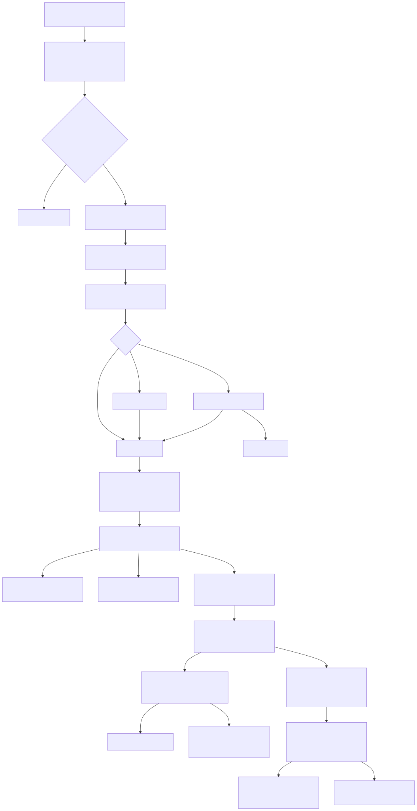

مصدر الرسم: `diagrams/brga/p29-01.mmd`

### 1.2 مسارات بديلة واستثناءات (As-Is)

مصدر الرسم: `diagrams/brga/p29-02.mmd`

### 1.3 خطوات يدوية/خارج النظام (من ممارسة الشركة) وأسئلة

| الخطوة | المعروف من ملفات الشركة | الحالة |
|---|---|---|
| سجل المبيعات الشهري | ورقة لكل شهر: فاتورة، عميل، مندوب، إجمالي، مسدد، حالة، صلاحية، كميات لكل صنف (B3-0291/0292) | مستمر يدويًا؟ **QUESTION Q-AS-1**: هل ما زال الفريق يملأ «مبيعات 2026.xlsx» بالتوازي مع النظام؟ |
| كشف حساب لكل عميل | 300+ ورقة دفتر جارٍ (B3-0294، B3-0190، B6c-0209) | **QUESTION Q-AS-2**: هل كشوف Excel ما زالت المرجع عند النزاع؟ |
| متابعة غير المحصل لكل مندوب | ورقة لكل مندوب: الباقي = القيمة − المحصل − المرتجع (B3-0295) | **QUESTION Q-AS-3**: من يحدّثها ومتى؟ |
| تسجيل التحصيلات | رقم الفاتورة، رقم الشيك/الإيداع/التحويل، الموظف المحصل، تاريخ الاستحقاق (B3-0293) | **QUESTION Q-AS-4**: هل يُدخل المحصل الدفعة بنفسه أم المحاسب لاحقًا؟ |
| إذن استلام بضاعة مختوم | ورق رسمي بتوقيع المسلّم والمستلم والختم (B3-0297/0311) | **QUESTION Q-AS-5**: هل الإذن الورقي ما زال يُوقّع إلى جانب التوقيع الرقمي؟ |
| دورة النقد | بيع ← مديونية ← تحصيل ← عهدة المحصل ← توريد للخزنة/البنك ← مطابقة (B3-0003/0004) | التوريد والعهدة لدى C6؛ **QUESTION Q-AS-6**: كيف تُسجل إيداعات الشيكات في البنك اليوم؟ |
| تجهيز وتوزيع | لا يوجد في النظام قائمة تجهيز أو رحلات | **QUESTION Q-AS-7**: كيف يُجهز ويُوزع اليوم (ورقي/شركة شحن)؟ |
| البونص والعروض | غير موجود في النظام | **QUESTION Q-AS-8**: كيف يُسجل البونص المجاني حاليًا (مخزنيًا ومحاسبيًا)؟ |

لا يُفترض غياب أي خطوة يدوية لم ترد في المصادر.

---

## 2. To-Be المقترح

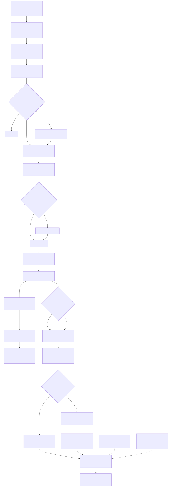

مصدر الرسم: `diagrams/brga/p29-03.mmd`

### 2.1 القرارات التي يعتمد عليها الـTo-Be

| القرار | يؤثر على خطوة |
|---|---|
| DEC-O2C-01 أساس السعر (شامل/غير شامل) | تحديد السعر، الضريبة |
| DEC-O2C-02 سلطة التسعير (ADR-1) | تحديد السعر |
| DEC-O2C-03 نموذج صلاحية الخصم ومعنى 12% | حوكمة الخصم |
| DEC-O2C-05 مفردات الشرائح | قوائم الشريحة، الأعمار بالشريحة |
| DEC-O2C-06 نموذج 09-25 مقابل 09-28 | القاعدة الواحدة / ملف العميل |
| DEC-O2C-07 / 08 البونص | سطور البونص |
| DEC-O2C-09 الأسعار المعتمدة | الكتالوج |
| DEC-O2C-12 تحديد التشغيلة | التخصيص |
| DEC-O2C-14 توقيت الفاتورة وتعددها | الفوترة، الشحن الجزئي |
| DEC-O2C-15 شروط السداد | الاستحقاق، الأعمار |
| DEC-O2C-16 سلوك الـsaga عند فشل النشر | outbox / التعافي |
| DEC-O2C-17 إعادة الفوترة | الإلغاء/إعادة الإصدار |
| DEC-O2C-18 الاعتراف بالشيك | التحصيل بالشيك |
| DEC-O2C-19 إثبات التسليم | التسليم |
| DEC-O2C-21 عتبة الاعتماد وعلاقتها بتجاوز الائتمان | الاعتماد |

### 2.2 خطوات To-Be افتراضية (Assumptions — تحتاج تأكيد المالك)

1. وثيقة بيع واحدة في الواجهة (الفاتورة) مع بقاء الأمر مسارًا خلفيًا — مبني على قرار المالك (REQ-O2C-029) لكن علاقته بالاعتماد/التخصيص للفاتورة المباشرة **افتراض**.
2. ترتيب أولوية السعر (عميل ▸ شريحة ▸ قواعد ▸ كتالوج) — من وثيقة تصميم غير موقعة.
3. قائمة التجهيز والرحلات والمركبات المبردة — مقترحات AI (REQ-O2C-057/058)، لا قرار مالك.
4. الشحن الجزئي مع backorder — مقترح AI (REQ-O2C-059).
5. سند قبض برأس وتوزيعات قابل للعكس كاملًا وارتداد الشيك على كل التوزيعات — مستنتج من ممارسة الشركة ومن قرار المالك «توزيع على عدة فواتير».
6. نقل الشيك المصفّى إلى البنك — يعتمد على DEC-O2C-18 وعلى C6.
7. فصل حالة التسوية عن حالة التنفيذ في حقول مستقلة — مستنتج (REQ-O2C-004).
8. outbox في Sales — مقترح تقني لحسم DEC-O2C-16.
9. إعادة الإصدار ببنود واعتماد ثانٍ — مقترح رقابي (REQ-O2C-037).

---

## C2 — Process analysis: Customer master & Field Sales (PFX=CRM)

Scope: lead → customer onboarding / classification / territory / assignment → field visit plans → visits → proposals → order hand-off, plus support tickets.
Snapshots: BASELINE `89c2c31` [B] and CURRENT `fa40270` [C]. The CRM field-sales, field-operations, support and legacy visits modules are byte-identical in B and C. Only accounts (export, CSV upload + dry-run, pricing-profile fields) and leads (lost reason, LOST→NEW, contact fields) differ. Production status: **Unknown**. There is no DB or runtime evidence, and the production value of `FIELD_PROPOSAL_CONVERSION_ENABLED` is unknown (compose default `false`).

## 1. As-Is (as coded, with known/unknown manual steps)

Legend: steps marked `Q:` are explicit QUESTIONS. The manual practice there is unknown and is **not** assumed to be absent.

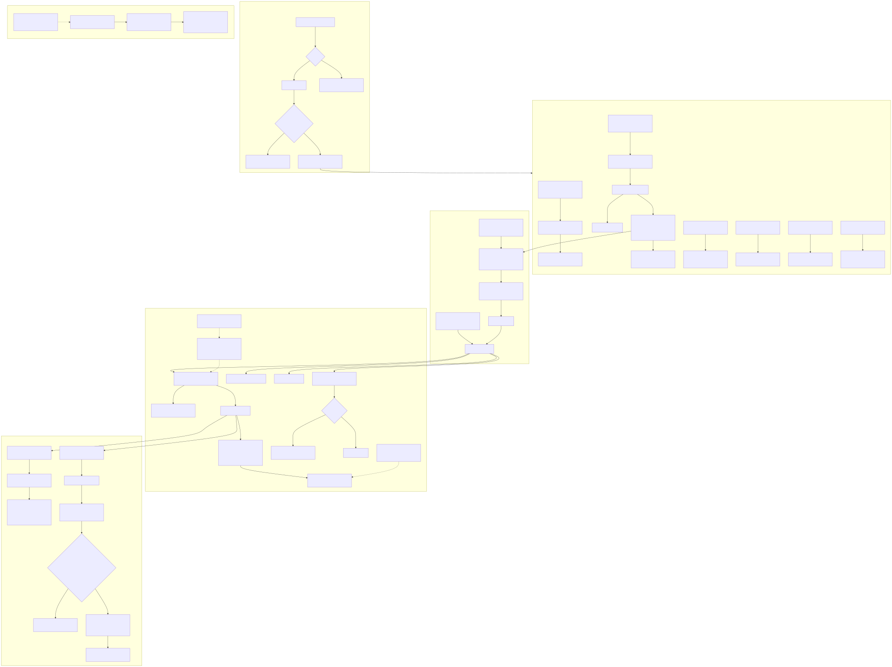

مصدر الرسم: `diagrams/brga/p29-04.mmd`

### As-Is observations (code-backed)
- Onboarding is robust: idempotent, transactional and outboxed ([B+C] `customer-onboarding.service.ts:171-311`). It can be bypassed by CSV import ([C] `accounts.service.ts:426-546`) and by the identity script (no event).
- An onboarded customer must have an active rep, so channel customers (C/R) cannot be represented without a nominal rep (DEC-CRM-08).
- No code path sets `Account.territoryId` after creation except import. `CustomerAssignment.territoryId` exists.
- There is no plan approval, no weekly plan, no auto-MISSED job, no check-in distance check, and no target achievement.
- The offline draft replay conflicts with the server's 5-minute capture freshness rule (DEC-CRM-10).
- The field-operations report filter `account.area` references a non-existent column ([B+C] `operations.service.ts:143-144`).
- Proposal conversion is fully coded with maker-checker, but it is off by default.

## 2. Proposed To-Be

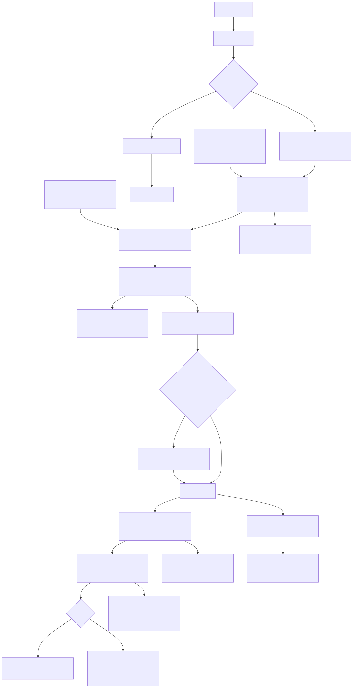

مصدر الرسم: `diagrams/brga/p29-05.mmd`

### Business decisions the To-Be depends on
DEC-CRM-04 (import defaults), DEC-CRM-05 (who classifies), DEC-CRM-07 (block inactive), DEC-CRM-08 (rep ownership and no-rep channels), DEC-CRM-09 (plan approval/horizon), DEC-CRM-10 (offline replay), DEC-CRM-11 (closure fields), DEC-CRM-12 (UI options), DEC-CRM-13 (lead conversion creates account), DEC-CRM-02 (extra segments), DEC-CRM-06 (name uniqueness), DEC-CRM-03 (opening balance at creation).

### To-Be steps that are assumptions (need owner approval)
- The "channel" attribute for customers without a rep (C/R/G) is inferred from the owner's explanation of the suffix codes (B1-0313). It is not a decided requirement.
- Supervisor approval of plans, the weekly horizon, the 300 m distance warning and the 23:30 auto-MISSED job come from AI-derived requirements (B5a-0229, B4a-0044). Not owner-decided.
- Lead conversion opening onboarding is an assumption (DEC-CRM-13).
- Accepting late-synced offline drafts with a review flag is an assumption (DEC-CRM-10). The current decided rule rejects captures older than 5 minutes.
- Blocking new sales for inactive customers is an assumption (DEC-CRM-07). The documented scope explicitly excluded it (B1-0243).
- Enabling proposal conversion in production is a release decision (REQ-CRM-032).
- The stock movement for customer gifts sourced "from stock or damaged" (REQ-CRM-023) depends on the C7/C4 gift and inventory decisions.

---

## C3: عملية Procure-to-Pay (من الشراء إلى الدفع)

النطاق: طلب الشراء، أمر الشراء واعتماده، ربط الاستلام بأمر الشراء، فاتورة المورد، المطابقة الثلاثية، دفتر المورد (AP)، سداد الموردين، مرتجعات ومطالبات الموردين (الجانب المالي)، شحنات الاستيراد والتخليص، التكاليف الواصلة.

ما يخرج عن هذا النطاق:
- الحركة المادية للاستلام والحجر والجودة: تتبع C4.
- بيانات المورد الرئيسية: تعيش في خدمة Products، ونشير إليها هنا كمرجع فقط.
- فروق العملة المحققة وإعادة التقييم: تتبع C5.
- نطاق الخزينة: يتبع C6.

اللقطتان المستخدمتان:
- **BASELINE `89c2c31` [B]:** موسومة كصورة الإنتاج، لكن هذا غير مثبت.
- **CURRENT `fa40270` [C]:** غير منشورة.

حالة الإنتاج **Unknown** في كل خطوة، لأنه لا يوجد دليل من قاعدة البيانات أو من التشغيل.

ملفات المراجع:
- المتطلبات: `C3.reqs.json` (REQ-P2P-001..032)
- القواعد: `C3.rules.json` (BR-P2P-01..37)
- القرارات: `C3.decisions.json` (DEC-P2P-01..13)

---

## 1. الوضع الحالي (As-Is) كما هو في الكود

### 1.1 الخطوات

| # | الخطوة | BASELINE [B] | CURRENT [C] | المرجع |
|---|---|---|---|---|
| 1 | طلب شراء داخلي | غير موجود (صفحة Placeholder) | غير موجود | REQ-001 |
| 2 | إنشاء أمر الشراء | ينشئه من يملك `accounting.matching.manage`. الرقم يأتي من العميل والحالة DRAFT | ينشئه SUPER_ADMIN فقط. الرقم `PO-YYYY-NNNN` من الخادم، والأمر يولد **APPROVED** مباشرة | `matching.service.ts` [B]:91-127، [C]:100-160، REQ-002/003، ACC-12 |
| 3 | اعتماد أمر الشراء | submit ثم approve، مع فصل المهام (المعتمد غير المنشئ) | الكود موجود لكن لا يصل إليه أي أمر جديد | [B]:186-229، [C]:148 |
| 4 | العملة وشروط التسليم | العمود `currency` موجود لكنه ثابت على EGP، ولا يوجد Incoterm ولا شروط دفع | نفس الوضع | REQ-004 |
| 5 | إرسال الأمر للمورد | خارج النظام (قالب الشركة باليورو، B3-0310) | نفس الوضع | REQ-005/032 |
| 6 | الشحن والتخليص | غير موجود | الكود والجداول موجودة لكن الوحدة **غير مسجلة** (تُرجع 404) ولا توجد واجهة | REQ-026/027، ARC-05 |
| 7 | الاستلام الفعلي (C4) | الاستلام في حوض الحجر. `unitCost` يُدخل يدويًا، ولا مرجع لأمر الشراء، ولا مفتاح idempotency | مرجع أمر الشراء وسطره اختياري، لكن النافذة تعرض الأوامر **APPROVED فقط** | `goods-receipt.dto.ts:18-20`، `receive-stock-modal.tsx:72`، INV-09 |
| 8 | قيد المستحق (AP) | الحدث `GoodsReceived` يُنشئ قيد DEBIT RECEIPT مرة واحدة لكل حدث | نفس السلوك، ويليه قيد GL `Dr 1131 / Cr 2111`، ثم الإسقاط على أمر الشراء. كل منها خطوة مستقلة | `saga-listener` [B]:290-294، [C]:318-356، ACC-16 |
| 9 | تحديث الكمية المستلمة على أمر الشراء | لا يوجد كود يكتب `receivedQty` | `PurchaseOrderReceipt` لكل `event_id`، مع اشتقاق الحالة PARTIALLY أو FULLY | [C] `matching.service.ts:951-1030` |
| 10 | فاتورة المورد | تُسجل يدويًا، وهي فريدة لكل (مورد، رقم)، وتتطلب أمرًا معتمدًا، وبالجنيه فقط | نفس السلوك، مع إضافة العملة وسعر الصرف و`baseTotal` | REQ-009 |
| 11 | المطابقة الثلاثية | مقارنة تراكمية، لكن ساق الاستلام = **المطلوب** (`:604`) | مقارنة مع **المستلم الفعلي** (`:583-597`) | REQ-010، ACC-19 |
| 12 | الاستثناءات | override أو reject بسبب، مع فصل المهام، ولا توجد شاشة | نفس السلوك، مع شاشة `matching/page.tsx` | REQ-011 |
| 13 | أعمار الدائنين | الرصيد من الدفتر. الأعمار من `dueDate` لكن الفلتر `isApprovedPayment=false` **معكوس** | نفس الوضع | `supplier-ledger.service.ts:152-176`، REQ-018 |
| 14 | سداد المورد | **غير موجود**. البديل الوحيد حركة خزينة حرة (سحب أو مصروف) غير مربوطة بالمورد | تنفيذان متعارضان (v1 وv2) **غير مسجلين**، وزر السداد في الواجهة يُرجع 404 | REQ-016/017، ACC-10، DB-03 |
| 15 | مرتجع المورد | قيد CREDIT | نفس القيد، مع قيد GL | REQ-014 |
| 16 | مطالبات التالف | غير موجودة | غير موجودة | REQ-015، GOV-05 |
| 17 | التكاليف الواصلة | قسيمة محاسبة فيها 5 بنود ثابتة بالجنيه، والحساب float، ولا ترحيل | نفس الوضع، لكن الحساب Decimal | REQ-029/030، ACC-21 |

### 1.2 مخطط الوضع الحالي

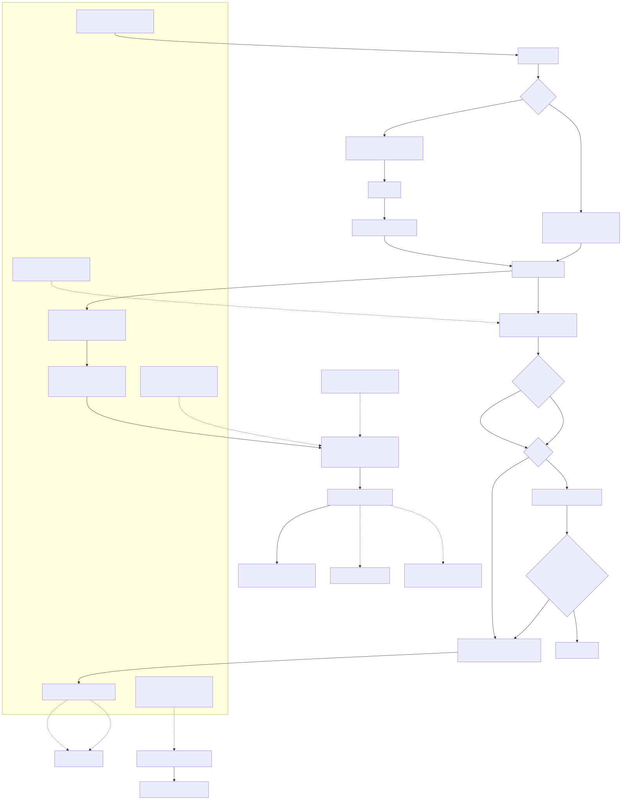

مصدر الرسم: `diagrams/brga/p29-06.mmd`

### 1.3 الخطوات اليدوية أو الخارجية: أسئلة لا افتراضات

ممارسات الشركة هنا غير معروفة. لا نفترض أنها غائبة، بل نحتاج إجابة عن كل سؤال:

1. كيف تُسجل الحاجة الداخلية للشراء، ومن يعتمدها؟ (REQ-001، DEC-P2P-11)
2. هل تُرسل أوامر الشراء من قالب الشركة (B3-0310)، وهل يُعاد إدخالها في النظام بنفس الأرقام؟ (REQ-004/032)
3. أين تُتابع الشحنات والتخليص والقرارات الرقابية؟ (REQ-026/027)
4. كيف تُحسب تكلفة الوحدة الواصلة التي تُدخل يدويًا في `unitCost` عند الاستلام؟ (REQ-029/030)
5. كيف يُسجل سداد الموردين اليوم؟ هل في النظام كسحب أو مصروف من الخزينة، أم خارج النظام؟ (REQ-016/017)
6. كيف تُتابع مطالبات التالف وكيف تُسوى؟ (REQ-015، DEC-P2P-12)
7. أين تُسجل فواتير الشحن والجمارك والتخليص، ومن يدفعها؟ (REQ-009/030، DEC-P2P-10)

### 1.4 نقاط الانكسار

- **الدورة غير مغلقة.** المستحق يُنشأ عند الاستلام ولا ينقص إلا بالمرتجع، والسداد غير ممكن في النسختين. النتيجة أن رصيد الموردين يتضخم.
- **مصدران منفصلان للحقيقة.** الدفتر يُبنى من الاستلامات، بينما «معتمد للدفع» مجرد علامة على الفاتورة. لا يربط بينهما شيء، ولا يوجد تقرير «مستلم غير مفوتر» (DEC-P2P-01).
- **CURRENT يصلح المطابقة ويكسر الاعتماد.** فهو يقارن بالمستلم الفعلي، لكن أمر الشراء يولد APPROVED دون اعتماد. كذلك لا يمكن ربط الاستلام الثاني لأمر مستلم جزئيًا من الواجهة، فتتحول فاتورة صحيحة إلى QUANTITY_MISMATCH.
- **تقرير الأعمار معكوس.** يستبعد الفواتير المعتمدة غير المسددة، ويشمل الفواتير المرفوضة.
- **الاستيراد كله خارج النظام في الواقع.** الكود في CURRENT موجود لكنه غير مسجل، وهذا هو النشاط الأساسي للشركة.

---

## 2. الوضع المقترح (To-Be)

يلتزم المقترح بقرارات المالك الآتية:

- المستحق ينشأ عند الاستلام (B2-0085).
- أمر الشراء سجل، وربطه بالاستلام لا يمنع الاستلام (B2-0086).
- الكمية المستلمة على الأمر حقيقة تقريرية، والتوريد الزائد لا يُمنع (B2-0088).
- الترقيم من الخادم، والإنشاء لـ SUPER_ADMIN (B2-0087).
- لا خصم تلقائي للتالف، والمطالبات دورة مستقلة (B1-0078، B1-0109، B1-0110).

خطوة الاعتماد معلقة على DEC-P2P-02.

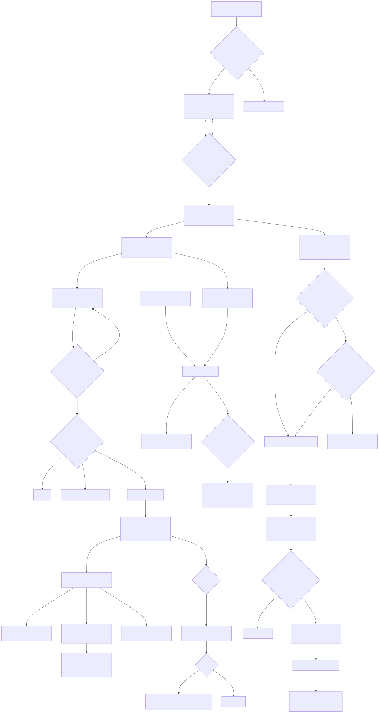

مصدر الرسم: `diagrams/brga/p29-07.mmd`

### 2.1 قرارات الأعمال التي يعتمد عليها المقترح

| القرار | ما يحسمه | الخطوات المتأثرة |
|---|---|---|
| DEC-P2P-01 (يمنع التقدم) | تأكيد أن المستحق عند الاستلام، وإلغاء تصميم «المستحق من الفاتورة»، والحاجة لتقرير «مستلم غير مفوتر» | AP، AG |
| DEC-P2P-02 (يمنع التقدم) | من يعتمد أمر الشراء بعد حصر الإنشاء في SUPER_ADMIN | POA |
| DEC-P2P-03 | طباعة أمر الشراء | POS |
| DEC-P2P-04 (يمنع التقدم) | موقع الشحنات والتكاليف الواصلة ونطاقها | SH، LCE، LCPOST |
| DEC-P2P-05 | ما الاستلام الذي يُحتسب (الحجر أم الإفراج) | PROJ، MT |
| DEC-P2P-06 | الزيادة في التوريد والاستلام على أمر ملغى | EXR |
| DEC-P2P-07 | الإغلاق الجزئي أو الإلغاء بعد الاستلام | POS |
| DEC-P2P-08 (يمنع التقدم) | هل GRN أو الربط بأمر الشراء إلزامي لدفع فاتورة البضاعة | GRN، MT، CHK |
| DEC-P2P-09 (يمنع التقدم) | تنفيذ السداد، وطرق الدفع، والدفعة المقدمة | PAY |
| DEC-P2P-10 | تصنيف الموردين وبياناتهم المالية | LCI، APS |
| DEC-P2P-11 | طلب الشراء الداخلي | PR |
| DEC-P2P-12 | تسوية المطالبات | CLS |
| DEC-P2P-13 | حد الاعتماد | POA |

### 2.2 خطوات في المقترح هي افتراضات تحتاج اعتمادًا

أي خطوة لم يقررها المالك صراحة تُعد افتراضًا:

1. **طلب الشراء الداخلي (PR، PRA):** افتراض، والطلب اختياري.
2. **اعتماد مدير المالية لأمر الشراء (POA):** متعارض بين قرارين للمالك.
3. **حد القيمة:** افتراض.
4. **حالة SENT وطباعة أمر الشراء:** افتراض.
5. **الشحنة وبواباتها (SH، CF، REG، HELD):** وثائق تصميم لا قرار مالك، وموقعها معلق على DEC-04.
6. **تقرير استثناءات الربط (EXR):** افتراض.
7. **التكاليف الواصلة ومستحقات موردي الخدمات (LCE..LCPOST، APS):** افتراض، ويتعارض مع قرار عدم تصنيف الموردين (DEC-10).
8. **فحص العملة والوحدة في المطابقة، ومستوى CFO للاستثناء:** الثاني موثق في وثيقة الشركة (B3-0328)، والأول افتراض.
9. **تقرير «مستلم غير مفوتر» (AG):** افتراض.
10. **سداد المورد بمكوناته (PAY، CHK، POSTP، REV):** ادعاءات تنفيذ، دون قرار صريح بالشكل. أما فرق العملة المحقق فقرار مالك مسجل في C5 (B2-0090).

### 2.3 الملكية بين المجموعات

- **C4:** حركة الاستلام المادية، والحجر، ومفتاح idempotency للاستلام (INV-09)، وتكلفة التشغيلة في المخزون، وموديل المورد في Products.
- **C5:** قيود GL، وفرق العملة المحقق، وإعادة التقييم.
- **C6:** نطاق الخزينة وطرق الدفع.
- **C8:** إسناد صلاحيات الاعتماد للأدوار (B1-0063).

---

## C4 — عملية «المخزون / الجودة / المرتجعات» (Inventory / Quality / Returns)

النطاق: الاستلام → الحجر وفحص الجودة → المخزون القابل للبيع → الحجز (FEFO) → الصرف؛ المرتجعات (عميل ومورد)؛ الاستدعاء؛ التالف والإعدام؛ الجرد.
اللقطات: BASELINE = `base/` (89c2c31، مرشح الإنتاج غير مثبت) و CURRENT = `cur/` (fa40270، غير منشور). حالة الإنتاج لكل خطوة: **Unknown** (لا دليل قاعدة بيانات/تشغيل).
المتطلبات المرجعية: `C4.reqs.json` (REQ-INV-001…071)، القواعد `C4.rules.json` (BR-INV-01…68)، القرارات `C4.decisions.json` (DEC-INV-01…37). كل مصدر ممارسة شركة مذكور بمعرّف sid من `C4.input.jsonl`.

> ملاحظة: الفرق بين B وC في هذه العملية محدود: C يضيف طبقات تكلفة FIFO وoutbox للاستلام، ورفض الدفعات المنتهية/المحظورة عند تحميل الأمانة (REQ-INV-031)، وزر إنشاء تشغيلة. كل مسارات الجودة والاستدعاء والمرتجعات متطابقة في النسختين.

---

## 1. As-Is (كما هو مكوَّد + الخطوات اليدوية المعروفة/المجهولة)

### 1.1 الاستلام → الجودة → قابل للبيع → الحجز → الصرف

**كما هو مكوَّد:**
1. QA أو أمين المخزن ينشئ التشغيلة في Products (`POST /batches`) بحالة QUARANTINE؛ وزر الإنشاء في شاشة التشغيلات موجود في C فقط.
2. أمين المخزن يستلم (`POST /transactions/goods-receipt`) فيدخل الرصيد حوض QUARANTINE بحركتي RECEIPT وQUARANTINE_IN. المخزون **لا يتحقق** من أن المنتج والتشغيلة متطابقان، ويأخذ تاريخ الانتهاء من العميل (INV-08)، ولا يوجد مفتاح idempotency (INV-09). المحاسبة تقيّد AP عند وصول GoodsReceived: النشر مباشر في B، وعبر outbox في C.
3. QA يسجل سجل QC (PENDING ثم PASS/FAIL/CONDITIONAL)، ثم يُفرج (`/release`). الإفراج يتطلب PASS/CONDITIONAL، والتوقيع اختياري. يُنشر BatchReleased مباشرة بعد التحديث، بلا outbox (INV-03).
4. عند وصول BatchReleased ينقل المخزون الرصيد QUARANTINE→WAREHOUSE. أي استلام لاحق لنفس التشغيلة يبقى في الحجر (INV-04).
5. الطلب: Sales saga → StockReserveRequested، ثم يخصص المخزون بـFEFO (أمانة العميل أولًا ثم WAREHOUSE، مع استبعاد المنتهي والمحظور)، ثم reserve داخل Serializable، ثم StockReserved/Failed.
6. الشحن: `ship()` يفحص الحظر (assertShippable)، ثم OrderMarkedShipped، ثم `issue()`: onHand−، reserved−، حركة ISSUE. **لا COGS** لأوامر الـsaga (INV-07). الفاتورة المباشرة تصرف تزامنيًا عبر issue-direct (وفي C فقط تكلفة FIFO مع StockIssued).
7. الإلغاء يحرر الحجز. الحجز الراكد أكثر من 72 ساعة يُكتشف ويُبلَّغ عنه فقط، بلا إفراج تلقائي (قرار المالك).

**خطوات خارج النظام أو مجهولة (أسئلة):**
- هل يوجد فحص فيزيائي مستقل (عد/مطابقة مع فاتورة المورد) قبل التسجيل؟ ومن يوقّع إذن الاستلام الورقي؟ (DEC-INV-02)
- كيف يُسجَّل التالف عند الوصول اليوم؟ (لا خانة في الاستلام — REQ-INV-010)
- هل يُنتظر إفراج الهيئة قبل الإفراج الداخلي؟ وأين يُحفظ دليله؟ (REQ-INV-012)
- هل يحمل المندوبون مخزونًا خارج المخزن، وكيف يُتابَع اليوم؟ (DEC-INV-01)

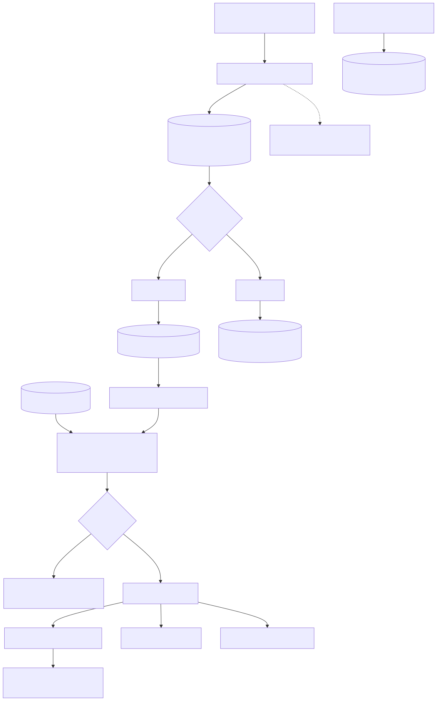

مصدر الرسم: `diagrams/brga/p29-08.mmd`

### 1.2 مرتجع العميل (فعلي + تسليم الائتمان)

**كما هو مكوَّد (متطابق في B وC):**
1. المندوب يسجل المرتجع على أمر بحالة INVOICED/PAID/SHIPPED/DELIVERED، ويشمل ذلك أوامر مفوترة لم تُشحن بعد (SAL-06). لكل سطر: تشغيلة من التخصيص الفعلي، وكمية لا تتجاوز المتبقي لتلك التشغيلة، و**حالة يعلنها الطالب** (SELLABLE/DAMAGED). السبب نص حر.
2. يُسجَّل المرتجع PENDING، ويزيد returnedQty كحجز منطقي.
3. معتمد مستقل (sales.returns.approve، ولا يكون هو المسجل) يعتمد. يتحول المرتجع إلى APPROVED، ثم يُنشر SalesReturnCreated، ثم POSTED. الرفض يتطلب سببًا ويفرج returnedQty، والمرفوض يمكن تعديله وإعادة إرساله.
4. عند وصول الحدث، يعيد المخزون SELLABLE **فورًا إلى حوض WAREHOUSE القابل للبيع**، بلا استلام فيزيائي ولا فحص (REQ-INV-045 CONTRADICTED). أما DAMAGED فيُسجَّل حركة بكمية 0 فقط (REQ-INV-047).
5. المحاسبة تضيف creditedAmount. على فاتورة مسددة بالكامل **يُرفض الائتمان** بينما المخزون أعاد البضاعة (ACC-18، REQ-INV-049 CONTRADICTED).
6. لا عكس لمرتجع مُرحّل (REQ-INV-044)، ولا سياسة صلاحية/عبوة (REQ-INV-046).

**أسئلة عن الممارسة اليدوية:**
- متى تصل البضاعة المرتجعة فعليًا إلى المخزن مقارنة بلحظة الاعتماد؟ ومن يفحصها اليوم؟
- هل تُطبَّق قاعدة «90 يومًا قبل الانتهاء + سلامة العبوة + اكتمال الأكياس» يدويًا؟ ومن يطبقها؟
- كيف يُرد المال للعميل على فاتورة مسددة اليوم؟

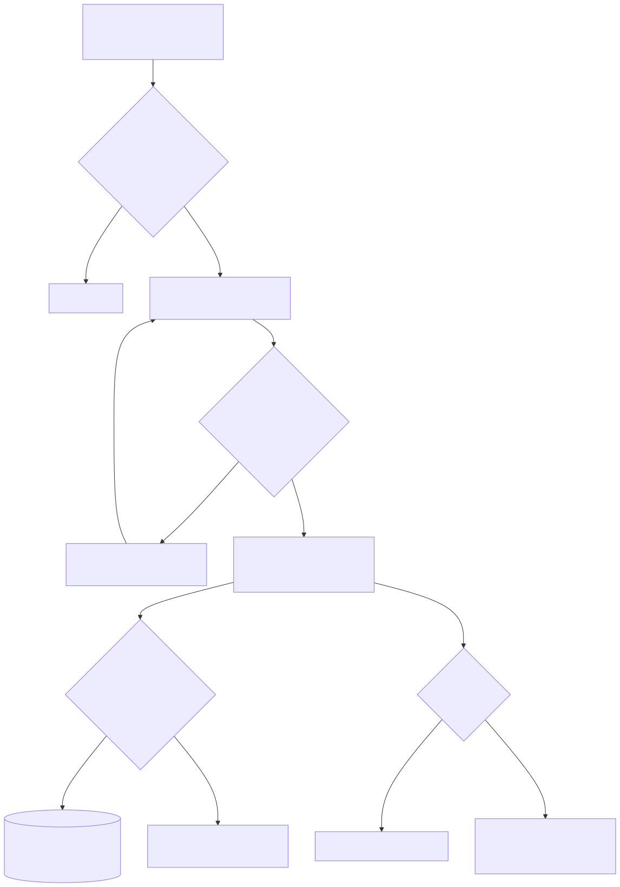

مصدر الرسم: `diagrams/brga/p29-09.mmd`

### 1.3 الاستدعاء

**كما هو مكوَّد (B=C):** QA يستدعي (`/recall` مع سبب ودرجة)، فتصبح التشغيلة RECALLED ويُنشر RecallInitiated **مباشرة**. بعدها:
- المخزون يضيف BlockedBatch، ويجمّد الأمانة (available→held) مع CONSIGN_HOLD، وينشر ConsignmentRecallHold.
- المبيعات تضيف BlockedBatch وتحول أوامر ALLOCATED/INVOICED/PAID إلى ON_HOLD_RECALL (مع حفظ الحالة السابقة)، ثم ترفض شحنها.
- مسؤول الاستدعاء يقرر لكل أمر: RESUME (مرفوض ما دام الحظر قائمًا) أو CANCEL (يحرر الحجز، **ويتجاهل المبالغ المحصلة** — SAL-16).
- شاشة الاستدعاء تعرض التوزيع والأمانة والتسلسل والتصدير.

إخطار العملاء والهيئة والاسترجاع والإغلاق كلها **خارج النظام** (REQ-INV-037). إن ضاع RecallInitiated فلا يمكن إعادة الاستدعاء (INV-03).

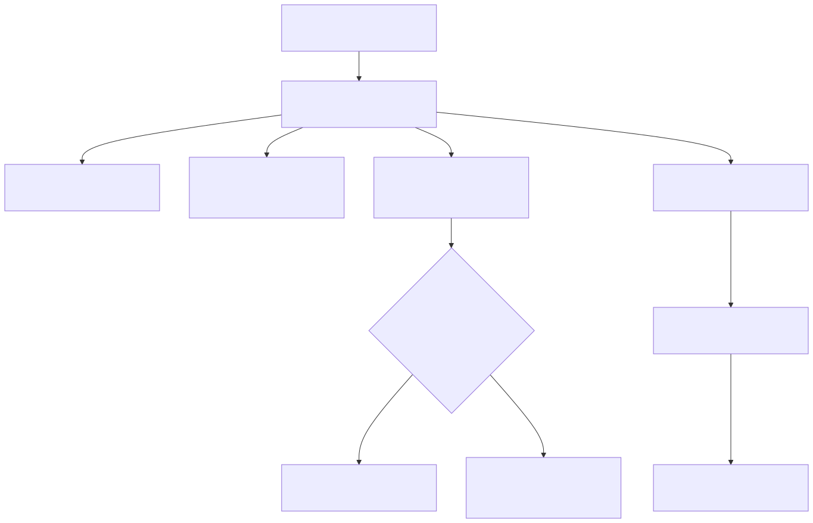

مصدر الرسم: `diagrams/brga/p29-10.mmd`

### 1.4 التالف والإعدام

**كما هو مكوَّد:** يصل المخزون إلى DAMAGED فقط برفض QC أو بنقل يدوي (`/quarantine/:batchId/move`). أما المرتجع التالف فلا يدخل أي رصيد. لا يوجد مسار خروج من DAMAGED: مرتجع المورد والتسوية تعملان على WAREHOUSE فقط. مهمة 07:00 تُبلّغ عن مرشحي الإعدام فقط. لا شاشة فرز ولا إذن إعدام ولا قيد خسارة ولا مطالبة مورد/شحن، رغم قرارات المالك ت-7/ت-8.

**أسئلة:** كيف يُعدم التالف اليوم (لجنة؟ محضر؟ شاهد الهيئة؟)، وكيف يُقيد محاسبيًا؟ وهل تُقدَّم مطالبات لشركات الشحن؟

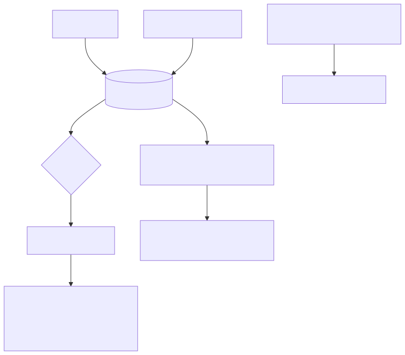

مصدر الرسم: `diagrams/brga/p29-11.mmd`

### 1.5 الجرد

**كما هو مكوَّد:** صفحة الجرد مجرد Placeholder. البديل الوحيد تسوية `COUNT_CORRECTION` لبند واحد. النقص ≥50 بلا صلاحية يذهب إلى طلب اعتماد غير ذري ولا يمنع الاعتماد الذاتي. الزيادة بلا حد. المطابقة الليلية تبلّغ انحرافًا كاذبًا لكل استلام في الحجر (INV-06).

**أسئلة:** هل يُجرى جرد دوري اليوم؟ بأي تكرار؟ على ورق أم Excel؟ ومن يعتمد الفروق؟

مصدر الرسم: `diagrams/brga/p29-12.mmd`

---

## 2. To-Be المقترح (يتوقف على القرارات أدناه)

### 2.1 الاستلام → الجودة → الحجز → الصرف

- مستند استلام (GRN) برأس وسطور، يحمل مفتاح idempotency وخانة «عدد التالف»، ويتحقق من التشغيلة في Products ويأخذ تاريخ الانتهاء منها (REQ-INV-007/009/010، DEC-INV-02).
- قرارات QC تُنشر عبر outbox في Products. ورفض QC يُنتج حدث «حكم حجر» تعالجه المحاسبة وفق DEC-INV-03 (مرتجع مورد أو شطب) (REQ-INV-016).
- الاستلام اللاحق لتشغيلة مفرج عنها يُفرج آليًا، أو يظهر في طابور (REQ-INV-007 AC-3).
- كل خروج يستهلك التكلفة وينتج COGS بالطريقة المعتمدة (REQ-INV-051، DEC-INV-20). لحظة الصرف والشحن الجزئي حسب DEC-INV-06/07.
- إضافة قيود CHECK على الأرصدة (REQ-INV-005).

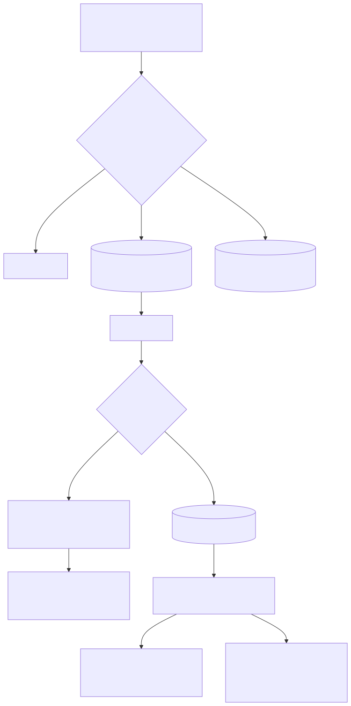

مصدر الرسم: `diagrams/brga/p29-13.mmd`

### 2.2 مرتجع العميل (RMA بفحص مستقل)

- طلب المرتجع يُعتمد مع سياسة صلاحية/عبوة/نافذة معتمدة (DEC-INV-18)، ثم يُستلم فيزيائيًا في الحجر، ثم يفحصه شخص غير المنشئ.
- الصالح يذهب إلى WAREHOUSE، والتالف والمنتهي إلى DAMAGED.
- الائتمان يُحسب عند الفحص للمقبول فقط. على الفاتورة المسددة يُنشأ رصيد دائن أو استحقاق رد، ثم سند رد مستقل (REQ-INV-045/046/047/049).
- مسار عكس مرتجع مُرحّل (REQ-INV-044)، ومفتاح عمل يمنع إعادة التخزين المزدوجة (REQ-INV-048).

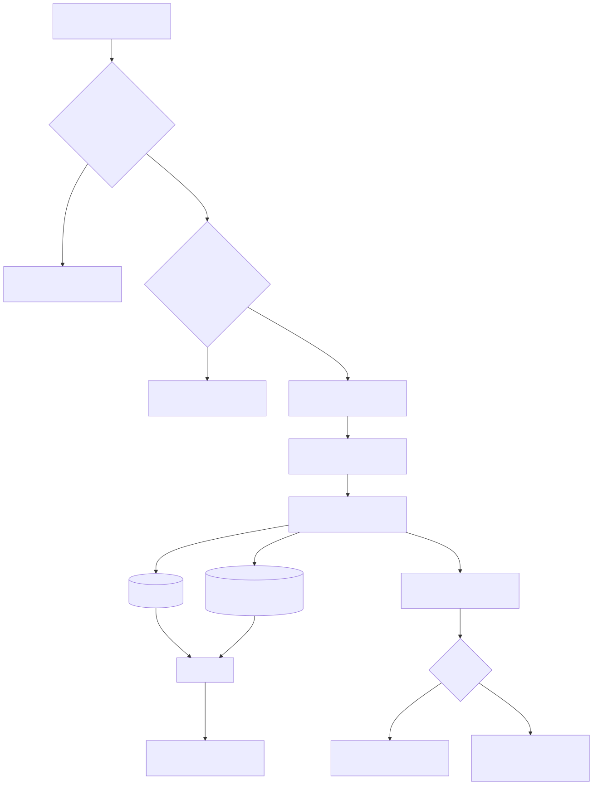

مصدر الرسم: `diagrams/brga/p29-14.mmd`

### 2.3 الاستدعاء

- RecallInitiated عبر outbox. يُنشأ كيان حالة استدعاء (RecallCase) مع قائمة العملاء والإخطار وتسجيل الإقرار. مرتجعات الاستدعاء تحدّث المسترجع، ويُطابق الموزع مع المسترجع زائد المعدوم محليًا. يُنتج تقرير إغلاق للهيئة (REQ-INV-037).
- إلغاء أمر مدفوع موقوف ينشئ رصيدًا دائنًا أو استحقاق رد (REQ-INV-035).

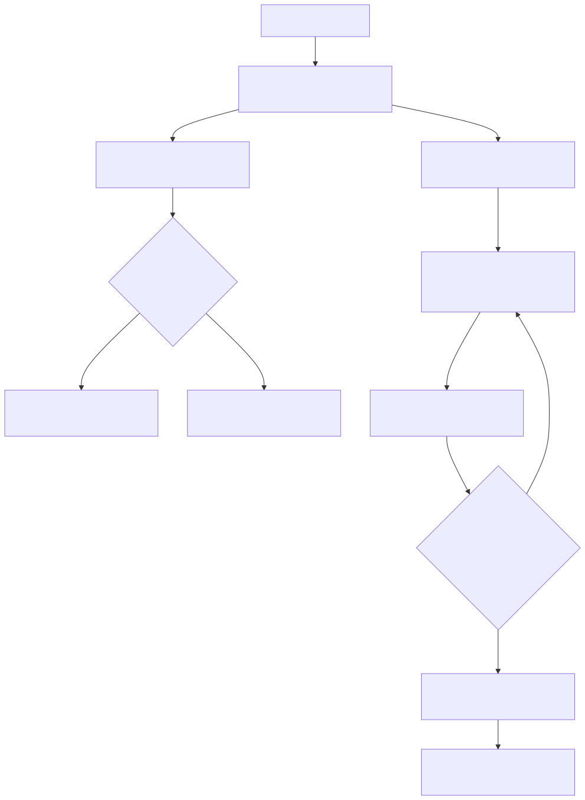

مصدر الرسم: `diagrams/brga/p29-15.mmd`

### 2.4 التالف والإعدام

- شاشة «فرز التالف» مع أحكام المالك. الأحكام: إصلاح يحوّل إلى SELLABLE (مدير المخزن)، أو هدايا/عينات (مبيعات أو تسويق)، أو إعدام (مخزن ومالية — DEC-INV-19)، أو مطالبة (مالية أو مشتريات)؛ ولكل حكم أثره المحاسبي (REQ-INV-040).
- إذن إعدام رسمي يمر بالحالات: مسودة، ثم اعتماد، ثم جدولة، ثم تنفيذ يخصم من DAMAGED/QUARANTINE، ثم ترحيل حدث بالقيمة (REQ-INV-041).
- مرتجع المورد مسموح من حوض DAMAGED (REQ-INV-050).

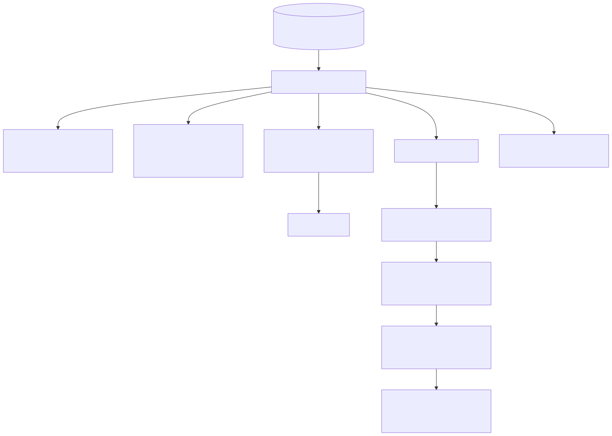

مصدر الرسم: `diagrams/brga/p29-16.mmd`

### 2.5 الجرد

- جلسة جرد مرقمة تبدأ بلقطة رصيد، ثم عد (يمكن أن يكون أعمى)، ثم تقديم بسبب لكل فرق، ثم اعتماد من غير العداد، ثم ترحيل ذري idempotent. يُبنى ذلك على مسار تسوية بعد إصلاحه (ذرية ومنع الاعتماد الذاتي)، وفق DEC-INV-12/13/14/15.
- تُصلح صيغة المطابقة الليلية (REQ-INV-006).

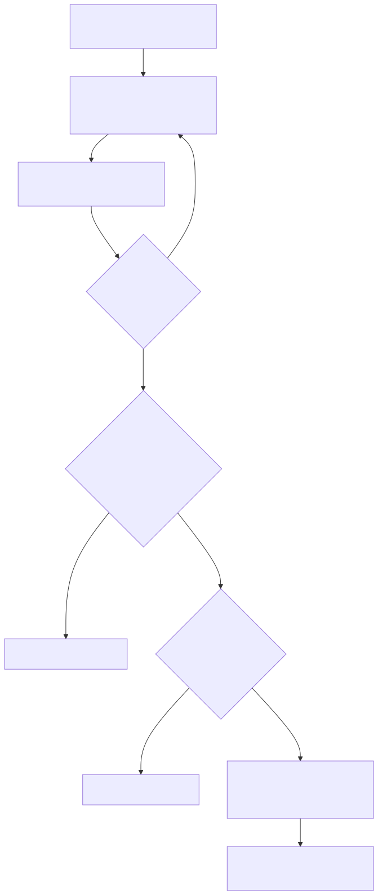

مصدر الرسم: `diagrams/brga/p29-17.mmd`

---

## 3. القرارات التي يعتمد عليها الـTo-Be

| القرار | الموضوع | يحجب |
|---|---|---|
| DEC-INV-01 | عهدة المندوب: موقع أم كيان، ووجود مخزن ثانٍ | REQ-INV-002 |
| DEC-INV-02 | مستند GRN مقابل حركة | REQ-INV-007/018/036 |
| DEC-INV-03 | الأثر المالي لرفض الجودة | REQ-INV-016/050 |
| DEC-INV-04 | إلزامية التوقيع الإلكتروني للإفراج | REQ-INV-013 |
| DEC-INV-05 | ملكية الأمانة والاعتراف بالإيراد | REQ-INV-032 |
| DEC-INV-06/07 | لحظة الصرف (شحن/تسليم)، والشحن الجزئي | REQ-INV-021 |
| DEC-INV-08 | الإلغاء بعد التخصيص: تعويض أم مطابقة | REQ-INV-022 |
| DEC-INV-09 | الحجز الراكد: تأكيد «لا إفراج تلقائي» ومالك الإفراج اليدوي | REQ-INV-023 |
| DEC-INV-10/11 | اعتماد/دورة التحويل، وحالة migration التحويلات في الإنتاج | REQ-INV-024/025 |
| DEC-INV-12..15 | نطاق الجرد، التجميد أو اللقطة، آلة الحالات، إصلاح مسار التسوية أولًا | REQ-INV-028 |
| DEC-INV-16 | معتمد المرتجع ومهلة الاعتماد | REQ-INV-043/045 |
| DEC-INV-17 | حالات الأمر المؤهلة للمرتجع (هل يُسمح قبل الشحن؟) | REQ-INV-042 |
| DEC-INV-18 | عتبات سياسة المرتجعات (90/30/180، ائتمان التالف) | REQ-INV-045/046 |
| DEC-INV-19 | معتمدو الإعدام (مخزن+مالية أم مالية+جودة) | REQ-INV-040/041 |
| DEC-INV-20 | طريقة التكلفة ونقطة COGS | REQ-INV-051 |
| DEC-INV-21/22 | الحاجة لتسلسل DSCSA، ونطاق السلسلة الباردة | REQ-INV-052/053 |
| DEC-INV-23 | عتبة التسوية الكبيرة (≥50 أم >50، الزيادة، القيمة) | REQ-INV-026 |

## 4. الخطوات اليدوية/خارج النظام المعروفة أو المحتملة (للتحقق مع المالك)

1. إخطار العملاء والهيئة ولوجستيات الاسترجاع عند الاستدعاء: خارج النظام (فجوة موثقة في B3-0343 وB4a-0058: لا RecallCase ولا إخطارات).
2. لجنة الإعدام ومحضره وشهادة شركة الإعدام: لا مسار في النظام. الممارسة الفعلية مجهولة.
3. الجرد الفعلي: لا جلسات في النظام. الممارسة الفعلية (التكرار، الأداة، المعتمد) مجهولة.
4. فحص المرتجع الفيزيائي: النظام يعيد المخزون عند الاعتماد. هل يُفحص قبل التخزين يدويًا؟ مجهول.
5. عهدة المندوبين: «شيتات» خارج النظام (ممارسة الشركة B3-0301: ورقة Excel لكل مندوب بعهدة بضاعة ونقدية؛ وB3-0083).
6. رد النقدية للعميل بعد مرتجع على فاتورة مسددة: خارج النظام، أو مرفوض محاسبيًا (ACC-18).
7. مطالبات الموردين وشركات الشحن عن التالف: لا مسار. الممارسة مجهولة.
8. إفراج الهيئة الرقابي قبل الإفراج الداخلي: غير مسجل. هل هو مطلوب لكل تشغيلة؟

---

## 5. إضافات C4: الأمانة (التصريف) والبيانات الرئيسية للمنتج والهدايا

### 5.1 As-Is — الأمانة (التصريف)

**كما هو مكوَّد:**
1. اتفاقية أمانة لكل عميل (`POST /consignment/agreements`). الواجهة داخل ملف العميل «الأمانة (التصريف)»، واختيار «بيع عادي / تصريف (أمانة)» في شاشة الطلب (REQ-INV-033).
2. التحميل (`/consignment/stock` أو إذن متعدد `/deliveries` بمفتاح idempotency) يخصم حوض WAREHOUSE للمخزن المصدر في نفس المعاملة (REQ-INV-029). في C فقط يرفض الخادم التشغيلة المنتهية أو المحظورة (REQ-INV-031، شرط المالك B1-0097). في B لا يرفضها (INV-14).
3. البيع من الأمانة: FEFO يستهلك أمانة العميل أولًا لحظة الحجز (available→consumed)، ثم يُفوتر الطلب العادي (REQ-INV-032، قرار المالك B1-0080).
4. الإرجاع: heldQty (المجمد بالاستدعاء) يذهب أولًا إلى QUARANTINE، والباقي إلى WAREHOUSE للمخزن المصدر.
5. الشطب (فقد): يحدّث lostQty ثم يكتب حركة CONSIGN_WRITE_OFF في استدعاءين منفصلين، بلا معاملة واحدة (REQ-INV-030).
6. لا قاعدة تدوير تشغيلات لدى العميل (REQ-INV-069، طلب المالك B1-0153)، ولا علم «لدى العميل أمانة» في CRM (REQ-INV-070).

**أسئلة عن الممارسة اليدوية:**
- هل يُطبق اليوم يدويًا «لا تُرسل تشغيلة جديدة قبل نفاد القديمة» (REQ-INV-069)؟ وكيف يُقاس «تقرب تخلص»؟
- متى تنتقل ملكية بضاعة التصريف ويُعترف بالإيراد (DEC-INV-05)؟ وكيف تُسوّى عهدة العميل دوريًا (جرد عند العميل؟)

مصدر الرسم: `diagrams/brga/p29-18.mmd`

### 5.2 To-Be — الأمانة

- الشطب ذري (تحديث الرصيد + حركة الدفتر في معاملة واحدة) مع قيد مساواة الأوعية الخمسة (REQ-INV-030).
- قاعدة تدوير التشغيلات عند التحميل مع تجاوز مصرح ومسبب (REQ-INV-069).
- مؤشر الأمانة في ملف العميل مشتق من الاتفاقية حسب DEC-INV-36.
- التسوية المالية لعهدة الأمانة حسب DEC-INV-05 (افتراض: لا إيراد قبل الاستهلاك — قرار المالك B1-0080).

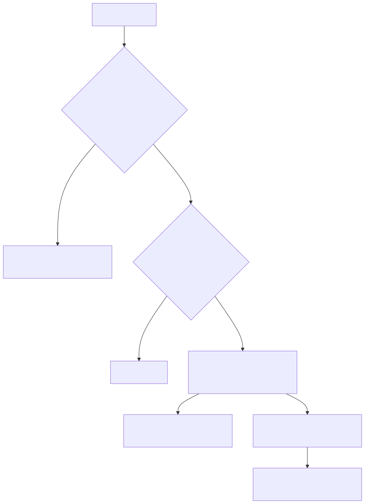

مصدر الرسم: `diagrams/brga/p29-19.mmd`

### 5.3 البيانات الرئيسية للمنتج والهدايا

**As-Is:**
- المنتج: الخلفية تقبل سعرًا فارغًا، أما واجهة الإنشاء فتفرضه (REQ-INV-056، DEC-INV-24). القوائم المرجعية (الفئة/العلامة/المصنّع) للقراءة فقط (REQ-INV-057). حالة المنتج isActive فقط (REQ-INV-058). التسجيل الرقابي حقل نصي (REQ-INV-059). تحويلات الوحدات موجودة لكنها لا تُستخدم في الكميات (REQ-INV-060). الاستيراد الجماعي بلا معاينة ولا كشف للتكرار (REQ-INV-061).
- الهدايا: بند «عينة منتج» مرجعي ولا يخصم المخزون (REQ-INV-065، قرار المالك B1-0099). هذا يتعارض مع طلب (8) ومع حكم «هدايا التالف = مصروف تسويق» (DEC-INV-32).

**أسئلة:** هل تُصرف العينات فعليًا من المخزن اليوم؟ ومن أي حوض؟ (DEC-INV-32). وكيف تُتابَع تواريخ تسجيل المنتجات وتراخيص الشركة خارج النظام (REQ-INV-059)؟

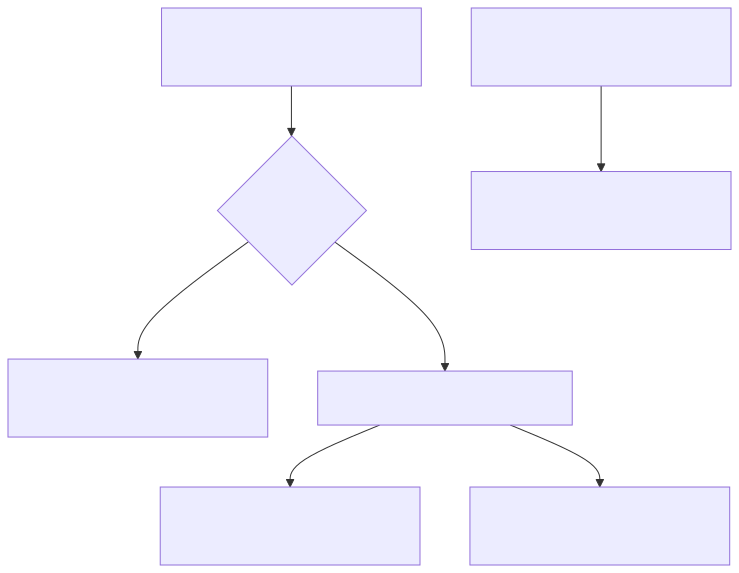

مصدر الرسم: `diagrams/brga/p29-20.mmd`

**To-Be (افتراضات بانتظار القرار):** إنشاء المنتج بلا سعر وفق DEC-INV-24، وكيان تسجيل رقابي يمنع البيع عند الانتهاء، وحالات دورة حياة للمنتج، وقوائم مرجعية قابلة للصيانة بأسماء فريدة. أما خصم العينات فيُضاف فقط إذا اعتُمد الخيار B أو C في DEC-INV-32.

## 6. القرارات الإضافية التي يعتمد عليها الـTo-Be (C4)

| القرار | الموضوع | يحجب |
|---|---|---|
| DEC-INV-24 | إنشاء منتج بلا سعر | REQ-INV-056 |
| DEC-INV-25/DEC-INV-26 | توقيت أثر المرتجع، وإعادة إرسال المرفوض | REQ-INV-043 |
| DEC-INV-27/DEC-INV-28/DEC-INV-29 | نطاق الإشعار الدائن، وقيمته الشاملة للضريبة، والمرتجع على فاتورة ملغاة | REQ-INV-071، REQ-INV-049 |
| DEC-INV-30 | مرتجع الفاتورة المباشرة | REQ-INV-042 |
| DEC-INV-32 | خصم العينات/الهدايا من المخزون | REQ-INV-065، REQ-INV-040 |
| DEC-INV-33/DEC-INV-34/DEC-INV-35 | الكميات الكسرية، ورفض الاستلام بمرجع PO خاطئ، والاستلام إلى الحجر دائمًا | REQ-INV-007، REQ-INV-068 |
| DEC-INV-36 | علم الأمانة في CRM | REQ-INV-070 |

## 7. خطوات To-Be المفترضة (Assumptions) — تحتاج تأكيد المالك

1. مستند GRN برأس وسطور (افتراض، DEC-INV-02). البديل: سجل حركات RECEIPT كما هو اليوم.
2. فحص المرتجع فيزيائيًا قبل إعادة التخزين (افتراض من مستندات AI، REQ-INV-045). لا يوجد قرار مالك.
3. عتبات سياسة المرتجعات 90/30/180 يومًا (أرقام مقترحة، DEC-INV-18). القاعدة الموثقة في مستند الشركة هي 90 يومًا فقط (B3-0041).
4. معتمدو الإعدام ولجنته وشاهد الهيئة (افتراض، DEC-INV-19).
5. جلسة جرد كاملة بدل مراجعة تسويات مبسطة (DEC-INV-12).
6. RecallCase وإخطار الهيئة (افتراض تنظيمي، REQ-INV-037).
7. عهدة المندوب كموقع مخزون من نوع REP (أحد خيارات DEC-INV-01). المالك اختار «تركه موثقًا» حاليًا (B6b-0020).
8. تدوير التشغيلات في الأمانة بحد رقمي غير محدد بعد (REQ-INV-069).

---

## C5: Record-to-Report (R2R): process analysis

Scope: the journey from sub-ledgers to the GL, through manual journals, period close, year-end, VAT/WHT/Form 41/ETA, fixed assets and FX revaluation, to the financial statements and management reports.
Snapshots: BASELINE `89c2c31` (labelled as the production image, not proven) and CURRENT `fa40270` (not deployed). Production status is always **Unknown** because there is no DB or runtime evidence.
Requirement ids: REQ-R2R-001..061. Decisions: DEC-R2R-01..21. Rules: BR-R2R-01..56.

## 1. Where the official ledger lives today

This is **Unknown** and is a question for the owner (DEC-R2R-01).

What the evidence shows:
- **BASELINE has no general ledger.** The ERP only keeps single-sided sub-ledgers: customer `ledger_entries`, supplier `supplier_ledger_entries`, treasury `financial_account_entries`, and hand-keyed `tax_entries`.
  - The trial balance is read from `chart_of_accounts.balance` (`[B] apps/accounting/src/modules/coa/coa.service.ts:208-255`).
  - Nothing posts to that column. The only writer is year-end close. The trial balance is therefore effectively zero (ACC-11).
- One company-practice statement (B6a-0226) says the ERP replaces **356 legacy Excel ledgers**. That points to customer receivables only. It does not say where these are produced today:
  - the double-entry GL
  - the financial statements
  - the VAT return and Form 41
  - e-invoices
- **CURRENT adds GL code but is not deployed.**
  - It has three competing journal implementations.
  - Every GL write path fails against any plausible schema (ACC-02).
  - It debits the CRM customer id as if it were a GL account (`[C] apps/accounting/src/modules/invoices/invoices.service.ts:512`).

Questions for the owner (these are questions, not assumptions):
1. Which system or person keeps the GL today: an accounting package, Excel, or an external accountant?
2. Who prepares the monthly and annual statements and the VAT return, and from which data?
3. Are e-invoices issued today by hand through the ETA portal, or by another system?
4. Are foreign-currency supplier balances tracked today, and where? In BASELINE, supplier ledger entries from goods receipts are always EGP.

## 2. As-Is flow (BASELINE, the likely production code)

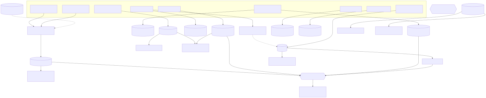

مصدر الرسم: `diagrams/brga/p29-21.mmd`

### 2.1 Sales and receivables

- A sale writes the invoice and an AR sub-ledger DEBIT in one transaction.
- The invoice number is timestamp-based, not sequential (`[B] invoices.service.ts:431`).
- VAT is a constant 14% (`[B] invoices.service.ts:631`). Shipping is added outside the VAT base.
- A collection writes an AR CREDIT and a treasury entry.
- A reversal is append-only, but it does not reverse the treasury entry (ACC-06).

### 2.2 Returns and credit notes

- A return writes an AR CREDIT, then a credit note numbered from an atomic sequence.
- The negative VAT entry is written only when the `CREDIT_NOTE_VAT_POSTING` flag is set, and the flag is off by default (`[B] credit-notes.service.ts:77`; DEC-R2R-04).

### 2.3 Tax

- The VAT summary and Form 41 read only hand-keyed `tax_entries` (`[B] tax.service.ts:55-196`).
- The company tax number is hard-coded at `tax.service.ts:181-182`.
- "Mark reported" sets a flag. There is no snapshot of the filed figures.

### 2.4 Periods and year-end

- `validatePostingDate` exists but nothing calls it (`[B] fiscal-periods.service.ts:21`). A closed period therefore blocks nothing.
- Closing and reopening a period are not audited in BASELINE.
- Year-end close is non-transactional and is not idempotent.

### 2.5 Fixed assets

- Depreciation is straight-line or declining-balance.
- Re-running depreciation doubles it (ACC-15). No journal is posted.
- Disposal is a preview only.

### 2.6 FX

- The rate registry, stale-rate alert and M2 revaluation (BANK rate) all exist (`[B] fx.service.ts:486-530`).
- In practice revaluation has nothing to act on, because supplier ledger entries from goods receipts are always EGP.
- Realized FX at payment has no caller (`fx.service.ts:637`).

### 2.7 Reports

The five report pages (financial, sales, inventory, customers, analytics) and the FX and tax pages exist. Their gaps:
- Aging is computed from the issue date.
- Some aggregates are capped at 200 rows.
- Report sums use floating-point arithmetic.

### 2.8 What CURRENT adds (not deployed)

- **GL hooks** on invoices, credit notes, goods received, supplier returns, COGS and depreciation. These depend on accounts 5211/1219, which are not in the seeded chart.
- **AR payment posting** through a second implementation.
- **Manual journal workflow** with no SoD, plus a direct-post route.
- **Period close** blocks only on the workbench statuses, and the close itself is audited.
- **TB and statements** are built from journals.
- **Supplier payments with realized FX** exist, but the module is unregistered.

## 3. Proposed To-Be flow

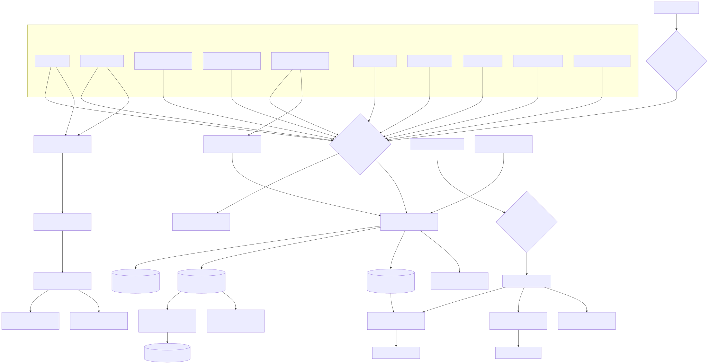

مصدر الرسم: `diagrams/brga/p29-22.mmd`

Key properties of the To-Be, each tied to a requirement:
1. **One GL and one table shape** (REQ-R2R-002, DEC-R2R-02).
2. **Posting rules** come from an approved, versioned table. They post to control accounts with a `partyId`, never to CRM ids (REQ-R2R-003).
3. **Every posting is safe:**
   - idempotent per source (REQ-R2R-004)
   - period-gated (REQ-R2R-010)
   - append-only, with correct reversals (REQ-R2R-006)
4. **Tax entries are automatic** from documents (REQ-R2R-021).
   - Filings are frozen as period snapshots (REQ-R2R-024).
   - ETA runs from the same invoices and notes (REQ-R2R-030..037).
5. **Close fails closed.** It stops on unposted drafts, an unbalanced TB or open reconciliation findings (REQ-R2R-011). Year-end posts a single journal (REQ-R2R-013).
6. **FX:**
   - Rates require a recorded source rate (REQ-R2R-043/046).
   - Unrealized revaluation follows M2 (REQ-R2R-047).
   - Realized difference is booked at payment (REQ-R2R-048), subject to DEC-R2R-10.
7. **Reports read from the ledgers** in Decimal, are paginated or flag incompleteness, and support exports (REQ-R2R-050..059).
8. **Opening balances are posted once**, from a signed sheet, at the cut-over date (REQ-R2R-016, DEC-R2R-21).

## 4. Business decisions the To-Be depends on

| Decision | Blocking | Why it matters |
|---|---|---|
| DEC-R2R-01: where the official ledger lives, and the ERP's role | Yes | Decides whether the ERP must produce statements and filings, or only feed an external ledger |
| DEC-R2R-02: canonical GL implementation and schema | Yes | No posting can be built until this is settled |
| DEC-R2R-04: credit-note VAT approval by the tax advisor | Yes | Accuracy of VAT due |
| DEC-R2R-05: ETA deferral vs legal obligation | Yes | Penalties and onboarding lead time |
| DEC-R2R-06: ETA signer and scope | Yes | ETA architecture |
| DEC-R2R-10: M2 unrealized vs realized-only FX | Yes | FX posting design |
| DEC-R2R-20: how VAT is filed today; automatic tax entries | Yes | Completeness of the VAT return |
| DEC-R2R-21: cut-over date and opening balances | Yes | Go-live |
| DEC-R2R-03: SoD for manual journals | No | Control design |
| DEC-R2R-08: rounding rule, ETA cancel window, document version | No | ETA correctness |
| DEC-R2R-11: CUSTOMS rate for imports | No | FX for import payables |
| DEC-R2R-12: accounts for wastage, gifts and expenses | No | Expense completeness |
| DEC-R2R-13: item-specific and bonus tax treatment | No | Tax base |
| DEC-R2R-14: floating-point arithmetic tolerance in reports | No | Report precision |
| DEC-R2R-17: whether the B2C e-receipt applies | No | Regulatory scope |
| DEC-R2R-18: company tax number and fiscal-year start | No | Form 41, ETA, periods |
| DEC-R2R-07, 09, 15, 16, 19 | No | Technical, status or prioritisation items |

## 5. To-Be steps that are assumptions

These steps are assumptions that the owner has not approved:
- **The ERP is the official ledger** (DEC-R2R-01). If it is not, the To-Be shrinks: the ERP keeps the sub-ledgers, tax and ETA, and exports to the external GL.
- **A posting-rules table with specific control accounts** (1121, 2111, 2121, 4110, 5100, 5211/1219). The accountant must approve the chart and the mappings.
- **What happens when a posting rule or account is missing.** The flow shows "exception queue or suspense", but whether that is acceptable, or whether the operation should be blocked instead, is undecided (ACC-03).
- **Automatic tax entries from documents, and the filed snapshot.** Both depend on DEC-R2R-20 and on tax-advisor approval.
- **The ETA submission flow** (signer, retry count, 5-minute polling, 72-hour cancel window). All of it is pending DEC-R2R-05, 06 and 08.
- **The close checklist content.** Bank reconciliation, cash count and stock count before close are assumed. The current practice is a QUESTION.
- **Realized FX measured against the original rate after reversing the last unrealized entry.** This is pending DEC-R2R-10.

## 6. Manual and outside-system steps: open questions

None of these is assumed to be absent; each is a question for the owner.
- **GL:** Who posts the GL today, how often, and from which ERP exports? Does a chart of accounts outside the ERP differ from the seeded Egyptian default?
- **Month-end:** Which close checklist is followed today, and who signs it off?
- **VAT and WHT:** Is the VAT return prepared from ERP invoice data, from spreadsheets, or by an external accountant? Is Form 41 built from supplier payments, and how are supplier payments recorded, given that BASELINE has no AP payment?
- **ETA:** Is the company registered and issuing e-invoices through the portal or a third-party tool? Does it hold an eSeal token?
- **Fixed assets:** Is the asset register kept in the ERP or in a spreadsheet? Has `run-monthly` or year-end close ever run in production?
- **FX:** Are foreign-currency supplier balances and FX gains and losses computed outside the ERP today?
- **Management reports:** Are the annual customer and rep analyses (company files B3-0304/0305) still produced in Excel, and should the ERP reports replace them?

---

## C6 — تحليل العمليات: الخزينة (Treasury) وضبط الائتمان (Credit Control)

> النطاق: BASELINE `89c2c31` (موسوم كصورة إنتاج — غير مُثبت) و CURRENT `fa40270` (غير منشور). حالة الإنتاج: Unknown.
> المراجع: المتطلبات REQ-TRC-001..034، القرارات DEC-TRC-01..13، القواعد BR-TRC-01..48.

---

## 1. عملية الخزينة (Treasury)

### 1.1 As-Is (كما هو مكوَّد + الممارسة المعروفة)

ملاحظات As-Is:
- الحساب المالي الموحد، الدفتر، الحركات اليدوية، التحويل، والجرد: منفذة متطابقة في B و C (`apps/accounting/src/modules/financial-accounts/financial-accounts.service.ts` متطابق بالكامل).
- التحصيل يوجَّه لحساب حسب الطريقة؛ الشيك لا يدخل الخزينة عند الاستلام **ولا عند التحصيل** (ACC-08).
- عكس الدفعة وارتداد الشيك لا يكتبان حركة خزينة (ACC-06).
- لا صرف موجَّه: المصروفات والرواتب والهدايا وسداد الموردين لا تمس الخزينة (B)؛ في C سداد الموردين ومطابقة البنك ومحفظة الأوراق موجودة كوحدات غير مسجلة (ARC-05).
- لا عهدة مندوب.
- الممارسة خارج النظام المعروفة: شيت «حسابات المخزون والخزنة 2026» يجمع موقف الخزنة (نقدي، فودافون كاش، إنستاباي، شيكات غير محصلة) — B3-0300.
- **أسئلة (لا نفترض الغياب):** Q-AS-1 كيف تُسلَّم نقدية المندوب للخزنة اليوم وبأي مستند؟ Q-AS-2 كيف تُتابع الشيكات حتى الصرف (دفتر/شيت/البنك)؟ Q-AS-3 كيف يُسجَّل صرف المصروفات وسداد الموردين حاليًا (من أي خزنة/بنك ومن يعتمد)؟ Q-AS-4 هل تُجرى مطابقة بنكية شهرية خارج النظام ومن يجريها؟

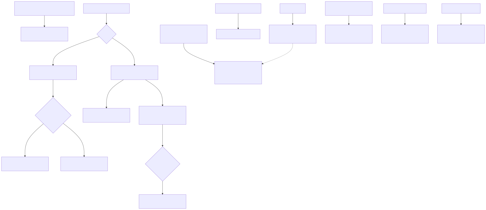

مصدر الرسم: `diagrams/brga/p29-23.mmd`

### 1.2 Proposed To-Be

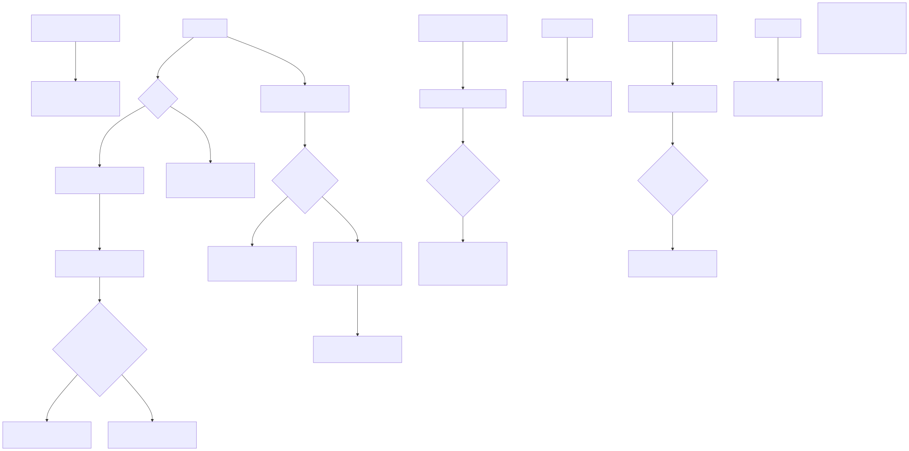

مصدر الرسم: `diagrams/brga/p29-24.mmd`

**القرارات التي يعتمد عليها To-Be:** DEC-TRC-01 (سداد الموردين ورجل الخزينة)، DEC-TRC-02 (معاملات العهدة)، DEC-TRC-03 (الاعتراف بالشيك)، DEC-TRC-04 (الأرصدة الافتتاحية)، DEC-TRC-13 (سياسة الارتداد).

**خطوات To-Be افتراضية (تحتاج اعتماد):**
- خطوة «تأكيد المستلم» للتوريد ومن هو المستلم (DEC-TRC-02).
- اعتماد الأرصدة الافتتاحية والفروق والسندات بمعتمد مستقل (لا مصدر مالك؛ REQ-TRC-014 INFERRED).
- محفظة الأوراق والكمبيالات وتنبيهات الاستحقاق (REQ-TRC-011 INFERRED).
- رسوم الارتداد والإيقاف الائتماني التلقائي (REQ-TRC-012 INFERRED، DEC-TRC-13).
- الصرف الموجّه لكل المستندات (REQ-TRC-015 INFERRED، DEC-TRC-01).
- ربط الحساب المالي بحساب الأستاذ وفحص ليلي (يتطلب حل ACC-02/ACC-03 في C).

---

## 2. عملية ضبط الائتمان (Credit Control)

### 2.1 As-Is

ملاحظات As-Is:
- الحد المالي على مستوى العميل كله فقط؛ يُعدَّل مباشرة من CRM (المندوب المالك مسموح، السبب اختياري) وينتقل لـ Sales بحدث بلا outbox.
- الحجز عند إنشاء/إرسال الأمر: المستحق (نموذج قراءة في Sales) + الملتزم (PENDING_APPROVAL, CREDIT_HOLD, APPROVED, ALLOCATING, ALLOCATED) + الجديد > الحد، بقفل صف. الحد ≤ 0 ⇒ لا فحص.
- المستحق يتحدث بالأحداث؛ دفعات الفواتير المباشرة لا تنقصه (SAL-03)؛ dedup جزئي (INT-02)؛ لا مطابقة مع المحاسبة.
- التجاوز ذري، يتخطى اعتماد ≥100,000، مع استثناء .any/SUPER_ADMIN لفصل المهام.
- لا طلب زيادة حد، لا حد بالعلب، لا إيقاف على مستوى العميل (تأخر/ارتداد)، شروط السداد 30 يومًا ثابتة لفواتير الأوامر.
- **أسئلة:** Q-AS-5 كيف يُقرَّر حد العميل اليوم ومن يوافق؟ Q-AS-6 هل تُتابع المتأخرات بإيقاف يدوي للعميل (مكالمة/قرار مدير) خارج النظام؟ Q-AS-7 كيف تُتابع كميات التصريف لدى العميل حاليًا (عدّ رف/تقارير صيدلية)؟

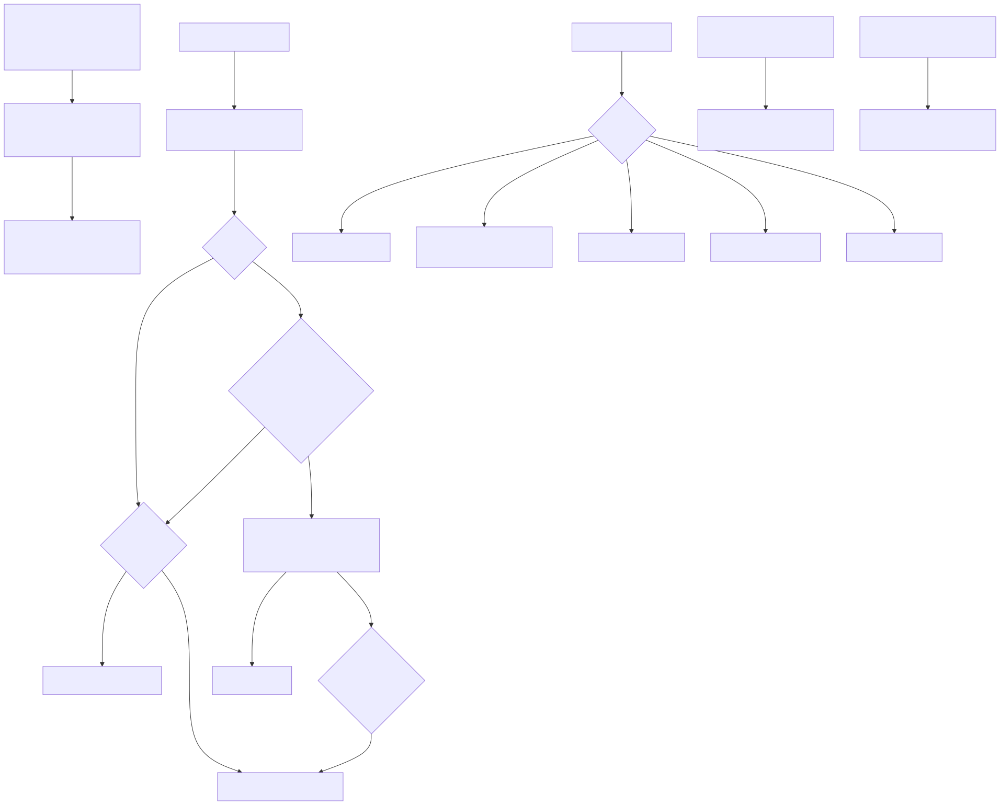

مصدر الرسم: `diagrams/brga/p29-25.mmd`

### 2.2 Proposed To-Be

مصدر الرسم: `diagrams/brga/p29-26.mmd`

**القرارات التي يعتمد عليها To-Be:** DEC-TRC-05، DEC-TRC-06، DEC-TRC-07 (الحد بالعلب)، DEC-TRC-08 (الآجل كحالة)، DEC-TRC-09 (شروط السداد)، DEC-TRC-10 (معنى الصفر)، DEC-TRC-11 (التجاوز و≥100,000)، DEC-TRC-12 (الملكية وفصل المهام)، DEC-TRC-13 (الارتداد)، DEC-TRC-03 (الشيك في التعرض).

**خطوات To-Be افتراضية (تحتاج اعتماد):**
- حالة ائتمان صريحة للعميل (ACTIVE/FROZEN/CASH_ONLY) بدل دلالة الصفر.
- إدخال الأوامر المشحونة غير المفوترة في «الملتزم».
- إيقاف العميل بسبب التأخر (لا مصدر قرار؛ مذكور كتوصية في DEC-TRC-13/REQ-TRC-033).
- طلب زيادة الحد بمسار اعتماد (المصدر RTM، غير منسوب للمالك).
- المطابقة الليلية للتعرض ولقطة الأرصدة.
- عتبة الاعتماد قابلة للضبط بدل 100,000 الثابتة.

---

## C7 — تحليل العمليات: الحوافز (Incentives) و HR-to-Finance

اللقطات: BASELINE = 89c2c31 (`[B]`)، CURRENT = fa40270 (`[C]`). حالة الإنتاج: **Unknown** (لا دليل من قاعدة البيانات أو التشغيل).
خدمات الحوافز والموارد البشرية متطابقة بين B وC إلا في: تصدير سجل الحوافز وتصدير الموظفين (C فقط)، وتغطية المناديب RepCoverage (C فقط)، وكتالوج صلاحيات IAM في C الذي ينقصه `org.employees.*` و`payroll.*` و`organization.customer-gifts.*` و`organization.employees.read` (SEC-02).

---

## 1. الحوافز (Incentives)

### 1.1 As-Is (كما هو مكتوب في الكود + الممارسة المعروفة)

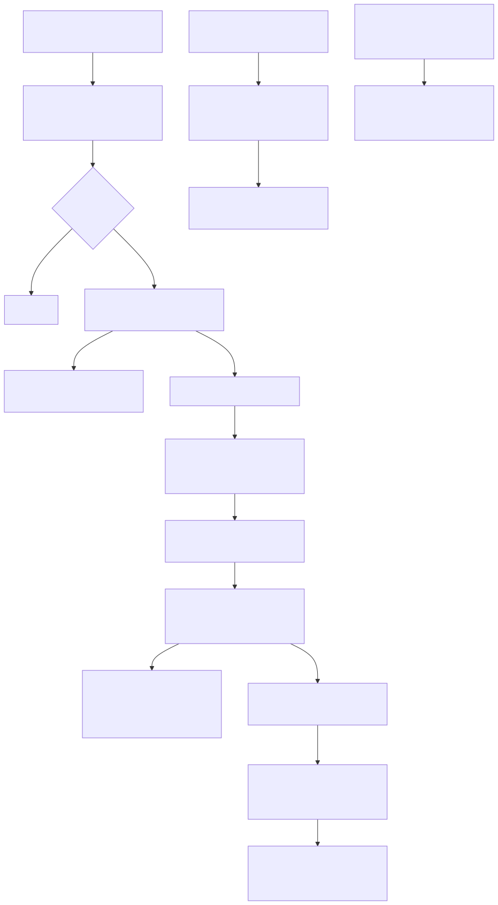

مصدر الرسم: `diagrams/brga/p29-27.mmd`

ملاحظات As-Is:
- الأساس والفترة: `[B][C] apps/incentives/src/modules/intake/intake.service.ts:99,112`؛ الحساب: `apps/incentives/src/modules/engine/incentive.engine.ts:52-79`.
- منع الازدواج ذري: `intake.service.ts:123-144` و`sourceEventId @unique`.
- لا زرع لنسخة القواعد في مسار الإنتاج (`scripts/production-migrate.sh:118-124` يزرع IAM فقط) — SAL-08.
- الاعتماد/الصرف/العكس بصلاحية واحدة `incentives.ledger.approve`، بلا SoD ولا paidBy (`ledger.service.ts [C]:99-123`).
- المرتجعات والإشعارات الدائنة لا تؤثر على الحافز، ونسبة التحصيل تحتسبها كتحصيل (`apps/accounting/src/modules/collection/collection.service.ts:70`).
- الحوافز لا تصل إلى المسير (`apps/organization/src/modules/payroll/payroll.service.ts:311`).

### 1.2 Proposed To-Be

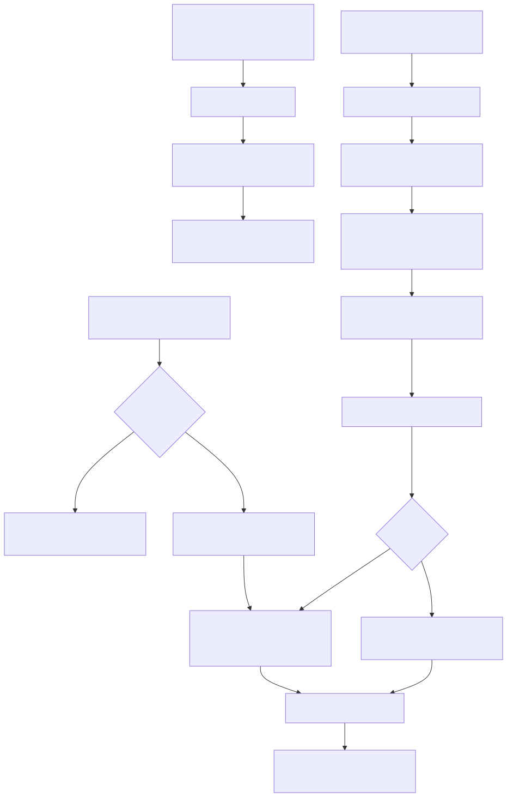

مصدر الرسم: `diagrams/brga/p29-28.mmd`

قرارات يعتمد عليها الـTo-Be: DEC-INH-01 (الأساس/الفترة/البونص)، DEC-INH-02 (فوق 6 ملايين)، DEC-INH-03 (الاسترداد بعد الصرف والمرتجعات)، DEC-INH-04 (المعتمد والصارف وقناة الصرف)، DEC-INH-05 (هل يوجد مسير رسمي تمر عبره الحوافز).

خطوات افتراضية (Assumptions) في الـTo-Be:
- «حساب الاستحقاق التراكمي وقيد الفرق» — يفترض اختيار A أو B في DEC-INH-01.
- «مراجعة إقفال الفترة» و«مراجعة ثانية للتفعيل» — مقترح رقابي غير مذكور في المصادر.
- «قناة الصرف ضمن الراتب» — يفترض قرارًا في DEC-INH-04/DEC-INH-05.
- «قيد تسوية سالب للمصروف» — يفترض الخيار A في DEC-INH-03.

---

## 2. HR-to-Finance (الموظفون، الحضور/الإجازات، الرواتب، المطالبات، هدايا العملاء)

### 2.1 As-Is

مصدر الرسم: `diagrams/brga/p29-29.mmd`

ملاحظات As-Is:
- المطالبات: `[B][C] apps/organization/src/modules/expenses/expenses.service.ts:68-191`؛ الرفض بلا شرط `:153-168`؛ الصرف `:173-191`.
- الهدايا: `apps/organization/src/modules/customer-gifts/customer-gifts.service.ts:57-118`.
- الرواتب: `apps/organization/src/modules/payroll/payroll.service.ts:225-458`.
- الإجازات: `apps/organization/src/modules/attendance/attendance.service.ts:134-203`.
- لا أي حدث أو قيد محاسبي من الرواتب أو المطالبات أو الهدايا (ORG-04).
- في CURRENT: مسارات المطالبات والهدايا والرواتب والموظفين تتطلب صلاحيات غير موجودة في كتالوج IAM، فلا يمكن منحها في بيئة جديدة (SEC-02).
- الممارسة المعروفة من ملفات الشركة: فريق ~7–8 متعدد الأدوار؛ لا سجل رواتب رسمي؛ مساعد إداري يُدفع بسلف نقدية غير منتظمة؛ ملف رواتب.xlsx لنشاط آخر؛ مرتبات.xlsx غير مؤكد الملكية.

### 2.2 Proposed To-Be

مصدر الرسم: `diagrams/brga/p29-30.mmd`

قرارات يعتمد عليها الـTo-Be: DEC-INH-05 (نموذج الرواتب)، DEC-INH-06 (ملف مرتبات.xlsx وسياسة خصم الغياب/السلف)، DEC-INH-07 (إعادة تشغيل المسير)، DEC-INH-09 (توقيت إصلاح EXP-1..3)، DEC-INH-10 (دورة السلف)، DEC-INH-11 (فئات المصروفات)، DEC-INH-12 (جداول التأمينات والضريبة)، DEC-INH-04 (قناة صرف الحوافز)، DEC-INH-08 (تصنيف تدقيق العقود). وتعتمد خطوات الصرف على متطلبات الخزينة/الدفاتر في C5/C6 (سند مالي مرقم، قيد يومية).

خطوات افتراضية (Assumptions) في الـTo-Be:
- «سلفة/عهدة كذمة وتسويتها» — يفترض DEC-INH-10 = A.
- «خصم الغياب والسلف في المسير» — يفترض اعتماد سياسة كشف مرتبات.xlsx (DEC-INH-06 = A).
- «قيد استحقاق الرواتب وصرفها بسند» — يفترض وجود نظام يومية/سندات في Accounting وتعريف الحسابات (C5/C6).
- «اعتماد المالية ليس المدير» — تشديد مقترح لفريق صغير؛ يحتاج تأكيد مصفوفة الأدوار (REQ-INH-030).
- «تنبيه فترة الاختبار» — مذكور في RTM، وآلية الإشعار مفترضة.
- «حضور يؤثر على الأجر» — يفترض قرار سياسة الغياب.

---

## C10 — عملية «القطع وترحيل البيانات والأرصدة الافتتاحية» (Data cut-over & opening balances)

النطاق: استيراد البيانات الأساسية (عملاء، هويات عملاء، منتجات، أسعار)، الأرصدة الافتتاحية للذمم المدينة، المخزون الافتتاحي، وتاريخ القطع، مع النسخ الاحتياطي المرتبط بها.
المصادر: REQ-OPS-001..014، 019، 020، 021 · القرارات DEC-OPS-01/02/03/07/08 · BASELINE = 89c2c31 · CURRENT = fa40270 · الإنتاج: **Unknown**.

## 1. As-Is (كما هو في الكود + الممارسة المعروفة)

حقائق مثبتة من الكود (متطابقة في B وC ما لم يُذكر):
- المرجع الرئيسي لحسابات العملاء هو ملف Excel «حسابات العملاء» (أكده المالك، B1-0310). يُستخرج خارج النظام (Python/openpyxl) إلى `apps/crm/scripts/data/customers-extracted.json` **المحفوظ داخل git**.
- `apps/crm/scripts/import-customers.ts` (dry-run افتراضي :96، مطابقة تامة بالاسم :140، لا تخمين للنوع :165-170) يكتب `Account.openingBalance` في **CRM فقط** (:172, :183) ولا يطلق أي حدث.
- مستهلك Accounting `onAccountCreated` يُنشئ قيد OPENING واحدًا (`saga-listener.service.ts` [B]:211-232 / [C]:218-239) **لكن** لا أحد يرسل له رصيدًا: `accounts.service.ts` يرسل `opening_balance: undefined` ([B]:238 / [C]:261) ومسار التأسيس لا يرسل الحقل. إذن **لا يصل أي رصيد افتتاحي إلى الأستاذ**، وتاريخ القيد (إن وُجد) = تاريخ التشغيل (`occurredAt @default(now())`).
- `import-identities.cjs` + `deploy-customer-identities.sh`: إدراج فقط بقفل ومعاملة وتقرير JSONL؛ أُبلغ (QA) عن تنفيذ على الإنتاج: 142 مُدرجًا، 495 بلا نوع.
- `import-products.ts`: ذري لكل منتج ويعزل الصفوف.
- المخزون: لا مسار «مخزون افتتاحي»؛ المتاح هو goods-receipt + QC + release العامة.
- لا تاريخ قطع ولا توقيع ولا مطابقة hash (`reconcileMigrationData` موجودة في import-kit وغير مستدعاة).
- النسخ الاحتياطي قبل الكتابة إجراء يدوي (B)، أو لقطة Neon (C) بينما الأدلة تشير إلى `nile-postgres` محلي.

مصدر الرسم: `diagrams/brga/p29-31.mmd`

خطوات يدوية/خارج النظام غير معروفة (أسئلة صريحة، لا افتراض غيابها):
- Q-AS-1: هل ما زالت أرصدة العملاء ومتابعتها تُدار في Excel بالتوازي مع ERP؟
- Q-AS-2: هل نُفذ `import-customers.ts --live` على الإنتاج، ومتى، وما التقرير؟ (DEC-OPS-02)
- Q-AS-3: كيف دخل المخزون الحالي للنظام (استلامات؟ تعديل؟ لم يدخل؟)
- Q-AS-4: من صنّف العملاء الـ93 المحسومين، وهل توجد ورقة تصنيف للباقي؟
- Q-AS-5: هل أُخذت نسخة احتياطية قبل دفعة الهويات على الإنتاج وأين حُفظت؟

## 2. To-Be المقترح

مصدر الرسم: `diagrams/brga/p29-32.mmd`

قرارات أعمال يعتمد عليها الـTo-Be:
- DEC-OPS-01 تاريخ القطع والعملة والموقِّع وصيغة الرصيد (إجمالي أم فواتير مفتوحة).
- DEC-OPS-03 تصنيف العملاء والأسماء البديلة وحسابات البذرة.
- DEC-OPS-07 منصة قاعدة الإنتاج (تحدد أداة النسخ ونقطة الاستعادة).
- DEC-OPS-08 RPO/RTO وجدول النسخ والاحتفاظ ومالك النسخ.
- DEC-OPS-02 مرجعية أرقام الاستيراد السابقة.
- DEC-OPS-04/05 آلية ونطاق الاستيراد.

خطوات To-Be افتراضية (Assumptions، تحتاج اعتمادًا):
- «Controlled job posts OPENING entries» — لا يوجد اليوم؛ يُفترض مسار جديد يقرأ الورقة الموقعة مباشرة بدل الاعتماد على حدث AccountCreated.
- «tagged OPENING_STOCK» — لا يوجد نوع حركة افتتاحي؛ افتراض.
- «Finance manager sign-off» ودور المحاسب كموقِّع — مقترح من وثائق AI (B3-0142/B3-0350)، غير معتمد من المالك.
- «Excel becomes read-only archive» — افتراض؛ لا قرار.
- تجميد Excel عند تاريخ القطع وتوقيت الجرد مع نفس التاريخ — افتراض.

## 3. ملحق: كل أرقام النسخ الاحتياطي/RPO/RTO/الاحتفاظ كما وردت

لا يوجد أي رقم منها معتمد من المالك. قرار المالك الوحيد في هذا الباب: «Backup ← migrate ← verify بلا تفاوض» (B1-0100، DECISIONS-2026-09-25-ar.md:111) بلا أرقام.

| البند | القيمة كما وردت | المصدر (sid · ملف:أسطر · تاريخ · كاتب) | اعتماد المالك |
|---|---|---|---|
| RTO هدف | 15 دقيقة | B3-0359 · Data/AB DATA/Nile ERP Architecture Description.pdf p.6-7 · 2026-09-13 · AI | لا |
| RPO هدف | 0 | B3-0359 (نفسه) | لا |
| جدول النسخ | «لا جدول موثق (افتراض PITR من Neon)» | B3-0359 (نفسه) | لا |
| جدول النسخ | Neon PITR + **dump أسبوعي** + تدريب استعادة | B3-0142 · docs/audit/2026-09-20-ab-data-pdf-review-ar.md:155-159 · 2026-09-20 · AI | لا |
| جدول النسخ | nightly logical + checksums + rclone، «specified but NOT deployed» | B6c-0080 · docs/PRODUCTION-READINESS-P0.md:104 · 2026-09-23 · AI | لا |
| الاحتفاظ (dumps) | 14 يوميًا / 8 أسبوعيًا / 6 شهريًا | B6c-0080؛ B6c-0167 · docs/runbooks/disaster-recovery.md:19-26 · 2026-09-23 · AI؛ الكود scripts/backup-nightly.sh:29-31 [B][C] | لا |
| الاحتفاظ (Neon PITR) | «as configured in Neon console» — غير محدد | B6c-0167؛ B6a-0039 · docs/audit/00-executive-summary.md:123 · 2026-09-01 · auditor؛ B6a-0221 · docs/audit/14-backup-dr.md:27 | لا (سؤال مفتوح) |
| توقيت cron | 02:30 يوميًا (`30 2 * * *`)، المسار /opt/nile-pharma-erp/scripts/backup-nightly.sh | B6c-0168 · disaster-recovery.md:28-48؛ backup-nightly.sh:12 | لا |
| مهلة تنبيه dead-man | 03:30 | B6c-0156 · docs/runbooks/alerts-and-metrics.md:50 | لا |
| RPO (Neon) | «seconds-to-minutes» | B6c-0172 · disaster-recovery.md:87-116 | لا |
| RPO (dumps) | ≤ 24 ساعة + زمن الاكتشاف | B6c-0172؛ B6c-0178 | لا |
| RTO لكل قاعدة | < 15 دقيقة (استعادة + تحقق) | B6c-0178 · disaster-recovery.md:217-224 · 2026-09-23 · AI («no owner approval recorded») | لا |
| RTO كامل | < 60 دقيقة (9 قواعد + compose up + smoke) — غير مقاس | B6c-0178 | لا |
| RPO مع PITR | < 5 دقائق | B6c-0178 | لا |
| هدف إنتاجي | «no production RTO/RPO target stated» | B6c-0163 · docs/DISASTER-RECOVERY-DRILL-REPORT.md:52-63 · 2026-09-23 | — |
| قياس تدريب | accounting: 33 جدولًا، 647 صفًا، backup 0.03 ث، restore 0.5 ث، RTO 0.52 ث، RPO 0 ث (تركيبي محلي) | B6c-0164/B6c-0165 · docs/dr-evidence.json:1-46 | — |
| قياس تدريب | audit-aggregator: 4 جداول، 40 صفًا، RTO 0.09 ث، RPO 0 ث (تركيبي محلي) | B6c-0162 · DISASTER-RECOVERY-DRILL-REPORT.md:12-51؛ B5a-0273 · GO-LIVE-ACCEPTANCE-REPORT.md:17 | — |
| رقم مختلق مسحوب | «PASSED / RTO 1s / 147,820 rows / CFO+CISO sign-off» | B6c-0079 · PRODUCTION-READINESS-P0.md:103؛ B6c-0161 | يجب عدم الاستشهاد |
| رقم استشهد به QA | «RTO < 1s» | B6c-0317 · QA-REPORTS/22-production-env-config-testing.md:12-20 | مبني على المختلق |
| حداثة الدليل | ≤ 92 يومًا | B6c-0079؛ B6c-0179؛ الكود go-live-acceptance-gate.cjs:125 | لا |
| تكرار التدريب | ربع سنوي + بعد migrations الجداول المالية | B6c-0179 · disaster-recovery.md:226-236؛ B6c-0081 | لا |
| احتفاظ نسخة الأدلة الجنائية | 30 يومًا بعد إغلاق الحادث | B6c-0177 · disaster-recovery.md:200-213 | لا |
| مُطلق DR | قاعدة متوقفة > 5 دقائق | B6c-0170 · disaster-recovery.md:57-72 | لا |
| لقطة ما قبل النشر (كود) | لقطة Neon تنتهي بعد 7 أيام | [C] scripts/deploy-production.sh:100 (لا وثيقة) | لا |
| نسخة ما قبل نشر 2026-09-22 | 12 MB محفوظة في /tmp على الـVPS | B6c-0302 · QA-REPORTS/15-build-deployment-testing.md:46-47 | — |
| تدوير السجلات (ليس نسخًا) | 20m × 5 ملفات لكل حاوية | B6c-0017 · PRODUCTION-HOSTINGER.md:497-517 | لا |

