# 30 — توصيات معمارية البيانات (Database Architecture Recommendations)

> **للمناقشة والاعتماد فقط.** لا تعديل ولا تنفيذ. كل توصية مربوطة بمشكلة ونتيجة (Finding) ومتطلبات (REQ) ومعيار قبول معماري. الأوزان والأهداف الرقمية (RPO/RTO، مدد الاحتفاظ) **مقترحة وتحتاج اعتماد المالك**.

## 0. مستويات الدليل — لا ادعاء drift دون دليل من القاعدة

يميز هذا التقرير بين أربعة مستويات لا يغني أحدها عن الآخر:

| المستوى | ما نملكه | الحكم المسموح |
|---|---|---|
| **1. Schema في الكود** (`schema.prisma`) | كامل للنسختين `[B]` و`[C]` | Verified على مستوى الملف |
| **2. Migration SQL** (`prisma/migrations/*/migration.sql`) | كامل للنسختين (149 ملفًا في `[C]`) | Verified على مستوى الملف؛ التعارض بين 1 و2 حقيقي في الكود (مثل DB-02، DB-07) |
| **3. بنية القاعدة الفعلية** (`information_schema`, `pg_constraint`, `_prisma_migrations`) | **غير متاح** سوى إفادات مستخدم `[U]` (أعداد جداول وأسماء ترحيلات) | **Unknown**. أعداد الجداول لا تثبت إصدار القاعدة (انظر `34`). لا يُدّعى أي drift فعلي |
| **4. سلوك البيانات الفعلي** (تكرارات، أرصدة سالبة، فروق تسوية) | **غير متاح** | **Unknown**. الاستعلامات المقترحة في `33` للقياس قبل أي قيد |

كل توصية أدناه تذكر المستوى الذي تعتمد عليه. التوصيات التي تضيف قيدًا (CHECK/UNIQUE) **مشروطة** بنتيجة استعلام المستوى 4 (عدد المخالفات الحالية = 0 أو خطة معالجة معتمدة).

## 1. المشكلات أولًا

| # | المشكلة | المستوى | النتائج المرتبطة | المتطلبات المتأثرة |
|---|---|---|---|---|
| P-01 | **لا دفتر أستاذ في BASELINE؛ ثلاثة تنفيذات GL متعارضة في CURRENT**، ومسار الكتابة الحي يُدرج قيدًا يغفل أعمدة NOT NULL أضافها ترحيل لاحق؛ مفتاحا مصدر بدلالتي إعادة ترحيل متعارضتين؛ أنواع/دقة مختلفة بين Prisma وSQL في `journal_lines` | 1+2 | ACC-01، ACC-02، ACC-04، ACC-05، DB-03، DB-07 | 147 متطلبًا؛ P1: REQ-O2C-004, REQ-O2C-005, REQ-O2C-040, REQ-O2C-041, REQ-O2C-042, REQ-O2C-044 … (+50) |
| P-02 | **الدفاتر الفرعية غير مربوطة بالأستاذ**: الشيك المحصّل لا يصل للخزينة، عكس التحصيل لا يعكس الخزينة، الرواتب والمصروفات والهدايا لا تُرحّل، الشحن لا ينتج COGS، تسوية AP↔GL بإشارات معكوسة | 1+2 + كود | ACC-06، ACC-08، ACC-10، ACC-23، ORG-04، INV-07 | 180 متطلبًا؛ P1: REQ-O2C-003, REQ-O2C-004, REQ-O2C-005, REQ-O2C-022, REQ-O2C-040, REQ-O2C-041 … (+59) |
| P-03 | **تقييم المخزون ناقص**: طبقات التكلفة تُستهلك في الفواتير المباشرة فقط، الإلغاء لا يعيدها، التقرير يعدّها مرتين | كود | INV-01، INV-02، INV-05، INV-07 | 28 متطلبًا؛ P1: REQ-O2C-019, REQ-P2P-029, REQ-P2P-030, REQ-INV-021, REQ-INV-031, REQ-INV-051 … (+2) |
| P-04 | **مراجع بين الخدمات بلا تحقق**: الاستلام يقبل أي `productId/batchId/supplierId`، الـsaga تكتب `'unknown'`/0، `linkedUserId` و`repId` بلا تحقق، طلبات لعملاء مؤرشفين | كود | DB-04، INV-08، SAL-12 | 124 متطلبًا؛ P1: REQ-O2C-001, REQ-O2C-006, REQ-O2C-019, REQ-O2C-021, REQ-O2C-030, REQ-O2C-040 … (+28) |
| P-05 | **قيود السلامة داخل المجال شبه غائبة**: 0 CHECK في sales، 1 في inventory؛ لا منع لرصيد سالب أو عكس مزدوج أو صرف مباشر مكرر أو إهلاك مكرر؛ 11 حقل حالة نص حر | 2 | DB-05، DB-06، ACC-13، INV-09 | 201 متطلبًا؛ P1: REQ-O2C-005, REQ-O2C-006, REQ-O2C-030, REQ-O2C-040, REQ-O2C-041, REQ-O2C-042 … (+67) |
| P-06 | **كتابة مزدوجة للأحداث** (commit ثم publish) في sales وproducts والفواتير والحجوزات؛ علامة dedup بعد المعالج وخارج معاملته؛ معالجات غير idempotent | كود | INT-01، INT-02، INV-03، SAL-02 | 142 متطلبًا؛ P1: REQ-O2C-004, REQ-O2C-005, REQ-O2C-006, REQ-O2C-009, REQ-O2C-022, REQ-O2C-036 … (+46) |
| P-07 | **إسقاطات بلا مطابقة**: `account_credit` لا يُطابق مع AR ومدفوعات الفاتورة المباشرة لا تخفضه؛ `product_prices` بلا إعادة مزامنة | كود | SAL-03، INV-03، INV-06 | 69 متطلبًا؛ P1: REQ-O2C-004, REQ-O2C-005, REQ-O2C-040, REQ-O2C-042, REQ-P2P-007, REQ-P2P-009 … (+22) |
| P-08 | **حالات المستندات والعكس والإقفال غير موحدة**: الإقفال لا يمنع الترحيل، الدفع يكتب PAID فوق SHIPPED/CANCELLED، إعادة إصدار فاتورة بلا سطور، فاتورة DEFERRED لا تُلغى، اعتماد إجازة/رفض مصروف من أي حالة | كود | ACC-14، ACC-17، SAL-01، ORG-01، ORG-02 | 111 متطلبًا؛ P1: REQ-O2C-004, REQ-O2C-022, REQ-O2C-040, REQ-O2C-043, REQ-O2C-044, REQ-O2C-045 … (+39) |
| P-09 | **العملة والدقة والتقريب والترقيم**: لا عملة على الطلبات والائتمان؛ عملة الدفعة لا تُقارن؛ دقتان لسعر الصرف (14,6 و16,6)؛ تقريب float في GL والإهلاك والأرصدة الجارية؛ رقم الفاتورة `INV-<base36 ms>` غير تسلسلي، و`count()+1` للموظفين والعقود | 1+2 + كود | DB-10، DB-12 (إيجابي)، ACC-09 | 81 متطلبًا؛ P1: REQ-O2C-003, REQ-O2C-040, REQ-P2P-003, REQ-P2P-004, REQ-P2P-007, REQ-P2P-009 … (+19) |
| P-10 | **التتبع**: لا `correlation_id` ولا مصدر على حركات المخزون والقيود بشكل موحد؛ سلسلة التشغيلة تعتمد على أحداث بلا outbox | كود | INV-03، ACC-17 | 35 متطلبًا؛ P1: REQ-O2C-005, REQ-O2C-055, REQ-INV-007, REQ-INV-014, REQ-INV-019, REQ-INV-029 … (+6) |
| P-11 | **سجل التدقيق**: `audit_logs` المحلية best-effort بعد الاستجابة وقابلة للتعديل في 8 قواعد؛ الإخفاء لا يشمل الرواتب وIBAN والهاتف؛ TRUNCATE غير ممنوع حتى في القاعدة المركزية | 2 + كود | SEC-13، DB-11 | 107 متطلبًا؛ P1: REQ-O2C-004, REQ-O2C-010, REQ-O2C-042, REQ-P2P-003, REQ-P2P-007, REQ-INV-013 … (+23) |
| P-12 | **التقارير**: تجميعات عابرة للخدمات في الـBFF في الذاكرة ومقصوصة عند 200 صف؛ أرصدة الدفاتر تُجمع float في JS؛ 123 استعلامًا بلا حد | كود | WEB-01 | 70 متطلبًا؛ P1: REQ-P2P-007, REQ-INV-043, REQ-INV-051, REQ-R2R-016, REQ-TRC-013, REQ-NFR-005 … (+9) |
| P-13 | **حوكمة الترحيل**: ترحيلات مطبقة عُدّلت ملفاتها، `resolve` يدوي، تعارض schema/migrations يوقف db-migrate، بوابة التوافق تقارن بالـpush السابق لا بالإنتاج | 2 + `[U]` | DB-01، DB-02، OPS-09، ARC-02 | 70 متطلبًا؛ P1: REQ-O2C-022, REQ-O2C-044, REQ-P2P-026, REQ-P2P-027, REQ-P2P-030, REQ-INV-007 … (+31) |
| P-14 | **النسخ الاحتياطي والاستعادة**: النسخ الآلي **غير مثبت من المستودع** (السكربت غير صالح لهذا المضيف كما هو)، تعريف القاعدة خارج git، أرقام RPO/RTO في الوثائق متعارضة وغير معتمدة؛ وجود نسخ على المضيف **Unknown** حتى E-06 | ريبو + `[U]` | OPS-04، ARC-03 | 89 متطلبًا؛ P1: REQ-O2C-022, REQ-CRM-001, REQ-P2P-003, REQ-P2P-004, REQ-P2P-030, REQ-INV-013 … (+19) |
| P-15 | **لا فصل أدوار في القاعدة**: نفس الاعتماد للترحيل والتشغيل لكل خدمة، صفر GRANT/REVOKE، `[U]` مالك واحد لكل القواعد | 2 + `[U]` | SEC-08، SEC-13 | 7 متطلبًا؛ P1: REQ-SEC-001, REQ-SEC-002, REQ-NFR-005 |
| P-16 | **البيانات الحساسة والاحتفاظ**: لا سياسة احتفاظ أو حذف أو إخفاء؛ نمو بلا حد لجداول sessions/audit/outbox/processed_events/DLQ | كود | DB-11، SEC-03 | 50 متطلبًا؛ P1: REQ-TRC-015, REQ-INH-040, REQ-INH-043, REQ-INH-044, REQ-INH-049, REQ-SEC-024 … (+6) |
| P-17 | **الأرصدة الافتتاحية**: رصيد العميل الافتتاحي لا يصل للدفتر (`opening_balance: undefined`)، لا تاريخ قطع معتمد | كود | DB-04 | 50 متطلبًا؛ P1: REQ-CRM-001, REQ-P2P-013, REQ-P2P-026, REQ-P2P-029, REQ-INV-017, REQ-R2R-016 … (+8) |

## 2. البدائل المعمارية

### 2.1 التقسيم المنطقي (منفصل عن قرار الاستضافة)

- **A1 — قاعدة لكل خدمة داخل خادم PostgreSQL واحد (الوضع الحالي، مع تقوية):** تسع قواعد `nile_*`، لا FK عابرة، تكامل بالأحداث وHTTP. التقوية = البنود DAR-03…DAR-20.
- **A2 — قاعدة واحدة بمخطط (schema) لكل خدمة:** `nile.sales`, `nile.accounting` … في قاعدة واحدة؛ يسمح بـFK عابرة واستعلام عابر ومعاملة واحدة، ويتطلب Prisma `multiSchema` وإعادة توجيه كل الاتصالات.
- **A3 — فصل المالية بدرجة أعلى:** نقل `nile_accounting` (+`nile_incentives` وأجزاء الرواتب) إلى خادم/عنقود مستقل بأدوار ونسخ وحماية مستقلة، والباقي كما هو.
- **A4 — دمج المجالات المالية في قاعدة واحدة:** `nile_accounting` + `nile_incentives` + بيانات الرواتب المالية في قاعدة/مخططات واحدة لترحيل GL في نفس المعاملة.

| المعيار | A1 قاعدة لكل خدمة (مقوّاة) | A2 مخططات في قاعدة واحدة | A3 فصل المالية على خادم مستقل | A4 دمج المالية |
|---|---|---|---|---|
| **سلامة المعاملات** | داخل الخدمة ACID؛ عبر الخدمات eventual مع outbox/inbox + تسويات. GL يُرحّل في معاملة الفاتورة/الدفعة لأنهما في نفس القاعدة | ممكن ACID عابر، لكنه يغري بمعاملات عابرة تكسر حدود الخدمات؛ لا يحل مشكلة الأحداث لأن الخدمات تبقى منفصلة | مثل A1 للمالية؛ لا تحسين | ACID بين الحوافز والرواتب والأستاذ؛ لكن الحوافز والرواتب تعتمد أصلًا على أحداث من خدمات أخرى |
| **العزل والصلاحيات** | جيد إذا طُبقت أدوار لكل قاعدة (DAR-16)؛ `REVOKE CONNECT` بين القواعد | أضعف افتراضيًا (قاعدة واحدة)، يحتاج GRANT دقيق لكل مخطط | الأقوى للمالية | جيد للمالية كوحدة |
| **التعقيد** | الأقل تغييرًا؛ يزيد عدد آليات التكامل (outbox/inbox/تسويات) لكنها لازمة في كل البدائل | تغيير توجيه اتصال 9 خدمات + Prisma multiSchema + اختبارات | خادم إضافي، نسخ وأدوار وشبكة إضافية | إعادة كتابة حدود خدمات قائمة |
| **التقارير** | تحتاج read model أو FDW أو نسخة قراءة | الأسهل (استعلام عابر مباشر) لكنه يربط التقارير ببنية الخدمات الداخلية | أصعب (خادمان) | أسهل للمالية فقط |
| **النسخ والاستعادة** | خادم واحد → نسخة فيزيائية + WAL تعطي **نقطة استعادة متسقة لكل القواعد معًا** | نفسه | نقطتا استعادة غير متزامنتين ← تعقيد اتساق عابر | مثل A1 |
| **الأداء** | الحجم الحالي صغير `[U]` (8–11 MB لكل قاعدة)؛ لا عنق زجاجة مثبت | نفسه | عزل حمل التقارير المالية — غير مطلوب بالحجم الحالي | لا أثر |
| **التكلفة** | الأقل | منخفضة | أعلى (مضيف وتشغيل) | متوسطة (تطوير) |
| **مخاطر الترحيل** | الأقل: تغييرات إضافية داخل كل قاعدة | متوسطة–عالية: نقل بيانات 9 قواعد ومراجع وأدوات | متوسطة: نقل قاعدة حية + قطع | عالية: تغيير ملكية وكود |
| **الحكم** | **موصى به** | غير مبرر الآن | غير مبرر بالحجم الحالي؛ يُعاد تقييمه عند قرار GxP/الامتثال أو نمو الحمل | غير مبرر؛ المشكلة ليست مكان الجداول بل غياب قواعد الترحيل والأحداث الموثوقة |

**لماذا لا إعادة بناء:** المشكلات P-01…P-17 كلها **داخل** حدود الخدمات أو في آلية التكامل، لا في نمط التقسيم. أي بديل آخر ينقل البيانات دون أن يحل غياب القيود والـoutbox وقواعد الترحيل، ويضيف خطر ترحيل فوق قاعدة إنتاجية غير معروفة الحالة (ARC-02).

### 2.2 قرار الاستضافة (منفصل)

| البديل | الوصف | مزايا | عيوب | شرط الاختيار |
|---|---|---|---|---|
| H1 — محلي على الـVPS (الوضع الحالي `[U]`) | `nile-postgres` PG18 في حاوية | تكلفة منخفضة، زمن استجابة محلي | نقطة فشل واحدة مع التطبيق؛ النسخ وPITR والمراقبة مسؤولية الفريق؛ التعريف خارج git (ARC-03) | يُقبل فقط مع: تعريف في git، أرشفة WAL خارج المضيف، تمرين استعادة ناجح موثق |
| H2 — PostgreSQL مُدار (مثل Neon أو غيره) | الوثائق والأدوات الحديثة تفترضه | PITR جاهز، نسخ خارج المضيف، توفر أعلى | تكلفة وزمن شبكة، اعتماد مزود، اختلاف الإصدار (16 مقابل 18)، إقامة البيانات | قرار مالك DEC-OPS-07 + متطلبات إقامة البيانات + اختبار أداء |
| H3 — مضيف قاعدة منفصل يُدار ذاتيًا | خادم DB مستقل عن التطبيق مع pgBackRest/WAL-G | يفصل فشل التطبيق عن القاعدة | تكلفة وتشغيل إضافيان | عند ارتفاع الحمل أو متطلب توفر أعلى |

**التوصية:** القرار **للمالك** (DEC-OPS-07، DEC-NFR-13) بناءً على RPO/RTO المعتمد (DEC-OPS-08) والتكلفة والقدرة التشغيلية. أيًا كان الاختيار، يبقى التقسيم المنطقي A1، وتبقى متطلبات DAR-15 واحدة: نسخ خارج المضيف + PITR + تمرين استعادة. **لا يُنقل شيء قبل** إثبات الحالة الحالية (E-03/E-04/E-06).

## 3. المعمارية المستهدفة للبيانات

المصدر: `diagrams/dar/d30-01-target-data-architecture.mmd`. أخضر = جديد، أصفر = تغيير على قائم، رمادي = يبقى.

### 3.1 Bounded contexts وملكية البيانات ونظام السجل (SoR)

| الكيان | SoR (الخدمة/القاعدة) | المستهلكون | آلية المزامنة المستهدفة | التحقق عند الكتابة |
|---|---|---|---|---|
| المستخدم والدور والصلاحية | iam / `nile_iam` | الكل (عبر JWT) | توكن + حدث تغيير صلاحية | — |
| الموظف، العقد، الرواتب، المصروفات | organization / `nile_organization` | accounting (ترحيل)، incentives | أحداث outbox → GL inbox | `linkedUserId` يُتحقق منه مقابل iam |
| المنتج، التشغيلة، المورد، السعر الرسمي | products / `nile_products` | sales (`product_prices`)، inventory، accounting | outbox + إسقاط بإصدار (version) + إعادة مزامنة دورية | inventory يتحقق من المنتج/التشغيلة/المورد قبل الاستلام |
| العميل، العنوان، المنطقة، حد الائتمان (القرار) | crm / `nile_crm` | sales، accounting | outbox (موجود للـonboarding) | sales يرفض العميل المؤرشف |
| الطلب، المرتجع، الشحنة | sales / `nile_sales` | inventory، accounting، incentives | outbox (جديد) | — |
| تعرض الائتمان (إسقاط) | sales (إسقاط) ← مصدره AR في accounting | — | inbox معاملاتي + تسوية يومية مع AR | — |
| الرصيد، الحركة، الحجز، طبقة التكلفة | inventory / `nile_inventory` | accounting (COGS/تقييم) | outbox (موجود جزئيًا) | — |
| الفاتورة، الإشعار الدائن، الدفعة، AP، الخزينة، الضريبة، الأصول، **الأستاذ العام** | accounting / `nile_accounting` | sales، incentives، التقارير | outbox (موجود للمدفوعات) | — |
| دفتر الحوافز | incentives / `nile_incentives` | accounting (ترحيل العمولة) | outbox → GL inbox | `repId` يُتحقق منه |
| سجل الأعمال المركزي | audit-aggregator / `nile_audit` | التدقيق | يستهلك كل الأحداث | — |

**القاعدة:** لكل كيان كاتب واحد. أي نسخة في خدمة أخرى **إسقاط للقراءة** يحمل `source_version`، ويُطابق دوريًا مع المصدر، ولا تُتخذ عليه قرارات مالية نهائية دون التحقق (مثال: الائتمان يُعاد حسابه من AR عند الشك).

### 3.2 أستاذ عام موحد مربوط بالدفاتر الفرعية والخزينة والمخزون (DAR-04/05/19)

| البند | As-Is (CURRENT) | المقترح |
|---|---|---|
| تنفيذات GL | ثلاثة (`general-ledger.service` حي، `gl-workbench` و`gl-posting` غير موصولين) بأشكال جداول متعارضة | **تنفيذ واحد**؛ شكل جدول واحد؛ حذف المسارات غير الموصولة بعد اعتماد DEC-R2R-02 |
| مفتاح المصدر | مفتاحان (جزئي وكامل) بدلالتي إعادة ترحيل مختلفتين | مفتاح واحد `(source_type, source_id, posting_seq)` بقرار صريح لإعادة الترحيل (X4) |
| العكس | قيد `<X>_REVERSAL` بلا `reversal_of_id`؛ أصل يصبح REVERSED فيُستبعد | `reversal_of_id` فريد؛ الأصل يبقى POSTED، والعكس قيد مستقل بتاريخ فترة مفتوحة (ACC-05) |
| الفترات | الإقفال لا يمنع الترحيل | `period_id` إلزامي؛ الترحيل يرفض الفترة CLOSED داخل نفس المعاملة |
| الحسابات الرقابية | غير معرفة | `is_control` + `subledger_control_map`؛ لا ترحيل يدوي على حساب رقابي |
| الدفاتر داخل accounting (AR/AP/خزينة/ضريبة/أصول) | بعضها يرحّل وبعضها لا | ترحيل **في نفس معاملة** المستند المصدر (نفس القاعدة) |
| الدفاتر خارج accounting (COGS، الرواتب، المصروفات، الحوافز) | لا ترحيل (INV-07، ORG-04) | حدث outbox من المصدر → `gl_posting_inbox` → قيد واحد لكل حدث (idempotent بمعرّف الحدث) |
| قواعد الترحيل | مضمنة في الكود | جدول `posting_rules` بإصدار واعتماد المحاسب |
| الدقة | `14,2` Prisma مقابل `18,2` SQL | دقة واحدة في الملفين (DB-07) |

**القوائم المالية والميزان تُستخرج من GL فقط**؛ أرصدة الدفاتر الفرعية تُطابق مع الحساب الرقابي (DAR-08).

### 3.3 تقييم المخزون (DAR-19)

- طريقة التكلفة **قرار مانع** (DEC-INV-20: FIFO أم متوسط مرجح). التصميم أعلاه يخدم FIFO؛ المتوسط المرجح يستبدل الطبقات بعمود متوسط على الرصيد مع نفس جدول الاستهلاك.
- كل حركة إصدار (شحن طلب، فاتورة مباشرة، شطب، مرتجع مورد، تحويل بين مالكين) تستهلك طبقة وتسجل `cost_layer_consumptions`؛ العكس يعيد الاستهلاك نفسه.
- حدث تقييم واحد لكل حركة إلى GL (COGS/مخزون)؛ تسوية دورية «قيمة المخزون في inventory = رصيد حساب المخزون في GL».

### 3.4 القيود داخل المجال والتحقق عبر الخدمات (DAR-03/06)

**داخل المجال (المستوى 2، مشروط بالمستوى 4):**

| القيد | الجدول | المرجع |
|---|---|---|
| `on_hand ≥ 0`، `0 ≤ reserved ≤ on_hand` | `stock_balances`، `consignment_stock` | DB-05 |
| عكس واحد لكل حركة مخزون | `UNIQUE(reversal_of_id) WHERE NOT NULL` (X1) | CON-01 |
| مطالبة صرف مباشر idempotent | عمود `idempotency_key UNIQUE` (X2) | CON-06 |
| إهلاك واحد لكل أصل/فترة | `UNIQUE(asset_id, fiscal_year, period_month)` (X3) | ACC-13 |
| مفتاح مصدر قيد واحد | X4 بعد القرار | CON-07 |
| `paid + credited ≤ total`، المبالغ ≥ 0 | `invoices` | بعد قرار الدفع الزائد |
| `returned_qty ≤ quantity`، `quantity > 0` | `sales_order_lines` | CON-05 |
| المبالغ ≥ 0 | الطلبات، المدفوعات، فواتير الموردين، الحوافز، الرواتب | — |
| مجال الحالة | 11 حقل حالة نص حر → enum أو CHECK | DB-06 |
| idempotency للاستلام والمرتجع والتسوية والشطب | `inventory_transactions.idempotency_key` | INV-09 |

**عبر الخدمات (لا FK ممكنة):**
1. **التحقق عند الكتابة** من الإسقاط المحلي أو باستدعاء متزامن للمصدر: الاستلام ← products؛ الطلب ← crm (الحالة النشطة)؛ الموظف ← iam؛ الحوافز ← iam/crm.
2. **رفض القيم البديلة** (`'unknown'`، 0) — الحقل المفقود خطأ لا قيمة افتراضية.
3. **تسوية مراجع دورية** (مراجع يتيمة) ضمن إطار DAR-08.

### 3.5 حدود المعاملات وoutbox/inbox وidempotency والتسويات (DAR-07/08)

| المبدأ | As-Is | المقترح |
|---|---|---|
| نشر الأحداث | outbox في accounting (مدفوعات/FX) وcrm (onboarding) وinventory (CURRENT)؛ الباقي commit ثم publish | outbox في **كل** خدمة تكتب حالة: sales، products، الفواتير، الحجوزات، الاستدعاءات، organization، incentives |
| استهلاك الأحداث | `processed_events` يُكتب بعد المعالج وخارج معاملته؛ `runInInboxTransaction` في دفتر المورد فقط | inbox في نفس معاملة الأثر لكل مستهلك يغيّر حالة (أولها `account_credit` وGL inbox) |
| أوامر الكتابة | idempotency key على الطلب والفاتورة والدفعة والتحويل فقط | على كل أمر يُنشئ مستندًا أو حركة مالية/مخزنية |
| ترتيب الإسقاطات | last-write-wins بلا إصدار | `source_version` ورفض الأقدم |
| التسويات | conservation للمخزون (بعيب عدّ مزدوج INV-06) وتسوية sales/AR جزئية | `reconciliation_runs/breaks` يومية: الائتمان↔AR، المخزون↔GL، المورد↔AP، الخزينة↔GL، المبيعات↔الفواتير، الأسعار↔الكتالوج؛ كل فرق له مالك وحالة |
| حدود المعاملة | Serializable في المسارات المالية الرئيسية؛ READ COMMITTED في الاستلام والفاتورة المباشرة | المستند + الحركة + القيد (إن كان في نفس القاعدة) + سطر outbox **في معاملة واحدة**؛ القيود عبر الخدمات eventual مع inbox |

### 3.6 سياسة حالات المستندات والعكس والإلغاء والفترات المقفلة (DAR-09)

1. **مصفوفة انتقالات لكل مستند** (طلب، فاتورة، دفعة، إشعار دائن، أمر شراء، فاتورة مورد، قيد، إجازة، مطالبة مصروف) تُفرض في الخدمة **وفي القاعدة** (`UPDATE … WHERE status IN (…)` أو trigger)، ويُرفض الانتقال غير المسموح بدل الكتابة فوقه (SAL-01).
2. **المستند المرحّل لا يُعدّل ولا يُحذف**؛ التصحيح بمستند عكسي مرتبط (`reversal_of_id`) أو إشعار دائن. «إعادة الإصدار» = إلغاء + مستند جديد بسطور كاملة واعتماد ثانٍ (ACC-17).
3. **الإلغاء** مسموح فقط قبل أي أثر مالي/مخزني؛ بعده = عكس. حالة DEFERRED تُعامل كغير مدفوعة في الإلغاء (قرار مالك).
4. **الفترة المقفلة**: أي ترحيل بتاريخ في فترة CLOSED يُرفض داخل معاملة الترحيل؛ العكس يُرحّل في أول فترة مفتوحة؛ إعادة الفتح بصلاحية مستقلة وسجل.
5. **فصل المهام**: المنشئ ≠ المعتمد للقيود اليدوية والخصومات فوق الحد والمدفوعات (قرار DEC-TRC-12 وC8).

### 3.7 العملات والدقة والتقريب والترقيم والتتبع (DAR-10/11)

- **العملة:** عمود عملة إلزامي على كل مستند مالي بما فيه الطلب وتعرض الائتمان (EGP صراحة)؛ الدفعة تُرفض إن خالفت عملة الفاتورة أو الخزينة دون تحويل معتمد (ACC-09).
- **الدقة:** المبالغ `18,2`، أسعار الوحدة `18,4`، أسعار الصرف دقة واحدة (مقترح `18,8`؛ القرار للمحاسب)، الكميات صحيحة أو `14,3` حسب الوحدة — مع توحيد Prisma وSQL.
- **التقريب:** قاعدة واحدة Decimal HALF_UP على مستوى السطر ثم الإجمالي (أو حسب معيار ETA بعد DEC-R2R-08)؛ حذف كل `Math.round`/`Number()` من مسارات المال (GL، الإهلاك، الأرصدة الجارية، الحوافز، الـBFF).
- **الترقيم:** `document_sequences(series, year)` داخل معاملة الإصدار لكل المستندات القانونية (الفاتورة أولًا)؛ استبدال `base36`/العشوائي/`count()+1`. **الترقيم بلا فجوات** مطلوب للفاتورة والإشعار الدائن والقيد (قرار ضريبي)؛ الباقي فريد ومتسلسل.
- **التتبع:** `correlation_id` ومصدر المستند على كل حركة مخزون وقيد وحدث؛ سلسلة التشغيلة (استلام ← حجر ← إفراج ← حجز ← صرف ← عميل ← مرتجع/استدعاء) قابلة للاستعلام من جداول inventory/sales دون الاعتماد على حدث قد يُفقد.

### 3.8 سجل التدقيق والاحتفاظ والبيانات الحساسة (DAR-12/18)

- **طبقتان:** (1) سجل تعديلات داخل معاملة الكتابة في كل خدمة (before/after بعد الإخفاء، المنفذ، correlation)، لا بعد الاستجابة؛ (2) `nile_audit` كسجل أعمال مركزي من الأحداث بسلسلة hash (قائم).
- **منع التعديل:** trigger عدم التعديل لجداول `audit_logs` في القواعد الثماني الأخرى + `REVOKE UPDATE, DELETE, TRUNCATE` من دور التطبيق (يعتمد على DAR-16).
- **الإخفاء:** قائمة مفاتيح موسعة (الراتب، IBAN، رقم الحساب، الهاتف، البريد، الرقم القومي/الضريبي) بدل المطابقة الحرفية الحالية.
- **الاحتفاظ:** جدول سياسات لكل فئة (تدقيق، outbox/inbox، sessions، job_runs، DLQ، مرفقات، PII) بمدد **يعتمدها المالك** (DEC-NFR-02) وبمتطلبات قانونية (ضريبة/دواء)؛ أرشفة قبل الحذف للسجلات المالية.
- **GxP/21 CFR Part 11:** قرار مانع (DEC-NFR-09) يغير متطلبات التوقيع والتدقيق جذريًا.

### 3.9 نموذج التقارير (DAR-13)

- **المرحلة 1 (الآن):** تجميعات SQL داخل كل خدمة (SUM/aggregate بدل جلب الصفوف)، حدود تصدير، ترقيم صفحات حقيقي؛ لا قص صامت في الـBFF (WEB-01). القوائم المالية من GL فقط.
- **المرحلة 2 (مشروطة بقياس E-10):** read model للتقارير يغذيه inbox من الأحداث، أو دور قراءة فقط على نسخة قراءة. لا مستودع بيانات قبل وجود حاجة مقاسة.

### 3.10 حوكمة الترحيل وتوافق الإصدارات (DAR-14)

- **expand → migrate data → contract**: كل تغيير هدام على ثلاث إصدارات؛ الكود N يعمل على schema N وN+1.
- **منع تعديل migration مطبقة**: checksum مقارن بـ`_prisma_migrations` في **الإنتاج** لا بالـpush السابق (OPS-09)؛ أي `resolve` يدوي يحتاج سجل قرار.
- **بوابة schema↔migrations** في CI قبل الدمج (موجودة في CURRENT وتفشل الآن — DB-02) + فحص drift دوري مقابل الإنتاج بدور قراءة.
- **مصفوفة توافق** إصدار التطبيق ↔ آخر migration لكل خدمة، تُحدّث مع كل إصدار؛ والصورة تُوسم بالـcommit وdigest (يعالج ARC-01).
- **الترحيل يُنفذ بدور المالك** (DAR-16) في خطوة منفصلة، لا من CMD الحاوية.

### 3.11 النسخ الاحتياطي وPITR والاستعادة (DAR-15)

- نسخة أساسية فيزيائية + أرشفة WAL **خارج المضيف** (أو PITR المزود في H2)، مع نسخ منطقية `pg_dump` لكل قاعدة كخط ثانٍ.
- **أهداف مقترحة للنقاش** (لا يوجد رقم معتمد؛ الوثائق متعارضة — ملحق C10 في `29`): RPO ≤ 15 دقيقة، RTO ≤ 4 ساعات لاستعادة كاملة، احتفاظ 30 يومًا PITR + نسخ شهرية لسنة. **تحتاج اعتماد DEC-OPS-08** بعد معرفة التكلفة.
- **تمرين استعادة** ربع سنوي على قاعدة حقيقية الحجم، يقيس RPO/RTO الفعليين، ويطابق أعدادًا وأرصدة مالية مرجعية بعد الاستعادة.
- تعريف القاعدة (compose/الإصدار/الامتدادات/الإعدادات) في git دون أسرار (ARC-03).

### 3.12 أدوار القاعدة وفصل الصلاحيات (DAR-16)

| الدور | LOGIN | الصلاحيات | المستخدم |
|---|---|---|---|
| `<svc>_owner` | لا | يملك الكائنات | لا أحد مباشرة |
| `<svc>_migrator` | نعم | `SET ROLE <svc>_owner`؛ DDL | خطوة db-migrate فقط |
| `<svc>_app` | نعم | DML على جداول الخدمة؛ لا DDL؛ لا UPDATE/DELETE/TRUNCATE على التدقيق | الخدمة |
| `<svc>_readonly` | نعم | SELECT | التقارير والتسويات والتدقيق والأدلة |
| `nile_dba` | نعم (طوارئ) | superuser محدود الاستخدام ومسجل | المسؤول |

مع `REVOKE CONNECT ON DATABASE` لكل قاعدة من أدوار الخدمات الأخرى، وإزالة `migrate deploy` من CMD الصور.

### 3.13 الفهارس (DAR-17)

X1–X4 قيود صحة (أعلاه)؛ **X5 سُحب بعد التحقق** (انظر الصف). X6–X14 **مشروطة** بـ`EXPLAIN`/`pg_stat_statements` على بيانات مشابهة للإنتاج؛ X15 حذف فهارس مكررة بعد فحص `idx_scan`. التفاصيل مع `path:line` لكل نمط استعلام:

| # | القاعدة.الجدول | الأعمدة | نمط الاستعلام `[C]` | السبب | الشرط |
|---|---|---|---|---|---|
| X1 | `nile_inventory.inventory_transactions` | `UNIQUE (reversal_of_id) WHERE reversal_of_id IS NOT NULL` | `transactions.service.ts:387-399` | منع العكس المزدوج | **قيد صحة**؛ عدّ التكرارات أولًا (E-40) |
| X2 | `nile_inventory` (عمود مطالبة جديد) | `UNIQUE (idempotency_key)` | `allocation.engine.ts:322-333, 583-591` | صرف مباشر idempotent في القاعدة؛ يغني عن فهرس `note` | **قيد صحة** |
| X3 | `nile_accounting.depreciation_entries` | `UNIQUE (asset_id, fiscal_year, period_month)` | `fixed-assets.service.ts:120-121` | إهلاك واحد لكل فترة | **قيد صحة**؛ عدّ التكرارات أولًا |
| X4 | `nile_accounting.journal_entries` | إبقاء **أحد** مفتاحي المصدر | `general-ledger.service.ts:34, 41-48` | دلالتا إعادة ترحيل متعارضتان | **قرار أعمال** ثم DDL |
| ~~X5~~ | `import_shipments`, `journal_entry_workflows` | ~~`UNIQUE(shipment_number)`, `UNIQUE(entry_number)`~~ | — | **مسحوب:** القيدان موجودان inline في SQL (`20260928140000_import_shipments/migration.sql:3`، `20260928150000_manual_journal_workflow/migration.sql:3`) وفي Prisma؛ ظهورهما «ناقصين» كان من مخرجات أداة المقارنة | — |
| X6 | `nile_sales.sales_orders` | `(created_at)` أو `(rep_id, created_at)` | `orders.service.ts:262-264, 273-274` | نطاقات اللوحة والتقارير | EXPLAIN/`pg_stat_statements` |
| X7 | `nile_sales.sales_returns` | `(created_at)` | `returns.service.ts:463-466` | تجميع اللوحة | مشروط بالقياس |
| X8 | `nile_inventory.stock_balances` | `(batch_id, ownership)` | `allocation.engine.ts:112`؛ `quarantine.service.ts:52` | بحث بالتشغيلة (استدعاء/مستهلك أحداث) | مشروط بالقياس |
| X9 | `nile_inventory.consignment_stock` | `(batch_id)` | `allocation.engine.ts:113` | مثل X8 | مشروط بالقياس |
| X10 | `nile_inventory.inventory_reservations` | `(batch_id) WHERE is_released=false`؛ `(created_at) WHERE is_released=false AND issued_at IS NULL` | `quarantine.service.ts:80`؛ `inventory-jobs.ts:120-124` | الاستدعاء ومسح الحجوزات القديمة | مشروط بالقياس |
| X11 | `nile_sales.order_sagas` | `(step, updated_at)` | `saga-monitor.service.ts:24-30` | مراقبة الـsaga المتوقفة | مشروط بالقياس |
| X12 | `nile_iam.sessions` | `(refresh_token_hash) WHERE is_active` (+ previous) | `auth.service.ts:437-440` | الخروج والتجديد | مشروط بالقياس + سياسة تنظيف الجلسات |
| X13 | `nile_iam.user_roles` | `(role_id)` | `roles.service.ts:113` | عمود FK بلا فهرس | مشروط بالقياس (رخيص) |
| X14 | عدة قواعد | `pg_trgm` GIN لأكثر 2–3 أعمدة بحثًا | `orders.service.ts:113`؛ `invoices.service.ts:411` | `ILIKE '%x%'` | فقط إن أظهره `pg_stat_statements` |
| X15 | `nile_accounting` | حذف الفهارس المكررة على `journal_lines`/`journal_entries` | — | تضخيم الكتابة | بعد فحص `idx_scan` وتعديل `schema.prisma` معًا |

### 3.14 الأرصدة الافتتاحية وتاريخ القطع (DAR-20)

حزمة افتتاحية واحدة معتمدة (عملاء AR، موردين AP، مخزون بالتشغيلة والتكلفة، خزينة/بنوك، أرصدة GL) بتاريخ قطع واحد (DEC-OPS-01/DEC-R2R-21)، تُوقَّع وتُحفظ بـhash، وتُرحّل كقيود افتتاحية في فترة الافتتاح، ثم تسوية «الدفتر الفرعي = الحساب الرقابي» قبل أول عملية حية.

## 4. ملخص التوصيات وربطها

| DAR | التوصية | المشكلات | ADR | عدد المتطلبات (منها P1) | معيار القبول المعماري |
|---|---|---|---|---|---|
| DAR-01 | الإبقاء على قاعدة لكل خدمة داخل خادم PostgreSQL واحد (لا إعادة تقسيم الآن) | كل المشكلات (سياق) — ARC-02, DB-04 | ADR-01 | 1 (0) | بافتراض اعتماد A1، عندما تُراجع أي توصية لاحقة، فإنها لا تتطلب FK أو معاملة عابرة بين القواعد. |
| DAR-02 | فصل قرار الاستضافة (محلي/مُدار) عن التقسيم المنطقي، بمعايير RPO/RTO والتكلفة والقدرة التشغيلية | P-14 — ARC-03, ARC-04, OPS-01 | ADR-02 | 10 (5) | عندما يُتخذ قرار الاستضافة، فإنه موثق بـRPO/RTO والتكلفة ويُثبت باختبار استعادة قبل النقل. |
| DAR-03 | ملكية بيانات صريحة ونظام سجل (SoR) لكل كيان، وتحقق المراجع بين الخدمات عند الكتابة + إسقاطات مرجعية + مطابقة دورية | P-04, P-07 — DB-04, INV-08, SAL-12 | ADR-03 | 124 (34) | عندما يُرسل استلام أو طلب أو ربط موظف بمرجع غير موجود أو غير نشط في نظام السجل، فإن الكتابة تُرفض ولا تُكتب قيمة بديلة؛ وتقرير المراجع اليتيمة = 0. |
| DAR-04 | دفتر أستاذ عام موحد واحد داخل nile_accounting: جدولا قيود بشكل واحد، محرك ترحيل واحد، قواعد ترحيل (posting rules) وحسابات رقابية للدفاتر الفرعية | P-01 — ACC-01, ACC-02, ACC-04, ACC-05, DB-03, DB-07 | ADR-04 | 147 (56) | بافتراض أي مستند مالي مرحّل، عندما يُستعلم عن قيوده، فإن هناك قيدًا واحدًا متوازنًا في شكل جدول واحد بفترة مفتوحة، والميزان من GL = مجموع القيود. |
| DAR-05 | ربط الدفاتر الفرعية (AR/AP/الخزينة/المخزون/الرواتب/المصروفات/العمولات) بالقيود عبر source_type/source_id ومراجع عكسية، وتسويات رقابية | P-02 — ACC-06, ACC-08, ACC-10, ORG-04, INV-07 | ADR-04 | 180 (65) | لكل دفتر فرعي، عندما تُشغّل التسوية في نهاية اليوم، فإن رصيده = رصيد الحساب الرقابي في GL، وكل حركة خزينة/COGS/رواتب/مصروفات/حوافز لها قيد بمصدرها. |
| DAR-06 | قيود سلامة داخل كل مجال: CHECK للكميات والمبالغ، enums/CHECK للحالات، UNIQUE لمفاتيح الأعمال (X1–X4) | P-05 — DB-05, DB-06, INV-15, ACC-13 | ADR-05 | 201 (73) | عندما تُحاول أي عملية جعل رصيد مخزون سالبًا أو عكس حركة مرتين أو إهلاك أصل مرتين في الفترة، فإن القاعدة ترفضها حتى لو تجاوزت طبقة التطبيق. |
| DAR-07 | Outbox لكل حدث يغيّر الحالة + Inbox معاملاتي للمستهلكين + مفتاح idempotency لكل أمر كتابة | P-06 — INT-01, INT-02, INV-03, INV-09, SAL-02 | ADR-06 | 142 (52) | عندما تنهار الخدمة بعد commit وقبل النشر، أو يُعاد تسليم حدث، فإن الحدث يُنشر لاحقًا مرة واحدة على الأقل ويُطبق أثره مرة واحدة فقط. |
| DAR-08 | إطار تسويات رقابية عبر القواعد (الائتمان↔AR، المخزون↔GL، دفتر المورد↔AP، الخزينة↔GL، المبيعات↔الفواتير) | P-07, P-02 — SAL-03, INV-06, ACC-23 | ADR-06 | 69 (28) | عندما تُشغّل التسويات اليومية، فإن كل فرق يُسجل كـbreak بمالك وحالة، ولا تبقى فروق مفتوحة أكثر من المدة المعتمدة. |
| DAR-09 | سياسة موحدة لحالات المستندات والإلغاء والعكس والإشعارات الدائنة وقفل الفترات على مستوى الترحيل | P-08 — ACC-14, ACC-17, SAL-01, ORG-01, ORG-02 | ADR-07 | 111 (45) | عندما يُطلب انتقال حالة غير مسموح أو ترحيل في فترة مقفلة، فإنه يُرفض؛ والتصحيح لا يتم إلا بمستند عكسي مرتبط. |
| DAR-10 | العملات والدقة والتقريب والترقيم: عملة على كل مستند مالي، دقة موحدة لأسعار الصرف، قاعدة تقريب واحدة Decimal، ترقيم تسلسلي لكل سلسلة داخل المعاملة | P-09 — DB-10, DB-12, ACC-09 | ADR-08 | 81 (25) | لكل مستند مالي، عملة صريحة ودقة موحدة؛ وعند إعادة الحساب بالقاعدة المعتمدة لا يظهر فرق قرش بين المستند والقيد والإقرار؛ وأرقام الفواتير متسلسلة بلا فجوات لكل سنة. |
| DAR-11 | تتبع شامل: correlation_id ومعرّف المستند المصدر على كل حركة وقيد، وسلسلة الدفعة الدوائية من الاستلام حتى العميل | P-10 — INV-03, ACC-17 | ADR-07 | 35 (12) | بافتراض تشغيلة مستدعاة، عندما يُطلب تتبعها، فإن كل العملاء والكميات والمستندات تُستخرج من الجداول دون الاعتماد على حدث. |
| DAR-12 | سجل تدقيق: الأحداث المركزية كسجل أعمال، وسجل تعديلات داخل المعاملة مع before/after، منع التعديل بالصلاحيات، إخفاء البيانات الحساسة | P-11 — SEC-13, DB-11 | ADR-09 | 107 (29) | عندما يُعدّل كيان حساس، فإن سجل التعديل يُكتب في نفس المعاملة مخفيًا للحقول الحساسة، ولا يستطيع دور التطبيق تعديله أو حذفه. |
| DAR-13 | نموذج تقارير على مرحلتين: تجميعات SQL داخل الخدمة الآن، ثم read model للتقارير عند الحاجة؛ القوائم المالية من GL فقط | P-12 — WEB-01 | ADR-10 | 70 (15) | عندما يُطلب تقرير أو لوحة، فإن الأرقام تُحسب في القاعدة بلا قص صامت، وتطابق GL للقوائم المالية. |
| DAR-14 | حوكمة الترحيل: expand/contract، منع تعديل migration مطبقة، بوابة checksum مقابل الإنتاج، مصفوفة توافق إصدار التطبيق مع الـschema، كشف drift | P-13 — DB-01, DB-02, OPS-09 | ADR-11 | 70 (37) | عندما يُنشر إصدار، فإن checksums للترحيلات تطابق الإنتاج، والإصدار N يعمل على schema N وN+1، ولا توجد migration مطبقة مُعدّلة. |
| DAR-15 | نسخ احتياطي وPITR واستعادة خارج المضيف بأهداف RPO/RTO معتمدة وتمارين استعادة دورية | P-14 — OPS-04, ARC-03 | ADR-12 | 89 (25) | عندما يُنفذ تمرين الاستعادة الربعي، فإن RPO وRTO المقاسين ضمن الأهداف المعتمدة، والأرصدة المرجعية تطابق بعد الاستعادة. |
| DAR-16 | أدوار قاعدة البيانات: مالك/مرحّل منفصل، دور تطبيق DML فقط، دور قراءة للتقارير، منع الوصول بين القواعد، حماية جداول التدقيق | P-15 — SEC-08, SEC-13 | ADR-13 | 7 (3) | عندما تتصل خدمة بقاعدة غير قاعدتها أو تنفذ DDL أو تعدّل التدقيق، فإن الطلب يُرفض من القاعدة. |
| DAR-17 | فهارس مبنية على أنماط الاستعلام (X6–X15) مشروطة بقياسات EXPLAIN/pg_stat_statements | P-05, P-12 — DB-06 | ADR-05 | 29 (6) | لكل فهرس مقترح X6–X14، يوجد قياس قبل/بعد يثبت التحسن، ولا يُضاف فهرس دون قياس. |
| DAR-18 | تصنيف البيانات الحساسة والاحتفاظ والحذف: رواتب، PII، بيانات بنكية؛ سياسات احتفاظ لكل فئة | P-16 — SEC-03, DB-11 | ADR-09 | 50 (12) | لكل فئة بيانات حساسة، سياسة احتفاظ معتمدة تُطبق آليًا، ولا تظهر القيم الحساسة في السجلات. |
| DAR-19 | تقييم المخزون ودفتر المخزون: طبقات تكلفة تغطي كل الحركات (أو متوسط مرجح)، استهلاك مسجل، ربط بـGL | P-03 — INV-01, INV-02, INV-05, INV-07 | ADR-04 | 28 (8) | عند أي حركة إصدار أو عكسها، فإن طبقات التكلفة تُستهلك/تُعاد، وقيمة المخزون في inventory = حساب المخزون في GL. |
| DAR-20 | ترحيل البيانات الافتتاحية وتاريخ القطع: دفعة افتتاحية معتمدة بتوقيع وhash، قيود افتتاحية بتاريخ القطع | P-17 — DB-04 | ADR-11 | 50 (14) | قبل أول عملية حية، الحزمة الافتتاحية موقعة بـhash ومرحّلة، وكل دفتر فرعي = حسابه الرقابي بتاريخ القطع. |

السلسلة الكاملة لكل متطلب (Business Requirement → Process/Control → Data Requirement → DAR → Acceptance Criterion) في `23-Traceability-Matrix.md`.
