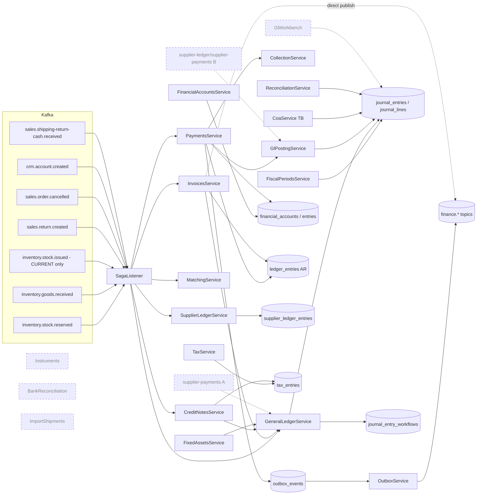
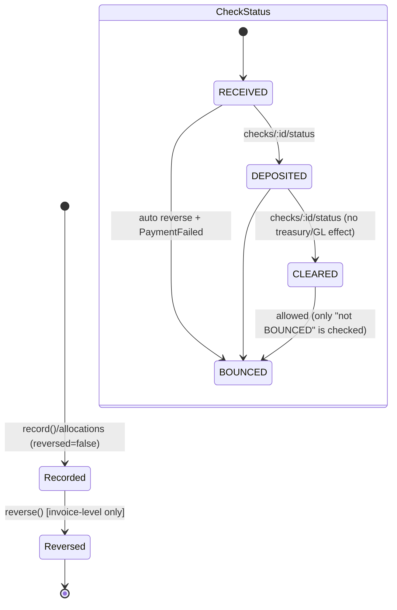
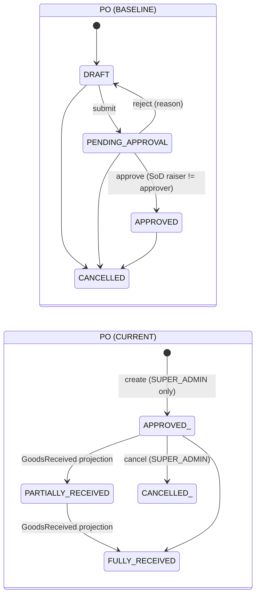
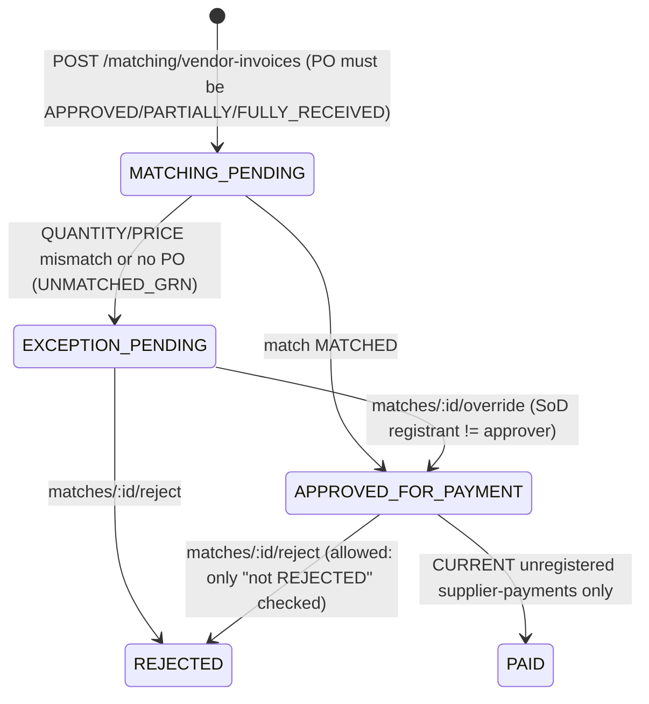
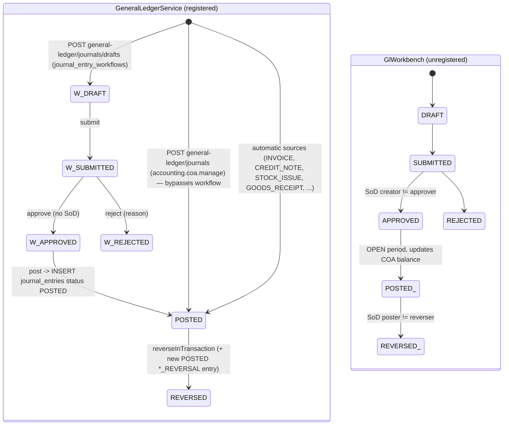

# Accounting service (apps/accounting): As-Is audit notes

Snapshots: **BASELINE** = `base/` (89c2c31, the candidate production image `release-89c2c31`). **CURRENT** = `cur/` (fa40270, main HEAD, not deployed).
Unless a path says otherwise, it is relative to the snapshot named next to it. "Verified" means I read it directly in code or evidence. "Inferred" means I reasoned it from code without running anything. Nothing here was executed against a database.
The one tool I ran is `node scripts/validate-schema-migrations.cjs accounting`. It is a pure file parser (it uses only `fs`/`path`), and I ran it in both snapshots. Its output is quoted in §5.3.

---

## 1. Scope and coverage

| Item | Coverage | Notes |
|---|---|---|
| Module inventory, wiring (app.module, module imports) | Full | both snapshots |
| Controllers / routes / permission decorators | Full (route list); Partial (DTO validation) | |
| AR invoicing (order saga, direct/counter invoice, lines, batches) | Full for flow; Partial for line/batch math | `invoices.service.ts` 1248 lines; read the generate/createDirect/reissue/cancel/return paths |
| Cancellation / void-on-order-cancel / reissue / credit notes | Full | |
| Customer payments, allocations, field-proposal, shipment-return, reversal, cheque status/bounce | Full | |
| Idempotency keys (payments, invoices, inbox, outbox) | Full (accounting side); events library only skimmed | |
| FX (rates, snapshots, revaluation, settlement) | Partial | read entry points and the diff; did not trace the revaluation math line by line |
| Financial accounts / treasury / cash-banks | Full for writes; Partial for reports | |
| Financial instruments (cheques) | Full | module is **not registered** in CURRENT |
| AP: PO workflow, PO receipt projection, 3-way match, SoD, vendor invoice (+FX) | Full | |
| Supplier ledger, supplier payments (2 implementations) | Full | supplier-payments **not registered** in CURRENT |
| General purchases, landed cost | Full (behaviour); Partial (allocation math) | |
| GL: COA, journals (3 implementations), posting services, manual journal workflow, dimensions, TB/statements | Full | |
| Period close / year-end | Full | |
| Bank reconciliation, import shipments, finance dashboard, audit timeline | Full (behaviour) | all **not registered** in CURRENT |
| Tax entries (VAT / Form 41) | Full | |
| Fixed assets / depreciation / disposal | Full | |
| Jobs (job_runs), nightly reconciliation, outbox | Full | |
| Migrations: 11 newer SQL files vs baseline models and the CURRENT schema | Full | |
| `scripts/accounting-migration-reconciliation.test.cjs`, `scripts/validate-schema-migrations.cjs`, `scripts/accounting-p0-gate.cjs`, `scripts/production-migrate.sh` | Full (what they check) | |
| Unit tests / specs content | Not reviewed (except `gl-posting.integration.spec.ts`) | |
| `@nile/events` consumer internals | Partial (retry→DLQ semantics from spec names) | covered by the events/platform area |
| Web UI accounting pages | Not reviewed (only `apps/web/lib/api.ts` route references) | |
| Runtime DB state | Not available | only `accounting-migration-history.txt` and the user's report (`docx.txt` ~782–832) |

---

## 2. Inventory and responsibilities

### 2.1 Modules

BASELINE has 20 module folders. All of them are registered in `app.module.ts` (base: `src/app.module.ts:52-55`).
CURRENT has 27 module folders. Only **one** new module is registered: `GeneralLedgerModule` (cur `src/app.module.ts:19,48`).

| Module | BASELINE | CURRENT | Registered in CURRENT? | Responsibility |
|---|---|---|---|---|
| invoices | yes | yes (+GL posting) | yes | AR invoice: order saga + direct counter sale, cancel, reissue, return credit |
| payments | yes | yes (+GlPostingService) | yes | customer collections, allocations, reversal, cheque status |
| ledger | yes | same | yes | customer AR sub-ledger (`ledger_entries`) read API |
| collection | yes | same | yes | aging, receivables, rep collection rate, unallocated credit |
| saga-listener | yes | yes (+StockIssued, +GL, +PO projection) | yes | the only Kafka consumer (group `accounting-saga-group`) |
| supplier-ledger | yes | yes (+2 unregistered files `supplier-payments.*`) | SupplierLedgerModule yes; the `supplier-payments.*` inside it no | AP sub-ledger |
| reconciliation | yes | yes (+GL/AP/treasury checks) | yes (via JobsModule) | nightly drift checks |
| fx | yes | yes (+tx-owned settlement) | yes | currencies, rates, snapshots, supplier FX revaluation |
| jobs | yes | same | yes | `fx-rate-reminder` (09:00 daily), `nightly-reconciliation` (02:00), via `@nile/scheduler` (`job_runs`) |
| coa | yes | yes (TB rebuilt on journals, CSV export) | yes | chart of accounts, default Egyptian chart seed, trial balance |
| fiscal-periods | yes | yes (+close-checks, close gated on journals) | yes | periods, close/reopen, year-end |
| matching | yes | yes (SUPER_ADMIN-only PO, receipt projection) | yes | PO, vendor invoice, three-way match, exceptions |
| tax | yes | same | yes | manual tax entries, VAT summary, Form 41 |
| credit-notes | yes | yes (+GL) | yes | credit notes from sales returns |
| financial-accounts | yes | same | yes | treasury (cash/bank/e-wallet/InstaPay), entries, transfers, counts |
| cash-banks | yes | same | yes | read-only cash/bank screen (COA 1110 subtree + payments) |
| landed-cost | yes | yes (Decimal math) | yes | landed-cost calculation vouchers (no posting) |
| fixed-assets | yes | yes (+idempotent run, +GL) | yes | asset register, monthly depreciation, disposal preview |
| general-purchases | yes | same | yes | expense-like purchase register with revisions |
| outbox | yes | same | yes | outbox dispatcher (5 s timer) + `/outbox/status` |
| general-ledger | — | new | **yes** | journals, manual-journal draft workflow, TB, P&L/BS/CF/equity |
| gl-workbench | — | new | **no** (only `GlPostingModule` is imported by PaymentsModule) | 2nd journal workflow (Prisma models) + `GlPostingService` |
| supplier-payments | — | new | **no** | AP payment (variant A, uses GeneralLedgerService) |
| instruments | — | new | **no** | cheque/promissory-note lifecycle |
| bank-reconciliation | — | new | **no** | bank statements import/match |
| import-shipments | — | new | **no** | import shipment / customs lifecycle |
| finance-dashboard, audit-timeline | — | new | **no** | read dashboards |

Evidence for "not registered": cur `src/app.module.ts:48-50` lists the imported modules. `grep` finds no import of `AuditTimelineModule|BankReconciliationModule|FinanceDashboardModule|GlWorkbenchModule|ImportShipmentsModule|InstrumentsModule|SupplierPaymentsModule` anywhere else in `cur/apps/accounting/src` (Verified).
The web client in CURRENT still calls `/api/accounting/gl-workbench`, `/finance-dashboard`, `/audit-timeline` and `/supplier-payments` (cur `apps/web/lib/api.ts:264-272, 2477, 2483, 2652-2653`). With these modules unregistered, those routes would return 404 (Inferred).

### 2.2 Kafka

- **Consumer (BOTH):** `SagaListener` (cur `modules/saga-listener/saga-listener.service.ts:47-62`) consumes these topics:
  - `inventory.stock.reserved` → generate invoice
  - `sales.shipping-return-cash.received` → payment
  - `crm.account.created` → opening balance into `ledger_entries`
  - `sales.return.created` → credit + credit note
  - `inventory.goods.received` → supplier ledger RECEIPT
  - `inventory.supplier-return.created` → supplier ledger RETURN
  - `sales.order.cancelled` → void invoice
  - **CURRENT only:** `inventory.stock.issued` → COGS journal
- **Dedup and failure handling:** `PrismaProcessedEventStore` over `processed_events`. A handler that fails is retried and then routed to `<topic>.dlq` (`packages/events/src/consumer.spec.ts:162-197`).
- **Producers:**
  - `FINANCE_INVOICE_GENERATED` and `FINANCE_INVOICE_CANCELLED` are published **directly after commit**, not through the outbox (cur `invoices.service.ts:543, 882, 1108, 1237`).
  - `FINANCE_RETURN_CREDITED` is also direct (`saga-listener.service.ts:284`).
  - `FINANCE_PAYMENT_RECEIVED/REVERSED/FAILED` go through the **transactional outbox** (`payments.service.ts:200, 417, 474`).
  - Also `FINANCE_FX_RATE_STALE` (job) and `FINANCE_EXCHANGE_RATE_RECORDED`.
- **Outbox:** `OutboxService.drain()` runs every 5 s with a 120 s lease and exponential backoff capped at 300 s. There is no max-attempts/dead state (cur `modules/outbox/outbox.service.ts:20-98`).

### 2.3 Scheduled jobs
`fx-rate-reminder` (`0 9 * * *`) and `nightly-reconciliation` (`0 2 * * *`), in `modules/jobs/*.ts`. Both are the same in both snapshots. CURRENT adds GL and AP/treasury checks to the nightly reconciliation (cur `reconciliation.service.ts:48-93`).

### 2.4 Security wiring
- `JwtAuthGuard` is global (`app.module.ts:54`).
- `PermissionsGuard` is **per-controller** and fails closed when metadata is missing. Every registered controller applies it in both snapshots.
- These unregistered CURRENT controllers lack it: `audit-timeline`, `finance-dashboard`, `gl-workbench`, `supplier-ledger/supplier-payments.controller.ts`. That is latent risk if they get wired.
- `bank-reconciliation.controller.ts:12-15` protects write operations (import/match/reconcile) with `accounting.payments.read`.

---

## 3. How it works (key flows)

### 3.1 Component diagram (CURRENT; dashed = present in code but not registered)



### 3.2 Customer payment, BASELINE (running candidate)
`POST /api/payments` (permission `accounting.payments.create`) runs `PaymentsService.record()` → `recordInternal()` → `recordInTransaction()`. Base `payments.service.ts` ~128-195.

```mermaid
sequenceDiagram
  autonumber
  participant UI
  participant PC as PaymentsController
  participant PS as PaymentsService
  participant DB as nile_accounting (SERIALIZABLE tx)
  participant OB as OutboxService
  participant K as Kafka
  UI->>PC: POST /payments {invoiceId, amount, method, idempotencyKey,...}
  PC->>PS: record(dto, actorId)
  PS->>DB: findUnique payment by idempotencyKey (outside tx)
  alt key exists
    PS-->>UI: replay (assertSamePayment else 409)
  else new
    PS->>DB: BEGIN SERIALIZABLE
    PS->>DB: invoice findUnique; reject CANCELLED; paid+credited <= total (Decimal)
    PS->>DB: resolveTreasuryAccount (CHECK -> none; CASH -> default box, auto-create "خزينة 1")
    PS->>DB: INSERT payments
    PS->>DB: UPDATE invoices paidAmount, status PAID|PARTIAL
    PS->>DB: INSERT ledger_entries CREDIT refType=PAYMENT (amount = dto.amount)
    opt treasury resolved
      PS->>DB: INSERT financial_account_entries PAYMENT_IN; UPDATE financial_accounts.balance
    end
    PS->>DB: collection rate for rep
    PS->>DB: INSERT outbox_events (PaymentReceived); INSERT audit_logs
    PS->>DB: COMMIT (P2034 -> retry x3; P2002 on idempotency_key -> return winner)
    OB->>DB: poll every 5s, lease row
    OB->>K: publish finance.payment.received
  end
```
BASELINE writes **no double-entry GL**. The "accounting" effect of a payment is three single-sided records: the AR sub-ledger credit, the treasury entry, and the outbox event.

### 3.3 Customer payment, CURRENT (not deployed)
This is the same as 3.2, plus a call to `GlPostingService.postArPayment(tx, …)` **inside the same transaction** (cur `payments.service.ts:183,186`). It only runs on the invoice-level path. The account-level allocations path has **no** GL call (cur `payments.service.ts:528-708`).

```mermaid
sequenceDiagram
  autonumber
  participant PS as PaymentsService.recordInTransaction
  participant GP as GlPostingService.post (raw SQL)
  participant DB as nile_accounting (same SERIALIZABLE tx)
  PS->>DB: payments / invoices / ledger_entries / treasury writes (as baseline)
  alt treasury resolved (CASH/BANK/E_WALLET/INSTAPAY)
    PS->>GP: postArPayment(paymentId, financialAccountId, amountBase)
  else method = CHECK (no treasury)
    PS->>GP: postArPayment(financialAccountId = null)
  end
  GP->>DB: SELECT journal_entries WHERE source_type='AR_PAYMENT' AND source_id=paymentId (idempotency)
  GP->>DB: SELECT financial_accounts FOR SHARE -> map CASH=1111, BANK=1112, E_WALLET/INSTAPAY=1113
  GP->>DB: SELECT chart_of_accounts codes (debit treasury or 1122; credit 1121) must be active/non-header/EGP
  GP->>DB: SELECT fiscal_periods OPEN covering now() FOR SHARE (else 400)
  GP->>DB: INSERT journal_entries (journal_number, created_by, status POSTED ...)
  Note over GP,DB: omits entry_number/entry_date/created_by_id (NOT NULL, no default in 20260927120000)
  GP->>DB: INSERT journal_lines x2 (omits line_no NOT NULL)
  GP->>DB: UPDATE accounts SET balance ...   (table "accounts" does not exist in nile_accounting)
  GP->>DB: INSERT ledger_entries refType=JOURNAL_LINE (COA ids into the customer AR ledger)
  Note over PS,DB: any failure above rolls back the whole payment
```
See ACC-02 and ACC-03. On the code alone, every invoice-level CURRENT payment with a treasury or a CHECK would fail and roll back.

### 3.4 Invoice from sales order (BOTH; GL step CURRENT only)
1. Sales/Inventory publish `StockReserved` with `order_id`, `account_id`, amounts, `invoice_lines`, `reservations`. `SagaListener.onStockReserved` calls `InvoicesService.generate()`. Missing fields default to `accountId 'unknown'` and amounts `0` (cur `saga-listener.service.ts:136-160`, "safe defaults ... in a demo").
2. `generate()`:
   - It is idempotent on `orderId` (unique).
   - Outside the transaction it computes the invoice number as `INV-${Date.now().toString(36)}` (cur `invoices.service.ts:444`). The number is not sequential.
   - It runs a SERIALIZABLE tx: if a `cancelled_orders` row exists it returns null. Otherwise it creates `invoices` + `invoice_lines` + `invoice_line_batches` (FEFO reservations mapped to lines) and `ledger_entries` DEBIT `INVOICE` (`input.total`, transaction currency = EGP on this path).
   - CURRENT also posts a GL journal: Dr `input.accountId` (CRM customer id), Cr 4110 (net+shipping), Cr 2121 (VAT) (cur `invoices.service.ts:508-521`).
3. After commit it publishes `InvoiceGenerated` directly. Sales moves the order to INVOICED.

### 3.5 Direct (counter) invoice (BOTH; no GL in either)
`POST /api/invoices` (`accounting.invoices.create`) runs `createDirect()` (cur `invoices.service.ts:584-905`):
- Idempotency key replay checks, including a replay of the Inventory issue.
- Batch validation and public prices via HTTP to Products/Inventory. Discount defaults to 12% on product lines. VAT is a server constant (14%) on TAX_INVOICE only.
- Shipping is quoted from Sales.
- FX: non-EGP requires `exchangeRate` and `baseTotal = total*rate`.
- Payment terms: DEFERRED status plus credit days.
- **Inventory stock is issued over HTTP before the DB tx**, with compensating rollback on failure.
- Invoice + lines + `ledger_entries` DEBIT(`baseTotal`) commit together. `InvoiceGenerated` is then published directly with `order_id: null`.

### 3.6 Return → credit → credit note (BOTH; GL CURRENT)
`SalesReturnCreated` triggers three steps, each in its own transaction:
1. `applyReturnCredit` (SERIALIZABLE): `creditedAmount` += amount, status PAID/PARTIAL, `ledger_entries` CREDIT `RETURN` (idempotent by returnId). If the source invoice is CANCELLED and has a replacement, the credit is applied to the replacement.
2. `CreditNotesService.issueForReturn` (separate tx): `CR-YYYY-NNNN` from `document_sequences`. Tax share is pro-rata of invoice tax. CURRENT also posts a GL journal: Dr 4110, Dr 2121, Cr `note.accountId` (CRM id).
3. Direct publish of `SalesReturnCredited` (only if step 1 applied).

`tax_entries` are not written unless `CREDIT_NOTE_VAT_POSTING=true`.

### 3.7 AP flow (BOTH; GL CURRENT)
- `GoodsReceived` → `SupplierLedgerService.recordEvent` via `runInInboxTransaction`: DEBIT `RECEIPT` (supplier ledger is "debit = we owe").
- CURRENT also does `gl.post` Dr 1131 / Cr 2111 (separate tx) and a PO receipt projection (separate tx).
- `SupplierReturnCreated` → CREDIT `SUPPLIER_RETURN` (CURRENT also Dr 2111 / Cr 1131).
- The vendor invoice is registered manually (`POST /api/matching/vendor-invoices`) and matched in the same SERIALIZABLE tx.
- **No AP payment exists in BASELINE.** In CURRENT, the two payment implementations are not registered (see ACC-08).

---

## 4. Business processes found

Statuses come from the CURRENT `prisma/schema.prisma` enums. They are the same in BASELINE except where marked.

### 4.1 AR invoice

| Aspect | Detail |
|---|---|
| Purpose | Raise a receivable (tax/normal invoice or receipt form) |
| Trigger | (a) `StockReserved` event (order-backed); (b) `POST /invoices` (counter sale); (c) `POST /invoices/:id/reissue` |
| Actors / permissions | system (saga); `accounting.invoices.create`, `.cancel`, `.reissue`, `.read` (+ `.read.any` to see others; else rep-scoped by `repId`) |
| Tables | `invoices`, `invoice_lines`, `invoice_line_batches`, `ledger_entries`, `cancelled_orders`, `audit_logs`; CURRENT also `journal_entries/lines` |
| Events | out: `finance.invoice.generated`, `finance.invoice.cancelled` (direct publish) |
| Controls | idempotent on `orderId` / `idempotencyKey`; SERIALIZABLE tx; server-computed totals on direct path; cancel only when UNPAID and paid = credited = 0; reissue only for order-backed UNPAID/DEFERRED with no money; replacement total must equal net+tax+shipping |
| Gaps | non-sequential numbering (`INV-<base36 ms>`); no TaxEntry auto-creation (VAT reports only see manual entries); reissue replacement has **no lines** (header-only, cur `invoices.service.ts:1019-1052`); reissue amounts are free values with no approval/SoD; events not through outbox |
| Completeness | BASELINE: complete for AR sub-ledger. CURRENT: GL posting added but broken (ACC-02) |

```mermaid
stateDiagram-v2
  [*] --> UNPAID: generate() / createDirect() cash
  [*] --> DEFERRED: createDirect() credit terms
  UNPAID --> PARTIAL: payment / return credit (settled < total)
  DEFERRED --> PARTIAL: payment / return credit
  UNPAID --> PAID: settled >= total
  DEFERRED --> PAID: settled >= total
  PARTIAL --> PAID: settled >= total
  PARTIAL --> UNPAID: payment reversal (settled = 0)
  PAID --> PARTIAL: payment reversal
  PAID --> UNPAID: payment reversal (settled = 0)
  UNPAID --> CANCELLED: cancel() / voidForCancelledOrder() (no money)
  UNPAID --> CANCELLED: reissue() (source voided; replacement created)
  DEFERRED --> CANCELLED: reissue() only
  CANCELLED --> [*]
```


Note: a reversal recomputes the status as UNPAID/PARTIAL/PAID. It never returns to DEFERRED (cur `payments.service.ts:395`).

### 4.2 Customer payment, allocation and reversal

| Aspect | Detail |
|---|---|
| Entry points | `POST /payments` (invoice-level or `allocations[]` account-level), `POST /payments/allocations`, `POST /payments/from-field-proposal` (needs `FIELD_PROPOSAL_CONVERSION_ENABLED=true`, CRM HTTP check, reviewer ≠ creator), internal `recordShipmentReturn` from Sales event, `POST /payments/:id/reverse` (`accounting.payments.reverse`), `POST /payments/checks/:id/status` (`accounting.payments.update`) |
| Idempotency | `payments.idempotency_key` unique + `assertSamePayment` payload comparison; P2002 → return winner; field proposals → `field_collection_postings` + advisory lock + derived deterministic keys; shipment return → `(source_type, source_id)` unique |
| Transaction | SERIALIZABLE, 3 attempts on P2034 |
| Rounding | Decimal for invoice math; `round2(Number)` for base amount and treasury balance (cur `payments.service.ts:180, 514, 633`) |
| Reversal | flags the payment (never deleted), recomputes the invoice, AR DEBIT `PAYMENT_REVERSAL`, outbox `PaymentReversed`. It does **not** reverse the treasury entry and does **not** handle allocation payments (ACC-06, ACC-07) |
| Cheques | CHECK has no treasury at receipt; status RECEIVED→DEPOSITED→CLEARED is a label only; BOUNCED auto-reverses + `PaymentFailed` (outbox). CLEARED never moves money into a treasury account (ACC-09) |



### 4.3 Purchase order, vendor invoice and three-way match

BASELINE workflow (base `matching.service.ts:91-127, 128-298`):
- A PO is created as DRAFT with a **client-supplied** `poNumber`.
- Transitions: submit → PENDING_APPROVAL; approve (SoD: `createdById ≠ approver`, fails closed if null); reject → DRAFT; cancel from DRAFT/PENDING/APPROVED.
- `receivedQty` is never updated, and the GRN is free text (`GRN_VERIFICATION='UNVERIFIED_FREE_TEXT'`).

CURRENT (cur `matching.service.ts:92-160, 297-300, 943-1029`):
- Creation is **SUPER_ADMIN only**, numbered server-side `PO-YYYY-NNNN`, and the PO is **born APPROVED**. The approval workflow and its SoD are bypassed for new POs; the routes still exist.
- Cancel is also SUPER_ADMIN only.
- `PurchaseOrderReceipt` projects `GoodsReceived` events (idempotent by `event_id`) and moves the PO to PARTIALLY/FULLY_RECEIVED.
- The match compares **billed vs received** quantity.
- Vendor invoices now store `currency/exchangeRate/baseTotal`.




Rules (BOTH):
- Quantities are compared **cumulatively** across the PO's non-rejected invoices.
- Price mismatch is flagged only when billed > ordered (`priceDiff.gt(0)`), with no tolerance.
- Under-billing is informational.
- Everything uses Decimal and ROUND_HALF_UP.

In BASELINE nothing ever moves a vendor invoice to PAID (Verified: no writer in base).

### 4.4 Supplier ledger and AP payments
- **BASELINE:** the AP sub-ledger comes from events only (RECEIPT/SUPPLIER_RETURN, plus FX_REVALUATION from `POST /fx/revalue`). There is **no supplier payment entity or endpoint**. Paying a supplier can only be recorded as a free treasury `PAYMENT_OUT` entry (`POST /financial-accounts/entries`) with no link to the supplier or vendor invoice (Inferred from absence).
- **CURRENT:** there are two competing, unregistered implementations:
  - (A) `modules/supplier-payments` uses GeneralLedgerService and the **first** `supplier_payments` table shape (`vendor_invoice_id, amount, exchange_rate, base_amount`) (cur `supplier-payments.service.ts:62`).
  - (B) `modules/supplier-ledger/supplier-payments.service.ts` uses GlPostingService and the **second** shape (`supplier_invoice_id, amount_fx, fx_rate, amount_egp`), which matches the Prisma model. It also has `WHERE id = ${id}::uuid` on a TEXT column (`:99`).

  Neither is reachable over HTTP.

### 4.5 General ledger
- **BASELINE:**
  - Has only the COA (`chart_of_accounts` with a cached `balance` column) and a static trial balance computed from `Account.balance` (base `coa.service.ts:208-255`).
  - Nothing in BASELINE posts to the COA balances. The only writer is year-end closing (base `fiscal-periods.service.ts:189-195`). `cash-banks.service.ts` says so explicitly ("a collection writes AR ledger entries for the customer account, not postings to a specific cash/bank account").
  - Result: there is no journal, no double entry, and the TB is effectively all zeros (Inferred).
- **CURRENT** has three journal implementations over the same `journal_entries/journal_lines` tables. The two migrations create incompatible column sets (§5.2):
  1. `GeneralLedgerService` (registered) uses raw SQL with the legacy columns `entry_number, entry_date, created_by_id, line_no, exchange_rate`. Used by invoices, credit notes, depreciation, saga COGS/GR/returns, and the manual journal draft workflow (stored in a separate table `journal_entry_workflows`, JSON lines).
  2. `GlPostingService` (registered indirectly via PaymentsModule) uses raw SQL with the workbench columns `journal_number, created_by, fx_rate`. Used by AR payments.
  3. `GlWorkbenchService` (unregistered) uses Prisma models `JournalEntry/JournalLine` with workflow statuses on `journal_entries.status`, SoD and COA balance updates.


Controls in `GeneralLedgerService`:
- At least 2 lines, one side per line.
- Balance check on **transaction-currency** debit/credit with EPS 0.005. `base_debit/base_credit` come from the caller and are **not** checked (ACC-12).
- Period check rejects only CLOSED/YEAR_END_CLOSED, and **allows posting when no period exists** (`general-ledger.service.ts:10-14`).
- Accounts must exist and be active. Header accounts are **not** rejected.

### 4.6 Fiscal periods and close
- **BOTH:** create / generate-year; close sets CLOSED; reopen (not from YEAR_END_CLOSED).
- **BASELINE:** nothing checks the period when posting invoices or payments. A closed period blocks nothing (Verified: no `fiscalPeriod` reference outside the module in base).
- **CURRENT:**
  - `closePeriod` blocks on `journal_entries` DRAFT/SUBMITTED/APPROVED (the workbench statuses). Only `close-checks` (advisory) counts `journal_entry_workflows` drafts and unmatched bank lines (cur `fiscal-periods.service.ts:101-138`).
  - GlPostingService requires an OPEN period. GeneralLedgerService does not require any period.
- **Year-end (BOTH, unchanged):**
  - The comment promises zeroing nominal accounts, but the code does not zero them.
  - The net income comes from COA `balance` values that are never posted (BASELINE).
  - Re-running adds the net income to 3200 again.
  - It is not transactional (base `fiscal-periods.service.ts:145-240`).

### 4.7 Treasury (financial accounts)
- **BOTH:**
  - Types are CASH/BANK/E_WALLET/INSTAPAY.
  - Entries are recorded with an idempotency key, Decimal running balance, SERIALIZABLE retry, and no negative balance except ADJUSTMENT. Transfers write both legs in one tx (FX needs a caller-supplied rate).
  - `reconcileLedger` proves the cache against the entries. Physical counts are stored as `financial_account_reconciliations`.
- Payment-generated `PAYMENT_IN` entries have no idempotency key, and their currency is not checked against the treasury account's currency (ACC-10).

### 4.8 Tax (BOTH)
- `POST /tax/entries` is manual. VAT summary = output − input from `tax_entries`. Form 41 lists WHT entries per quarter. `mark-reported` flags them.
- No automatic tax entries are created from invoices or vendor invoices.
- Company identity is hard-coded (`companyName`, `companyTaxNumber: '621-890-432'`, cur `tax.service.ts:181-182`). Whether this is the real registration number is an Open question.
- Quarters are computed with server-local `getMonth()`.

### 4.9 Fixed assets (BOTH; GL CURRENT)
- Register, monthly depreciation (straight-line or 150% declining), disposal "preview" (sets DISPOSED, returns a suggested journal, posts nothing).
- **BASELINE** depreciation is non-transactional and has no per-(asset, year, month) guard. Running `run-monthly` twice double-depreciates (ACC-15).
- **CURRENT** adds a per-asset tx and a guard, plus GL to accounts **5211/1219, which are not in the seeded chart** (cur `coa.service.ts` seed list). Depreciation therefore throws unless someone creates those accounts by hand.

### 4.10 Landed cost, general purchases (BOTH)
- Landed cost: calculation vouchers (`LC-YYYY-random`), with allocation BY_VALUE/QUANTITY/WEIGHT. No inventory cost update, no posting. Uses the `accounting.fx.*` permissions.
- General purchases: register with optimistic version and revision history. The status (DRAFT/CONFIRMED/CANCELLED) is freely editable in any direction, and there is no treasury or GL effect.

### 4.11 FX (BOTH)
- Currencies, rates (history, stale reminder job), snapshots.
- `POST /fx/revalue` revalues **supplier** ledger entries with non-EGP currency. Supplier entries from GoodsReceived are always created as EGP (`createEntry` default), so in BASELINE revaluation has nothing to act on unless entries were written another way (Inferred).
- `settleFxDifference` has no caller in BASELINE. In CURRENT its only caller is the unregistered supplier-payments A.

### 4.12 CURRENT-only, unregistered capabilities
Each of these exists as code but is not reachable:
- **Instruments:** status machine only (RECEIVED→DEPOSITED→CLEARED / BOUNCED→REPLACED). No money or GL effect. `createFromPayment` has no caller.
- **Bank reconciliation:** statement import, manual match to an arbitrary `sourceType/sourceId` with no amount check, reconcile when all lines are matched.
- **Import shipments:** status machine PLANNED→…→CLOSED with HELD branches, documents, regulatory clearances.
- **Finance dashboard, audit timeline.**

---

## 5. BASELINE vs CURRENT

### 5.1 Code
`diff -rq` gives 57 differences. In summary: 7 new module folders, plus GL hooks inserted into invoices, credit-notes, fixed-assets, payments, saga-listener, coa (TB), fiscal-periods, reconciliation, matching (PO model change, receipt projection) and fx (tx settlement), plus XLSX/CSV exports (`@nile/export-kit`, Dockerfile builds it). Specific points:
- PO lifecycle semantics changed: born APPROVED, SUPER_ADMIN only (removes the BASELINE SoD for new POs).
- The three-way match now uses `receivedQty`. Without PO references on GoodsReceived, every PO-linked vendor invoice becomes QUANTITY_MISMATCH (Inferred; depends on Inventory sending `purchase_order_id/purchase_order_line_id`).
- The TB moved from `Account.balance` to journal lines.

### 5.2 Migrations: the 11 newer files (CURRENT only) vs BASELINE models

| Migration | Touches baseline tables? | Additive vs baseline? | Notes |
|---|---|---|---|
| 20260927120000_general_ledger | FK `journal_lines.account_id → chart_of_accounts` RESTRICT | Additive (new tables, new sequence `journal_entry_number_seq`) | Creates the **legacy GL shape**: `entry_number/entry_date/created_by_id NOT NULL` (no default), `status TEXT CHECK IN (DRAFT,POSTED,REVERSED)`, `fiscal_period_id` NULL, `journal_lines.line_no NOT NULL` (no default), `exchange_rate`, CHECK one-side>0 on debit/credit and base, partial unique `(source_type,source_id) WHERE POSTED`. Edited ≥5 times after creation (evidence `accounting-migration-history.txt:52-63`) |
| 20260927143000_supplier_payments | FK → `vendor_invoices` RESTRICT, → `financial_accounts` | Additive | **v1 shape** (`vendor_invoice_id NOT NULL, amount, exchange_rate, base_amount`). Plain `CREATE TABLE` (no IF NOT EXISTS) |
| 20260927210000_financial_instruments | FKs → `payments`, `invoices` ON DELETE SET NULL | Additive | new enums `InstrumentType/InstrumentStatus`; `updated_at NOT NULL` without default (Prisma `@updatedAt` supplies it) |
| 20260928003000_purchase_order_receipt_tracking | FKs → `purchase_orders/_lines` CASCADE | Additive, IF NOT EXISTS | |
| 20260928090000_supplier_payments | none | Additive, `CREATE TABLE IF NOT EXISTS` | **v2 shape** (`request_hash, supplier_invoice_id, method, amount_fx, fx_rate, amount_egp, financial_account_id NOT NULL, paid_at TIMESTAMPTZ`). No FKs |
| 20260928110000_gl_workbench | journal tables only | "reviewed-destructive": converts `status` TEXT→enum `JournalEntryStatus`, adds `journal_number, created_by` then **SET NOT NULL** (backfilled), adds workflow columns; `journal_lines` adds `fx_rate`, `description/currency/base_*` (IF NOT EXISTS, so skipped when legacy exists); new NOT VALID CHECKs; non-partial unique `(source_type,source_id)` | **Depends on** the legacy columns `entry_number, created_by_id, entry_date, exchange_rate` existing (UPDATEs at lines 57-70, 102-104). Edited after creation (`3fbb59d`, `df51cb3`, `e9d6d81`) |
| 20260928130000_gl_analytical_dimensions | journal_lines | Additive | `branch_id, cost_center_id, profit_center_id, party_id, tax_code`, **not mapped in Prisma** |
| 20260928140000_import_shipments | none | Additive | 5 new tables |
| 20260928143000_vendor_invoice_fx | `vendor_invoices` | Additive: `exchange_rate NUMERIC(16,6) NOT NULL DEFAULT 1`, `base_total NUMERIC(14,2) NOT NULL DEFAULT 0` + one-time backfill | Safe for BASELINE inserts (defaults). But any vendor invoice created by BASELINE code **after** this migration keeps `base_total = 0` forever (the backfill ran once) (Inferred) |
| 20260928150000_manual_journal_workflow | none | Additive | `journal_entry_workflows` (JSON lines) |
| 20260928210000_bank_reconciliation | none | Additive | `bank_statements`, `bank_statement_lines` (no FK to financial_accounts) |

**Compatibility of BASELINE code with a DB migrated to bank_reconciliation:**
- No migration adds a NOT NULL column without a default to a table BASELINE writes. No migration drops or renames anything BASELINE uses. New enums don't affect BASELINE's Prisma client.
- New FKs point *from* new tables, so they only constrain deletes. BASELINE has no delete paths on `payments/invoices/vendor_invoices/purchase_orders/chart_of_accounts` that I found.
- **Conclusion (Inferred):** BASELINE code keeps working on the extended schema. The new tables simply stay empty.
- Residual effects:
  1. `vendor_invoices.base_total = 0` on BASELINE-created rows.
  2. `prisma migrate deploy` run from a BASELINE image sees 11 applied migrations missing locally. Behaviour is Unknown; I did not verify the Prisma version's semantics.
  3. A rollback of the DB to the BASELINE migration set is impossible without manual DDL.

**Duplicate-looking migrations:**
- *supplier_payments v1 vs v2.* If v1 had executed, v2's `CREATE TABLE IF NOT EXISTS` would be a no-op. `supplier_payments_invoice_idx` would also be skipped, because the name already exists (on `vendor_invoice_id`). But `CREATE INDEX IF NOT EXISTS supplier_payments_supplier_id_paid_at_idx ON (supplier_id, paid_at)` would **fail** (column `paid_at` does not exist). The user reports v2 and later migrations as applied, and v1 as "rolled back → applied, 0 steps". The most consistent reading is that **v1's DDL never ran** and the table has the **v2 shape** (Inferred; confirm with `\d supplier_payments`). In that case CURRENT's supplier-payments A code (v1 columns) cannot work, while B and the Prisma model match.
- *general_ledger vs gl_workbench.* gl_workbench (current content) does not create the tables. It ALTERs them and reads the legacy columns, so it can only succeed if `journal_entries` already had `entry_number/created_by_id/entry_date` and `journal_lines.exchange_rate`. With general_ledger recorded as "applied, 0 steps" and gl_workbench reported applied, either:
  - (A) the legacy tables were created outside Prisma (manual SQL) before gl_workbench ran; or
  - (B) an **earlier version** of gl_workbench was applied. The test at `scripts/accounting-migration-reconciliation.test.cjs:17-18` asserts the file must *not* contain `CREATE TABLE "journal_entries"`, which implies an earlier version did. In that version the workbench created the tables in its own shape.

  Which one happened is **Unknown**. It decides which columns production really has. Compare `_prisma_migrations.checksum` with the sha256 of the files (values in §7).

**Prisma schema vs SQL (CURRENT)**, from `validate-schema-migrations.cjs accounting`, run read-only:
- *extra (in SQL, not in schema):* `journal_entries.entry_number, entry_date, created_by_id`; `journal_lines.line_no, exchange_rate, branch_id, cost_center_id, profit_center_id, party_id, tax_code`; `supplier_payments.vendor_invoice_id, amount, exchange_rate, base_amount`.
- *missing:* unique `import_shipments(shipment_number)`, `journal_entry_workflows(entry_number)`, `regulatory_clearances(shipment_id,authority)`; FKs `import_shipment_lines/shipment_documents/regulatory_clearances/shipment_status_events → import_shipments`, `bank_statement_lines → bank_statements`. These "missing" items exist in the SQL as **inline** `UNIQUE`/`REFERENCES` on unquoted DDL. They look like **parser limitations (false positives)**, not real drift (Inferred).
- Result: `❌ Release blocked`. BASELINE: `✅ 30 migrations describe the schema`.
- `scripts/production-migrate.sh:95-99` exits **3** on this failure ("REFUSE"). That matches the user-reported `db-migrate exit=3`, if the migrate container ran CURRENT-like content (Inferred).

Other Prisma vs DB mismatches:
- Prisma `JournalEntry.fiscalPeriodId` is required, but the legacy SQL column is nullable, and GeneralLedgerService inserts NULL when no period exists. Prisma reads of such rows would fail.
- `JournalLine.currency` is an enum in Prisma but TEXT in the legacy shape.
- Prisma `ImportShipment.updatedAt` has no `@updatedAt`.

**What the scripts check:**
- `accounting-migration-reconciliation.test.cjs` is a regex-only static test. It checks that gl_workbench contains `CREATE TYPE "JournalEntryStatus"`, the `ADD COLUMN IF NOT EXISTS "journal_number"/"reversal_of_id"` statements and the COALESCE backfills, that it does **not** `CREATE TABLE journal_entries/journal_lines`, that the legacy column names are mentioned, and that eight workspace models exist in schema.prisma. It does not check that any code path can insert a row.
- `validate-schema-migrations.cjs` replays DDL statically against the schema (tables/columns/enums/FKs/uniques/indexes/order). No database.
- `accounting-p0-gate.cjs` runs read-only SELECTs against a DB. It requires the journal tables, `supplier_payments`, the sequence, COA codes `1111,1112,1113,1121,1131,2111,2112,2121,4110,5100,5211,1219` (5211/1219 are **not** in the default seed), valid/balanced lines and unique posted sources.

### 5.3 What is "running" (evidence)
- `runtime.txt:2-7`: the container runs `nile-pharma-erp/accounting:release-89c2c31`, healthy, created 2026-09-29.
- `git-and-schema.txt:690-726`: the BASELINE model list has **no** JournalEntry, JournalLine, SupplierPayment, FinancialInstrument, PurchaseOrderReceipt, Bank*, Import*, or JournalEntryWorkflow.
- Combined with the user report (§7), the DB likely has these tables while the running code has no models or routes for them. **The DB is ahead of the code** (Inferred).
- Practical meaning: production accounting today is the BASELINE behaviour (sub-ledgers only, no GL), assuming image = commit (unproven).

### 5.4 Documented intentions vs code

| Documented claim | Code reality |
|---|---|
| P0 mega-wave §1 "AP supplier payment → supplier ledger → treasury → GL" | Both AP payment implementations are unregistered (ACC-08) |
| §2 "AR collection → … → GL" | Invoice-level only; GL insert path broken (ACC-02/03); allocations path has no GL |
| §3 "Reversal → compensating GL journal" | GlPostingService reversal posts the **same direction** for non-cheque AR and all AP (ACC-04); GeneralLedgerService reversal double-counts in TB (ACC-05) |
| §4 "Closed periods cannot receive automated postings" | true for GlPostingService; GeneralLedgerService allows a missing period |
| §5 "Period close fails closed while DRAFT/SUBMITTED/APPROVED journals remain" | checks workbench statuses in `journal_entries` only; the registered draft workflow lives in `journal_entry_workflows` and does not block close |
| §6 cheque → 1122 | implemented in GlPostingService; clearing 1122→bank never posted |
| Gate: "CI status intentionally not declared green" | consistent: integration spec is skipped without `ACCOUNTING_TEST_DATABASE_URL` and does not seed COA codes (`gl-posting.integration.spec.ts:5-23`) |
| Audit-impl doc: "Manual journal workflow DRAFT→SUBMITTED→APPROVED/REJECTED→POSTED" | exists (journal_entry_workflows) but has **no SoD**, and its permissions `accounting.ledger.create/approve/post` are not in the IAM seed (`grep` over `cur/apps/iam` finds none; Inferred unusable) |
| "Posted journals immutable; reversal is the correction mechanism" | `POST /general-ledger/journals` posts directly with `accounting.coa.manage` (bypasses approval) |
| "PO creation is SUPER_ADMIN-only and backend-numbered" | implemented; also removes approval SoD |
| "Import shipment … backend is now present" | present but unregistered |
| "Supplier payment … Payables web workspace now exposes controlled supplier settlement" | web calls `/supplier-payments`, which is not mounted |
| "Landed-cost allocation moved to Decimal" | implemented (diff in `landed-cost.service.ts`) |

---

## 6. Findings

**ACC-01: The production DB schema is likely ahead of the running code, and the migration history was edited and manually resolved**
- Domain: Deployment/DB. Affects BOTH.
- Verification: Inferred (evidence + user report; DB not inspected).
- Type: Operational uncertainty. Severity: **High**. The schema state can't be reproduced from either snapshot, and the history was manually resolved.
- Evidence:
  - `runtime.txt:2` (image release-89c2c31)
  - `git-and-schema.txt:690-726` (no GL models at baseline)
  - `docx.txt:782-832` (general_ledger and supplier_payments ROLLED_BACK then APPLIED with `applied_steps_count=0`; later migrations through bank_reconciliation applied)
  - `accounting-migration-history.txt` (general_ledger edited 6 times, gl_workbench 4 times, financial_instruments 3 times)
- Trigger: newer migrations applied to `nile_accounting` while the BASELINE app is running.
- Impact:
  - It is unknown which SQL version each table came from (see §5.2 scenarios A/B).
  - Checksums of edited files probably differ from the DB.
  - Fresh environments built from the repo will not match production.
  - A rollback needs manual DDL.
- To close: run the read-only queries in §7 and compare checksums to the sha256 values listed there.

**ACC-02: CURRENT: every GL write path fails against any plausible schema, which blocks invoicing, credit notes, COGS, depreciation and AR payments**
- Domain: GL/AR. Affects CURRENT.
- Verification: Verified (code + SQL); runtime Inferred.
- Type: Confirmed defect (latent until CURRENT is deployed). Severity: **Critical**. If CURRENT is deployed, invoicing, collections and the order saga would stop.
- Evidence:
  - `GeneralLedgerService.postInTransaction` inserts only legacy columns (cur `general-ledger.service.ts:39-40`). Scenario A: fails on `journal_number`/`created_by` NOT NULL (`gl_workbench/migration.sql:72-74`). Scenario B: fails because `entry_number`, `line_no` and the sequence don't exist.
  - `GlPostingService.post` inserts only workbench columns (cur `gl-posting.service.ts:47,50`). Scenario A: fails on `entry_number/entry_date/created_by_id/line_no` NOT NULL (`general_ledger/migration.sql:6-13,28`).
  - Independently of the schema: `UPDATE accounts` (`gl-posting.service.ts:51-52`). No `accounts` table exists in any accounting migration; `accounts` is CRM's table (`apps/crm/prisma/schema.prisma:203`).
  - Independently of the schema: invoice and credit-note journals debit/credit `invoice.accountId`, the CRM customer id (cur `invoices.service.ts:512`, `credit-notes.service.ts:61`). `validateLines` requires these ids in `chart_of_accounts` → `NotFoundException` (`general-ledger.service.ts:22-23`). The FK `journal_lines_account_fk` would also reject them.
- Trigger: any `StockReserved` (invoice generation), reissue, return credit note, depreciation run, GoodsReceived/SupplierReturn/StockIssued event, or invoice-level/CHECK payment, on CURRENT code.
- Impact:
  - Synchronous calls return 4xx/5xx and roll back the business transaction.
  - Event handlers retry and then go to DLQ. The order saga stalls at "allocated", and the supplier-ledger entry for a GR is committed while the GL and PO projection are not.
- To close:
  - Do not deploy CURRENT accounting as-is.
  - Decide on one GL table shape and one writer. Map customer AR to a control account (1121) with `partyId` = customer.
  - Add an integration test that seeds the COA and runs real inserts.

**ACC-03: CURRENT: GL posting is inside the payment transaction, so any GL configuration gap blocks cash collection**
- Domain: AR/Treasury. Affects CURRENT.
- Verification: Verified. Type: Potential risk. Severity: **High**. It couples cash receipt to GL configuration.
- Evidence: cur `payments.service.ts:183-187` (in tx); `gl-posting.service.ts:32-44`. Failure conditions: no OPEN fiscal period covering now, an inactive treasury, COA codes missing/inactive/header/non-EGP, or a non-EGP treasury account (the mapping only checks the COA currency).
- Trigger: production DB with no `fiscal_periods` rows, or a missing COA (BASELINE never required either; COA seeding happens lazily on `GET /coa/tree`).
- Impact: collections refused.
- To close:
  - Count `fiscal_periods` and the COA codes in production (§7).
  - Decide the business policy: block collection, or post to suspense.

**ACC-04: CURRENT: the GlPostingService "reversal" posts the same direction as the original for non-cheque AR and for all AP**
- Domain: GL. Affects CURRENT.
- Verification: Verified (code). Type: Confirmed defect (latent). Severity: **High**. It would double the effect instead of cancelling it.
- Evidence: cur `gl-posting.service.ts:13,17,24`.
  - AR original: Dr treasury, Cr 1121. AR reversal (non-CHECK): `debitPartyCode=null` → treasury, `creditPartyCode='1121'`, so again Dr treasury, Cr 1121.
  - AP original: Dr 2111/2112, Cr treasury. AP reversal: Dr 2111/2112, Cr treasury.
  - The integration test checks only the debit and credit sums, not the direction (`gl-posting.integration.spec.ts:50-60`).
- Trigger: `POST /payments/:id/reverse`, or a bounced cheque on a CASH/BANK payment.
- Impact: GL cash and AR wrong by 2× the reversed amount.
- To close: swap the codes and assert per-line direction in the tests.

**ACC-05: CURRENT: a GeneralLedgerService reversal marks the original REVERSED and also posts a POSTED reversing entry, so TB and statements double-count**
- Domain: GL. Affects CURRENT.
- Verification: Verified (code), Inferred (effect). Type: Confirmed defect (latent). Severity: **High**. Cancelled invoices would show negative revenue.
- Evidence: cur `general-ledger.service.ts:48-49`. The TB and cash-flow filter `je.status='POSTED'` (`:119,146`; `coa.service.ts:244`).
- Trigger: invoice cancel/void/reissue (`invoices.service.ts:1229-1230`), supplier payment reversal (A).
- Impact: the original is excluded and the reversal is included, giving a net of −original.
- To close: keep the original POSTED (it is linked by the reversal) or don't post the reversal; pick one convention.

**ACC-06: BOTH: payment reversal and cheque bounce leave treasury balances unchanged**
- Domain: Treasury/AR. Affects BOTH.
- Verification: Verified. Type: Confirmed defect. Severity: **High**. Cash-box and bank balances overstate after any reversal. `reconcileLedger` cannot detect this, because the cache and the entries agree.
- Evidence: base `payments.service.ts:369-400` and cur `:381-420`. The reversal writes payment, invoice, `ledger_entries` and outbox; it writes no `financial_account_entries` or `financial_accounts` row. Compare the receipt side at base `:169-170`.
- Trigger: `POST /payments/:id/reverse` on a CASH/DEPOSIT/TRANSFER/E_WALLET/INSTAPAY payment.
- Impact: treasury overstated, and physical counts show unexplained shortages.
- To close: find reversed payments that have a `financial_account_id` (§7 query), then define a reversal treasury entry.

**ACC-07: BOTH: account-level (allocation) collections cannot be reversed or bounced, and the allocations are never unwound**
- Domain: AR. Affects BOTH.
- Verification: Verified (code), Inferred (runtime error). Type: Confirmed defect. Severity: **Medium**. A wrong central collection has no correction path except manual DB work.
- Evidence: `reverseInTx` reads `payment.invoiceId` (null for allocations) (cur `payments.service.ts:386`; base `:370`). It never touches `payment_allocations` or the invoices settled through them.
- Trigger: reverse or bounce of a payment created through `allocations[]`.
- Impact: a Prisma validation error or 404, with invoices left PAID/PARTIAL.
- To close: count `payments WHERE invoice_id IS NULL`, and ask the business how corrections are handled today.

**ACC-08: CURRENT: most "completed" features are unreachable (modules not registered), and the web calls 404 routes**
- Domain: Architecture. Affects CURRENT.
- Verification: Verified. Type: Confirmed defect. Severity: **High**. Documented features (supplier payment, GL workbench, instruments, bank rec, import shipments, dashboards) don't exist at runtime.
- Evidence: cur `src/app.module.ts:48-50`; web `apps/web/lib/api.ts:264-272, 2477, 2483, 2652-2653`. There are two divergent supplier-payment implementations (A: `modules/supplier-payments`, v1 table shape; B: `modules/supplier-ledger/supplier-payments.*`, v2 shape, `::uuid` cast on a TEXT id at `:99`).
- Trigger: deploy CURRENT and use those screens.
- Impact: 404s. The docs overstate delivered scope.
- To close: decide which implementation is canonical, then register it and test it end to end.

**ACC-09: BOTH: a cleared cheque never reaches treasury, and in CURRENT never leaves 1122**
- Domain: Treasury/Cheques. Affects BOTH.
- Verification: Verified. Type: Confirmed defect / gap. Severity: **Medium**. Bank balances never include cheque collections.
- Evidence: CHECK → `resolveTreasuryAccount` returns null (cur `payments.service.ts:70,771`). `updateCheckStatus` only flips the label for non-BOUNCED (`:446-453`). The instruments module (unregistered) also has no money effect.
- Trigger: any cheque collection.
- Impact: the treasury understates the bank; in CURRENT, 1122 grows forever.
- To close: ask the business how cheque deposits are recorded today (likely a manual `DEPOSIT` entry). Confirm with a query on `financial_account_entries`.

**ACC-10: BOTH: payment currency is not checked against the invoice or treasury currency, and sub-ledgers mix currencies**
- Domain: AR/FX. Affects BOTH.
- Verification: Verified. Type: Potential risk. Severity: **Medium**. It needs non-EGP use to bite; FX invoices exist (direct path).
- Evidence: `recordInTransaction` compares `dto.amount` with the invoice total without comparing `dto.currency` and `invoice.currency` (cur `payments.service.ts:147-153`). `ledger_entries` PAYMENT uses `dto.amount` (transaction currency), while the direct invoice DEBIT uses `baseTotal` (`invoices.service.ts:849`). The treasury entry uses `dto.amount` in `treasury.currency` (`:180-181`). Invoice cancellation credits `inv.total`, not `baseTotal` (`:1226`).
- Trigger: a USD invoice or payment.
- Impact: wrong paid status, AR statement in mixed currencies, treasury value wrong.
- To close: count non-EGP invoices and payments (§7).

**ACC-11: BASELINE has no general ledger, so the trial balance, financial statements and year-end close are not meaningful**
- Domain: GL. Affects BASELINE.
- Verification: Verified (code). Type: Confirmed gap. Severity: **High**. There is no double-entry book of record. Statutory reporting must happen outside the ERP (Inferred).
- Evidence: base `coa.service.ts:208-255` (TB from `Account.balance`). The only writer of `balance` is year-end close (`fiscal-periods.service.ts:189-195`). `cash-banks.service.ts` header comment. No JournalEntry model (`git-and-schema.txt:690-726`).
- Trigger: any use of `/coa/trial-balance` or `/fiscal-periods/year-end-closing`.
- Impact: TB is zeros or manual. Year-end adds `netIncome` to 3200 again on every run, and does not zero nominal accounts despite its comment (`:136-143` vs code).
- To close: ask the business where the official ledger is kept today.

**ACC-12: CURRENT: the GeneralLedgerService balance check ignores base amounts; posts allowed to header accounts and with no period**
- Domain: GL. Affects CURRENT.
- Verification: Verified. Type: Potential risk. Severity: **Medium**.
- Evidence: cur `general-ledger.service.ts:15-26, 29, 10-14`. `baseDebit/baseCredit` come from the caller (`dto/create-journal.dto.ts:10-11`). TB uses `base_*`.
- Trigger: a manual journal with inconsistent base amounts, or no fiscal period defined.
- Impact: unbalanced TB in base currency; journals with NULL period.
- To close: derive base amounts server-side, reject header accounts, and require a period.

**ACC-13: CURRENT: the manual journal workflow has no SoD, and a direct-post endpoint bypasses approval**
- Domain: Controls. Affects CURRENT.
- Verification: Verified (code), Inferred (permission availability). Type: Potential risk. Severity: **Medium**.
- Evidence: cur `general-ledger.service.ts:82-111` (no creator ≠ approver check); `general-ledger.controller.ts:19` (`POST journals` with `accounting.coa.manage`). By contrast the unregistered workbench enforces SoD (`gl-workbench.service.ts:67,126`). `accounting.ledger.create/approve/post` do not appear in `cur/apps/iam`.
- To close: confirm the IAM permission catalogue in production, and decide the SoD policy.

**ACC-14: CURRENT: the PO approval SoD of BASELINE is removed for new POs**
- Domain: Procurement controls. Affects CURRENT.
- Verification: Verified. Type: Potential risk (control regression). Severity: **Medium**.
- Evidence: cur `matching.service.ts:100-158` (`status: 'APPROVED'`, SUPER_ADMIN only) vs base `:91-127` (DRAFT) and `approvePurchaseOrder` SoD (base `:186-230`).
- Impact: a single SUPER_ADMIN raises and "approves" POs. Whether this is acceptable is a business decision (the docs say intentional).
- To close: business confirmation.

**ACC-15: BASELINE: monthly depreciation is not idempotent and not transactional**
- Domain: Fixed assets. Affects BASELINE.
- Verification: Verified. Type: Confirmed defect. Severity: **Medium**. A re-run doubles depreciation; it is limited to the asset register (no GL in BASELINE).
- Evidence: base `fixed-assets.service.ts:111-195`. No unique on `depreciation_entries(asset_id, fiscal_year, period_month)` (`20260914100000_baseline_drift_accounting/migration.sql:219-238`).
- Trigger: `POST /fixed-assets/run-monthly` twice for the same month (`accounting.periods.close`).
- To close: query for duplicates (§7).

**ACC-16: CURRENT: depreciation needs COA 5211/1219, which the seeded chart does not contain**
- Domain: Fixed assets/GL. Affects CURRENT.
- Verification: Verified. Type: Confirmed defect (latent). Severity: **Low/Medium**.
- Evidence: cur `fixed-assets.service.ts:143-146`; seed list in `coa.service.ts` (no 5211/1219); `scripts/accounting-p0-gate.cjs:43` requires them.

**ACC-17: BOTH: fiscal period close does not block BASELINE postings, and in CURRENT the close checks are inconsistent**
- Domain: Period close. Affects BOTH.
- Verification: Verified. Type: Confirmed gap. Severity: **Medium**.
- Evidence: in BASELINE, nothing outside the module references `fiscalPeriod`. In CURRENT, `closePeriod` checks `journal_entries` workbench statuses, while drafts of the registered workflow live in `journal_entry_workflows` and are only reported by `close-checks` (cur `fiscal-periods.service.ts:101-138`).
- Impact: back-dated documents can land in closed periods (BASELINE has no date gating at all).

**ACC-18: BOTH: VAT reporting is not fed by sales or purchase documents**
- Domain: Tax. Affects BOTH.
- Verification: Verified. Type: Confirmed gap. Severity: **Medium**. A VAT return from the ERP would be incomplete unless every entry is keyed by hand.
- Evidence: the only `taxEntry.create` calls are `tax.service.ts:70` (manual) and `credit-notes.service.ts:90` (flag-gated). Hard-coded company tax identity at `tax.service.ts:181-182`.
- To close: ask the business how VAT is filed today, and whether the e-invoice (ETA) integration is deferred (the docs say deferred).

**ACC-19: BOTH: invoice numbers are non-sequential timestamps**
- Domain: AR/compliance. Affects BOTH.
- Verification: Verified. Type: Potential risk / Question. Severity: **Low** (pending the tax-rule answer).
- Evidence: cur `invoices.service.ts:444, 715, 1018`. A same-millisecond collision gives P2002 on `invoice_number`, which `generate()` treats as an orderId race (`:526-529`) and then rethrows.

**ACC-20: BOTH: invoice and return events are published outside the outbox (dual write)**
- Domain: Integration. Affects BOTH.
- Verification: Verified. Type: Potential risk. Severity: **Medium**. A broker failure after commit leaves the order saga waiting with no automatic replay. Re-delivery of `StockReserved` returns the existing invoice **without** re-publishing (`invoices.service.ts:441-442`).
- Evidence: cur `invoices.service.ts:543,882,1108,1237`; `saga-listener.service.ts:284`.
- To close: compare Sales order states with invoices (cross-DB, read-only) via audit-aggregator.

**ACC-21: CURRENT: non-atomic multi-step event handlers, and a GL "already posted" error turns redelivery into a poison message**
- Domain: Integration/GL. Affects CURRENT.
- Verification: Verified (code). Type: Potential risk. Severity: **Medium**.
- Evidence: `onGoodsReceived` runs supplier ledger (inbox tx), then `gl.post` (own tx), then the PO projection (own tx) (cur `saga-listener.service.ts:330-357`). `postInTransaction` throws `ConflictException` when the source was already posted (`general-ledger.service.ts:35`). So if the projection fails after the GL step, every retry fails at GL, and the message goes to DLQ with the PO never updated. The same pattern applies to returns: `applyReturnCredit` → `issueForReturn` → publish.

**ACC-22: CURRENT: the AP-vs-GL reconciliation uses opposite sign conventions, so it would always report drift**
- Domain: Reconciliation. Affects CURRENT.
- Verification: Inferred. Type: Potential risk. Severity: **Low**.
- Evidence: the supplier ledger is "DEBIT = we owe" (RECEIPT is DEBIT; cur `supplier-ledger.service.ts:32`). The GL AP side is `base_debit − base_credit` on 2111/2112, which is negative for a liability (`reconciliation.service.ts:77`). The check also sums all journal statuses (no `status='POSTED'` filter).

**ACC-23: BOTH: reissue creates a header-only replacement with free amounts and no approval**
- Domain: AR controls. Affects BOTH.
- Verification: Verified. Type: Potential risk. Severity: **Medium**.
- Evidence: cur `invoices.service.ts:986-1062` (no `lines` copied; amounts from DTO; permission `accounting.invoices.reissue` only).
- Impact: the replacement can't be tied to dispensed batches or lines, and it allows value changes without a second approver.

**ACC-24: BOTH: landed cost and general purchases are registers only, with no inventory cost, treasury or GL effect**
- Domain: AP/Inventory costing. Affects BOTH.
- Verification: Verified. Type: Confirmed gap. Severity: **Low**.
- Evidence: `landed-cost.service.ts:116-162`, `general-purchases.service.ts:67-129` (status freely editable, any → any).

**ACC-25: BOTH: no FK or consistency across services for party, product and order references**
- Domain: Data ownership. Affects BOTH.
- Verification: Verified (schema). Type: Info. Severity: **Info**.
- Evidence (all TEXT, no FK):
  - `invoices.account_id` / `ledger_entries.account_id` → CRM `accounts.id`
  - `invoices.rep_id` / `actor_id` → IAM users
  - `invoices.order_id` / `payments.order_id` → Sales
  - `invoice_lines.product_id`, `batch_id` → Products/Inventory
  - `supplier_id` → Products suppliers (Inferred)
  - `warehouse_id` → Inventory
  - `invoices.account_name` is a denormalised snapshot
  - The saga defaults `accountId 'unknown'` and amounts 0 when the payload lacks them (cur `saga-listener.service.ts:138-143`)
- Impact: orphan or placeholder parties are possible. Reconciliation needs cross-DB tooling.

**ACC-26: BOTH: `GET /coa/tree` has a write side effect (seeds the default chart on an empty table)**
- Domain: GL. Affects BOTH.
- Verification: Verified. Type: Improvement. Severity: **Low**.
- Evidence: cur `coa.service.ts:177-198`.

---

## 7. Open questions and evidence requests

### Business owner
1. Where is the official general ledger kept today (external accounting package)? Is the ERP meant to replace it, and from what date?
2. How are supplier payments recorded today (BASELINE has no AP payment)? How are vendor invoices marked as paid?
3. How are cheque deposits and clearances reflected in bank balances?
4. How is a wrong account-level (central) collection corrected?
5. Is a non-sequential invoice number acceptable for Egyptian VAT/ETA? Is `621-890-432` the company's real tax registration number?
6. Is the PO "record-only, SUPER_ADMIN, born APPROVED" model (CURRENT) the intended control, replacing the DRAFT→approval SoD of BASELINE?
7. Is VAT filed from ERP data or from another system? Should invoices auto-generate tax entries?
8. Are non-EGP sales invoices or collections used in practice?
9. What SoD policy applies to manual journals (creator vs approver vs poster)?

### Server evidence (read-only metadata/aggregate queries against `nile_accounting`)
- `SELECT migration_name, checksum, applied_steps_count, started_at, finished_at, rolled_back_at, left(logs,200) FROM _prisma_migrations ORDER BY started_at;`

  Compare the checksums to the local sha256 values:

  | Migration | sha256 |
  |---|---|
  | general_ledger | `8fbdee35…7c21d` |
  | supplier_payments 0927 | `93255801…1434a` |
  | financial_instruments | `623286ce…fa879` |
  | po_receipt | `bd924b29…239d9` |
  | supplier_payments 0928 | `557c3243…3f606` |
  | gl_workbench | `9651beb6…402f6` |
  | gl_dimensions | `8bbf90c5…107f7` |
  | import_shipments | `7d2aa5a3…2bc3a` |
  | vendor_invoice_fx | `c9782986…12fa` |
  | manual_journal_workflow | `b888644a…f4e2` |
  | bank_reconciliation | `b3694416…1aef` |

  Full hashes can be recomputed with `sha256sum apps/accounting/prisma/migrations/*/migration.sql`.
- `\d+ journal_entries`, `\d+ journal_lines`, `\d+ supplier_payments`, `\d financial_instruments`. This decides scenario A/B and the v1/v2 shape. Also `SELECT to_regclass('accounts'), to_regclass('journal_entry_number_seq');`
- `SELECT count(*) FROM journal_entries; SELECT count(*) FROM journal_lines; SELECT count(*) FROM supplier_payments; SELECT count(*) FROM journal_entry_workflows;` These should all be 0 if only BASELINE has run.
- `SELECT status, count(*) FROM fiscal_periods GROUP BY 1;` and `SELECT code, is_active, is_header, currency FROM chart_of_accounts WHERE code IN ('1111','1112','1113','1121','1122','1131','2111','2112','2121','4110','5100','5211','1219');`
- `SELECT count(*) FROM payments WHERE reversed AND financial_account_id IS NOT NULL;` (ACC-06) and `SELECT count(*), sum(amount) FROM payments WHERE invoice_id IS NULL;` (ACC-07)
- `SELECT currency, count(*) FROM invoices GROUP BY 1; SELECT currency, count(*) FROM payments GROUP BY 1;` (ACC-10)
- `SELECT method, check_status, count(*) FROM payments WHERE method='CHECK' GROUP BY 1,2;` (ACC-09)
- `SELECT asset_id, fiscal_year, period_month, count(*) FROM depreciation_entries GROUP BY 1,2,3 HAVING count(*)>1;` (ACC-15)
- `SELECT count(*) FROM vendor_invoices WHERE base_total = 0 AND total_amount > 0;` (vendor_invoice_fx side effect)
- `SELECT count(*) FROM invoices WHERE account_id='unknown' OR total=0;` (ACC-25)
- `SELECT topic, count(*) FILTER (WHERE published_at IS NULL), max(attempts) FROM outbox_events GROUP BY 1;`
- `scripts/accounting-p0-gate.cjs` is read-only (SELECTs only). Running it against a **restored copy** would summarise readiness for CURRENT. It is not needed in production.
- Prove image = commit: `docker image inspect` labels/digest vs CI build metadata. Also `docker run --rm --entrypoint ls <image> /app/apps/accounting/dist/modules`: the absence of `general-ledger/` would confirm the BASELINE code.
- Logs of `nile-pharma-erp-accounting-manual` (exit=1) and `db-migrate` (exit=3): the first ~50 lines, to confirm the validator REFUSE (expected from `production-migrate.sh:95-99`).
