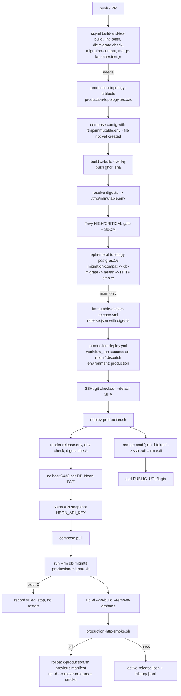
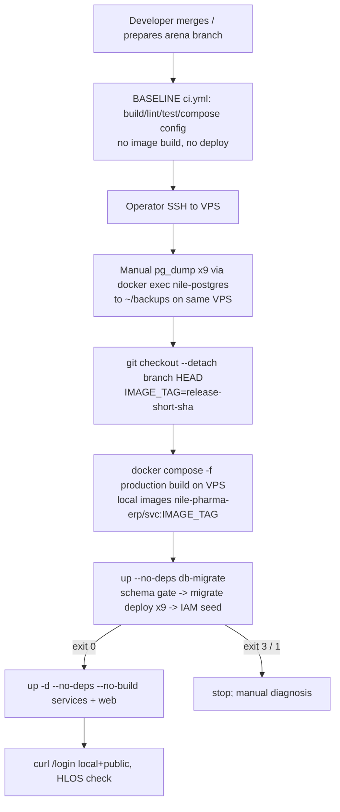
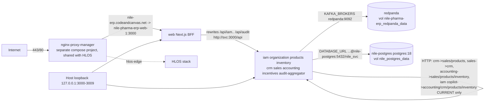
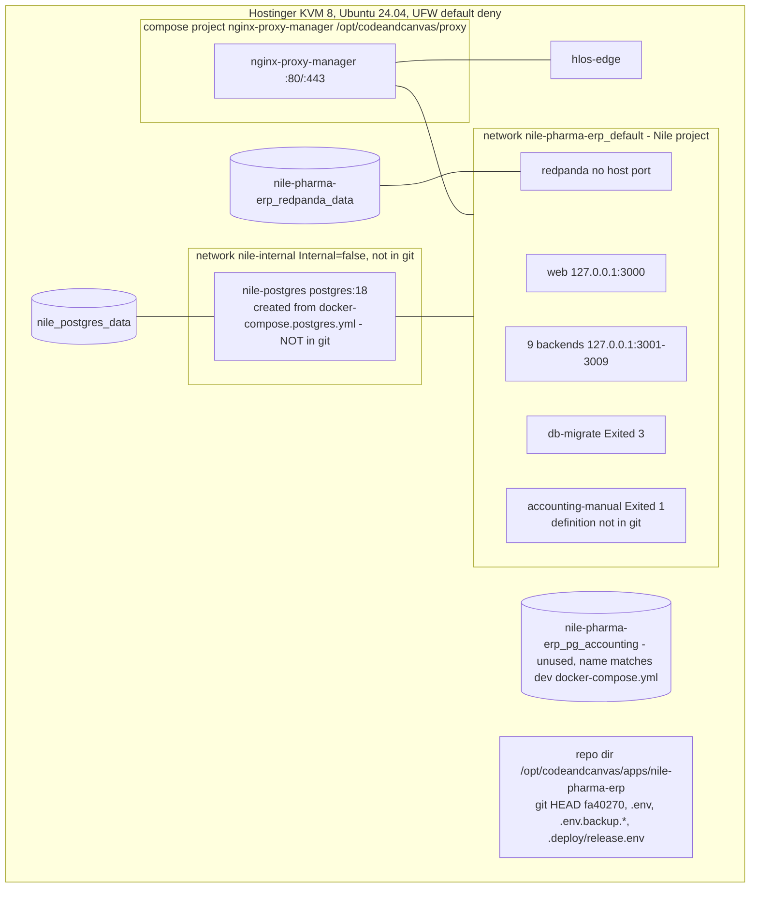

# DEPLOYMENT & OPERATIONS — As-Is audit notes (Nile Pharma ERP)

Snapshots: **BASELINE** = `base/` (89c2c31, candidate production source; images tagged `release-89c2c31`, image→commit NOT proven) · **CURRENT** = `cur/` (fa40270, main HEAD, NOT deployed).
Runtime evidence: `evidence/runtime.txt` (accounting container only), `evidence/git-and-schema.txt`, `evidence/accounting-migration-history.txt`; user observations `docx.txt` (secondary, no raw output).
Method: static reading only. One exception: `node scripts/validate-schema-migrations.cjs` (pure file parser, no DB, no writes — verified by grep for write calls) and `node --check` (parse only) were executed on both snapshots.
No secrets copied. CI/dev files contain only literal CI/dev placeholder credentials (e.g. `postgres:postgres`, `admin:admin`, `dev-access-secret-…`) — names cited, values not reproduced.

---

## 1. Scope / coverage matrix

| Item | Coverage | Notes |
|---|---|---|
| `docker-compose.production.yml` BASELINE vs CURRENT | Full | full diff done |
| `docker-compose.yml` (dev), `docker-compose.smoke.yml` | Full | identical in both snapshots |
| `docker-compose.ci-build.yml`, `docker-compose.ci-production.yml` | Full | CURRENT only |
| `docker-compose.postgres.yml` | Not available | not in git at either commit (confirmed: no file, no reference in repo) |
| Dockerfiles (11 apps incl. web, redpanda) | Full | diffs base→cur: only `export-kit` build line added in 7 backends |
| `.github/workflows/*` | Full | BASELINE: `ci.yml` only; CURRENT: `ci.yml`, `immutable-docker-release.yml`, `production-deploy.yml` |
| Deploy/migration scripts (`production-migrate.sh`, `deploy-production.sh`, `rollback-production.sh`, `render-release-env.cjs`, `production-http-smoke.sh`, `check-production-env.sh`, `make-production-env.sh`, `validate-schema-migrations.cjs`, `validate-migration-compatibility.cjs`, `deploy-migrations.cjs`, `check-migrations.cjs`, `verify-migrations-pg.cjs`, `backup-nightly.sh`, `dr-restore-drill-vps.sh`, `production-topology.test.cjs`, `merge-launcher.test.js` (contract parts)) | Full / Partial | `verify-migrations-pg.cjs`, `dr-backup-restore-drill.cjs` (888 lines), `affected-deployables.cjs` read partially (headers, git usage) |
| `setup-env.sh`, `check_schema_fix.sh`, `generate-prisma.cjs` | Not reviewed in depth | identical in both; dev-time helpers, not on prod path |
| Env templates `.env.example`, `.env.example.local`, `.env.production.example` | Full (names only) | values confirmed to be placeholders, not printed |
| Config loading (`apps/*/src/config/env.ts`, PrismaService) | Partial | DB-URL precedence checked for all 9; other vars not |
| `deploy/nginx`, `deploy/npm` | Partial | identical in both; reference config + diagnostics script |
| Docs: PRODUCTION-HOSTINGER, OPERATIONS-RUNBOOK, SAFE-DEPLOY-AR, PRODUCTION-LAST-MILE (CURRENT only), DISASTER-RECOVERY-DRILL-REPORT, dr-evidence.json, runbooks/*, SHARED-PROXY-NETWORKS-AR, SERVER-STEPS-2026-09-25-ar, PRODUCTION-UPDATE-2026-09-20-ar, PRODUCTION-DEPLOY-COMBINED-2026-09-24-ar, PRODUCTION-READINESS-P0 (backup rows) | Full / Partial | all identical between snapshots except PRODUCTION-LAST-MILE (new) |
| Runtime: all containers' labels/images/networks | Partial | only `accounting` container inspected in raw evidence; rest from docx (secondary) |
| GitHub-side settings (environment protection, repo variables, run history) | Not available | outside repo |
| NPM proxy config (`/data/nginx/proxy_host/4.conf`) | Not available | only docx description |

---

## 2. Inventory & responsibilities

### 2.1 Compose services (production file)

| Service | BASELINE image | CURRENT image | Ports (host) | depends_on | restart | healthcheck |
|---|---|---|---|---|---|---|
| redpanda | `${REDPANDA_IMAGE:-redpandadata/redpanda:v26.1.14}` (base:133) | `${REDPANDA_IMAGE:?…}` required (cur:136) | none | — | unless-stopped | `rpk cluster health` |
| db-migrate | build `apps/iam/Dockerfile`, `nile-pharma-erp/migrate:${IMAGE_TAG:-prod}` (base:176-180) | `${MIGRATE_IMAGE:?…}` (cur:180) | none | — | `"no"` | none |
| iam … audit-aggregator (9) | build `apps/<svc>/Dockerfile`, `nile-pharma-erp/<svc>:${IMAGE_TAG:-prod}` | `${<SVC>_IMAGE:?…}` (digest expected, cur:214-331) | `${BACKEND_BIND_IP:-127.0.0.1}:300{1..9}:3000` | db-migrate `service_completed_successfully`, redpanda `service_healthy` (base:111-115, cur:114-118) | unless-stopped | `node -e fetch('http://127.0.0.1:3000/health')` 30s/5s/3, start 60s |
| web | build `apps/web/Dockerfile` + 9 `*_URL` build args (base:383-396) | `${WEB_IMAGE:?…}` (cur:365) | `127.0.0.1:3000:3000` | 9 backends `service_started` | unless-stopped | fetch `/login` |

Common to both (Verified): `init: true`, `security_opt: no-new-privileges:true`, `stop_grace_period: 30s`, logging `json-file` max-size 20m × 5 (base:90-94 / cur:93-97), `command: ["node","dist/main.js"]` overriding Dockerfile CMD (base:110 / cur:113). **No** `networks:` block (default network `nile-pharma-erp_default`), **no** resource limits (`mem_limit`/`cpus`/`deploy.resources` absent — grep), **no** postgres service, **no** `env_file:` key (all env via `${VAR}` interpolation from `--env-file`/`.env`). Only named volume: `redpanda_data` (→ runtime `nile-pharma-erp_redpanda_data`). `name: nile-pharma-erp` is load-bearing (proxy attaches to `nile-pharma-erp_default` as external).

CURRENT-only additions: IAM gets `ACCOUNTING_INTERNAL_URL`, `CRM_INTERNAL_URL`, `PRODUCTS_INTERNAL_URL`, `INVENTORY_INTERNAL_URL` (cur:228-231); all `build:` blocks removed (artifact-only); comments still say "Neon direct connection string" on every `*_DATABASE_URL`.

### 2.2 Other compose files
- `docker-compose.yml` (dev, identical both): 9 × `postgres:16` (`postgres-iam`, `-org`, `-audit`, `-products`, `-inventory`, `-crm`, `-sales`, `-accounting`, `-incentives`) with host ports **5432-5440 on all interfaces**, literal dev credentials, redpanda publishes `9092:9092`, services built locally; crm/accounting/incentives/audit-aggregator commands run `npx prisma migrate deploy && node dist/main.js` (cur/docker-compose.yml:190,239,272,289). Volumes `pg_iam … pg_incentives` incl. **`pg_accounting`** (line ~313). No `name:` → project name = directory basename.
- `docker-compose.smoke.yml` (identical): overrides accounting command only.
- `docker-compose.ci-build.yml` (CURRENT): re-adds `build:` for 11 services, `image: ${X_IMAGE}`.
- `docker-compose.ci-production.yml` (CURRENT): adds `postgres: postgres:16` (CI-only literal creds), init SQL `scripts/ci-production-topology-init.sql`, `migration-compat` (node:20-bookworm-slim + apt git + `validate-migration-compatibility.cjs`), db-migrate depends on postgres/redpanda/migration-compat.

### 2.3 Dockerfiles (Verified, both snapshots near-identical)
- Base images: `node:20-slim` builder + runner (tag, not digest); pnpm via corepack `pnpm@9.1.0`; `apt-get install openssl`.
- Multi-stage in name only: runner does `COPY --from=builder /app ./` — full monorepo incl. all sources, devDependencies, `scripts/`, other services' builds (e.g. accounting image also builds products; crm builds sales; incentives builds inventory).
- `prisma generate` per service in builder (e.g. `cur/apps/accounting/Dockerfile:17,19`).
- **No `USER`** directive (grep) → processes run as root. No `HEALTHCHECK` in Dockerfiles (compose supplies it).
- Default `CMD ["sh","-c","npx prisma migrate deploy && exec node dist/main.js"]` in all 9 backends (e.g. `cur/apps/accounting/Dockerfile:29`) — overridden by production compose, but any container run outside compose migrates its DB at startup.
- web: build-time rewrite targets baked into `.next/routes-manifest.json`, with build-time assertion of 9 non-localhost rewrites (`cur/apps/web/Dockerfile:61-66`); `next start` as root.
- `apps/redpanda/Dockerfile` `FROM redpandadata/redpanda:latest` — not referenced by any compose/CI (dead).
- `.dockerignore` excludes `.env*`, node_modules, dist, tsbuildinfo; does **not** exclude `Data/` (sent in build context, but not COPYed since Dockerfiles copy only apps/packages/scripts).
- BASELINE→CURRENT: only `RUN pnpm --filter @nile/export-kit build` added to 7 backends (package `export-kit` is new in CURRENT).

### 2.4 CI/CD workflows
| Workflow | BASELINE | CURRENT |
|---|---|---|
| `ci.yml` jobs | build-and-test, audit-e2e, web-auth-e2e, smoke-test, docs-and-hygiene | same + `production-topology-artifacts` + `release-manifest` (calls reusable workflow) |
| Build gate | `pnpm build`, lint, turbo test, audit PG gate, SQL phase tests, DR drill on synthetic DB, `merge-launcher.test.js`, `docker compose config` of prod file | + dependency-graph, `db:migrate:check`, migration-compat gate, accounting/inventory P0 gates |
| Image build/publish | none (comment: "deploys stay manual (web on Vercel …)" base ci.yml:8-14) | build via ci-build overlay, push `ghcr.io/<owner>/nile-pharma-erp/<svc>:<sha>`, resolve digests, Trivy HIGH/CRITICAL `--exit-code 1`, CycloneDX SBOM (not uploaded as artifact), ephemeral topology up + health + HTTP smoke |
| Release | none | `immutable-docker-release.yml`: pull by sha tag, record digests into `release/release.json`, upload artifact |
| Deploy | none (manual SSH runbooks) | `production-deploy.yml`: on `workflow_run` CI success on main or manual dispatch; `environment: production`; SSH + scp manifest & GHCR token; server `git fetch --depth=1 && git checkout --detach SHA`; `./scripts/deploy-production.sh`; external `/login` curl |

### 2.5 Deploy/migration scripts (CURRENT; BASELINE has the subset marked *)
- `production-migrate.sh`* (identical both): pooled-host refusal (exit 2) → `validate-schema-migrations.cjs` gate (**exit 3** on refusal, line 95-100) → sequential `prisma migrate deploy` iam→organization→products→inventory→crm→sales→accounting→incentives→audit → `prisma db seed` IAM when `RUN_IAM_SEED=true` (default).
- `deploy-production.sh` (CURRENT only): lock → render release.env from manifest → env checker → compose config → GHCR login → digest checks → per-DB `nc -z host 5432` "Neon TCP" → requires previous `active-release.json` or `ALLOW_FIRST_DEPLOY=true` → **mandatory Neon snapshot via Neon API** (`NEON_API_KEY/PROJECT_ID/BRANCH_ID`) → pull → `run --rm db-migrate` → `up -d --no-build --remove-orphans` → `production-http-smoke.sh` → write active manifest + `deployment-history.jsonl`; ERR trap → rollback after rollout.
- `rollback-production.sh`: render previous manifest → pull → `up -d --no-build --remove-orphans` → smoke.
- `render-release-env.cjs`: manifest → `<SVC>_IMAGE=ghcr.io/3boalazm/nile-pharma-erp/<svc>@sha256:…` (default registry hardcoded line 41).
- `production-http-smoke.sh`: public `/login`, then per-service health via `docker compose -f docker-compose.production.yml ps -q` (no env files), then `127.0.0.1:3001-3009/health`.
- `check-production-env.sh`* / `make-production-env.sh`*: name-only checks (required vars, FILL-ME, dev secrets, length ≥43, distinctness, URL shape, CORS https, mode 600); warns when no `sslmode=require` ("Neon needs TLS").
- `deploy-migrations.cjs`* (`pnpm db:migrate:deploy`): dev/operator helper; per service uses `process.env[<SVC>_DATABASE_URL] || process.env.DATABASE_URL` (line ~55).
- `validate-migration-compatibility.cjs` (CURRENT): regex block of DROP TABLE/COLUMN, TRUNCATE, DROP VALUE, RENAME COLUMN, SET NOT NULL in **changed** migration files between `--base…--head`; marker `-- @nile-compat: reviewed-destructive` bypasses.
- `backup-nightly.sh`* / `dr-restore-drill-vps.sh`* / `dr-backup-restore-drill.cjs`*: see §4.4.

### 2.6 Config loading (Verified)
- Each service `apps/<svc>/src/config/env.ts` loads dotenv files from cwd and `../..` (`.env.test.local`, `.env.local`, `.env.<NODE_ENV>`, `.env`), then `resolveEnv('<SVC>_DATABASE_URL','DATABASE_URL')` (e.g. `cur/apps/accounting/src/config/env.ts:57`) — fail-fast at import if neither set.
- Prisma datasources all `url = env("DATABASE_URL")` (all 9 schema.prisma). Only IAM and Organization pass `env.databaseUrl` into PrismaClient (and switch to `PrismaNeon` adapter when host matches `neon.tech`, `cur/apps/iam/src/prisma/prisma.service.ts:24-28`); the other 7 (e.g. `cur/apps/accounting/src/prisma/prisma.service.ts`) use bare `PrismaClient` → `DATABASE_URL` only; `env.databaseUrl` is computed but unused.
- In production compose each service receives only `DATABASE_URL` (no `<SVC>_DATABASE_URL`), so both paths agree there. Runtime confirms accounting `DATABASE_URL=…@nile-postgres:5432/nile_accounting` (runtime.txt).
- `packages/config/index.js` is a stub (`module.exports = { extends: [] }`) — no shared config/validation module.
- Production CORS fallback (when `CORS_ORIGINS` unset) = `https://nile-pharma-food-erp.vercel.app` (accounting env.ts:22) — but compose makes `CORS_ORIGINS` mandatory.

---

## 3. How it works

### 3.1 BASELINE-era release (documented manual path; matches runtime labels)
Source: `docs/SERVER-STEPS-2026-09-25-ar.md` (identical in both snapshots), `docs/PRODUCTION-DEPLOY-COMBINED-2026-09-24-ar.md`.
1. Manual backup: `docker exec -u postgres nile-postgres pg_dump -Fc` × 9 DBs → `~/backups/nile/<stamp>` on the VPS + `pg_restore --list` + SHA256SUMS; copy off-host by operator rsync (manual, optional) (COMBINED §1).
2. `git fetch origin arena/01a0d00e-nile-pharma-erp && git checkout --detach FETCH_HEAD`; `export IMAGE_TAG=release-$(git rev-parse --short HEAD)` (SERVER-STEPS §2) — this is the convention that yields `release-89c2c31`.
3. `docker compose -f docker-compose.production.yml build` on the VPS.
4. `up --no-deps --no-build --exit-code-from db-migrate db-migrate`, then `up -d --no-deps --no-build <9 services + web>` — "--no-deps" used so redpanda is not recreated (SERVER-STEPS line 9). Rules: no `down`, no `--remove-orphans`, no `-p`.
5. Verify `/login` local + public, HLOS health, NPM networks; optional `dr-restore-drill-vps.sh`.
6. Rollback = checkout previous commit + previous IMAGE_TAG + same `up --no-deps` (no DB rollback).

### 3.2 CURRENT designed pipeline (code; never observed to have run against production)

Blocking points found statically are listed in findings DEPLOY-04/05/08/09.

### 3.3 BASELINE-era flow (diagram)

### 3.4 Migration execution (both snapshots)
- Where: only in the `db-migrate` one-shot container (image built from `apps/iam/Dockerfile`, which COPYs `scripts/` and the whole monorepo), command `sh /app/scripts/production-migrate.sh`.
- Which DBs: all 9 via `*_DATABASE_URL` (base:190-198 / cur:190-198), plus IAM seed.
- Ordering: compose `depends_on: db-migrate: service_completed_successfully` on all 9 backends → with a plain `up`, no backend starts unless db-migrate exits 0. In practice the BASELINE-era runbook uses `--no-deps`, bypassing this (and runtime accounting label `com.docker.compose.depends_on:""` is consistent with `--no-deps`).
- Gate: `validate-schema-migrations.cjs` must pass for **all** services before **any** `migrate deploy` → exit 3.
  - BASELINE result (executed): ✅ all services pass.
  - CURRENT result (executed): ❌ accounting — 22 issues (14 "extra column" e.g. `journal_entries.entry_number`, `journal_lines.cost_center_id`, `supplier_payments.vendor_invoice_id`; 5 missing FKs e.g. `bank_statement_lines(statement_id) → bank_statements`; 3 missing unique). Exit code 1 → production-migrate.sh exit 3.
- Runtime: `nile-pharma-erp-db-migrate-1 Exited (3)` (docx) == schema-gate refusal signature. Because BASELINE passes the gate, the db-migrate container that exited 3 must have contained post-89c2c31 migration files (Inferred, strong).

### 3.5 Runtime connectivity (from runtime.txt + docx + compose)

### 3.6 Deployment architecture (as evidenced)

---

## 4. Operational processes found

### 4.1 Release / deploy
- BASELINE era: **manual**, host-built, `--no-deps` sequencing, operator-driven backup (§3.1). Status: *Partial* — works when gates pass; no audit trail other than shell history; image identity = mutable local tag.
- CURRENT: **designed automated**, digest-pinned, approval via GitHub environment (configuration Unknown). Status: *Absent in practice* — static defects block it end-to-end (DEPLOY-04/05/09) and it assumes Neon (DEPLOY-02).
- Actual last rollout: neither. Accounting container was created with env files `.env,/tmp/nile-recovery-release.env` (runtime.txt COMPOSE LABELS), not `.deploy/release.env` (deploy-production.sh:12) → an undocumented manual "recovery" release (Verified mismatch; procedure Unknown).

### 4.2 Migrations — see §3.4. Manual interventions evidenced: `_prisma_migrations` rows for `20260927120000_general_ledger` and `20260927143000_supplier_payments` rolled back then re-recorded applied with `applied_steps_count=0` (docx) → `prisma migrate resolve --applied` (or equivalent) run manually; no runbook in repo authorises it. These two migrations do not exist in BASELINE (`base/apps/accounting/prisma/migrations` ends at `20260924120000_po_workflow_and_match_sod`) → production accounting DB schema is ahead of the 89c2c31 code (Inferred from docx; evidence request E3).

### 4.3 Rollback
- BASELINE: previous IMAGE_TAG re-up (only works while the old local image still exists; nothing pins it).
- CURRENT: `rollback-production.sh` by previous manifest digest; DB never rolled back (by design); requires `.deploy/active-release.json` (Unknown on server).

### 4.4 Backup / restore / DR
- Automated backup job: **none evidenced**. `backup-nightly.sh` exists (both snapshots) but is "specified but not yet deployed" — `docs/PRODUCTION-READINESS-P0.md:104,181` (INFRA-BACKUP-2 OPEN). It also cannot work as written on this host (DEPLOY-07).
- DR runbook primary = "Neon PITR" (`docs/runbooks/disaster-recovery.md:23,53` "Neon PITR alone is the current real coverage") → not applicable to `nile-postgres`.
- Manual pre-deploy backups: `docker exec nile-postgres pg_dump` into `~/backups` on the same VPS (COMBINED §1; UPDATE-2026-09-20 §3 confirms host has no `pg_dump`).
- DR drill evidence: `docs/dr-evidence.json` — 2 drills, 2026-09-23, **synthetic fixtures** on `127.0.0.1:55432` (accounting 33 tables/647 rows; audit 4/40) — not production, 2 of 9 DBs. Earlier report was fabricated (self-declared, DISASTER-RECOVERY-DRILL-REPORT.md:3-9). VPS drill script `dr-restore-drill-vps.sh` exists (correctly targets `nile-postgres`); no report of a run in repo (INFRA-BACKUP-3 OPEN).
- CI runs a DR drill on synthetic accounting data each push (base ci.yml:130-138) — proves the script, not production recoverability.

### 4.5 Monitoring / alerting
- No monitoring stack (`docs/runbooks/alerts-and-metrics.md:4` "There is no Prometheus/Grafana stack"); alerts are *defined* (signals, thresholds), not wired. `SENTRY_DSN` default empty in compose and template. Docker healthchecks exist but nothing restarts unhealthy containers (`restart: unless-stopped` acts on exit only). Backup dead-man's switch depends on the uninstalled cron.

### 4.6 Secrets / config
- `.env` on host (mode 600 expected); generated partly by `make-production-env.sh` (JWT_ACCESS_SECRET, JWT_REFRESH_SECRET, EVENT_SIGNATURE_PEPPER generated; SIGNATURE_PEPPER must be recovered, never regenerated). Server also has untracked `.env.backup.20260927-130337` and `.deploy/release.env` (git-and-schema.txt:8-9). Rotation: manual runbook (`OPERATIONS-RUNBOOK.md` "JWT secret rotation") — assumes dual-secret acceptance capability, not verified here.
- CURRENT deploy needs additional server file `/etc/nile-pharma/deploy.env` (Neon API creds) + GitHub secrets `PRODUCTION_SSH_*`, `PRODUCTION_GHCR_TOKEN`.

### 4.7 Operations responsibility matrix (as evidenced)

| Activity | BASELINE era (who/what) | CURRENT design | Evidence of actually happening | Gap |
|---|---|---|---|---|
| Build images | Operator on VPS (`compose build`) | GitHub Actions → GHCR | Local tags `nile-pharma-erp/<svc>:release-89c2c31` on host | CURRENT pipeline blocked; tag→commit unprovable |
| Test gate | GitHub CI (no image) | CI + topology + Trivy | none in evidence | CURRENT CI red by static analysis |
| Approve release | Operator judgement | GitHub `production` environment reviewers (not in repo) | Unknown | approval config unverified |
| Deploy | Operator SSH, `--no-deps` | `deploy-production.sh` via SSH | Manual recovery with `/tmp/nile-recovery-release.env` | undocumented recovery procedure |
| Migrate | db-migrate one-shot | same, via `run --rm` | db-migrate Exited 3; manual resolve of 2 accounting migrations | migration authority/runbook for resolve absent |
| Pre-migration backup | Operator pg_dump to same VPS | Neon snapshot (wrong target) | Unknown (folder names not in evidence) | no off-host guarantee; CURRENT protects wrong DB |
| Scheduled backup | — | `backup-nightly.sh` (not installed) | none | **no automated backup** |
| Restore drill | `dr-restore-drill-vps.sh` (manual) | same | only synthetic CI/local drills | no production restore evidence |
| Monitor/alert | manual curl / logs | defined in runbook only | none | no alerting |
| Rotate secrets | manual runbook | manual | Unknown | no schedule/owner |
| Proxy (NPM) | shared with HLOS team, config in NPM DB | same | proxy_host/4.conf → web only (docx) | NPM config not in git |
| Postgres lifecycle | out-of-repo compose file | not modelled (assumes Neon) | `nile-postgres` running | definition missing from git |

---

## 5. BASELINE vs CURRENT differences (deploy/ops area)

| Aspect | BASELINE 89c2c31 | CURRENT fa40270 |
|---|---|---|
| Prod compose images | built locally, `nile-pharma-erp/<svc>:${IMAGE_TAG:-prod}` (mutable, default `prod`) | artifact-only, `${<SVC>_IMAGE:?}` digest refs; `MIGRATE_IMAGE` separate var |
| Redpanda image | default pinned tag `v26.1.14` if unset | required var (must be digest per runner) |
| IAM env | — | +4 `*_INTERNAL_URL` for Copilot tools |
| CI | test-only, no images | + GHCR publish, Trivy, SBOM, topology, release manifest, deploy workflow |
| Deploy scripts | none (manual docs) | `deploy-production.sh`, `rollback-production.sh`, `render-release-env.cjs`, `production-http-smoke.sh` |
| CI-only compose | none | `ci-build`, `ci-production` |
| Dockerfiles | — | + `export-kit` build step (7 backends) |
| Schema gate result (executed) | PASS all 9 | FAIL accounting (22 issues) |
| Docs | PRODUCTION-HOSTINGER/runbooks (Neon) | same files unchanged + PRODUCTION-LAST-MILE (Neon) |
| Unchanged | `production-migrate.sh`, `backup-nightly.sh`, DR scripts, env checker, dev & smoke compose, deploy/nginx, deploy/npm, `.dockerignore` | — |

---

## 6. Findings

**DEPLOY-01 — Production PostgreSQL is defined outside git (missing `docker-compose.postgres.yml`)**
- Domain: Infra/DR · Affected: BOTH · Verification: Verified (repo) + user-reported runtime
- Type: Operational uncertainty / Potential risk · Severity: **High** — the system of record (9 DBs, PG18, volume `nile_postgres_data`, network `nile-internal`) cannot be recreated from source; no outage today.
- Evidence: no `docker-compose.postgres.yml`, `nile-internal`, `nile_postgres_data` anywhere in `base/` or `cur/` (grep); runtime label `com.docker.compose.project.config_files` for app services lists only `docker-compose.production.yml` (runtime.txt); docx: nile-postgres created from the missing file. Docs contradict runtime: `cur/docs/PRODUCTION-HOSTINGER.md:74` "No PostgreSQL runs on the VPS"; `cur/scripts/merge-launcher.test.js:109-110` asserts "production talks to Neon, never a local postgres container"; `docs/audit/2026-09-18-branches-deploy-review-ar.md:192` already flagged it.
- Trigger: host loss / rebuild / PG upgrade. Impact: undocumented DB image, credentials bootstrap, init SQL, network, volume; DR RTO unknown.
- To close: recover the file (or `docker inspect nile-postgres` → reconstruct), commit a sanitized definition; reconcile docs/tests.

**DEPLOY-02 — CURRENT deployment tooling assumes Neon; production uses local `nile-postgres` (PG18)**
- Domain: Deploy/DR · Affected: CURRENT (comments/docs also BASELINE) · Verification: Verified (code) / Inferred (runtime effect)
- Type: Confirmed defect (design mismatch) · Severity: **High** — the "mandatory pre-migration restore point" would protect a non-production database or block deploys.
- Evidence: `cur/scripts/deploy-production.sh:72-80` (`nc -z "$host" 5432 || fail "Neon TCP 5432 unreachable"` — host parsed from URL = `nile-postgres`, a Docker-DNS name not resolvable from the host shell); `:94-110` Neon API snapshot required (`NEON_API_KEY`, `NEON_PROJECT_ID`, `NEON_BRANCH_ID`); `cur/docs/PRODUCTION-LAST-MILE.md` host prerequisites "direct Neon database URLs"; `cur/.github/workflows/ci.yml` (topology job) parity gate requires `vars.NEON_POSTGRES_MAJOR_VERSION == 16`; `check-production-env.sh:122-123` warns without `sslmode=require`; compose comments "Neon direct connection string" on every DB var (cur:190-198). Runtime: `DATABASE_URL=…@nile-postgres:5432/nile_accounting` (runtime.txt).
- Trigger: running the CURRENT deploy on this server. Impact: deploy fails closed at nc (Inferred), or—if Neon vars and an `/etc/hosts` workaround exist—migrates `nile-postgres` with only a Neon snapshot of something else as "backup".
- To close: decide target DB platform; replace Neon snapshot with `pg_dump`/volume snapshot of `nile-postgres`; run nc inside the Docker network; set parity to 18.

**DEPLOY-03 — `--remove-orphans` in automated deploy/rollback can delete project-labelled containers (incl. possibly `nile-postgres`)**
- Domain: Deploy · Affected: CURRENT · Verification: Verified (code) / Inferred (nile-postgres label)
- Type: Potential risk · Severity: **High** — if `nile-postgres` carries project label `nile-pharma-erp` (docx: `docker compose ls` reported the project using `docker-compose.postgres.yml`), `up --remove-orphans` from a file without that service removes the DB container (data volume survives) → full outage, and rollback repeats it.
- Evidence: `cur/scripts/deploy-production.sh:140`, `cur/scripts/rollback-production.sh:20`; forbidden by `cur/docs/OPERATIONS-RUNBOOK.md:9` ("`--remove-orphans` — is a two-team change"), `SERVER-STEPS-2026-09-25-ar.md:7` ("ممنوع --remove-orphans"), `SHARED-PROXY-NETWORKS-AR.md:151`.
- To verify: `docker inspect -f '{{index .Config.Labels "com.docker.compose.project"}} {{index .Config.Labels "com.docker.compose.service"}}' nile-postgres nile-pharma-erp-accounting-manual`.

**DEPLOY-04 — CURRENT CI/release pipeline cannot complete (static defects)**
- Domain: CI/CD · Affected: CURRENT · Verification: Verified (a,b,c) / Inferred (d,e)
- Type: Confirmed defect · Severity: **High** — the only automated release path in CURRENT cannot produce a release manifest, so every release is forced back to manual/recovery procedures (which is how today's drift arose).
- Evidence:
  a) `cur/scripts/production-topology.test.cjs:26` literal `\n` outside a string → `SyntaxError` (`node --check` executed) — first step of `production-topology-artifacts`; it also asserts `/IMAGE_TAG:\?IMAGE_TAG is required/` (line 10) which CURRENT compose no longer contains.
  b) `cur/scripts/merge-launcher.test.js:105` asserts `dockerfile: apps/<svc>/Dockerfile` and `:442` web build `args:` in production compose — both removed in CURRENT (artifact-only) → "Deployment contract tests" step in build-and-test fails.
  c) `pnpm db:migrate:check` (ci.yml build-and-test) fails for accounting (executed, 22 issues).
  d) "Render immutable production contract" step uses `--env-file /tmp/immutable.env` before the "Resolve exact immutable digests" step creates it (ci.yml production-topology-artifacts).
  e) `actions/checkout@v4` default depth 1 while `affected-deployables.cjs` / `validate-migration-compatibility.cjs` run `git diff base...head` (and the `migration-compat` container runs git on a read-only bind mount owned by another uid) — likely "bad revision"/"dubious ownership".
- To close: fix tests to current topology; fix accounting drift; reorder steps; `fetch-depth: 0`; obtain GitHub Actions run history for fa40270.

**DEPLOY-05 — `db-migrate Exited (3)` = schema-gate refusal; CURRENT migrate image blocks the whole fleet**
- Domain: Migrations · Affected: CURRENT (runtime container) · Verification: Verified (exit-code mapping + executed gate) / Inferred (which image ran)
- Type: Confirmed defect · Severity: **High** — with a standard `up`, all 9 backends wait on `service_completed_successfully`; exit 3 means zero migrations applied anywhere and no service starts.
- Evidence: `production-migrate.sh:95-100` (only exit-3 path); executed validator: BASELINE ✅, CURRENT ❌ accounting; compose `depends_on` base:111-115 / cur:114-118; docx "db-migrate-1 → exit=3" and checker reporting `journal_entries.entry_number`, `bank_statements`, `import_shipments`.
- Impact: a db-migrate built from post-baseline code was run on production (those columns exist only after 89c2c31). To verify: E1.

**DEPLOY-06 — Running production is not reproducible from any documented pipeline; DB schema ahead of image code**
- Domain: Release provenance · Affected: BOTH · Verification: Verified (labels vs scripts) / Inferred (sequence)
- Type: Operational uncertainty · Severity: **High** — finance DB (`nile_accounting`) carries migrations absent from 89c2c31, two of them recorded applied with 0 steps; running image identity rests on a mutable local tag.
- Evidence: runtime.txt: env files `/opt/…/.env,/tmp/nile-recovery-release.env` (≠ `.deploy/release.env` used by `deploy-production.sh:12`); `com.docker.compose.depends_on:""` (compose files declare db-migrate+redpanda deps → consistent with `--no-deps`); image `nile-pharma-erp/accounting:release-89c2c31` (local name, not GHCR digest that CURRENT requires); `com.docker.compose.image` sha256:7dd5c9… ≠ container image_id sha256:0b814f… (unexplained, see Q5); container created 2026-09-29T19:28 (3 days after 89c2c31 dated 2026-09-26). Accounting migrations 20260927…–20260928210000 exist only in CURRENT (`ls` both snapshots) but applied in prod per docx.
- To verify: E1–E5.

**DEPLOY-07 — No working automated backup of the real production database; DR evidence is synthetic**
- Domain: DR · Affected: BOTH · Verification: Verified (repo/docs) / Unknown (host cron)
- Type: Potential risk · Severity: **High** — only manual, same-host dumps are evidenced for a single PG18 instance holding all 9 DBs.
- Evidence: `docs/PRODUCTION-READINESS-P0.md:104,181` INFRA-BACKUP-2 "OPEN — NEEDS PRODUCTION OPERATION"; `backup-nightly.sh:47` requires host `pg_dump` but `PRODUCTION-UPDATE-2026-09-20-ar.md:116` says host has none; script dumps `*_DATABASE_URL` which point to `nile-postgres` (resolvable only inside Docker); cron path `/opt/nile-pharma-erp/…` (`backup-nightly.sh:12`) ≠ real `/opt/codeandcanvas/apps/nile-pharma-erp`; off-host copy optional (`:83-90`); DR runbook relies on Neon PITR (`runbooks/disaster-recovery.md:23,53`); `dr-evidence.json` = synthetic, local, 2 DBs; INFRA-BACKUP-3 full drill OPEN.
- To verify: E6.

**DEPLOY-08 — Deploy workflow masks remote deployment failure**
- Domain: CI/CD · Affected: CURRENT · Verification: Verified (shell semantics)
- Type: Confirmed defect · Severity: **Medium** — a failed/rolled-back deploy is reported green; the follow-up external `/login` check passes on the old version.
- Evidence: `cur/.github/workflows/production-deploy.yml:175` `"… ./scripts/deploy-production.sh '…'; rm -f '/tmp/nile-pharma-ghcr-token-$SHA'"` — remote exit status = `rm -f` (0).
- To close: `trap 'rm -f …' EXIT; ./scripts/deploy-production.sh …`.

**DEPLOY-09 — Post-deploy smoke cannot resolve compose project → forced rollback, then rollback-failed**
- Domain: Deploy · Affected: CURRENT · Verification: Inferred (Compose interpolation behaviour)
- Type: Potential defect · Severity: **Medium**
- Evidence: `cur/scripts/production-http-smoke.sh:17` `docker compose -f docker-compose.production.yml ps -q` with no `--env-file`; `*_IMAGE` variables live only in `.deploy/release.env`/`rollback.env` and are `${VAR:?}`-required (cur:180-365) → interpolation error unless `.env` also defines them; deploy ERR trap → rollback → same smoke.
- To verify: on a staging host, run the smoke after a rendered release.

**DEPLOY-10 — Production approval and first-deploy behaviour depend on unversioned settings**
- Domain: CI/CD governance · Affected: CURRENT · Verification: Unknown
- Type: Question · Severity: **Medium** — `production-deploy.yml` auto-fires on every successful CI run on main (`:72-88`); the only human gate is GitHub `environment: production` protection (PRODUCTION-LAST-MILE "Configure required reviewers"), not visible in repo. First deploy requires `ALLOW_FIRST_DEPLOY=true` (`deploy-production.sh:84-86`) which the workflow never sets (only possible via `/etc/nile-pharma/deploy.env`).

**DEPLOY-11 — Dev compose is the default compose file in the production directory, same project name**
- Domain: Ops hygiene · Affected: BOTH · Verification: Verified (files) / Inferred (pg_accounting origin)
- Type: Potential risk · Severity: **Medium** — any `docker compose …` without `-f` in `/opt/codeandcanvas/apps/nile-pharma-erp` targets `docker-compose.yml` (9×postgres:16 on `0.0.0.0:5432-5440`, literal dev credentials, redpanda `9092:9092`) under project `nile-pharma-erp` (directory name), able to recreate prod `redpanda` with dev config.
- Evidence: `cur/docker-compose.yml` (no `name:`, ports lines 15, 31…143; volume `pg_accounting`); runtime volume `nile-pharma-erp_pg_accounting` unused (docx) matches `<dir>_pg_accounting`; Compose metadata 5.5.1 same as the app containers.
- To verify: E4.

**DEPLOY-12 — Migration compatibility gate checks the wrong range and ignores edits to applied migrations**
- Domain: Migrations · Affected: CURRENT · Verification: Verified (code)
- Type: Potential risk · Severity: **Medium**
- Evidence: base SHA = `github.event.before` / PR base (ci.yml build-and-test & topology) — not the SHA running in production; `validate-migration-compatibility.cjs:41-43` only pattern-matches changed files and accepts `M` (modified) files without flagging that an already-applied migration was edited; `20260927120000_general_ledger/migration.sql` modified in 6 commits (accounting-migration-history.txt) and recorded applied with 0 steps in prod (docx). Prisma `migrate deploy` does not re-run edited applied migrations → repo SQL ≠ prod DDL.
- To close: gate against `active-release.json` SHA; fail on any modification of a migration directory already in production.

**DEPLOY-13 — PostgreSQL major-version mismatch across environments**
- Domain: Infra · Affected: BOTH · Verification: Verified (code) + user-reported runtime
- Type: Potential risk · Severity: **Medium**
- Evidence: prod `postgres:18` (docx; PRODUCTION-UPDATE-2026-09-20-ar.md:71-72); dev `postgres:16` (docker-compose.yml:26…); CI services `postgres:16` (ci.yml); CI topology `postgres:16` (ci-production.yml:7) and parity gate pinned to 16 vs Neon var; PGlite 18.3 used for migration replay (SAFE-DEPLOY-AR §10). DR VPS drill uses same image as source (OK).

**DEPLOY-14 — Images run as root and ship the whole build tree; default CMD self-migrates**
- Domain: Container security/ops · Affected: BOTH · Verification: Verified
- Type: Improvement / Potential risk · Severity: **Medium** — a `docker run`/`compose run` of any backend image outside the prod file executes `prisma migrate deploy` against whatever `DATABASE_URL` it gets (plausible mechanism for `accounting-manual` exit 1 — Inferred).
- Evidence: no `USER` in any Dockerfile; `COPY --from=builder /app ./`; CMD `npx prisma migrate deploy && exec node dist/main.js` (e.g. `cur/apps/accounting/Dockerfile:26-29`); `node:20-slim` by tag. Mitigations present: `no-new-privileges`, `init`.
- Trivy HIGH/CRITICAL `--exit-code 1` on such fat images is likely to block CURRENT CI (Inferred).

**DEPLOY-15 — `nile-internal` network is not internal and not in git; Postgres dual-homed**
- Domain: Network · Affected: BOTH · Verification: user-reported runtime (docx) / Verified absent in repo
- Type: Improvement · Severity: **Low** — Postgres has no published port; NPM and all Nile services share `nile-pharma-erp_default` with Postgres, so the "internal" network adds no isolation.

**DEPLOY-16 — Documentation drift vs runtime and vs CURRENT compose**
- Domain: Docs · Affected: BOTH · Verification: Verified
- Type: Improvement · Severity: **Low**
- Evidence: PRODUCTION-HOSTINGER.md (unchanged in CURRENT) still instructs host `build` (§5, lines ~464-466, ~500-503) and `IMAGE_TAG` rollback, impossible with artifact-only CURRENT compose; says Neon/no Postgres on VPS; base ci.yml:8-14 "web on Vercel" while web runs in compose (and `apps/web/vercel.json` still present — whether a Vercel deployment is still live is Unknown); DR runbook Neon-centric; deploy/nginx reference config unused (actual NPM config not in git).

**DEPLOY-17 — Inconsistent DB-URL precedence between config validation and Prisma**
- Domain: Config · Affected: BOTH · Verification: Verified
- Type: Potential risk · Severity: **Low** — 7 services validate `<SVC>_DATABASE_URL || DATABASE_URL` but connect with `DATABASE_URL` only; a container given only `ACCOUNTING_DATABASE_URL` (e.g. via `--env-file .env` in a manual run) passes config and then fails/connects elsewhere. `deploy-migrations.cjs` falls back to a single `DATABASE_URL` for all 9 services (cross-DB migration risk on operator machines).
- Evidence: `cur/apps/accounting/src/config/env.ts:57` vs `apps/accounting/src/prisma/prisma.service.ts`; `cur/scripts/deploy-migrations.cjs` (`process.env[svc.envKey] || process.env.DATABASE_URL`).

**DEPLOY-18 — No monitoring/alerting or resource limits**
- Domain: Observability · Affected: BOTH · Verification: Verified (repo) / Unknown (host)
- Type: Improvement · Severity: **Low** — alerts defined on paper only (`alerts-and-metrics.md:4-9`), Sentry DSN default empty, no `mem_limit`/`cpus` (Redpanda ~2 GiB observed), unhealthy containers are not restarted.

**DEPLOY-19 — CI publishes PR-built images to the production registry namespace**
- Domain: Supply chain · Affected: CURRENT · Verification: Verified (code)
- Type: Improvement · Severity: **Low** — `permissions: packages: write` at workflow level and `production-topology-artifacts` has no main-only condition; images `ghcr.io/<owner>/nile-pharma-erp/<svc>:<pr-sha>` pushed for PRs. Release manifest is main-only, so not directly deployable. SBOMs generated but never uploaded.

**DEPLOY-20 — Redpanda image provenance**
- Domain: Infra · Affected: BOTH · Verification: Unknown
- Type: Question · Severity: **Low** — as of 2026-09-25 the prod broker ran from `latest` (SERVER-STEPS §5); BASELINE default `v26.1.14`; CURRENT requires digest in `.env`. Current runtime image unknown (no downgrade allowed).

---

## 7. Open questions & evidence requests

### Questions for the business/ops owner
- Q1. Is the target DB platform local `nile-postgres` (PG18) or Neon? (Determines whether CURRENT deploy/DR tooling or production must change.)
- Q2. Who created `docker-compose.postgres.yml` and `/tmp/nile-recovery-release.env`, when, and what happened on 2026-09-29 (container creation date)? Is there a written incident note?
- Q3. Who authorised the `migrate resolve` of `20260927120000_general_ledger` and `20260927143000_supplier_payments`, and was the DDL applied by hand?
- Q4. Is the GitHub `production` environment configured with required reviewers? Has `production-deploy.yml` ever run?
- Q5. Is there any off-host copy of the `~/backups/nile/*` dumps? Retention? Who owns backups?
- Q6. Is a Vercel deployment of `apps/web` still live (vercel.json, CORS fallback)?
- Q7. Who is on-call / receives alerts? Any external uptime monitor?

### Read-only evidence requests (server)
- E1. `docker inspect nile-pharma-erp-db-migrate-1 --format '{{.Config.Image}} {{.Image}} {{.Created}} {{json .Config.Labels}}'` and `docker logs --tail 80 nile-pharma-erp-db-migrate-1` (check for secrets before sharing).
- E2. For all containers: `docker ps -a --format '{{.Names}}\t{{.Image}}\t{{.Status}}\t{{.Label "com.docker.compose.project"}}\t{{.Label "com.docker.compose.project.config_files"}}\t{{.Label "com.docker.compose.project.environment_file"}}\t{{.Label "com.docker.compose.depends_on"}}'`.
- E3. `docker exec -u postgres nile-postgres psql -U "$POSTGRES_USER" -d nile_accounting -Atc "select migration_name, applied_steps_count, finished_at, rolled_back_at from _prisma_migrations order by started_at"` (metadata only).
- E4. `docker volume inspect nile-pharma-erp_pg_accounting nile_postgres_data` (labels, CreatedAt) and `docker inspect nile-pharma-erp-accounting-manual --format '{{.Config.Image}} {{json .Config.Cmd}} {{.State.ExitCode}} {{.Created}} {{json .Config.Labels}}'` (no env dump).
- E5. `docker image inspect nile-pharma-erp/accounting:release-89c2c31 --format '{{.Id}} {{.Created}} {{json .RepoDigests}}'` plus `docker image ls --digests | grep nile-pharma-erp` — establish when each release-89c2c31 image was built (vs 2026-09-26) and explain label/image_id difference.
- E6. `ls -la /etc/cron.d/ ; crontab -l ; ls -la ~/backups/nile /var/backups/nile 2>/dev/null ; ls /etc/nile-pharma 2>/dev/null` (names only).
- E7. `docker inspect nile-postgres --format '{{.Config.Image}} {{json .Config.Labels}} {{json .HostConfig.RestartPolicy}} {{range .Mounts}}{{.Name}}->{{.Destination}} {{end}}'` and `docker network inspect nile-internal --format '{{.Internal}} {{json .Labels}} {{range .Containers}}{{.Name}} {{end}}'`.
- E8. `ls -la .deploy/ && sed -n '1,40p' .deploy/release.env | cut -d= -f1` (variable names only); `docker inspect nile-pharma-erp-redpanda-1 --format '{{.Config.Image}} {{.Image}}'`.
- E9. GitHub: Actions run list for commits after 89c2c31 (`gh run list --limit 30`), environment `production` protection rules, repo variable `NEON_POSTGRES_MAJOR_VERSION`.
