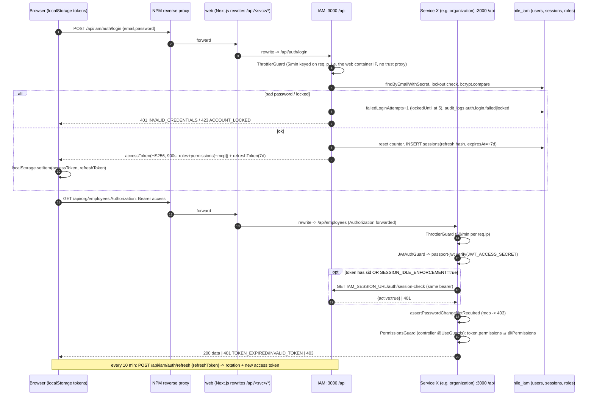
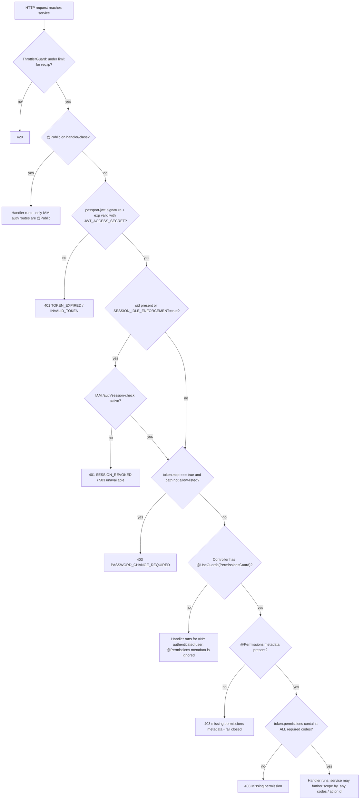

# IAM + ORGANIZATION + cross-cutting SECURITY — As-Is notes

Snapshots: **BASE** = `/home/claude/audit/base` (89c2c31, likely the running images, release-89c2c31 tag; image to commit match not proven). **CUR** = `/home/claude/audit/cur` (fa40270, not deployed). Paths below are relative to the snapshot named. Static reading only: "Verified" means "the code does X", not "production does X".

---

## 1. Scope / coverage matrix

| Item | Coverage | Notes |
|---|---|---|
| IAM login / JWT issuance / refresh rotation / logout / session-check | Full | `apps/iam/src/modules/auth/*` (identical BASE and CUR) |
| IAM sessions table, managed (idle) sessions, SecurityPolicy | Full | `schema.prisma` Session, SecurityPolicy; `workspace.controller.ts` session-policy |
| Password hashing, policy, lockout, rate limiting | Full | |
| MFA | Full (absent) | `users.mfa_enabled` column exists, nothing reads it |
| Roles / permissions catalogue, seeding, anti-escalation | Full | seed BASE vs CUR compared programmatically against every `@Permissions()` |
| SoD module | Full | advisory only |
| E-signatures | Full | |
| Notifications | Partial | ownership scoping and permissions reviewed; channel providers (SMS/WhatsApp) not reviewed in depth |
| AI settings / Copilot / workspace drafts | Partial | secret storage, permission gating and token forwarding reviewed; prompt and workflow engine logic not reviewed |
| Token validation in each backend service | Full | all 9 services' `jwt.strategy.ts`, `permissions.guard.ts`, `app.module.ts`, `main.ts` |
| Endpoints without guards / `@Public` | Full | scripted scan of every `*.controller.ts` in `apps/*/src` (both snapshots) |
| `scripts/validate-controller-permissions.cjs` | Full | |
| Service-to-service auth | Full (HTTP), Partial (Kafka) | Event HMAC (`EVENT_SIGNATURE_PEPPER`) is noted but owned by the events/integration reviewer |
| Multi-tenancy / data scoping | Partial | No tenant model exists. `.any`-permission rep scoping is listed per service, but each service's query logic is not reviewed here (owned by the domain reviewers). |
| Organization: departments, branches, regions, territories, rep coverage, lookups | Partial | endpoints and models reviewed; service logic only skimmed |
| Organization: employees, contracts | Partial | endpoints, permissions and events reviewed; contract renewal math not reviewed |
| Organization: attendance and leaves | Full (workflow) | Egyptian tax/insurance formula only skimmed |
| Organization: expenses, customer gifts | Full (workflow) | |
| Organization: payroll | Full (workflow) | calculation formula only skimmed |
| Web auth (token storage, refresh, BFF routes, CSP) | Partial | `apps/web/lib/api.ts`, `app/login/page.tsx`, `components/topbar.tsx`, `app/api/*/route.ts`, `next.config.js` |
| Secrets committed in repo | Full | scripted scan of committed text files (values never printed) |
| `Data/` folder | Names only | contents not opened, as the brief requires |
| Runtime configuration (actual env values, NPM config, applied migrations for iam/org) | Not reviewed | not in the evidence pack, so evidence requests are listed in §7 |
| `packages/config` | Full | trivial: `module.exports = { extends: [] }` (empty ESLint config stub) |

---

## 2. Inventory & responsibilities

### 2.1 IAM (`apps/iam`, port 3001 to container 3000, DB `nile_iam`)
- **Bootstrap** (`src/main.ts:28-37`): global prefix `api`; `helmet({contentSecurityPolicy:false})`; `ValidationPipe({whitelist:true, transform:true, forbidNonWhitelisted:true})`; `enableCors({origin: env.corsOrigins})`. Health is registered on the raw adapter at `/health` and `/health/details`, outside `/api` and without auth (`src/common/health.ts:105,116`).
- **Global providers** (`src/app.module.ts:44-52`): `APP_GUARD` JwtAuthGuard, `APP_GUARD` ThrottlerGuard (60 req/min/IP default, `:31`), CorrelationInterceptor, AuditInterceptor, AllExceptionsFilter. **PermissionsGuard is not global.** Each controller binds it with `@UseGuards(PermissionsGuard)`.
- **Modules / controllers** (CUR = BASE except workspace/copilot):

| Controller | Routes, with the permission each one requires |
|---|---|
| `auth` (`auth.controller.ts`) | `POST login` @Public 5/min; `POST refresh` @Public 30/min; `GET session-check` @Public 6000/min; `POST extend` @Public 60/min; `POST logout` @Public 10/min; `POST change-password` `@Permissions('iam.users.update')`, which is **not enforced** because the controller has no PermissionsGuard |
| `users` | read / create / update / delete via `iam.users.*`; `iam.users.roles.manage` for role assign/remove; `GET account-assignees` = `crm.accounts.read` |
| `roles` | `iam.roles.read/create/update/delete` |
| `permissions` | `iam.permissions.read` |
| `audit` | `iam.audit.read` (IAM-local `audit_logs`) |
| `sod` | `rules` and `evaluate` = `iam.roles.read`; `scan` = `iam.roles.manage` |
| `signatures` | `create` = `iam.signatures.create`; `verify` and `:id` = `iam.signatures.read` |
| `notifications` | `notifications.read` / `.send` / `.bulk.send` |
| `workspace/ai-settings` | `iam.security.manage` |
| `workspace` | session-policy GET/PUT = `iam.security.manage`; drafts = `workspace.drafts.manage`; copilot routes = `copilot.read` |

- **Consumers**: `notifications-events.listener.ts` maps Kafka topics (credit hold, reservation failure, return created, payment failed, recall, near-expiry digest, stale reservations) to in-app notifications.
- **Producers**: `iam.user.status_changed`, `iam.role.assigned`, `iam.permission.changed` (`users.service.ts:182-205,251-262,288-296`; `roles.service.ts:70-78,139-147`).
- **Tables** (`prisma/schema.prisma`): users, roles, permissions, user_roles, role_permissions, sessions, audit_logs, electronic_signatures, notifications, processed_events, security_policies, workspace_drafts, ai_provider_settings. There are no tenant or org columns.

### 2.2 Organization (`apps/organization`, port 3002, DB `nile_organization`)
- Same bootstrap pattern (`src/main.ts:31-33`); global JwtAuthGuard and ThrottlerGuard (`src/app.module.ts:48-49`). Each controller has `@UseGuards(PermissionsGuard)`.
- Modules: Departments, Territories (+RepCoverage in CUR only), Branches, Lookups, Employees (+xlsx export in CUR only), Contracts, Attendance (+leaves, tax-calc), Expenses, CustomerGifts, Payroll.
- Producers: `org.department.created`, `org.territory.assigned`, `org.contract.created|updated|renewed|terminated` (`contracts.service.ts:221,300,369,407`; `departments.service.ts:63`; `territories.service.ts:67`). **Expenses, customer gifts, payroll, attendance and leaves publish no events** (grep of `*.service.ts`).
- Models: Department, JobTitle, Region, Branch, Employee (`linkedUserId` = IAM user id, no FK), AttendanceRecord, LeaveBalance, LeaveRequest, EmploymentContract, RepCoverage (CUR), Territory (`assignedRepId` = IAM user id), CompensationProfile, SalaryComponent, EmployeeCompensationAssignment, PayrollPeriod, PayrollRun, PayrollEntry, PayrollAdjustment, PayrollApproval, LookupTable, ExpenseClaim(+Line), CustomerGift(+Line), AuditLog.

### 2.3 Shared security pieces
- `packages/security/src/index.ts` (identical BASE and CUR):
  - `requireManagedSession()` (`:9-38`): if the token has `sid`, or `SESSION_IDLE_ENFORCEMENT=true`, it calls `IAM_SESSION_URL/auth/session-check` with the caller's bearer token (3 s timeout, fail-closed 503/401).
  - `assertPasswordChangeNotRequired()` (`:54-67`): rejects tokens that carry `mcp:true`.
- Each service has its own copy of `common/guards/{jwt.strategy,jwt-auth.guard,permissions.guard}.ts`. Two formatting variants exist (md5 `18da00e3…` and `ce794d36…`), and they are semantically identical. Each service also has its own `common/decorators/{public,permissions,current-user}.decorator.ts`.
- `scripts/validate-controller-permissions.cjs` (identical BASE and CUR): text scan that flags any `@Get|@Post|@Patch|@Delete|@Put` line without `@Permissions` or `@Public` within ±2 lines (`:13-16,39-46`). **It does not check that `PermissionsGuard` is bound to the controller, that the module is mounted, or that the code exists in the IAM catalogue.**

---

## 3. How it works

### 3.1 Login and token issuance (BASE = CUR, `apps/iam/src/modules/auth/auth.service.ts`)
1. `POST /api/iam/auth/login`: Next.js rewrites it (`apps/web/next.config.js` rewrites `r('/api/iam/:path*','IAM_URL',3001)`) to IAM `POST /api/auth/login`. The DTO requires `@IsEmail` and a password of `MinLength(8)` (`dto/login.dto.ts`).
2. Lockout pre-check: `users.findByEmailWithSecret(email)`. If `lockedUntil > now`, IAM writes audit `auth.login.locked` and returns HTTP 423 (`:96-104`).
3. `bcrypt.compare`; the user must be `ACTIVE` (`validateUser`). On failure, the counter goes `failedLoginAttempts+1` (read-then-write, not atomic, `:108-115`). At 5 failures it sets `lockedUntil = now+15min` (`:14-15`). It writes audit `auth.login.failed` (entityId = email) and returns 401 `INVALID_CREDENTIALS`.
4. On success the counter is reset. Then:
   - **Legacy mode** (`SESSION_IDLE_ENFORCEMENT` ≠ `true`; production compose defaults it to `false`, `docker-compose.production.yml:59`): IAM signs an access JWT `{sub,email,roles[],permissions[],mcp?}` with `JWT_ACCESS_SECRET`, `expiresIn = JWT_ACCESS_TTL` (default `900s`), using @nestjs/jwt's default algorithm HS256. It signs a refresh JWT `{sub,jti}` with `JWT_REFRESH_SECRET`, `JWT_REFRESH_TTL` (default `7d`). It inserts a `sessions` row with the sha256 of the refresh token, ip, user-agent, and **`expiresAt = now+7d` hard-coded** (`:144`), which ignores `JWT_REFRESH_TTL`.
   - **Managed mode** (`=true`): the session row id becomes `sid` and is embedded in both tokens. `idleExpiresAt = now + security_policies.timeoutMinutes` (default 15). Access token lifetime = time remaining to the idle deadline (`managedLogin` `:357-391`, `managedAccess` `:329-355`).
5. Response `{accessToken, refreshToken, tokenType, mustChangePassword}`. The browser stores **both tokens in `localStorage`** (`apps/web/app/login/page.tsx:35-36`).
6. Refresh (`:188-317`): verify the JWT with the refresh secret, then find an active session matching the current **or** previous hash. A previous-hash replay after a 60 s grace revokes the session (audit `auth.refresh.reuse`). Each refresh rotates the token through a conditional `updateMany`, re-reads the user and requires `ACTIVE`, then re-flattens roles and permissions from the DB. The web refreshes every 10 min (`components/topbar.tsx:51-66`).
7. Logout: marks the session row inactive by hash. **No JWT verification and no access-token revocation.** In legacy mode the access token stays valid until it expires (≤15 min).
8. `mustChangePassword`: the column defaults to `true` for new users. The access token carries `mcp:true`. IAM allows only `/api/auth/change-password` and `/api/auth/logout` (`strategies/jwt.strategy.ts:24,39`); every other service rejects `mcp` tokens (`assertPasswordChangeNotRequired(payload)`).
9. Password hashing: bcryptjs, cost 12 (`users.service.ts:10`, `auth.service.ts:178`). Policy for set or reset: ≥8 characters with upper, lower, digit and symbol (`common/validation/password-policy.ts:14-20`). There is no password history, expiry or self-service reset. Admin reset goes through `PATCH /users/:id {password}`.
10. MFA: **absent** (`users.mfa_enabled` is never read; grep).

### 3.2 Authenticated request in another service (all 8 non-IAM services)
- `JwtStrategy` (e.g. `apps/organization/src/common/guards/jwt.strategy.ts:21-42`) uses `ExtractJwt.fromAuthHeaderAsBearerToken()`, `secretOrKey: env.jwtAccessSecret` (shared `JWT_ACCESS_SECRET`) and `ignoreExpiration:false`. It has no `issuer`, `audience` or `algorithms` options; jsonwebtoken limits a string secret to HS*.
- `validate()` calls `requireManagedSession` (an introspection call to IAM only when `sid` is present or enforcement is on) and then `assertPasswordChangeNotRequired`. It returns `{id, email, roles, permissions, correlationId}`, taken **from the token**. There is no DB lookup, so permission revocation, suspension and deletion take effect only when the token expires (≤15 min) in legacy mode.
- `PermissionsGuard` (controller-level) works as follows:
  - `@Public` lets the request through.
  - Missing metadata gets 403 (fail-closed).
  - Otherwise the user needs **all** listed codes (`required.every(...)`).
  - SUPER_ADMIN has no bypass at guard level. It passes only because it holds every granted code.
- Data scoping: services branch on `.any` permission codes to widen from "own rep" to "company-wide" (sales orders, credit and returns; crm accounts, leads, visits, support and field-sales; accounting invoices, payments, ledger, collection and general-purchases; iam account-assignees). This is identity-based (repId = IAM user id). **No branch, region or tenant scoping exists** (no tenant column in any schema; grep).

### 3.3 Permission catalogue lifecycle
- Codes come from `apps/iam/prisma/seed.ts` (`PERMISSIONS` array) plus 5 IAM migrations that `INSERT … ON CONFLICT DO NOTHING` codes and grant them to SUPER_ADMIN (`20260919090000_ai_provider_settings`, `20260919150000_field_review`, `20260923111000_shipping_permission`, `20260923130000_master_data_finance_permissions`, `init`).
- Production runs the seed after migrations when `RUN_IAM_SEED` is true, which is the default (`scripts/production-migrate.sh:118-127`, `npx prisma db seed` uses `ts-node prisma/seed.ts`, under `set -eu` at `:36`).
- **BASE seed** (318 lines) does three things:
  - upserts 204 codes;
  - upserts role `SUPER_ADMIN` (isSystemRole) and grants it **every** permission row;
  - creates `admin@nilepharma.local` with `mustChangePassword:true`, using `IAM_SEED_ADMIN_INITIAL_PASSWORD` or else a random password printed once.

  Scripted comparison: every code enforced by `@Permissions` in BASE is seeded (0 missing).
- **CUR seed** (67 lines) is a rewrite. It only upserts 181 codes and **no longer creates or syncs SUPER_ADMIN or the admin user**. It updates the admin password via `prisma.user.findFirst({ where: { username: 'admin' } })` (`seed.ts:57-62`), but **`User` has no `username` field** (`schema.prisma:41-72`). See IAM-03.
- Anti-escalation: `assertWithinAuthority` (`common/authority.ts`) runs on role create, role permission grant, user create with roleNames, and user role assignment. The actor may only grant codes they hold. System roles cannot be assigned at user creation; the last holder of a system role cannot be removed; system roles cannot be renamed or deleted.
- Role assignment requires no approval workflow. SoD (`sod/sod-matrix.ts`, `sod.service.ts`) is **report-only**: `assertNoToxicConflict` and `assertNotSelfApproval` have no callers outside the SoD module (grep), and 7 of the 16 matrix codes do not exist in the catalogue (IAM-08).

### 3.4 Service-to-service authentication
- **HTTP**: there is no service identity or internal token. Callers forward the end-user's `Authorization` header: accounting to inventory/products/sales (`accounting/src/modules/invoices/invoices.service.ts:242-247`), payments to crm (`payments.service.ts:207`), sales to crm, crm to sales, and IAM copilot to accounting/crm/products/inventory (`copilot-tool-handlers.service.ts:49-58`). The downstream call therefore runs under the user's own permissions; a user must hold downstream codes, e.g. `products/.../products.controller.ts:48` `public-prices` requires `accounting.invoices.create`.
- **Kafka**: envelopes are HMAC-signed with `EVENT_SIGNATURE_PEPPER` (documented `docker-compose.production.yml:69-73`; detail is owned by the events reviewer).
- Managed-session introspection from service to IAM uses `IAM_SESSION_URL=http://iam:3000/api` (`docker-compose.production.yml:60`).

### 3.5 E-signatures (`signatures.service.ts`)
`sign()` computes `HMAC-SHA256(SIGNATURE_PEPPER, userId|meaning|JSON.stringify(payload, sortedTopLevelKeys))` and stores entityType, entityId, meaning and hash. `verify()` recomputes the hash. There is **no re-authentication** at signing time (only a bearer token plus `iam.signatures.create`). entityType and entityId are not part of the MAC. The only consumer is `products` batch release, which checks that `signatureId` is **present** when `QC_RELEASE_REQUIRES_SIGNATURE=true` (default false) and never verifies it with IAM (`products/src/modules/batches/batches.service.ts:149`; env `products/src/config/env.ts:67`).

### 3.6 Organization workflows

```mermaid
stateDiagram-v2
  direction LR
  state "Expense claim (expenses.service.ts)" as E {
    [*] --> DRAFT: POST /expenses (organization.employees.read)
    DRAFT --> SUBMITTED: submit (no ownership check)
    SUBMITTED --> MANAGER_APPROVED: manager-approve (organization.departments.manage; approver != employeeId)
    MANAGER_APPROVED --> FINANCE_APPROVED: finance-approve (accounting.payments.create; approver != employeeId)
    FINANCE_APPROVED --> PAID: pay (accounting.payments.create) - no event, no GL
    DRAFT --> REJECTED: reject (any status, no guard)
    SUBMITTED --> REJECTED
    MANAGER_APPROVED --> REJECTED
    FINANCE_APPROVED --> REJECTED
    PAID --> REJECTED: possible - no status check
  }
  state "Payroll run (payroll.service.ts)" as P {
    [*] --> PDRAFT: POST /payroll/runs (calculate)
    PDRAFT --> CALCULATED: calculate (records calculatedBy)
    CALCULATED --> APPROVED: approve (approver != calculatedBy unless SUPER_ADMIN)
    CALCULATED --> PDRAFT: reject (reason required)
    APPROVED --> FINALIZED: finalize
    FINALIZED --> PAIDR: mark-paid - no event, no GL
    PDRAFT --> CANCELLED: cancel
    CALCULATED --> CANCELLED
    APPROVED --> CANCELLED
  }
```

| Process | Trigger / actor and permission | Steps / statuses | Controls found | Gaps | Completeness |
|---|---|---|---|---|---|
| **Expense claim** | Any user holding `organization.employees.read` creates a claim. `employeeId` = **IAM user id** (`expenses.controller.ts:30`). | DRAFT, SUBMITTED, MANAGER_APPROVED, FINANCE_APPROVED, PAID, or REJECTED | Self-approval blocked at manager and finance steps (`expenses.service.ts:99-104,130-135`) | `rejectClaim` has no status precondition (`:153-168`), so a PAID claim can become REJECTED. Status transitions are read-then-update with no conditional `where status=` (race). No ownership check on submit. `findAll`/`findOne` are unscoped, so anyone with the read code sees every claim. The manager approver is not checked against Department.managerId or Employee.managerId. Manager and finance approver may be the same person. `markPaid` "triggers journal entry" per its comment, but **no event and no accounting integration exist**. Anonymous fallbacks `'emp-system'` exist, though they are unreachable because JwtAuthGuard always sets `req.user`. | Partial |
| **Customer gift** | `organization.customer-gifts.create` / `.approve` / `.finance` | DRAFT, SUBMITTED, MANAGER_APPROVED, FINANCE_APPROVED, PAID, REJECTED | Only the requester may submit (`customer-gifts.service.ts:59`). The requester cannot approve their own request (`:106-110`). Atomic `transition(from[])` (`:113-118`). | No event and no GL. Read is unscoped. | Partial (best-controlled org workflow) |
| **Leave** | `org.leaves.apply` with arbitrary `dto.employeeId` (`attendance.controller.ts:71-74`); `org.leaves.approve` | PENDING, APPROVED, or REJECTED | Balance check at apply (`attendance.service.ts:140-155`) | `approveLeave` has **no status check**, so re-approving double-deducts the balance and a REJECTED leave can be approved (`:170-203`). No self-approval check. Not transactional. Reject also writes `approvedBy`. | Partial / defective |
| **Attendance** | `org.attendance.record` for any employee | PRESENT, or LATE when more than 15 minutes late | — | No device or geo evidence; manual entry by any holder of the code | Partial |
| **Payroll** | `payroll.*` codes | DRAFT, CALCULATED, APPROVED, FINALIZED, PAID, or CANCELLED. Entries can receive adjustments. | Calculator ≠ approver, **except SUPER_ADMIN** (`payroll.service.ts:356-359`). `PayrollApproval` record. Reject needs a reason. Transactions. Unpaid leave deducted. | `adjustEntry` accepts any non-DRAFT entry (including FINALIZED and PAID) and **mutates `netPay` in place** (`:437-458`); run totals are not recomputed and no re-approval happens. `incentiveAmount: 0` hard-coded (`:311`), so there is no Incentives integration. **No event or GL posting** for salary expense or payment. The documented rule "finalized is final, corrections via adjustment rows" (`docs/ERP-EMPLOYEE-PAYROLL-DESIGN.md:44`) is only half met. That doc also says "API not built", which is stale. | Partial |
| **Employees / contracts** | `org.employees.*`, `org.contracts.*` | Employee status enum; contract create, update, renew, terminate | Contract events published | `Employee.linkedUserId` links to an IAM user without validation. CUR adds xlsx export (`employees.controller.ts:14-27`, CUR only). | Partial |
| **Org structure / coverage** | `org.departments.*`, `org.branches.*`, `org.territories.*`, `org.lookups.*` | — | Events for department created and territory assigned | Branch and region are master data only: **not used for data scoping** anywhere. RepCoverage (CUR only) is free-text `areaName`. | Partial |

---

## 4. Business processes: identity and security

| Process | Status | Key evidence |
|---|---|---|
| User provisioning (create user, optionally assign roles within the actor's authority, mustChangePassword) | Complete for the basics; no approval workflow and no joiner/mover/leaver integration with Employee | `users.service.ts:84-150` |
| Role and permission administration | Complete with anti-escalation; **one gap**: `PATCH /users/:id` (password, status) has no authority check | `users.service.ts:160-191` (IAM-01) |
| Deprovisioning (suspend or soft-delete revokes refresh sessions) | Partial: access tokens stay valid ≤15 min in legacy mode | `users.service.ts:166-176,194-208` |
| Password change and reset | Self-service change exists; admin reset exists; no forgot-password flow (documented decision in `update-user.dto.ts:43-46`) | |
| Brute-force protection | Per-IP throttle plus per-account lockout | IAM-05 and SEC-05 |
| Session management and idle timeout | Code present, **off by default** (`SESSION_IDLE_ENFORCEMENT:-false`) | SEC-03 |
| Security event audit | Login failed, locked and refresh-reuse events are written to IAM `audit_logs`; all successful mutations are recorded by AuditInterceptor (response body, redacted keys); user status, role and permission changes are published to Kafka for the aggregator | `auth.service.ts:42-56`; `common/interceptors/audit.interceptor.ts:17-58`. IAM `audit_logs` is not DB-immutable (no trigger in the IAM migrations; the aggregator has its own chain). |
| SoD | Only expense, gift and payroll services have hard-coded self-approval checks; RBAC-level SoD is advisory | IAM-08 |
| E-signature (21 CFR Part 11 intent) | Partial | IAM-06 |
| MFA | Absent | IAM-10 |

---

## 5. BASELINE vs CURRENT differences (this area)

`diff -rq` results:
- **IAM**:
  - `prisma/seed.ts` was rewritten. See IAM-03: SUPER_ADMIN, admin bootstrap and the 32 org/payroll codes were removed; 9 GL and supplier-payment codes were added; the `username` bug was introduced.
  - Workspace/copilot changed: new `copilot-workflow.engine.ts`, `copilot-workflows.registry.ts` and `copilot-scenarios.registry.ts`; new tools such as `inventory.warehouses.search` and `inventory.transferFormDraft.fill` (requires `inventory.transfers.create`); the AI provider retries without tools on HTTP 400.
  - **Auth, users, roles, guards, `packages/security` and the validator script are byte-identical.**
- **Organization**:
  - New `RepCoverage` model plus migration `20260927133000_rep_coverage` (CUR only).
  - Territories got rep-coverage endpoints; employees got an xlsx export.
  - The seed adds rep-coverage rows **with named individuals** (`apps/organization/prisma/seed.ts:180-199`, CUR).
  - Dockerfile and package.json changed for export-kit.
- **Cross-service guard posture**:
  - BASE: the only controller without PermissionsGuard is IAM `auth.controller.ts` (by design).
  - CUR adds four accounting controllers **without PermissionsGuard**: `gl-workbench`, `finance-dashboard`, `supplier-ledger/supplier-payments`, `audit-timeline`. Their modules are **not imported** in `apps/accounting/src/app.module.ts`, so they are not mounted today (SEC-01).
  - CUR newly mounts `GeneralLedgerModule` (guarded, `app.module.ts:19,48`).
- **Permission catalogue vs enforcement** (scripted):
  - BASE: 0 enforced codes missing from the seed or migrations.
  - CUR: 44 enforced codes are missing from the CUR seed and migrations. 32 are org/payroll codes removed from the seed. 12 are new accounting codes such as `accounting.ledger.create|approve|post`, `accounting.imports.*`, `accounting.instruments.*`, `accounting.payables.pay` and `accounting.gl.create|submit|approve`.

---

## 6. Findings

**IAM-01 — Holder of `iam.users.update` can reset any user's password (including SUPER_ADMIN) or suspend them; no authority check**
- Domain IAM. Affects BOTH. Verified (code). Type: Confirmed defect (privilege-escalation path).
- Severity: **High**. Any role carrying `iam.users.update` (for example a helpdesk or HR admin role built in the Roles UI) can set a SUPER_ADMIN's password and log in as that account. Exploitability depends on whether such a role exists in production (Unknown).
- Evidence: `apps/iam/src/modules/users/users.controller.ts:43-47` passes only actorId. `users.service.ts:160-176` hashes `dto.password` and updates with no `assertWithinAuthority` against the target's permissions, no self or other check, and no `mustChangePassword:true` on admin reset. Compare `assignRole` (`:228-237`), which does check authority.
- Trigger: `PATCH /api/iam/users/{adminId} {password}`. Impact: full takeover. Close: compare the target's effective permissions with the actor's (as `assertWithinAuthority` does); set `mustChangePassword=true` on admin reset. Evidence query in §7.

**IAM-02 — Permissions are embedded in the JWT and not re-checked; revocation, suspension and deletion lag up to the access TTL; idle-session enforcement is off by default**
- IAM / all services. BOTH. Verified (code); production value of `SESSION_IDLE_ENFORCEMENT` Unknown.
- Type: Potential risk. Severity: **Medium**. Default TTL is 900 s. Logout does not kill the access token.
- Evidence: `auth.service.ts:132-136` (claims); `organization/src/common/guards/jwt.strategy.ts:31-41` (no DB lookup); `packages/security/src/index.ts:13` (introspection skipped when there is no sid and enforcement is off); `docker-compose.production.yml:59` (`:-false`).
- Close: confirm the production env value; consider enabling enforcement (the code path exists in all services).

**IAM-03 — CURRENT IAM seed is broken and regresses the permission model (deploy-blocking if CUR is released)**
- IAM / deploy. CURRENT only. Verified (code); runtime effect Inferred (not executed).
- Type: Confirmed defect. Severity: **High** for releasing CUR (no effect on the running BASE).
- Evidence:
  1. `cur/apps/iam/prisma/seed.ts:60` queries `user.findFirst({ where: { username: 'admin' } })`, but `User` has no `username` (`schema.prisma:41-72`). `ts-node` type-checks by default, so the seed should fail to compile. `scripts/production-migrate.sh:36,118-124` runs it under `set -eu` **after** all migrations are already applied, which leaves a half-finished release.
  2. Even if fixed, the CUR seed no longer upserts SUPER_ADMIN or grants it all codes (BASE `seed.ts:252-266`). New codes such as `accounting.gl.read/post/reverse` and `accounting.supplier-payments.*` would exist but be granted to nobody. `assertWithinAuthority` then prevents anyone from granting them through the UI, because nobody holds them. That is a catalogue deadlock until someone edits the DB directly.
  3. 44 enforced codes are absent from the CUR catalogue, including all `org.employees|contracts|attendance|leaves.*`, `organization.customer-gifts.*` and `payroll.*`. Existing production rows survive (upsert-only), but a fresh or DR environment built from CUR would 403 the HR and payroll modules for everyone.
  4. The variable name changed from `IAM_SEED_ADMIN_INITIAL_PASSWORD` (compose `:206`) to `SEED_ADMIN_PASSWORD`, which nothing sets.
- Close: restore the BASE seed logic and merge the new codes (the server shows branch `fc88f2a fix(rbac): reconcile IAM permission catalogue with enforced routes` on `origin/arena/01a0e551…`, not on main; evidence `git-and-schema.txt:105`).

**SEC-01 — CURRENT contains four accounting controllers with `@Permissions` but no `PermissionsGuard` (latent authorization bypass); CI validator cannot detect it**
- Security / accounting. CURRENT only. Verified (code); not mounted today, also Verified (no import of `GlWorkbenchModule`, `FinanceDashboardModule`, `AuditTimelineModule` or the `supplier-ledger` `SupplierPaymentsModule` anywhere in `cur/apps/accounting/src`).
- Type: Potential risk. Severity: **Medium** (latent). If any module is imported, every authenticated user could create, submit, approve, post or reverse GL journals (`gl-workbench.controller.ts:9-23`) and pay or reverse supplier payments (`supplier-ledger/supplier-payments.controller.ts:10-31`).
- Evidence: the controllers listed; `scripts/validate-controller-permissions.cjs:13-16,39-46` only checks that the decorator text is nearby.
- Close: add `@UseGuards(PermissionsGuard)`, or make PermissionsGuard an `APP_GUARD` (fail-closed globally); extend the validator to require the guard binding.

**SEC-02 — Tokens in `localStorage` with CSP allowing `'unsafe-inline'` scripts; 7-day refresh token readable by any XSS**
- Web. BOTH. Verified (code). Type: Potential risk. Severity: **Medium** (no XSS found by this review; impact if one exists is full account takeover for up to 7 days).
- Evidence: `apps/web/app/login/page.tsx:35-36`; `components/topbar.tsx:58-59`; `lib/api.ts:40-43`; `next.config.js` CSP `script-src 'self' 'unsafe-inline'`.
- Close: httpOnly SameSite cookie for refresh (BFF), nonce-based CSP.

**SEC-03 — Rate limiting and lockout keyed on `req.ip` without `trust proxy`; behind NPM to web to service, every user probably shares one bucket**
- Security / ops. BOTH. Inferred (no `trust proxy` / `getTracker` anywhere: grep of `apps/*/src`, `packages`). Topology from user observation: NPM sends everything to `web:3000`, which rewrites to services (`docx.txt:600-700`).
- Type: Operational uncertainty / Potential risk. Severity: **Medium**.
- Possible effects:
  - Login limited to 5 per minute **across the whole company**.
  - 60 requests per minute per service shared by all users. Dashboards poll `session-check`, which has its own 6000/min; other polling is unknown.
  - `sessions.ip_address` and `audit_logs.ip_address` record the web container IP, not the client, which weakens forensic value.
- Close: query `SELECT ip_address, count(*) FROM sessions GROUP BY 1` (§7); add `app.set('trust proxy', …)` plus a forwarded-for-aware tracker.

**IAM-04 — Account lockout: user enumeration and targeted lockout DoS**
- IAM. BOTH. Verified. Type: Potential risk. Severity: **Low**.
- Evidence: `auth.service.ts:96-104` (423 only for existing, locked accounts); `:106-115` (non-atomic increment; the counter is not reset when the lock expires, so after the first lock each further failure re-locks immediately); email lookup is case-sensitive (`findUnique({where:{email}})`).
- Close: uniform response, atomic increment, decay.

**IAM-05 — Non-managed session row expiry hard-coded to 7 days, independent of `JWT_REFRESH_TTL`**
- IAM. BOTH. Verified (`auth.service.ts:144`). Type: Confirmed defect (config drift). Severity: **Low**. An operator who shortens `JWT_REFRESH_TTL` still gets 7-day rows; one who lengthens it gets refresh failures after 7 days.

**IAM-06 — E-signature implementation does not meet the 21 CFR Part 11 intent claimed in comments**
- IAM / quality. BOTH. Verified. Type: Confirmed defect / Improvement. Severity: **Medium** (regulatory claim; QC release signature defaults to off).
- Evidence:
  - No re-authentication at signing (`signatures.controller.ts:14-18`).
  - entityType and entityId are not in the MAC (`signatures.service.ts:12-16`).
  - `JSON.stringify(payload, Object.keys(payload).sort())` uses the top-level key list as a **property allow-list at every depth**, so nested fields whose names are not top-level keys are dropped from the canonical form and their tampering is undetectable (`:13`, standard JSON.stringify replacer-array semantics).
  - Products only checks that `signatureId` is present and never verifies it (`products/src/modules/batches/batches.service.ts:149`).
- Close: re-enter password at signing; recursive canonicalisation; bind entity; verify server-side in consumers.

**IAM-07 — Seed bootstrap: an empty `IAM_SEED_ADMIN_INITIAL_PASSWORD` crashes first-boot seeding; default admin credential documented in repo**
- IAM / deploy. BASE (and docs in both). Verified. Type: Confirmed defect (fresh install only). Severity: **Low**. Production already has users, since sessions=162 per user observation (`docx.txt:464`).
- Evidence:
  - Compose passes `"${IAM_SEED_ADMIN_INITIAL_PASSWORD:-}"`, which is an empty string, not undefined (`docker-compose.production.yml:206`). `base/apps/iam/prisma/seed.ts:295-298` throws when `!== undefined && length < 8`, so the documented "empty means generate" behaviour never happens.
  - A default admin email and password pair appears in `README.md:42,50`, `apps/iam/README.md:28` and `QA-REPORTS/11-authentication-testing.md:21` (value redacted ***). It is not used by the BASE seed (random or supplied). `scripts/check-production-env.sh:147-153` checks for it.
- Close: treat empty as unset; verify the production admin no longer uses any documented credential (only via a login attempt by the owner, or by confirming `must_change_password=false` and recent `updated_at`).

**IAM-08 — SoD is advisory only; matrix references 7 non-existent permission codes; payroll SoD bypassed for SUPER_ADMIN**
- IAM / Org. BOTH. Verified. Type: Confirmed defect / Improvement. Severity: **Medium**.
- Evidence:
  - `assertNoToxicConflict` and `assertNotSelfApproval` have no external callers (grep).
  - `sod-matrix.ts` uses `accounting.payments.approve`, `sales.credit.override`, `sales.discounts.apply|approve`, `organization.expenses.create|approve` and `iam.users.manage`, none of which exist in the catalogue (scripted), so the scan can never flag those pairs.
  - `payroll.service.ts:356-359` lets SUPER_ADMIN both calculate and approve.
- Close: wire SoD evaluation into `assignRole` and `assignPermissions` (warn or block per business decision); fix the codes.

**ORG-01 — Leave approval has no state check (double balance deduction, approving rejected leave), no self-approval check, and apply-on-behalf of any employee**
- Org. BOTH. Verified. Type: Confirmed defect. Severity: **Medium** (HR data integrity; production business tables are mostly empty per user observation `docx.txt:475`).
- Evidence: `apps/organization/src/modules/attendance/attendance.service.ts:170-203,205-218`; `attendance.controller.ts:71-74`.
- Trigger: second `POST /attendance/leaves/:id/approve`. Impact: the balance is decremented twice.

**ORG-02 — Expense claim workflow: reject from any state (including PAID), unscoped reads, no ownership on submit, no manager-hierarchy check, no conditional status updates**
- Org. BOTH. Verified. Type: Confirmed defect. Severity: **Medium**.
- Evidence: `expenses.service.ts:68-86,153-168,197-215`; `expenses.controller.ts:27-55` (read and submit require only `organization.employees.read`).

**ORG-03 — Payroll: post-finalization adjustments mutate `netPay` of FINALIZED or PAID entries without re-approval; run totals not recomputed; incentives hard-coded 0**
- Org. BOTH. Verified (code); contradicts the documented design (`docs/ERP-EMPLOYEE-PAYROLL-DESIGN.md:44`). Type: Confirmed defect. Severity: **Medium**.
- Evidence: `payroll.service.ts:437-458`, `:311`.

**ORG-04 — No financial integration from HR flows: payroll paid, expense paid and gift paid publish no events and post no GL**
- Org / Accounting. BOTH. Verified (no `publish` in those services). Type: Operational uncertainty (a manual accounting step is implied). Severity: **Medium**.
- Evidence: grep `publish` in `apps/organization/src/modules/*/*.service.ts` finds hits only in contracts, departments and territories. The comment at `expenses.service.ts:171` ("triggers journal entry") is false.
- Question for the business owner: how are salaries and expenses booked today?

**ORG-05 — Inconsistent identity keys across HR flows**
- Org. BOTH. Verified. Type: Improvement. Severity: **Low**.
- Expense and gift `employeeId` = IAM user id (`expenses.controller.ts:30`). Leave, attendance and payroll `employeeId` = `Employee.id`. The link between them is `Employee.linkedUserId` (unvalidated, nullable). Reporting and SoD across them is unreliable.

**SEC-04 — Shared HS256 secret across nine services; no iss/aud; dev literal secrets committed for dev/CI; runtime does not reject them**
- Security. BOTH. Verified (repo); production values Unknown. Type: Potential risk. Severity: **Medium**. Anyone holding `JWT_ACCESS_SECRET`, which every service has, can mint SUPER_ADMIN tokens.
- Committed literal values (redacted), by variable name:

| File | Lines | Variables |
|---|---|---|
| `.env.example` | 25-26, 31, 35 | `JWT_ACCESS_SECRET`, `JWT_REFRESH_SECRET`, `SIGNATURE_PEPPER`, `EVENT_SIGNATURE_PEPPER` |
| `.env.example.local` | 30-31 | `JWT_ACCESS_SECRET`, `JWT_REFRESH_SECRET` |
| `docker-compose.yml` | 158-159, 179, 196, 212, 228, 245, 261, 278, 295 | `JWT_ACCESS_SECRET`, `JWT_REFRESH_SECRET` |
| `apps/iam/docker-compose.yml` | 34-35 | `JWT_ACCESS_SECRET`, `JWT_REFRESH_SECRET` |
| `.github/workflows/ci.yml` | 54-56, 60, 247-250 | `JWT_*`, `SIGNATURE_PEPPER`, `EVENT_SIGNATURE_PEPPER` |
| test setup files | — | `apps/{iam,organization,products}/test/setup-env.ts`, `apps/sales/test/jest.setup.ts` |

- Dev Postgres URLs with a trivial `admin` password: `apps/*/.env.example:3-10`, `apps/iam/docker-compose.yml:32-33`, `docker-compose.yml:157-294`.
- `.env.production.example` and `scripts/make-production-env.sh:83` hold only placeholders (`REQUIRE…`, `FILL-ME…`). No real-looking production credential, API key (sk-/gsk_/AIza/ghp_/npg_), private key or JWT literal was found in either snapshot.
- Env loaders only check non-empty (`apps/iam/src/config/env.ts:164-172`). `scripts/check-production-env.sh:31,63-64,76-90` rejects known dev values and checks length and distinctness, but it is an optional operator script.
- Close: run that script on the server (it prints lengths and statuses, not values); consider asymmetric signing (RS256/EdDSA, so services hold only the public key) and adding `aud`/`iss`.

**SEC-05 — Untracked `.env.backup.20260927-130337` in the server working tree; not covered by `.gitignore`**
- Ops / security. Server (main HEAD checkout). Verified from evidence (`git-and-schema.txt:9`, `?? .env.backup.20260927-130337`). `.gitignore:6-12` covers `.env`, `.env.local`, `.env.*.local`, `.env.development` and `.env.production`, not `.env.backup.*`. `.dockerignore` excludes `.env.*`, so it does not enter images.
- Type: Potential risk (accidental `git add -A` would commit production secrets). Severity: **Medium**.
- Close: move it out of the repo directory, restrict it to 600, and add `.env.*` to `.gitignore`.

**SEC-06 — `Data/` with real business, customer, invoice, sales-rep and payroll files is committed to git (both snapshots)**
- Governance / privacy. BOTH. Verified (names only; contents not opened). Type: Confirmed defect (data governance). Severity: **High**. Real customer, financial and salary data is replicated to every clone, CI runner and fork, and git history keeps it permanently.
- Files: `مرتبات.xlsx` (salaries), `العملاء.xlsx`, `حسابات العملاء.xlsx`, `فواتير 2026.xlsx`, `فواتير ضريبية.xlsx`, `فواتير لم يتم تحصيلها.xlsx`, `مبيعات 2026.xlsx`, `مبيعات تفصيلي 2026.xlsx`, `مبيعات المناديب.xlsx`, `المبيعات.xlsx`, `الإيرادات والمصروفات والمديونيات 2026.xlsx`, `حسابات المخزون والخزنه 2026.xlsx`, `مصاريف 2026.xlsx`, `تحليل بيانات 2025.xlsx`, `اسكيمة الانسنتف2026.xlsx`, `NILE PHARMA.xlsm`, `1belal.xlsm`, `1belal.xlsx`, `Data.rar` (≈22 MB, opaque archive), `Proxeed Plus Studies.docx`, `123`.
- CUR additionally: `AB DATA/` (4 architecture PDFs), `INV/` (letterhead and PO templates), `01a0d00e-….patch`.
- Size: base/Data 53 MB, cur/Data 58 MB. Dockerfiles copy only `apps`, `packages` and `scripts` (`apps/iam/Dockerfile:5-10`, `apps/organization/Dockerfile:5-7`), so `Data/` is **not** baked into images (Inferred from Dockerfiles).
- Related: CUR `apps/organization/prisma/seed.ts:183-187` hard-codes named employees into rep-coverage seed data.
- Close: remove the files, purge history (filter-repo), rotate any credentials found inside, and decide on a retention location.

**SEC-07 — `/health/details` unauthenticated on every service (DLQ counts, signature rejections)**
- Security. BOTH. Verified (`apps/*/src/common/health.ts:116`). Backends bind to `127.0.0.1` by default (`docker-compose.production.yml:241-242` etc.) and are not reachable through the web rewrites, which only cover `/api/*`. Exposure exists only if `deploy/nginx/nile-pharma-erp.conf` (template with `api.example.com`, routes `/iam/`, `/org/` and so on directly to backends) or a `BACKEND_BIND_IP` override is used in production. Type: Potential risk. Severity: **Low**.

**SEC-08 — No service identity: service-to-service HTTP calls run on the end-user's token**
- Security / architecture. BOTH. Verified (§3.4). Type: Improvement / Operational uncertainty. Severity: **Low**.
- Users need cross-domain permissions (e.g. products `public-prices` requires `accounting.invoices.create`). Long sagas fail when the user token expires. There is no mutual auth on the internal network.

**SEC-09 — SUPER_ADMIN access token ≈7.4 KB (204 permission codes) is close to the default nginx 8 KB header-line buffer**
- Ops. BOTH. Inferred (size computed from the seeded catalogue; NPM buffer config Unknown). Type: Operational uncertainty. Severity: **Low**. Each new code adds roughly 30 bytes. Once the limit is crossed, NPM returns 400 for admin requests.

**SEC-10 — Copilot sends ERP data read under the user's token (customer ledgers, invoices, stock) to external LLM providers (OpenAI, Groq, Gemini)**
- Governance. BOTH (expanded in CUR). Verified (`ai-settings.service.ts:12-14`, `copilot-tool-handlers.service.ts`). Type: Question (data residency and consent). Severity: **Info**.
- Provider keys are AES-256-GCM encrypted with `AI_CONFIG_ENCRYPTION_KEY` (`secret-box.ts`). Provider base URLs are fixed, so there is no SSRF.

**SEC-11 — Validation and hardening baseline is good (positive control)**
- BOTH. Verified. Severity: **Info**.
- All 9 services use `ValidationPipe({whitelist, forbidNonWhitelisted, transform})`, helmet (CSP off on the APIs), a CORS allow-list (production compose requires `CORS_ORIGINS`, `:76`), a global JwtAuthGuard, fail-closed PermissionsGuard semantics, and bcrypt cost 12.
- The web sets CSP, HSTS, X-Frame-Options DENY and nosniff. Every BFF route rejects requests without an `Authorization` header (`apps/web/app/api/*/route.ts`), though the BFF itself does not verify the JWT; the upstream services do. `apps/web/app/api/system-health/route.ts:23-28` only checks that the header is present before returning per-service `/health` status.
- The only `@Public` routes in the whole backend are the 5 IAM auth routes (scripted scan).

**IAM-09 — `POST /auth/change-password` declares `@Permissions('iam.users.update')` that is never evaluated**
- IAM. BOTH. Verified (`auth.controller.ts:71-76`; no PermissionsGuard on the class). Type: Improvement (misleading metadata; enforcing it would actually block self-service change for normal users). Severity: **Info**.

**IAM-10 — No MFA despite `mfa_enabled` column**
- BOTH. Verified (grep). Type: Improvement. Severity: **Low** (internal ERP with finance and payroll; business decision).

---

## 7. Open questions and evidence requests

### Questions for the business owner
1. Is production running with `SESSION_IDLE_ENFORCEMENT=true`? What idle timeout is required?
2. Which roles exist in production? Who holds `iam.users.update`, `iam.users.roles.manage` and `iam.roles.update` besides SUPER_ADMIN? (IAM-01)
3. How are payroll, staff expenses and customer gifts booked into the GL today? Manually? (ORG-04)
4. Should leave and expense approval be restricted to the employee's line manager (`Employee.managerId`) or department manager? Should SUPER_ADMIN be exempt from payroll maker-checker?
5. Is MFA required for finance, payroll and admin users?
6. Is the `Data/` folder in git intentional? Who may hold copies of the repo (contractors, AI agents, CI)?
7. Is sending ERP data to external LLM providers approved?
8. Is any 21 CFR Part 11 or GxP e-signature compliance actually required (QC release)?

### Read-only server evidence requests (metadata only)
- Env flags, printing names and presence only:
  `docker compose -f docker-compose.production.yml exec -T iam sh -c 'for v in SESSION_IDLE_ENFORCEMENT JWT_ACCESS_TTL JWT_REFRESH_TTL CORS_ORIGINS QC_RELEASE_REQUIRES_SIGNATURE; do printf "%s=%s\n" $v "$(printenv $v)"; done'`. These are not secrets; JWT secrets are excluded.
- Secret hygiene without values: `bash scripts/check-production-env.sh /opt/codeandcanvas/apps/nile-pharma-erp/.env` (it reports ok/FAIL and lengths only); `ls -l /opt/codeandcanvas/apps/nile-pharma-erp/.env*`.
- IAM DB (`nile_iam`):
  - `SELECT r.name, count(ur.user_id) FROM roles r LEFT JOIN user_roles ur ON ur.role_id=r.id GROUP BY 1;`
  - `SELECT r.name FROM roles r JOIN role_permissions rp ON rp.role_id=r.id JOIN permissions p ON p.id=rp.permission_id WHERE rp.is_granted AND p.code IN ('iam.users.update','iam.users.roles.manage','iam.roles.update') GROUP BY 1;`
  - `SELECT count(*) FROM permissions;`
  - `SELECT count(*) FROM role_permissions rp JOIN roles r ON r.id=rp.role_id WHERE r.name='SUPER_ADMIN' AND rp.is_granted;`
  - `SELECT ip_address, count(*) FROM sessions GROUP BY 1 ORDER BY 2 DESC LIMIT 10;` (SEC-03)
  - `SELECT is_active, count(*) FROM sessions GROUP BY 1;`
  - `SELECT count(*) FILTER (WHERE must_change_password) mcp, count(*) FILTER (WHERE mfa_enabled) mfa, count(*) total FROM users;`
  - `SELECT action, count(*) FROM audit_logs WHERE entity='/auth' GROUP BY 1;`
  - `SELECT id, timeout_minutes FROM security_policies;`
  - `SELECT migration_name, finished_at FROM _prisma_migrations ORDER BY started_at;`
- Org DB: `SELECT migration_name FROM _prisma_migrations ORDER BY started_at;` (is `20260927133000_rep_coverage` applied? It exists in CUR only); `SELECT status, count(*) FROM leave_requests GROUP BY 1;` and the same for `expense_claims`, `payroll_runs`, `customer_gifts`.
- Proxy: NPM advanced config / `large_client_header_buffers` for the `nile-erp.codeandcanvas.net` host (SEC-09); confirm that the `deploy/nginx/nile-pharma-erp.conf` template is **not** deployed (SEC-07).
- Git: `git log --all --oneline -- Data/ | head`, and `git count-objects -vH` (SEC-06 history size).
