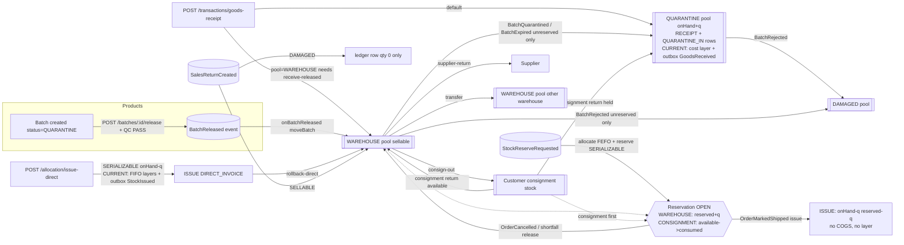
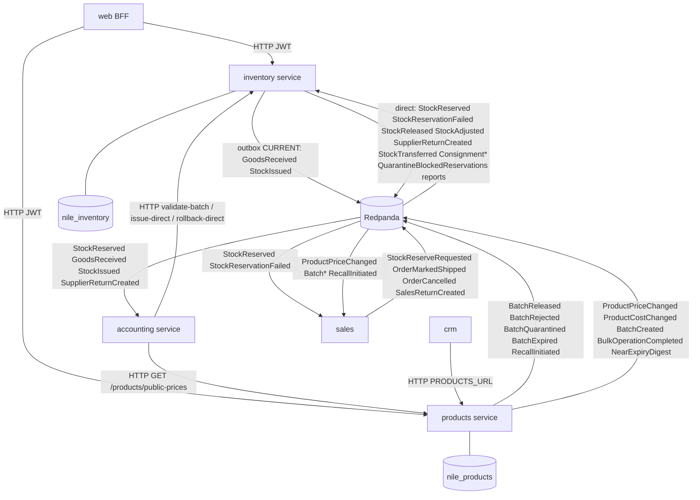
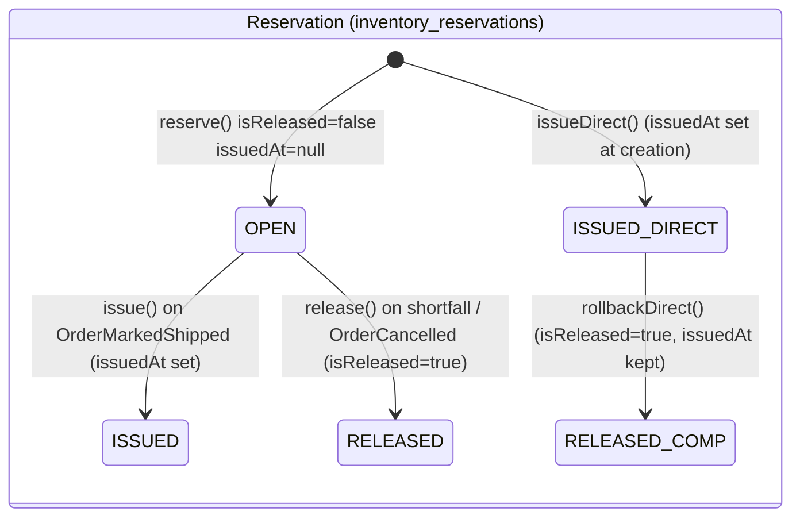
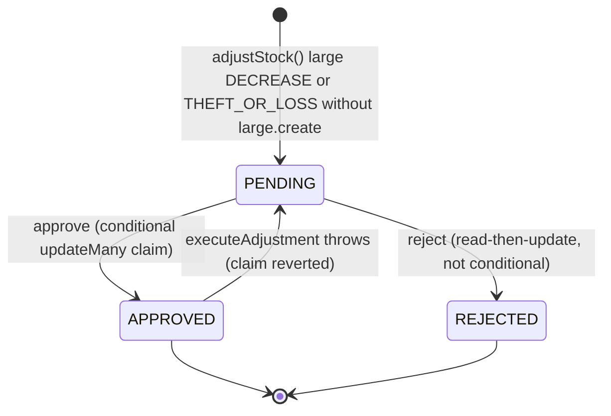
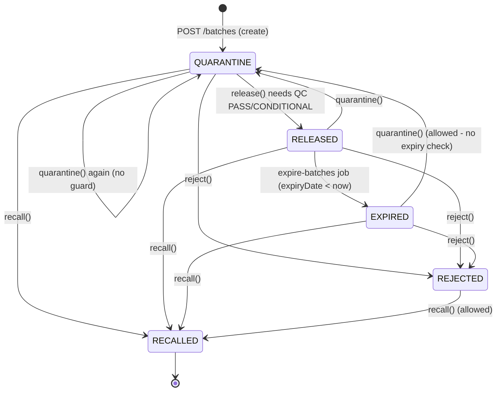

# Inventory & Products services — As-Is audit notes

Area: `apps/inventory` (Inventory & Consignment service, port 3004, DB `nile_inventory`) and `apps/products` (Products & Pharma master, port 3003, DB `nile_products`).
Snapshots: CURRENT = `cur/` (fa40270, not deployed). BASELINE = `base/` (89c2c31, candidate production; image→commit match not proven).
Method: static reading only. Nothing was built, run, or connected to. "Verified" below means "seen in the code/evidence file", never "seen in production".

---

## 1. Scope covered / not covered

| Item | Coverage | Notes |
|---|---|---|
| Inventory Prisma schema + all 22 migrations (BASELINE 19) | Full | `cur/apps/inventory/prisma/schema.prisma`, migrations folder |
| Inventory modules: warehouses, stock, transactions (+outbox), allocation (engine + listener), transfers, consignment, quarantine, jobs | Full (service + controller + DTO) | Specs only skimmed (`inventory-jobs.spec.ts`) |
| Inventory common: guards, JWT strategy, audit interceptor, serializable-retry helper, env | Partial | Cross-cutting security is another agent's area |
| Products Prisma schema + migrations | Full (schema) / Partial (migrations SQL) | |
| Products modules: products, batches/QC, suppliers, categories/brands/manufacturers, UOM, price-lists, serialization, jobs | Full for products/batches/suppliers/jobs/serialization/categories; Partial for UOM and price-lists (outline + diffs) | |
| `packages/events` publisher / consumer / processed-event store | Partial (only the semantics that affect this area) | Owned by integration agent |
| `packages/scheduler` | Partial (job registration, TZ) | |
| Accounting consumers of inventory events (`saga-listener.service.ts` onGoodsReceived / onStockIssued) and direct-invoice HTTP calls | Partial (boundary only) | Accounting agent owns the rest |
| Sales publishers/consumers touching stock (ship, cancel, returns, recall holds) | Partial (boundary only) | |
| Web BFF usage of inventory/products endpoints | Not reviewed (only grep for URLs) | |
| `Data/` folder | Not opened (rule) | |
| Runtime / DB state of `nile_inventory` and `nile_products` | Not available | Only secondary user notes in `docx.txt` |
| Unit/integration tests correctness | Not reviewed | |

---

## 2. Inventory & responsibilities

### 2.1 Inventory service (`apps/inventory`)
Bootstrap: `cur/apps/inventory/src/main.ts` (global prefix `api`, ValidationPipe whitelist+forbidNonWhitelisted, helmet, `/health` with `criticalKafka: true`). Container CMD runs `npx prisma migrate deploy && exec node dist/main.js` (`cur/apps/inventory/Dockerfile`, same in BASELINE) — whether the production image actually uses this CMD is Unknown (accounting container evidence shows `cmd=["node","dist/main.js"]`, `evidence/runtime.txt`).
Global guards: `JwtAuthGuard`, `ThrottlerGuard` (60 req/min per IP, `cur/apps/inventory/src/app.module.ts:29`); interceptors: Correlation, Audit (best-effort, after response, failures only logged).

| Module | Controller routes (prefix `/api`) | Service responsibilities | Tables |
|---|---|---|---|
| warehouses | `GET /warehouses`, `GET /warehouses/export` (CURRENT), `GET /warehouses/:id`, `POST /warehouses`, `PATCH /warehouses/:id`, `POST /warehouses/:id/bins` (CURRENT), `DELETE /warehouses/:id/bins/:binId` (CURRENT) | Warehouse master (code, AR/EN name, GLN, isActive); bin master (code, zone) | `warehouses`, `bin_locations`, `audit_logs` |
| stock | `GET /stock` (+`warehouseId` filter CURRENT), `/stock/export` (CURRENT), `/stock/valuation` (CURRENT), `/stock/by-warehouse`, `/stock/summary`, `/stock/by-product`, `/stock/shrinkage`, `/stock/movement-trend`, `/stock/trace/:batchId` | Read models: balances, KPIs, shrinkage, trend, batch trace; FIFO valuation (CURRENT) | `stock_balances`, `inventory_transactions`, `consignment_stock`, `blocked_batches`, `inventory_reservations`, `inventory_cost_layers` |
| transactions | `GET /transactions`, `POST /transactions/goods-receipt`, `POST /transactions/adjustment`, `POST /transactions/supplier-return`, `POST /transactions/:id/reverse`, `GET /transactions/adjustment-requests`, `POST .../adjustment-requests/:id/approve|reject` | Goods receipt (default into QUARANTINE pool), adjustments with large/theft approval workflow, reversal of adjustments, supplier returns | `stock_balances`, `inventory_transactions`, `adjustment_requests`, `inventory_cost_layers` (CURRENT), `inventory_outbox_events` (CURRENT) |
| transactions/InventoryOutboxService (CURRENT only) | — | Transactional outbox: `enqueue(tx, topic, envelope)`; worker `flush()` every 2 s, claims one row with `FOR UPDATE SKIP LOCKED` + 60 s lease | `inventory_outbox_events` |
| allocation | `POST /allocation/preview`, `/preview-direct`, `/validate-batch`, `/issue-direct`, `/rollback-direct` | FEFO engine (`allocate`), `reserve`, `release`, `issue` (ship), direct-invoice `issueDirect`/`rollbackDirect`, batch validation with audit rows | `stock_balances`, `consignment_stock`, `inventory_reservations`, `inventory_transactions`, `blocked_batches`, `audit_logs`, `inventory_cost_layers` (CURRENT) |
| allocation/ReservationListener | Kafka consumer group `inventory-reservation-group` | Handles `StockReserveRequested`, `OrderMarkedShipped`, `OrderCancelled`, `SalesReturnCreated`, `RecallInitiated`, `BatchReleased`, `BatchQuarantined`, `BatchRejected`, `BatchExpired` | as above + `processed_events` |
| transfers | `GET /transfers`, `GET /transfers/:id`, `POST /transfers` | Atomic warehouse→warehouse move of WAREHOUSE-pool stock, idempotency key required | `transfers`, `stock_balances`, `inventory_transactions` |
| consignment | `GET /consignment/agreements`, `GET /consignment/customer/:customerId`, `POST /consignment/agreements`, `POST /consignment/stock`, `POST /consignment/deliveries`, `POST /consignment/return`, `POST /consignment/write-off` | Consignment agreements; warehouse→customer consign-out; returns (held units → QUARANTINE); write-off at customer | `consignment_agreements`, `consignment_stock`, `stock_balances`, `inventory_transactions` |
| quarantine | `GET /quarantine`, `GET /quarantine/summary`, `POST /quarantine/:batchId/move` | Pool moves WAREHOUSE/QUARANTINE/DAMAGED with ledger rows | `stock_balances`, `inventory_transactions`, `inventory_reservations` |
| jobs (`@nile/scheduler`, `GET /jobs`, `GET /jobs/runs`, `POST /jobs/:name/run`) | — | `stale-reservations` (hourly), `disposal-candidates` (07:00), `stock-conservation` (03:30), TZ Africa/Cairo, advisory lock | `job_runs` |

Producers (topic constants from `@nile/contracts`):
- Via outbox (CURRENT only): `GoodsReceived` (`transactions.service.ts:110-117`), `StockIssued` (direct invoice only, `allocation.engine.ts:531-538`).
- Direct `EventPublisher.publish` after commit (BOTH): `SupplierReturnCreated`, `StockAdjusted`, `AdjustmentDecided`, `StockTransferred`, `StockReserved`, `StockReservationFailed`, `StockReleased`, `ConsignmentCreated`, `ConsignmentStockAdded`, `ConsignmentStockReturned`, `ConsignmentRecallHold`, `QuarantineBlockedReservations`, `StaleReservationsDetected`, `DisposalCandidatesDigest`. In BASELINE `GoodsReceived` is also a direct post-commit publish (`base/apps/inventory/src/modules/transactions/transactions.service.ts:93-108`).

Consumers: one `EventConsumer` with durable `PrismaProcessedEventStore` (`reservation.listener.ts:35`), topics listed at `reservation.listener.ts:49-59`.

Sync HTTP inbound callers (from other services): Accounting `invoices.service.ts:242` (`/allocation/validate-batch`), `:316` (`/allocation/issue-direct`), `:366` (`/allocation/rollback-direct`); Web BFF routes under `apps/web/app/api/*` and `apps/web/lib/*`. Inventory itself makes **no outbound HTTP calls** (Verified: no http client in `apps/inventory/src`).

### 2.2 Products service (`apps/products`)
Same bootstrap/guard pattern; consumer: **none** (Products publishes only; Verified — no `consumer.on` in `apps/products/src`).

| Module | Routes | Responsibilities | Tables |
|---|---|---|---|
| products | `GET /products`, `/products/export` (CURRENT), `/products/public-prices` (perm `accounting.invoices.create`), `/products/:id`, `/products/:id/price-history`, `POST /products`, `PATCH /products/:id`, `POST /products/:id/archive|activate`, `POST /products/bulk-update|bulk-import|import-prices|bulk-adjust-prices|publish-price-catalog` | Product master, prices (base/public/cost), VAT fixed 14, price history ledger, publishes `ProductPriceChanged`, `ProductCostChanged`, `BulkOperationCompleted` | `products`, `product_price_history` |
| batches | `GET /batches`, `/batches/near-expiry`, `/batches/quarantine-queue`, `/batches/:id`, `/batches/:id/qc`, `POST /batches`, `POST /batches/:id/qc`, `PATCH /batches/:id/qc/:qcId`, `POST /batches/:id/release|reject|quarantine|recall` | Batch/lot master, QC records, status lifecycle; publishes `BatchCreated`, `BatchReleased`, `BatchRejected`, `BatchQuarantined`, `BatchExpired`, `RecallInitiated` | `batches`, `batch_qc_records` |
| suppliers | `GET /suppliers`, `/suppliers/export` (CURRENT), `/suppliers/:id`, `/suppliers/:id/batches`, `POST /suppliers`, `PATCH /suppliers/:id`, `PATCH /suppliers/:id/archive` (CURRENT), `PATCH /suppliers/:id/credit-limit` | **Supplier master is owned here** (code, names, contact, creditLimit, isActive) | `suppliers`, `audit_logs` |
| categories | `GET /categories`, `/brands`, `/manufacturers` | Read-only lookups; no CRUD (seeded/managed directly) | `product_categories`, `product_brands`, `product_manufacturers` |
| uom | `GET /uom/units`, `/uom/products/:productId`, `/uom/convert`, `/uom/breakdown/:productId`, `POST /uom/products/:productId`, `POST /uom/seed-units`; CURRENT adds CSV export/import | Units master (BOX is base), per-product conversion matrix | `units_of_measure`, `product_uom_conversions` |
| price-lists | `@Controller('products/price-lists')`: list/create/update lists, items CRUD, bulk-adjust, import; CURRENT adds CSV export/import, permission for import changed | Channel price lists | `price_lists`, `price_list_items` |
| serialization | `GET /serialization`, `GET /serialization/trace/:serial`, `POST /serialization` | Generates serial numbers per batch (DSCSA-style), aggregation parent/child | `serialized_units` |
| jobs | — | `expire-batches` 00:15, `near-expiry-digest` 06:30 (Africa/Cairo) | `job_runs` |

---

## 3. How it works

### 3.1 Data model essentials (Inventory)
- `StockBalance` keyed by `(warehouseId, batchId, ownership)` with `ownership ∈ {WAREHOUSE, CONSIGNMENT, QUARANTINE, DAMAGED}`; `onHand`, `reserved`, denormalised `expiryDate`, `productId` (`schema.prisma:75-92`). Only `WAREHOUSE` rows are sellable. `CONSIGNMENT` ownership on `stock_balances` is never written by code (consignment uses its own table) — Verified by grep.
- No DB CHECK constraints on `stock_balances` (`on_hand >= 0`, `reserved >= 0`, `reserved <= on_hand`) — Verified: only CHECK in all inventory migrations is on `inventory_cost_layers` (`migrations/20260927170000_inventory_cost_layers/migration.sql:16`). Negative-stock prevention is application-only.
- `InventoryTransaction` = append-only ledger (except `reversed*` flag update on reversal) (`schema.prisma:109-146`).
- `InventoryReservation`: `isReleased`, `issuedAt` flags, `source` pool, `expiryDate` snapshot (`schema.prisma:190-211`). No unique constraint on `orderId` (only index).
- `BinLocation` exists since init but **no stock row, movement, or reservation references a bin** — bins are a master list only (Verified: no other reference to `binLocation`/`binId` in `apps/inventory/src`).
- `InventoryCostLayer` (CURRENT only): per (product, batch, warehouse) receipt layer with `quantityRemaining`, `unitCost` (`schema.prisma:94-106`).
- `InventoryOutboxEvent` (CURRENT only) with lease column `processing_until` (`schema.prisma:342-356`).
- Cross-service references without FK: `productId`, `batchId` (Products), `supplierId` (Products), `customerId` (CRM), `orderId` (Sales), `actorId` (IAM). Inventory **never validates** product/batch/supplier existence or product↔batch pairing on receipt (`goods-receipt.dto.ts`: plain `@IsString()`), and takes `expiryDate` from the client on first receipt (`transactions.service.ts:70-77`).

### 3.2 Goods receipt (Verified, CURRENT `transactions.service.ts:64-123`; BASELINE `base/.../transactions.service.ts`)
1. `POST /transactions/goods-receipt` perm `inventory.transactions.create`. `pool` defaults to `QUARANTINE`; `WAREHOUSE` requires `inventory.transactions.receive-released` (`:65-68`).
2. In one (default isolation) `$transaction`: upsert `stock_balances` (create with client `expiryDate`; on existing row only `onHand += qty`, client expiry ignored) → `RECEIPT` ledger row (CURRENT adds `unitCost`, `totalCost`, note `pool:… po:… poLine:…`) → CURRENT: create `inventory_cost_layers` row → if QUARANTINE, second ledger row `QUARANTINE_IN` (+qty) → CURRENT: enqueue `GoodsReceived` into outbox.
3. BASELINE: `GoodsReceived` is published directly after commit (no outbox, no cost layer, no PO fields).
4. Accounting consumes `GoodsReceived` → supplier ledger + GL Dr 1131/Cr 2111 and (CURRENT) `applyGoodsReceiptToPurchaseOrder` using optional `purchase_order_id/line_id` (`cur/apps/accounting/src/modules/saga-listener/saga-listener.service.ts:318-357`). PO link is "record-only": Inventory never validates the PO, quantity vs PO, or supplier (`goods-receipt.dto.ts:17-20` comment "Missing it never blocks receipt").
5. No idempotency key on goods receipt — a double submit creates two receipts, two layers and two AP postings (each event has its own `event_id`).

### 3.3 QC / quarantine pool flow (Verified)
- Products `release()` (`batches.service.ts:145-177`): status must be QUARANTINE; requires PASS/CONDITIONAL QC record when `QC_RELEASE_REQUIRES_QC` (default true in production, `products/src/config/env.ts:66`); optional e-signature id (`QC_RELEASE_REQUIRES_SIGNATURE`, default false, not verified against IAM). Publishes `BatchReleased` **after** the DB update, direct publish.
- Inventory `onBatchReleased` (`reservation.listener.ts:410-415`): `QuarantineService.moveBatch(QUARANTINE→WAREHOUSE)` for all warehouses + delete non-recall block.
- `BatchQuarantined` / `BatchExpired` → block batch, move unreserved WAREHOUSE → QUARANTINE, report reserved units via `QuarantineBlockedReservations` (`:418-453`).
- `BatchRejected` → QUARANTINE→DAMAGED and WAREHOUSE(unreserved)→DAMAGED, block `REJECTED` (`:430-441`).
- Manual override `POST /quarantine/:batchId/move` perm `inventory.transactions.receive-released`; allowed transitions `QUARANTINE>WAREHOUSE`, `WAREHOUSE>QUARANTINE`, `QUARANTINE>DAMAGED`, `WAREHOUSE>DAMAGED`, `DAMAGED>QUARANTINE` (`quarantine.service.ts:19-25`).
- There is **no disposal / destruction transaction and no way to supplier-return or adjust DAMAGED/QUARANTINE stock directly** (`applySignedDelta` only touches `ownership: 'WAREHOUSE'`, `transactions.service.ts:45-59`). The `disposal-candidates` job only reports (`inventory-jobs.ts`).

### 3.4 Reservation (sales order) — FEFO
1. Sales saga publishes `StockReserveRequested` (`cur/apps/sales/src/modules/saga/saga.orchestrator.ts:264`).
2. `onReserveRequested` (`reservation.listener.ts:179-341`): if any non-released reservation exists for the order → re-publish `StockReserved` from existing rows (CONC-6 guard). Else for each line: `allocate()` (read-only, no lock) → `reserve()` (SERIALIZABLE, rechecks balance and block, `allocation.engine.ts:667-709`), each line in its **own** transaction; P2034 retried 3× at two levels.
3. Allocation order (`allocation.engine.ts:83-195`): if `customerId` → that customer's consignment stock FEFO (`expiryDate asc`, `availableQty>0`, not expired, not blocked) first; then WAREHOUSE pool FEFO on `onHand - reserved`. Explicit `requested_batch_id` restricts to that batch and rejects product mismatch/expired/blocked.
4. Reserve effects: WAREHOUSE → `reserved += q`; CONSIGNMENT → `availableQty -= q`, `consumedQty += q` (consumption is recorded at reservation time, not at shipment).
5. Any shortfall → `release(orderId)` and publish `StockReservationFailed`; else publish `StockReserved` (carries invoice/shipping payload through for Accounting).
6. No minimum remaining shelf-life rule (comment `consignment.service.ts:156-157` "No minimum shelf life is applied: none has been decided").

### 3.5 Issue on shipment (sales order)
- Sales `ship()` flips order to SHIPPED, then publishes `OrderMarkedShipped` (`sales/.../orders.service.ts:1240-1269`).
- Inventory `issue()` (`allocation.engine.ts:767-831`): SERIALIZABLE; for each open reservation: WAREHOUSE → `onHand -= q; reserved -= q` + `ISSUE` ledger row; CONSIGNMENT → `CONSIGN_CONSUME` ledger row only; stamp `issuedAt`.
- **No cost-layer consumption, no unit cost, no `StockIssued` event on this path** (Verified; only `issueDirect` does). It also does not check `blocked_batches` — the recall/quarantine gate for shipping lives in Sales (`traceability.assertShippable`, `orders.service.ts:1246-1249`).

### 3.6 Direct (counter) invoice stock issue — Accounting-driven, synchronous
- Accounting calls `POST /allocation/issue-direct` with the user's bearer token (perm `accounting.invoices.create`), then commits its invoice; on failure calls `/allocation/rollback-direct` (`accounting/.../invoices.service.ts:316, 366`).
- `issueDirectOnce` (`allocation.engine.ts:317-541`): SERIALIZABLE; idempotency via synthetic `orderId = direct-invoice:<key>` and replay comparison; per line consignment-first then FEFO WAREHOUSE; optimistic `updateMany` on balance; creates reservation rows already `issuedAt=now`; CURRENT: consumes FIFO cost layers (warehouse-scoped for WAREHOUSE source, batch-only for CONSIGNMENT) and **throws 409 if layers are insufficient** (`:479-481`), writes `ISSUE`/`CONSIGN_CONSUME` with `unitCost/totalCost`, audit row, enqueues valued `StockIssued` (currency hard-coded `EGP`, `:536`).
- `rollbackDirect` (`:582-641`): restores `onHand` / consignment `availableQty`, writes `RETURN` / `CONSIGN_RETURN` with reason `DIRECT_INVOICE_COMPENSATION`, marks reservations released. **Does not restore cost layers and emits no compensating event** (Verified).
- Accounting `onStockIssued` posts Dr 5100 COGS / Cr 1131 Inventory keyed on `event_id`, without checking that an invoice exists (`saga-listener.service.ts:297-316`; `inv` is fetched and unused).

### 3.7 Release / cancellation
- `OrderCancelled` → `release(orderId)` (`allocation.engine.ts:718-745`): default isolation (not SERIALIZABLE), reads open un-issued reservations, decrements `reserved` / restores consignment, marks released; publishes `StockReleased`. Sales now allows cancellation from `ALLOCATED`/`INVOICED` (`orders.service.ts:1332`) and from recall holds (`traceability.service.ts:285`), so the listener comment saying cancellation only happens pre-allocation (`reservation.listener.ts:83-99`) is stale. Payload field mismatch: Sales sends `cancellation_reason`, Inventory reads `reason` (falls back to `'order_cancelled'`).

### 3.8 Returns into stock
- Customer return: `SalesReturnCreated` → per line: `DAMAGED` → audit-only `RETURN` row with qty 0; else upsert WAREHOUSE pool `onHand += q` at event's `warehouse_id` with expiry borrowed from any existing balance, `RETURN` row (`reservation.listener.ts:353-402`). Restocked directly into **sellable** pool (no QC), each line in its own transaction, no cost layer created.
- Supplier return: `POST /transactions/supplier-return` → SERIALIZABLE decrement of WAREHOUSE pool (reserved-guarded) + `SUPPLIER_RETURN` row, then direct publish `SupplierReturnCreated` (Accounting credits AP). Client supplies `unitCost`; no cost-layer consumption; no link to receipt/batch supplier.
- Consignment return: `POST /consignment/return` → held units first → QUARANTINE pool, rest → WAREHOUSE pool, `CONSIGN_RETURN` row (`consignment.service.ts:199-246`).

### 3.9 Adjustments
- `POST /transactions/adjustment` perm `inventory.adjustments.create`; reasons closed list (`stock-adjustment.dto.ts:4-12`). DECREASE with `THEFT_OR_LOSS` or qty ≥ 50 by an actor without `inventory.adjustments.large.create` → `AdjustmentRequest PENDING` (`transactions.service.ts:251-268`). INCREASE of any size applies immediately.
- `executeAdjustment` SERIALIZABLE, `EXPIRY_WRITE_OFF` requires expired batch, `applySignedDelta` (reserved guard), `ADJUSTMENT` row, then direct publish `StockAdjusted`.
- Approve: atomic claim `PENDING→APPROVED` via `updateMany`, then execute outside the claim transaction; on exception reverts to PENDING (`:288-344`). Reject: read-then-unconditional update (`:346-369`).
- Reverse: only `ADJUSTMENT`; compensating row with `reversalOfId` (`:378-419`).
- Stock counts: **no count document / count session / freeze process** — only `COUNT_CORRECTION` adjustments (Absent).

### 3.10 Transfers
`POST /transfers` (`transfers.service.ts:48-121`): idempotency key lookup outside the tx (returns original even if payload differs), SERIALIZABLE: source `applySignedDelta(-q)`, destination upsert with source expiry, `transfers` row, two `TRANSFER` ledger rows joined by `correlationId=transfer.id`; then direct publish `StockTransferred`. Immediate, no in-transit state, no approval, no `isActive` check on either warehouse, **no cost-layer movement** (CURRENT).

### 3.11 Consignment
Agreement create → `ConsignmentCreated`. Consign-out (`addStock` / `addStockBulk` delivery note with idempotency via `correlationId=consign-delivery:<key>`): SERIALIZABLE; asserts not blocked, not expired (CURRENT only, `consignment.service.ts:159-177`), decrements WAREHOUSE pool, upserts `consignment_stock` (unique per customer+batch), `CONSIGN_OUT` row. Agreement `isActive`/`endDate` are not checked on load (Verified, `:52-64`). `productId` on the consignment row comes from the client DTO, not from the warehouse balance (`:133, :142`). Write-off: two separate non-transactional writes (`:259-286`). Recall: `holdConsignmentForBatch` moves `availableQty → heldQty` per row and publishes `ConsignmentRecallHold`.

### 3.12 Outbox worker (CURRENT only) — `inventory-outbox.service.ts`
- Started in `onModuleInit`: `setInterval(flush, 2000)` (`:11-14`); `flush` loops up to 50 claims; `claimOne` selects oldest unpublished row whose lease is null/expired `ORDER BY created_at FOR UPDATE SKIP LOCKED LIMIT 1`, sets 60 s lease and `attempts+1` (`:35-56`).
- On success: `publishedAt=now`. On failure: lease cleared **immediately** and `lastError` stored (`:68-77`) — the same row is re-claimed in the next loop iteration (oldest first), so one failing row is retried up to 50× per 2 s tick and blocks newer rows (head-of-line). No max-attempts, no backoff, no dead-letter state for the row. Publisher itself also routes the failed message to `<topic>.dlq` before throwing (`packages/events/src/publisher.ts:258-270`), so each failed attempt may add a DLQ copy.
- Delivery is at-least-once (documented `:31-33`); consumers rely on `event_id` dedup.

### 3.13 Scheduled jobs (`inventory-jobs.ts`, BOTH snapshots)
- `stale-reservations` hourly, threshold `STALE_RESERVATION_HOURS` (72) → publishes report only.
- `disposal-candidates` daily → report only.
- `stock-conservation` daily 03:30 → compares Σ onHand per (warehouse,batch) with signed ledger sum (`:67-74`) and reserved vs open reservations; report only, result in `job_runs`. See finding INVPRD-07 (formula double-counts quarantined receipts).
- Products: `expire-batches` (RELEASED & past expiry → EXPIRED + `BatchExpired`), `near-expiry-digest`.

### 3.14 Diagrams

Stock movement flow (built from code; pools in brackets):

Component / integration diagram:

State diagrams:

Transfer has no status (atomic, `schema.prisma:221-231`). Stock pools: QUARANTINE→WAREHOUSE→QUARANTINE, QUARANTINE/WAREHOUSE→DAMAGED, DAMAGED→QUARANTINE (manual only).

---

## 4. Business processes found

| # | Process | Trigger / actor (permission) | Steps & statuses | Controls | Events / tables | Status |
|---|---|---|---|---|---|---|
| P1 | Product master maintenance | Catalog user (`products.products.create/update/archive/import`) | Create/edit/archive (soft) / bulk update / bulk import / price import / bulk ±% | SKU unique; VAT forced 14; price-history ledger rows; price events | `products`, `product_price_history`; `ProductPriceChanged`, `ProductCostChanged` | Complete (history write and event publish are outside the product update transaction) |
| P2 | Brands/categories/manufacturers | none via API | Read-only lookups; managed directly in DB/seed | — | — | Partial (no maintenance UI/API) |
| P3 | UOM & conversions | `products.uom.manage` | Units master (BOX base); per-product factors; CSV import (CURRENT) | Factor validation; audit rows on import | `units_of_measure`, `product_uom_conversions` | Partial: **not used by Inventory/Sales/Accounting** — inventory quantities are unitless integers (Verified: no `conversionFactor` usage outside products & web). Base unit assumption is Inferred = BOX |
| P4 | Supplier master | `products.suppliers.*` | Create, edit, archive (CURRENT), credit limit | Code unique; audit log on update/archive | `suppliers` (Products owns); Accounting/Inventory reference `supplierId` without FK | Partial: no supplier validation in Inventory receipt/return; supplier credit-limit enforcement not seen in this area |
| P5 | Batch registration & QC release | QA (`products.batches.create`, `.qc`, `.release`) | Create (QUARANTINE) → QC record(s) → release/reject; re-quarantine; recall; expiry job | QC record required in prod; e-signature optional; QC record frozen after decision | `batches`, `batch_qc_records`; Batch* events | Complete in Products; cross-service propagation is fire-and-forget (INVPRD-04) |
| P6 | Goods receipt | Warehouse (`inventory.transactions.create`) | Receive into QUARANTINE (or WAREHOUSE with extra perm) | No idempotency; no PO/qty/supplier/batch validation; expiry from client | `stock_balances`, `inventory_transactions`, cost layers (CURRENT); `GoodsReceived` | Partial |
| P7 | Sales reservation (saga) | Sales saga event | FEFO, consignment-first, all-or-nothing per order | SERIALIZABLE recheck; blocked-batch check; per-order replay guard | `inventory_reservations`; `StockReserved/Failed` | Complete (lines reserved in separate transactions, compensated by release) |
| P8 | Shipment issue | `OrderMarkedShipped` | Reservation → ISSUE | Serializable; idempotent on redelivery | `ISSUE` rows | Partial: no COGS/valuation |
| P9 | Direct invoice stock issue | Accounting HTTP | issue-direct / rollback-direct | Idempotency key, owner check, serializable | `StockIssued` (CURRENT) | Partial (compensation incomplete, INVPRD-02) |
| P10 | Cancellation release | `OrderCancelled` | release open reservations | idempotent by flags | `StockReleased` | Complete-ish (race INVPRD-13) |
| P11 | Customer returns restock | `SalesReturnCreated` | SELLABLE → WAREHOUSE pool; DAMAGED → zero-qty row | none beyond dedup | `RETURN` rows | Partial (no QC on returned goods, non-atomic across lines) |
| P12 | Supplier return | `inventory.supplier-returns.create` | decrement WAREHOUSE pool | reserved guard | `SupplierReturnCreated` → AP | Partial (no idempotency, not from DAMAGED/QUARANTINE pool) |
| P13 | Adjustments + approval + reversal | `inventory.adjustments.*` | see 3.9 | threshold 50 for DECREASE; theft always; reasons list | `StockAdjusted`, `AdjustmentDecided` | Partial (no threshold on INCREASE; no value-based threshold) |
| P14 | Inter-warehouse transfer | `inventory.transfers.create` | immediate | idempotency key | `StockTransferred` | Partial (no in-transit, no approval, no cost move) |
| P15 | Consignment (out, delivery note, return, write-off, recall hold) | `inventory.consignment.*` | see 3.11 | serializable, idempotent delivery note | Consignment* events | Partial (agreement validity not enforced, write-off non-atomic) |
| P16 | Quarantine/damaged handling & disposal | QC events + manual move | pool moves | — | — | Partial: **disposal/destruction absent** |
| P17 | Stock count / cycle count | — | — | — | — | Absent (only COUNT_CORRECTION adjustment) |
| P18 | Bin/location management | `inventory.warehouses.update` (CURRENT) | add/delete bin | unique per warehouse | `bin_locations` | Partial: master only, stock not tracked per bin; BASELINE has no bin endpoints |
| P19 | Valuation / FIFO costing | — | CURRENT: layers on receipt, consumed on direct invoice only; `GET /stock/valuation` | — | `inventory_cost_layers` | Partial/inconsistent (INVPRD-01) |
| P20 | Expiry handling | Products job + Inventory filters | FEFO excludes expired; BatchExpired → quarantine | — | — | Complete for sale-blocking; disposal absent |
| P21 | Reorder alerts | web low-stock report (`products.reorderPoint` vs `/stock/by-product`) | — | — | — | Not reviewed beyond data source |
| P22 | Serialization (DSCSA-style) | `products.serialization.create` | generate serials per batch | — | `serialized_units` | Partial: not linked to any inventory movement or shipment (Verified: Inventory has no serial reference) |

Documented requirements: Not reviewed in `docs/` for this area beyond code comments; process rules above are **Inferred business rules from code** unless a code comment cites an approval (e.g. "ACR-06 approved" consignment-first, `schema.prisma:1-4`; "round-2 decision" consignment expiry rule, `consignment.service.ts:150-157`) — those citations are claims in comments, not verified documents.

---

## 5. BASELINE (89c2c31) vs CURRENT (fa40270)

Command: `diff -rq base/apps/inventory cur/apps/inventory`, `diff -rq base/apps/products cur/apps/products` (results summarised; Verified).

Inventory:
| Change | BASELINE | CURRENT | Evidence |
|---|---|---|---|
| Migrations | 19 (last `20260923140000_reservation_expiry_snapshot`) | +3: `20260927170000_inventory_cost_layers`, `20260927173000_inventory_outbox`, `20260927190000_inventory_outbox_lease` | `cur/apps/inventory/prisma/migrations/` |
| FIFO cost layers | none; `inventory_transactions` has no cost columns | layer per receipt; `unit_cost/total_cost` on transactions; consumed only by `issueDirect` | `transactions.service.ts:78-96`, `allocation.engine.ts:454-497` |
| GoodsReceived publish | direct after commit | transactional outbox | `base/.../transactions.service.ts:93-108` vs `cur/...:107-117` |
| StockIssued (valued COGS) | not published | outbox, direct invoices only | `allocation.engine.ts:531-538` |
| Goods receipt PO link | absent | optional `purchaseOrderId/LineId` passed in note + event | `goods-receipt.dto.ts:17-20` |
| Consignment load guard | no expiry/block check; client expiry used | `assertSellableBatch` (not blocked, not expired); warehouse expiry used | `consignment.service.ts:128, 159-177` |
| Valuation endpoint | absent | `GET /stock/valuation` | `stock.service.ts:43-57` |
| Exports | absent | `/stock/export`, `/warehouses/export` (needs `@nile/export-kit`, Dockerfile builds it) | `stock.controller.ts:11-19`, `warehouses.controller.ts:13-21` |
| Bins API | absent (model only) | add/delete bin ("restored" by commit `015cc74 fix(inventory): restore the warehouse bin endpoints dropped by a merge`, `evidence/git-and-schema.txt:72`) | `warehouses.controller.ts:30-38` |
| Stock overview `warehouseId` filter | absent | present | `stock.controller.ts:21-30` |
| Build fixes | — | commit `acac22f fix(inventory): restore the build (schema drift, dropped dependency, stale specs)` (`evidence/git-and-schema.txt:73`) indicates an intermediate post-baseline state did not build; BASELINE build status Unknown |

Products:
| Change | BASELINE | CURRENT |
|---|---|---|
| Migrations | identical set (14) — no `diff` entries under `prisma/` | same |
| Exports | none | product/supplier export (xlsx), UOM & price-list CSV export |
| Supplier archive/restore with audit | absent (only `isActive` via PATCH) | `PATCH /suppliers/:id/archive`, new permission `products.suppliers.archive` (seeded only in CURRENT `cur/apps/iam/prisma/seed.ts`) |
| UOM CSV import | absent | present with audit rows |
| Price-list item import permission | `products.products.import` | `products.price-lists.manage`; CSV upload added; actorId recorded |

Implications: if CURRENT is deployed onto an inventory DB that holds stock received under BASELINE, none of that stock has cost layers (no backfill migration or script exists — Verified by grep for `inventory_cost_layers` across repo). Secondary evidence (`docx.txt:429-430`, user summary, no raw output) states `nile_inventory` contains "cost layers, and outbox events" — if true, the production DB already has CURRENT-era tables while the running image is tagged 89c2c31. Unverified; see evidence requests.

---

## 6. Findings

### INVPRD-01 — FIFO cost layers only track receipts and direct-invoice issues; every other movement leaves layers out of sync with physical stock
- Domain: Inventory valuation / COGS ; Affected: CURRENT
- Verification: Verified (code) ; impact Inferred
- Type: Confirmed defect
- Severity: High — CURRENT direct invoices can be refused or mis-costed and valuation diverges from on-hand once any non-direct movement happens; not running in production (BASELINE has no layers).
- Evidence (cur): layer created only in `apps/inventory/src/modules/transactions/transactions.service.ts:90-96`; consumed only in `allocation/allocation.engine.ts:454-481`. Not touched by `issue()` (`:783-831`), `applySignedDelta` users (adjustments `transactions.service.ts:184-238`, supplier return `:131-157`, transfer `transfers/transfers.service.ts:72-90`, consign-out `consignment/consignment.service.ts:121-147`), sales-return restock (`reservation.listener.ts:384-399`), consignment return (`consignment.service.ts:212-238`), `rollbackDirect` (`allocation.engine.ts:595-619`). No backfill for pre-existing stock (repo-wide grep).
- Trigger: (a) transfer then direct invoice from destination warehouse → `ConflictException 'No inventory cost layers available…'` (`:479-481`) because layers are warehouse-scoped; (b) stock received before the migration → same 409; (c) order shipment/adjustment/supplier return reduce onHand but not layers → later direct invoice consumes layers of goods already gone (wrong COGS), and (d) consignment consume draws layers of warehouse stock by batch only.
- Impact: direct invoicing blocked for legitimate stock; COGS posted to GL (5100/1131) wrong; `GET /stock/valuation` overstated.
- To verify/close: business decision on costing method for all movements (FIFO vs moving average); count rows `stock_balances` vs `SUM(quantity_remaining)` per (warehouse,batch) on a CURRENT-schema DB.

### INVPRD-02 — Direct-invoice rollback leaves the valued `StockIssued` event and consumed cost layers in place
- Domain: Inventory↔Accounting compensation ; Affected: CURRENT
- Verification: Verified (code)
- Type: Confirmed defect
- Severity: High — a failed counter invoice still produces a COGS journal (Dr 5100 / Cr 1131) with no invoice, and the layer quantity is permanently lost.
- Evidence (cur): enqueue in same tx `apps/inventory/src/modules/allocation/allocation.engine.ts:531-538`; `rollbackDirect` restores stock but no event, no layer restore `:582-641`; Accounting posts COGS without invoice check `apps/accounting/src/modules/saga-listener/saga-listener.service.ts:297-316` (variable `inv` unused).
- Trigger: Accounting invoice transaction fails after `/allocation/issue-direct` succeeded → `/allocation/rollback-direct`.
- Impact: GL inventory understated/COGS overstated; subsequent FIFO costs wrong or 409s.
- To verify/close: on a CURRENT environment, count `inventory_transactions` with `reason_code='DIRECT_INVOICE_COMPENSATION'` and match their `note` (order id) to accounting `STOCK_ISSUE` journals.

### INVPRD-03 — Post-commit direct publishes (dual write) for most inventory events; failure after commit loses the event and invites a duplicate retry
- Domain: Integration / data consistency ; Affected: BOTH (BASELINE also for `GoodsReceived`)
- Verification: Verified (code) ; impact Inferred
- Type: Potential risk
- Severity: High — `SupplierReturnCreated` (AP credit) and BASELINE `GoodsReceived` (AP + GL) can be lost with stock already changed; no reconciliation exists between inventory ledger and AP.
- Evidence: cur `transactions.service.ts:146-155` (SupplierReturnCreated), `:225-235` (StockAdjusted), `transfers.service.ts:114-120` (approx., after the tx), `consignment.service.ts:32-35, 62, 240-244`, `reservation.listener.ts:109-114, 304-308, 313-339`; base `apps/inventory/src/modules/transactions/transactions.service.ts:93-108`. Publisher throws after retries (`packages/events/src/publisher.ts:258-270`). Comment acknowledging partial migration to outbox: cur `transactions.service.ts:27-28`.
- Trigger: Kafka unavailable / publish error after the DB commit.
- Impact: Accounting misses AP credit or receipt; HTTP caller gets 5xx although stock changed; a user retry repeats the stock movement (no idempotency on supplier return/adjustment/receipt).
- To verify/close: in production, compare count of `inventory_transactions` type `SUPPLIER_RETURN`/`RECEIPT` with Accounting supplier ledger entries of type RETURN/RECEIPT; check DLQ topics `inventory.*.dlq`.

### INVPRD-04 — Products batch lifecycle and price events are fire-and-forget; a failed publish leaves Inventory/Sales permanently inconsistent with no re-emit path
- Domain: Products → Inventory/Sales (QC, recall, price) ; Affected: BOTH
- Verification: Verified (code) ; impact Inferred
- Type: Potential risk
- Severity: High — `RecallInitiated` lost after the batch is set RECALLED means Inventory never blocks the batch and consignment is never frozen; `recall()` cannot be retried (`'Batch is already recalled'`).
- Evidence (cur): `apps/products/src/modules/batches/batches.service.ts:165-176` (release), `:188-198` (reject), `:206-215` (quarantine), `:228-235` (expire), `:250-265` (recall) — DB update first, then `events.publish`, no outbox; re-invocation blocked by status guards (`:147-148`, `:182`, `:247`). Price events: `products.service.ts:256-258` etc.; partial mitigation only for prices (`POST /products/publish-price-catalog`, `:281-285`).
- Trigger: Kafka error at the moment of the QA action.
- Impact: released batch stays unsellable in Inventory QUARANTINE pool; recalled batch stays allocatable in Inventory (Sales has its own block only if it received the event).
- To verify/close: compare Products `batches.status` with Inventory `blocked_batches` and pool distribution per batch (read-only queries below).

### INVPRD-05 — Goods received after the batch was QC-released land in QUARANTINE and are never released automatically
- Domain: Receiving / QC ; Affected: BOTH
- Verification: Inferred (code paths verified, scenario not executed)
- Type: Potential risk (process gap)
- Severity: Medium — stock becomes unsellable until someone with `inventory.transactions.receive-released` moves it manually.
- Evidence (cur): default pool `transactions.service.ts:65`; release moves only what is in QUARANTINE at event time `reservation.listener.ts:410-415` → `quarantine.service.ts:52`; Products `release()` refuses a second release `batches.service.ts:147`.
- Trigger: second receipt of an already RELEASED batch, or receipt posted after QA release.
- Impact: hidden stock in QUARANTINE, shortfalls on orders.
- To verify/close: query QUARANTINE-pool balances whose Products batch status is RELEASED.

### INVPRD-06 — `GET /stock/valuation` double counts layers when a batch has more than one pool row in the same warehouse
- Domain: Reporting / valuation ; Affected: CURRENT
- Verification: Verified (SQL read)
- Type: Confirmed defect
- Severity: Medium — reporting only, but `totalValueEgp` overstated.
- Evidence (cur): `apps/inventory/src/modules/stock/stock.service.ts:43-57` — join `ON batch_id AND warehouse_id` (no ownership), `GROUP BY … sb.ownership …`; every pool row (WAREHOUSE, QUARANTINE, DAMAGED) of the same warehouse/batch receives the full layer sum.
- Trigger: partial QC moves, re-quarantine, rejection leaving rows in two pools.
- Impact: inflated inventory value report; combined with INVPRD-01 value is layer-based, not on-hand-based.
- To verify/close: compare `SUM(value)` to `SUM(quantity_remaining*unit_cost)` from `inventory_cost_layers`.

### INVPRD-07 — Stock-conservation job counts quarantined receipts twice (false drift every run)
- Domain: Inventory reconciliation ; Affected: BOTH
- Verification: Verified (SQL read); test mocks the SQL (`inventory-jobs.spec.ts:29-53`) so it does not catch it
- Type: Confirmed defect
- Severity: Medium — the only automated inventory reconciliation would report drift for every quarantine receipt, making real drift indistinguishable.
- Evidence (cur): `apps/inventory/src/modules/jobs/inventory-jobs.ts:67-74` (`ELSE quantity` includes both `RECEIPT` and `QUARANTINE_IN`) vs receipt writing both rows for one onHand increment `transactions.service.ts:78-106`. Same code in BASELINE (no diff for jobs).
- Trigger: any default (QUARANTINE) goods receipt.
- Impact: noisy/useless reconciliation; `job_runs` shows FAILED-looking drift.
- To verify/close: `SELECT name,status,affected,error FROM job_runs WHERE name='stock-conservation' ORDER BY started_at DESC LIMIT 5` (metadata only).

### INVPRD-08 — Sales-order shipments produce no COGS / valuation; only direct invoices post COGS
- Domain: Inventory→Accounting ; Affected: BOTH (BASELINE: no COGS anywhere from inventory; CURRENT: direct invoices only)
- Verification: Verified (code)
- Type: Potential risk (process gap) / Question
- Severity: Medium — GL inventory (1131) is debited on every receipt (CURRENT accounting) but credited only for direct invoices, so GL inventory and COGS diverge from physical flow for saga orders.
- Evidence: cur `allocation.engine.ts:783-831` (no cost, no event); only producer of `StockIssued` `:531-538`; Accounting COGS only in `saga-listener.service.ts:297-316`.
- Trigger: any saga order shipped.
- Impact: margin/COGS reporting incomplete.
- To verify/close: business owner to confirm intended COGS recognition point (shipment vs invoice) and method.

### INVPRD-09 — Inventory accepts any productId/batchId/supplierId and client-supplied expiry on receipt; no cross-check with Products master
- Domain: Master data integrity ; Affected: BOTH
- Verification: Verified (code)
- Type: Potential risk
- Severity: Medium — a typo or mismatched product/batch pair creates a sellable (after release) balance whose FEFO expiry may differ from the Products batch; release/recall events keyed by batchId would then act on wrong stock.
- Evidence (cur): `transactions/dto/goods-receipt.dto.ts:2-11` (plain strings), upsert with client expiry `transactions.service.ts:70-77`; consignment row `productId` from DTO `consignment.service.ts:133,142`; schema comments "no cross-db FK" `schema.prisma:74-79`.
- Trigger: UI/API caller error, or batch expiry corrected in Products (no batch update endpoint exists).
- Impact: wrong FEFO order, wrong recall scope.
- To verify/close: export `stock_balances(product_id,batch_id,expiry_date)` and Products `batches(id,product_id,expiry_date)` and compare (ids/dates only).

### INVPRD-10 — No idempotency on goods receipt, supplier return, adjustment, consignment single load, write-off
- Domain: Inventory commands ; Affected: BOTH
- Verification: Verified (DTOs have no key)
- Type: Potential risk
- Severity: Medium — double-click or retry after a 5xx (see INVPRD-03) duplicates physical movements and AP postings.
- Evidence (cur): `goods-receipt.dto.ts`, `supplier-return.dto.ts`, `stock-adjustment.dto.ts`, `consignment/dto/add-stock.dto.ts`, `write-off-stock.dto.ts`; contrast transfers `create-transfer.dto.ts:17-18` and delivery note `consignment.service.ts:83-118`.
- To verify/close: look for duplicate `RECEIPT` rows with identical (batch, warehouse, quantity, actor) within seconds.

### INVPRD-11 — Outbox worker retries a failing row immediately and repeatedly, blocking newer events
- Domain: Integration ; Affected: CURRENT
- Verification: Verified (code)
- Type: Potential risk
- Severity: Low — only matters when one specific row fails while others could succeed (e.g. topic-level error); when Kafka is down all rows fail anyway.
- Evidence (cur): `apps/inventory/src/modules/transactions/inventory-outbox.service.ts:42-44` (oldest first), `:68-77` (lease cleared on failure), `:58-60` (50 iterations); no max attempts.
- Impact: head-of-line blocking of `GoodsReceived`/`StockIssued`; `attempts` grows fast; DLQ copies per attempt.
- To verify/close: `SELECT count(*), max(attempts) FROM inventory_outbox_events WHERE published_at IS NULL` (CURRENT schema).

### INVPRD-12 — Non-atomic multi-line event handlers re-apply earlier lines on in-process retry (sales return restock)
- Domain: Event consumer idempotency ; Affected: BOTH
- Verification: Inferred (handler and consumer semantics verified)
- Type: Potential risk
- Severity: Medium — a failure on line N of a `SalesReturnCreated` re-runs lines 1..N-1 up to 3 more times (handler retries before mark), each restocking again.
- Evidence (cur): per-line transactions `reservation.listener.ts:361-400`; consumer marks only after success and retries `packages/events/src/consumer.ts:290-316` (`handlerRetries` default 3, `:121`); comment admits reliance on dedup `reservation.listener.ts:119-123`.
- Trigger: invalid `warehouse_id` (FK error) or DB error on a later line.
- Impact: overstated sellable stock.
- To verify/close: none read-only beyond comparing RETURN rows per correlation_id with Sales return lines.

### INVPRD-13 — `release()` is not serializable; concurrent cancel + ship can double-decrement `reserved`
- Domain: Concurrency ; Affected: BOTH
- Verification: Inferred
- Type: Potential risk
- Severity: Low — requires cancel and ship events for the same order processed concurrently (Sales normally prevents cancel after SHIPPED), but no DB constraint would stop `reserved` going negative.
- Evidence (cur): `allocation.engine.ts:718-738` (default isolation, unconditional decrement by stale read) vs `issueOnce` `:783-827`; no CHECK constraints on `stock_balances` (only CHECK is in cost-layer migration).
- To verify/close: `SELECT count(*) FROM stock_balances WHERE reserved<0 OR on_hand<0 OR reserved>on_hand` (this is also in `scripts/inventory-p0-gate.cjs:33-36`).

### INVPRD-14 — Adjustment reversal retry path does not re-check `reversed`
- Domain: Concurrency ; Affected: BOTH
- Verification: Inferred
- Type: Potential risk
- Severity: Low — two concurrent reverse calls: the loser gets P2034, `withSerializableRetry` re-runs only the inner transaction, which updates the original without `reversed=false` condition → double compensation.
- Evidence (cur): `transactions.service.ts:379-383` (check outside tx), `:387-401` (inner tx, unconditional update), helper `common/db/with-serializable-retry.ts:51-70`.
- To verify/close: `SELECT reversal_of_id, count(*) FROM inventory_transactions WHERE reversal_of_id IS NOT NULL GROUP BY 1 HAVING count(*)>1`.

### INVPRD-15 — Adjustment request reject is not conditional; approval claim and stock execution are separate transactions
- Domain: Approval workflow ; Affected: BOTH
- Verification: Verified (code), race Inferred
- Type: Potential risk
- Severity: Low — a reject racing an approve can overwrite APPROVED with REJECTED after stock moved; a crash between claim and execute leaves APPROVED with no transaction.
- Evidence (cur): `transactions.service.ts:346-354` (read then update), `:288-344`.
- To verify/close: `SELECT status, count(*) FROM adjustment_requests WHERE (status='APPROVED' AND resulting_transaction_id IS NULL) OR (status='REJECTED' AND resulting_transaction_id IS NOT NULL) GROUP BY 1`.

### INVPRD-16 — Control gaps in adjustments: unlimited INCREASE, quantity-only threshold
- Domain: Internal control ; Affected: BOTH
- Verification: Verified (code)
- Type: Improvement / Question
- Severity: Medium — any holder of `inventory.adjustments.create` can create stock (e.g. `FOUND_STOCK` 10,000) with no approval and (CURRENT) no cost layer; threshold ignores value.
- Evidence (cur): `transactions.service.ts:21, 252-253`.
- To verify/close: business owner to define approval matrix.

### INVPRD-17 — Damaged / quarantined stock has no disposal or supplier-return path
- Domain: Process (QC, write-off) ; Affected: BOTH
- Verification: Verified (code)
- Type: Potential risk (process absent)
- Severity: Medium — QC-rejected goods accumulate in DAMAGED forever; the only way out is a manual pool move back into QUARANTINE→WAREHOUSE (making them momentarily sellable) before a supplier return/adjustment.
- Evidence (cur): `applySignedDelta` WAREHOUSE-only `transactions.service.ts:45-59`; allowed moves `quarantine.service.ts:19-25`; disposal job is report-only `jobs/inventory-jobs.ts` (header comment).
- To verify/close: business owner to define destruction/return-to-supplier procedure for rejected lots.

### INVPRD-18 — Price-list list endpoint likely shadowed by `GET /products/:id`
- Domain: Products API routing ; Affected: BOTH
- Verification: Inferred (not executed)
- Type: Potential risk (probable defect)
- Severity: Medium — if confirmed, the price-list screen cannot load lists (`GET /api/products/price-lists` would be handled as product id `price-lists` → 404).
- Evidence (cur): `apps/products/src/modules/price-lists/price-lists.controller.ts:11` (`@Controller('products/price-lists')`), `products/products.controller.ts:53` (`@Get(':id')`), module order `apps/products/src/app.module.ts:31` (ProductsModule registered before PriceListsModule); web calls `/api/products/products/price-lists` (`apps/web/lib/api.ts:1296`). Same in BASELINE.
- To verify/close: one authenticated `GET /api/products/price-lists` against a test instance; check status code only.

### INVPRD-19 — Recall/quarantine/expiry do not stop `issue()`; Inventory relies on Sales to hold shipments
- Domain: Pharma compliance (recall) ; Affected: BOTH
- Verification: Verified (code)
- Type: Potential risk (defence in depth)
- Severity: Low — Sales has an explicit `assertShippable` gate and recall holds (`sales/.../orders.service.ts:1246-1249`, `traceability.service.ts:135-176`); risk only if that gate or the Sales event is missed (INVPRD-04).
- Evidence (cur): `allocation.engine.ts:783-827` (no `blockedBatch` check); `onRecallInitiated` does not report open WAREHOUSE reservations, unlike quarantine path (`reservation.listener.ts:124-150` vs `:443-453`).

### INVPRD-20 — Consignment: agreement validity not enforced; write-off non-atomic; client-supplied productId
- Domain: Consignment ; Affected: BOTH
- Verification: Verified (code)
- Type: Potential risk
- Severity: Low
- Evidence (cur): `consignment.service.ts:52-64` (no `isActive`/`endDate` check), `:259-286` (update and ledger row in separate statements), `:133,142` (productId from DTO). No endpoint to close an agreement.

### INVPRD-21 — Transfers: no warehouse-active check; idempotency key ignores payload; immediate (no in-transit)
- Domain: Transfers ; Affected: BOTH
- Verification: Verified (code)
- Type: Improvement
- Severity: Low
- Evidence (cur): `transfers.service.ts:51-52` (returns any existing transfer for the key), `:58-90` (no `isActive` lookup).

### INVPRD-22 — Bins are master data only (CURRENT); no stock-by-bin, no put-away/pick
- Domain: Warehouse structure ; Affected: CURRENT (endpoints), BOTH (model)
- Verification: Verified
- Type: Question / Improvement
- Severity: Info
- Evidence (cur): `schema.prisma:63-72` (no relation from `StockBalance`), `warehouses.service.ts:51-69` (hard delete, no audit row). Warehouse export lists a `createdAt` column the model does not have (`warehouses.controller.ts:18`) → empty column.

### INVPRD-23 — Products batch state machine permits questionable transitions
- Domain: QC lifecycle ; Affected: BOTH
- Verification: Verified (code)
- Type: Question
- Severity: Low — EXPIRED → QUARANTINE → RELEASED is allowed (release has no expiry check), REJECTED → RECALLED allowed; status checks are read-then-update (no conditional update) except expiry job.
- Evidence (cur): `batches.service.ts:145-148, 180-183, 202-206, 245-253`. Inventory allocation still excludes expired by date (`allocation.engine.ts:131,156`), so no sale results.

### INVPRD-24 — UOM matrix not used in stock quantities
- Domain: Master data / units ; Affected: BOTH
- Verification: Verified (grep)
- Type: Question
- Severity: Info — inventory, sales and accounting quantities are unitless integers; conversions live only in Products and web.
- Evidence: `apps/products/src/modules/uom/uom.service.ts` (BOX base, `seedDefaultUnits`); no `conversionFactor` usage outside products/web.

### INVPRD-25 — Direct-invoice stock endpoints callable directly by any holder of `accounting.invoices.create`
- Domain: Authorisation boundary ; Affected: BOTH (CURRENT adds COGS posting)
- Verification: Verified (code), exploitation Inferred
- Type: Potential risk
- Severity: Medium — a user with that permission can call `POST /api/allocation/issue-direct` on Inventory without creating an invoice, decrementing stock (and in CURRENT generating a COGS journal), and can roll it back.
- Evidence (cur): `allocation/allocation.controller.ts:59-68`; owner check only on replay/rollback `allocation.engine.ts:329-336, 589-594`.
- To verify/close: confirm whether Inventory is network-reachable from browsers (production compose binds `127.0.0.1`, `cur/docker-compose.production.yml:272`) and whether the web BFF proxies `/api/inventory/allocation/*` generically.

### INVPRD-26 — Throttle of 60 requests/min per IP behind a BFF
- Domain: Availability (cross-cutting) ; Affected: BOTH
- Verification: Inferred
- Type: Operational uncertainty
- Severity: Info — if all traffic arrives from the web container IP, the whole user base shares 60 req/min per service. Flag for the security/ops agent.
- Evidence: `apps/inventory/src/app.module.ts:29`, `apps/products/src/app.module.ts:28`.

### INVPRD-27 — Production schema/data state for inventory and products unknown; possible CURRENT-era tables on BASELINE image
- Domain: Operations ; Affected: BOTH
- Verification: Unknown (secondary evidence only)
- Type: Operational uncertainty
- Severity: Info until verified
- Evidence: `docx.txt:429-430` (user summary lists cost layers and outbox events in `nile_inventory`), `docx.txt:467, 475-476` (inventory: job_runs≈39, audit_logs≈10; Products business tables ≈0 rows, estimates from `n_live_tup`). Inventory container CMD auto-runs `migrate deploy` per Dockerfile, but production image command is unverified.
- To verify/close: `_prisma_migrations` listing for `nile_inventory` and `nile_products` (see §7).

---

## 7. Open questions & evidence requests

Business owner:
1. Costing method: FIFO per warehouse for all movements, or moving average? When is COGS recognised for saga orders (shipment vs invoice)? (INVPRD-01/08)
2. Should returned SELLABLE goods go straight to sellable stock or through QC/quarantine?
3. Disposal/destruction procedure for DAMAGED/rejected/expired lots; who approves; accounting treatment (INVPRD-17).
4. Approval matrix for adjustments (INCREASE, value-based thresholds) and for transfers (INVPRD-16/21).
5. Minimum remaining shelf life for sales and consignment loads.
6. Is stock tracked per bin required (put-away/picking), or are bins informational?
7. Physical stock-count process (cycle counts, freeze, variance approval) — currently absent.
8. Which unit is the inventory quantity unit (BOX?) and should purchase/sales UOM conversion be applied at receipt/sale?
9. Is the supplier master meant to stay in Products while AP/PO live in Accounting? Who enforces supplier credit limit?
10. Should Inventory validate PO lines (quantity, supplier) on receipt, or stay "record-only"?

Server, read-only, metadata/small queries only (run by the user; no secrets in output):
- `docker inspect nile-pharma-erp-inventory-1 nile-pharma-erp-products-1 --format '{{.Config.Image}} {{.Image}} {{json .Config.Cmd}} {{json .Config.Entrypoint}}'`
- `nile_inventory`: `SELECT migration_name, finished_at, rolled_back_at, applied_steps_count FROM _prisma_migrations ORDER BY started_at;` (same for `nile_products`).
- `nile_inventory`: `SELECT table_name FROM information_schema.tables WHERE table_schema='public' ORDER BY 1;`
- `nile_inventory`: `SELECT ownership, count(*), sum(on_hand), sum(reserved) FROM stock_balances GROUP BY 1;`
- `nile_inventory`: `SELECT count(*) FROM stock_balances WHERE on_hand<0 OR reserved<0 OR reserved>on_hand;`
- `nile_inventory`: `SELECT type, count(*) FROM inventory_transactions GROUP BY 1;`
- `nile_inventory`: `SELECT name, status, affected, started_at FROM job_runs ORDER BY started_at DESC LIMIT 20;`
- `nile_inventory` (if table exists): `SELECT count(*) FILTER (WHERE published_at IS NULL) AS pending, max(attempts) FROM inventory_outbox_events;` and `SELECT count(*), sum(quantity_remaining) FROM inventory_cost_layers;`
- `nile_inventory`: `SELECT status, count(*) FROM adjustment_requests GROUP BY 1;` and `SELECT count(*) FROM inventory_reservations WHERE is_released=false AND issued_at IS NULL;`
- `nile_products`: `SELECT status, count(*) FROM batches GROUP BY 1;` and `SELECT count(*) FROM products;`, `SELECT count(*) FROM suppliers;`
- Cross-check (ids only): Products `SELECT id, status FROM batches WHERE status IN ('RELEASED','RECALLED')` vs Inventory `SELECT batch_id, ownership, sum(on_hand) FROM stock_balances GROUP BY 1,2` and `SELECT batch_id, reason FROM blocked_batches`.
- Redpanda: list topics matching `inventory.*.dlq`, `quality.*.dlq` with message counts (no payloads).
- Test instance only: `GET /api/products/price-lists` status code (INVPRD-18).
