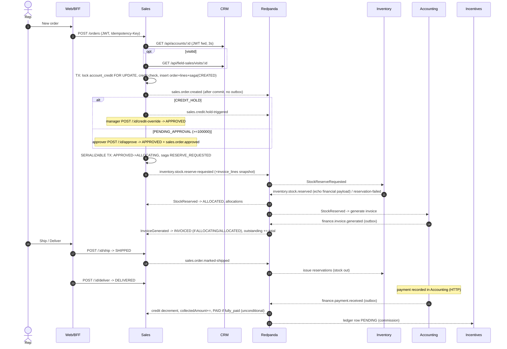
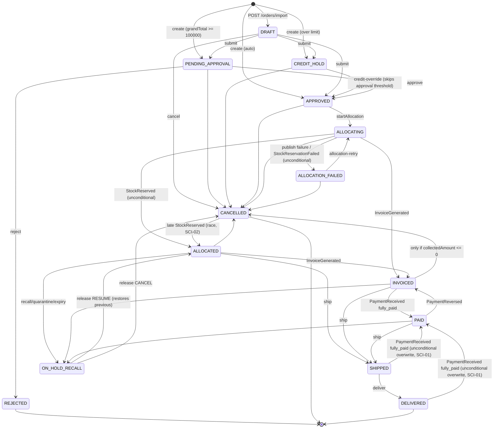
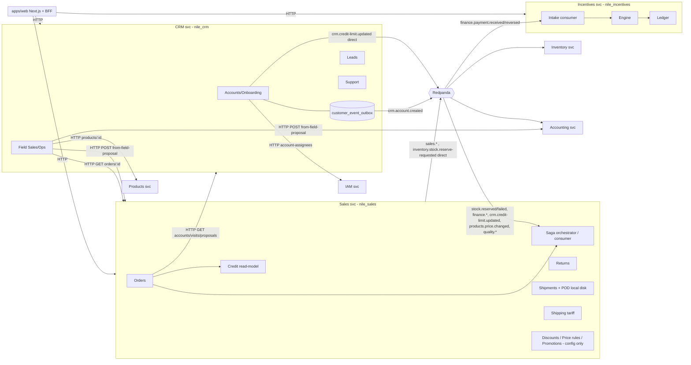
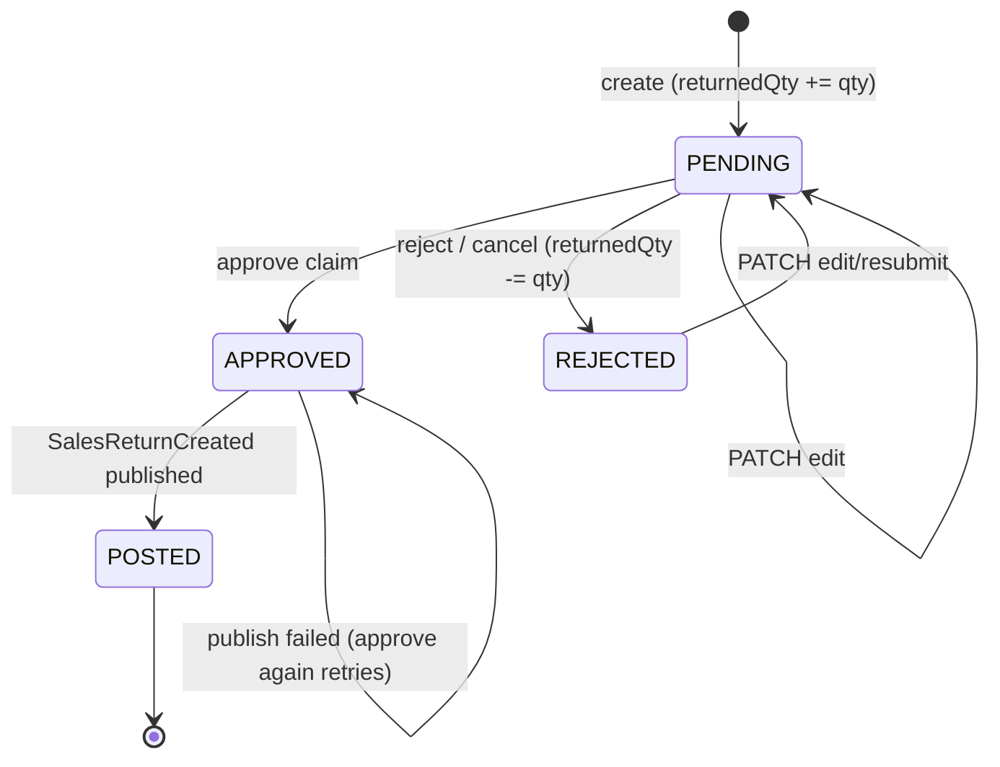
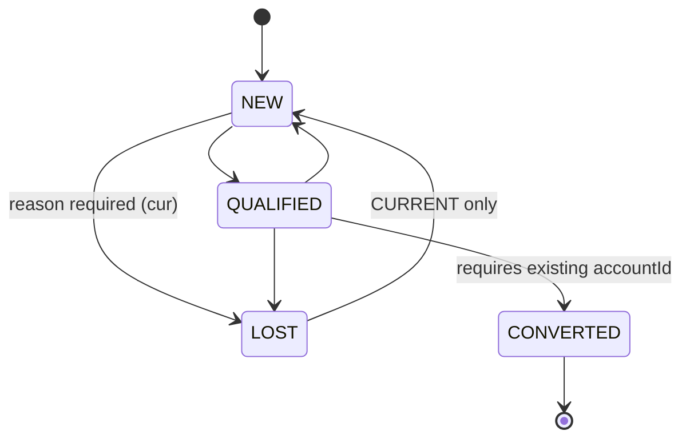
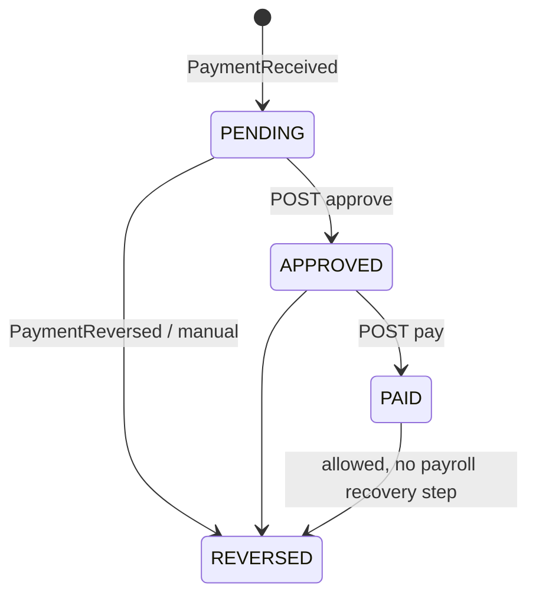

# As-Is Audit Notes — SALES, CRM, INCENTIVES

Snapshots: BASELINE = `base/` (89c2c31, candidate production) · CURRENT = `cur/` (fa40270, not deployed).
All paths below are relative to the snapshot root named in brackets, e.g. `[cur] apps/sales/src/...:123`. When a line is identical in both snapshots it is marked `[both]` and the line number is the CURRENT one (BASELINE differs only in `orders.service.ts`, see §5).
Classification: **V** = Verified in code/evidence · **I** = Inferred (reasoned, not executed) · **U** = Unknown.
Static reading proves what the code does, not what production does.

---

## 1. Scope / coverage matrix

| Item | Coverage | Notes |
|---|---|---|
| Sales: module inventory, controllers, permissions | Full | all 11 modules + jobs |
| Sales: orders service (create / import / submit / approve / credit override / ship / deliver / cancel / retry) | Full | |
| Sales: saga orchestrator (all consumers) | Full | |
| Sales: credit read-model | Full | |
| Sales: returns | Full | |
| Sales: shipments / POD / return-leg | Full | |
| Sales: shipping tariff quote | Full | |
| Sales: traceability / recall holds | Partial | hold/release/assertShippable read; `batchDistribution` skimmed |
| Sales: discounts / price-rules / promotions modules | Partial | controllers + where used; engines not read line by line (they are not applied to orders, see SCI-20) |
| Sales: reconciliation job, saga monitor | Full | |
| Sales: Prisma schema + migration list | Partial | enums/models/uniques read; individual migration SQL read only for tariffs/discount matrix/CRM additive ones |
| CRM: accounts / onboarding / outbox / credit limit / import | Full | `customer-profile.service`, `customer-notes.service` not read in detail |
| CRM: leads | Full | |
| CRM: field-sales (visits, plans, assignments, targets, follow-ups, calls) | Partial | structure + complete/link-order/targets read; dashboard aggregation not read |
| CRM: field-operations (reschedule, GPS review, proposals, convert) | Partial | convert + statuses read |
| CRM: support tickets | Partial | transitions + SLA only |
| CRM: legacy visits quick-log | Full | |
| Incentives: intake, engine, rules, ledger, leaderboard, seed | Full (leaderboard service skimmed) | |
| Shared `packages/events` (publisher, consumer dedup, DLQ) | Partial | only what affects these services |
| Cross-service counterparts (accounting saga-listener/payments, inventory reservation listener) | Partial | only payloads/handlers that interact with Sales |
| IAM permission catalogue vs code permissions | Full (string diff) | role→permission assignments in production: **Unknown** |
| apps/web (order form, pricing profile use) | Spot checks only | |
| Runtime / DB state | Not reviewed (no server access) | only `evidence/` + `docx.txt` (secondary) |
| Docs: FIELD-SALES-AUDIT, BUSINESS-FLOWS-COVERAGE, INVOICE-CONCEPT-AR, SHIPPING-TARIFF-AND-TAX-DECISION-AR | Full | |

---

## 2. Inventory & responsibilities

### 2.1 Sales (`apps/sales`, port 3006 dev / 3000 in compose, DB `nile_sales`)

Bootstrap [both] `apps/sales/src/app.module.ts:29-58`: global `JwtAuthGuard` + `ThrottlerGuard` (60 req / 60 s per client IP, line 32), `CorrelationInterceptor`, `StructuredLoggingInterceptor`, `AuditInterceptor`, `HttpModule` (timeout 5 s). Every controller uses `@UseGuards(PermissionsGuard)`; the guard **denies** when no `@Permissions` metadata is present ([both] `common/guards/permissions.guard.ts` lines 12-13 of the guard; note the stale comment in `orders.controller.ts:49-50` claiming the opposite).

| Module | Controller routes (prefix `/api`) | Permission(s) | Responsibility |
|---|---|---|---|
| orders | `GET /orders`, `/orders/export`(cur), `/orders/config`, `/summary`, `/top-products`, `/top-reps`, `/trend`, `/status-breakdown`, `/top-customers`, `/by-account`, `GET /orders/:id`; `POST /orders`, `/orders/import`, `/orders/from-field-proposal`, `/:id/submit`, `/:id/approve`, `/:id/reject`, `/:id/credit-override`, `/:id/allocation-retry`, `/:id/ship`, `/:id/deliver`, `/:id/cancel` | `sales.orders.read/create/approve/ship/deliver/cancel/credit-hold.override`; field proposal needs `sales.orders.create`+`crm.field-sales.review` | Order lifecycle, reporting |
| credit | `GET /credit/exposures`, `/credit/:accountId/exposure`, `/credit/:accountId` | `sales.orders.read` | Local credit read-model (`account_credit`) |
| saga | `GET /sagas/stalled`, `/sagas/distribution`, `/sagas/:orderId` | `sales.sagas.read` | Kafka consumer (`sales-saga-group`) + monitor |
| returns | `GET/POST /orders/:orderId/returns`; `GET /returns`, `/returns/summary`, `POST /returns/:id/approve|reject|cancel`, `PATCH /returns/:id` | `sales.returns.read/create/approve` | Sales returns (RMA) |
| shipments | `GET /shipments`, `/shipments/:orderId/legs`, `PUT/DELETE /shipments/:orderId`, `POST /shipments/bulk-assign`, `/:orderId/return-leg`, `/:orderId/pod/:kind` (GET/POST) | `sales.shipments.read/manage` | Dispatcher logistics, POD files, round-trip return-cash leg |
| shipping | `GET /shipping/catalog`, `/catalog/export.csv`(cur), `POST /shipping/quote` | `sales.shipping.read` | Fixed per-order tariff (zones/rates/areas) |
| traceability | `GET /traceability/batch/:batchId`, `/holds`; `POST /holds/:orderId/release` | `sales.traceability.read`, `sales.orders.recall-hold.release` | Recall/quarantine order holds |
| discounts | `/discounts` CRUD, `/approval-matrix` GET/PUT, `/:id/impact` | `sales.discounts.read/manage/matrix.manage` | Discount policy config (`pricing_rules` table) + approval matrix |
| pricing | `/pricing/rules` CRUD, `/simulate`, `/engine` | `sales.pricing-rules.read/manage` | Price-rule config + simulator (`price_rules`) |
| promotions | `/promotions` CRUD, `/simulate`, `/:id/performance` | `sales.promotions.read/manage` | Promotions config + simulator |
| reconciliation + jobs | none (scheduler `sales-reconciliation`, cron `0 3 * * *`) | — | Saga/status and returnedQty drift checks |

Consumers (single `EventConsumer`, group `sales-saga-group`) [both] `modules/saga/saga.orchestrator.ts:55-93` — durable dedup via `PrismaProcessedEventStore(processed_events)`:

| Event type | Topic | Handler |
|---|---|---|
| StockReserved | `inventory.stock.reserved` | `onStockReserved` → ALLOCATED + allocations |
| StockReservationFailed | `inventory.stock.reservation-failed` | → ALLOCATION_FAILED |
| InvoiceGenerated | `finance.invoice.generated` | → INVOICED (conditional) + credit `applyInvoice` |
| PaymentReceived | `finance.payment.received` | credit `applyPayment`, `collectedAmount += amount`, PAID if fully paid; return-leg FINANCE_POSTED |
| PaymentReversed | `finance.payment.reversed` | credit re-apply, `collectedAmount -=`, PAID→INVOICED |
| SalesReturnCredited | `finance.return.credited` | credit `applyPayment` |
| InvoiceCancelled | `finance.invoice.cancelled` | credit `applyPayment(total)` |
| CreditLimitUpdated | `crm.credit-limit.updated` | `account_credit.credit_limit` upsert + pending applications |
| ProductPriceChanged | `products.price.changed` | `product_prices` projection upsert |
| RecallInitiated / BatchQuarantined / BatchExpired / BatchRejected / BatchReleased | `quality.*`, `inventory.batch.expired` | `blocked_batches` + ON_HOLD_RECALL |

Producers (direct `EventPublisher.publish`, **no outbox table in Sales** — V: no `outbox` model in `[both] apps/sales/prisma/schema.prisma`):
`sales.order.created` (OrderCreated), `sales.order.approved`, `sales.order.rejected`, `sales.order.cancelled`, `sales.credit.hold-triggered`, `sales.credit.hold-overridden`, `sales.discount.overridden`, `inventory.stock.reserve-requested` (StockReserveRequested — a command to Inventory), `sales.order.marked-shipped`, `sales.order.marked-delivered`, `sales.return.created` (SalesReturnCreated), `sales.order.held-for-recall`, `sales.order.recall-hold-released`, `sales.shipping.return.cash-received`. Topic constants: `[both] packages/contracts/src/generated/events.ts:749-813`.

Synchronous HTTP out of Sales: `GET {CRM_BASE_URL}/api/accounts/:id`, `/api/field-sales/visits/:id`, `/api/field-operations/proposals/:id` forwarding the caller's JWT, timeout 3 s, fail-closed ([both] `orders.service.ts:175-221`). `CRM_BASE_URL` default `http://localhost:3005` ([both] `config/env.ts:170`), compose sets `http://crm:3000` (`[cur] docker-compose.production.yml:298`).

Tables (27 models + `_prisma_migrations` = 28, consistent with the 28 tables reported in `docx.txt:394`): `sales_orders`, `sales_order_lines`, `order_line_allocations`, `order_approvals`, `order_sagas`, `sales_returns`, `sales_return_lines`, `account_credit`, `pending_payments`, `pending_credit_applications`, `product_prices`, `pricing_rules`, `discount_approval_levels`, `price_rules`, `price_rule_settings`, `promotions`, `promotion_redemptions`, `blocked_batches`, `order_recall_holds`, `shipping_zones`, `shipping_rates`, `shipping_zone_areas`, `order_shipments`, `shipment_legs`, `processed_events`, `audit_logs`, `job_runs`.

### 2.2 CRM (`apps/crm`, DB `nile_crm`, 20 models + migrations table = 21, matches `docx.txt:394`)

| Module | Routes | Permissions |
|---|---|---|
| accounts | `GET /accounts`, `/accounts/export`(cur), `/summary`, `/:id`; `POST /accounts` (onboarding), `/bulk`, `/import`, `/import/file`(cur); `PATCH /:id`, `DELETE /:id` (archive); `POST /:id/addresses`, `/:id/notes`, `PATCH /:id/notes/:noteId`, `/:id/profile`, `/:id/credit-limit` | `crm.accounts.read/create/manage/credit-limit.update` |
| leads | `GET/POST /leads`, `PATCH /leads/:id`(cur), `PATCH /leads/:id/status` | `crm.leads.read/create/manage` |
| visits (legacy) | `GET/POST /visits` | `crm.visits.read/create` |
| field-sales | dashboard, my-day, calls, visits (create/start/complete/complaint/link-order/cancel/missed), plans, assignments, targets, follow-ups | `crm.field-sales.read/manage/visit.start/visit.complete/complaints.create` |
| field-operations | report, reschedule + decision, GPS review, proposals (submit/revise/review/convert) | `crm.field-sales.read/visit.complete/review` |
| support | tickets CRUD/status, SLA stats, categories | reuses `crm.accounts.read/manage` |

Producers: `crm.account.created` (onboarding via `customer_event_outbox` relay, [both] `customer-onboarding.service.ts:283-298`, relay `customer-outbox.service.ts:29-70`, 10 s interval, `FOR UPDATE SKIP LOCKED`); `crm.credit-limit.updated` (direct publish, `[both] accounts.service.ts:290-304`); `crm.visit.logged` (direct, legacy quick-log `[both] visits.service.ts:119-123`). CRM consumes **no** events (V: no `consumer.on` in `apps/crm/src`).
Synchronous HTTP out of CRM: Sales `GET /api/orders/:id` (`SALES_BASE_URL`, field-sales link/complete, `field-sales.service.ts:140-174`), Sales/Accounting `POST .../from-field-proposal` (`SALES_URL`/`ACCOUNTING_URL`, `operations.service.ts:537-556`), Products `GET /products/:id` (`PRODUCTS_URL`), IAM `GET /users/account-assignees` (`IAM_URL || IAM_SESSION_URL`, `customer-onboarding.service.ts:36-67`). Note two different env names for the same Sales service (`SALES_BASE_URL` vs `SALES_URL`).

### 2.3 Incentives (`apps/incentives`, DB `nile_incentives`, 5 models + migrations = 6, matches `docx.txt:395`)

| Module | Routes | Permissions |
|---|---|---|
| rules | `GET /rules`, `/rules/active`, `POST /rules`, `POST /rules/:version/activate` | `incentives.rules.read/manage` |
| ledger | `GET /ledger`, `/ledger/export`(cur), `POST /ledger/:id/approve|pay|reverse` | `incentives.ledger.read/approve` |
| leaderboard | `GET /leaderboard`, `/leaderboard/summary` | `incentives.ledger.read` |
| intake (consumer) | group `incentives-intake-group` on `finance.payment.received`, `finance.payment.reversed` | — |
| engine | pure tier + collection-bonus calculation | — |

Producers: `incentives.ledger.recorded`, `incentives.commission.calculated`, `incentives.bonus.triggered` (direct publish after commit, `[both] ledger.service.ts:69-97`). No consumers of these were found in the reviewed services (I).

---

## 3. How it works

### 3.1 Order creation (`POST /api/sales/orders`) — [cur] `orders.service.ts:535-827`
1. Batch override requires `sales.orders.batch.override` (548-551).
2. Catalogue prices from local `product_prices` projection (552-555); `publicPrice ?? unitPrice` is authoritative, client prices ignored (571-589).
3. **CURRENT only:** discount ceiling = highest active `discount_approval_levels.max_discount_pct` (default 12) and > 12 % needs `sales.discounts.approve` or SUPER_ADMIN (556-570). BASELINE has no ceiling (see SCI-04).
4. CRM account lookup with caller JWT; ownership = active `CustomerAssignment` or legacy `repId` (595-601, 196-212). Name must match CRM.
5. Idempotency: `Idempotency-Key` header → `sales_orders.idempotency_key` unique; visit-origin → `visit_id` unique (605-636, 745-768).
6. Optional shipping quote (`ShippingService.quote`) → fee added to grand total, **not** to tax (638-641) — matches `docs/SHIPPING-TARIFF-AND-TAX-DECISION-AR.md` §"القرار الضريبي".
7. `PricingService.price` (per-line Decimal rounding) ([both] `pricing.service.ts:49-75`).
8. Order number `SO-<base36 ms>-<uuid8>` (647) — unique, not sequential/gap-free.
9. **One DB transaction**: `SELECT … FROM account_credit … FOR UPDATE` then credit evaluation (credit.service.ts:338-371) → status `CREDIT_HOLD` | `PENDING_APPROVAL` (grandTotal ≥ 100 000) | `APPROVED`; insert order + lines + `order_sagas(step=CREATED)` + audit rows (649-738).
10. **After commit** (no outbox): publish OrderCreated, one DiscountOverridden per line whose `discountPct` was supplied, CreditHoldTriggered or — if auto-approved — `saga.startAllocation` (782-825).

### 3.2 Allocation → invoice → payment (saga) — [both] `saga.orchestrator.ts`
- `startAllocation` (121-321): SERIALIZABLE tx claims `APPROVED|ALLOCATION_FAILED → ALLOCATING`, saga `RESERVE_REQUESTED`; after commit publishes `StockReserveRequested` carrying order header, shipping snapshot and `invoice_lines` snapshot. Publish failure → `ALLOCATION_FAILED` / saga `FAILED` (retry via `POST /orders/:id/allocation-retry`).
- Inventory FEFO reserves and publishes `StockReserved` echoing the commercial payload (`[cur] apps/inventory/src/modules/allocation/reservation.listener.ts:179-340`).
- **Invoice trigger:** Accounting consumes `StockReserved` (not a Sales event, not HTTP) and generates the invoice (`[cur] apps/accounting/src/modules/saga-listener/saga-listener.service.ts:49,102-182`), then emits `InvoiceGenerated` (outbox in accounting).
- Sales: `StockReserved` → ALLOCATED + `order_line_allocations` (323-378); `InvoiceGenerated` → INVOICED only from ALLOCATING/ALLOCATED, plus `account_credit.outstanding += total` (406-432); `PaymentReceived` → credit decrement, `collectedAmount += amount`, `PAID` + saga `DONE` if `fully_paid` (434-486).
- Ship: `POST /orders/:id/ship` from ALLOCATED|INVOICED|PAID (1235-1269) after recall gate → `OrderMarkedShipped` → Inventory issues reservations (`reservation.listener.ts:72-80`). Deliver: SHIPPED → DELIVERED (1273-1294). Neither touches accounting.
- Cancel: from DRAFT…INVOICED unless PAID or `collectedAmount>0` (1313-1358) → `OrderCancelled` → Inventory releases reservations, Accounting voids an unpaid invoice or marks “no invoice” (`saga-listener.service.ts:184-207`).

### 3.3 SalesOrder state machine (as coded)

Saga steps: CREATED → RESERVE_REQUESTED → RESERVED → INVOICED → DONE; FAILED (retryable); `PAID` and `COMPENSATING` enum values are never written (V: no writer in `saga.orchestrator.ts`).

### 3.4 Component view

### 3.5 Returns (RMA) — [both] `returns.service.ts`
Create (`POST /orders/:orderId/returns`) on orders in INVOICED|PAID|SHIPPED|DELIVERED (16), lines must reference a real allocation batch, per-batch cap = allocated − non-rejected returned (376-417); in one tx insert return (PENDING) and increment `sales_order_lines.returned_qty` (92-111). Approve (independent approver unless `.any`/SUPER_ADMIN): claim PENDING→APPROVED, publish `SalesReturnCreated`, then POSTED (127-168). Inventory restocks SELLABLE lines into the warehouse given on the line (`reservation.listener.ts:353-398`); Accounting credits the invoice, issues a credit note and publishes `SalesReturnCredited` (`saga-listener.service.ts:252-291`), which reduces Sales credit outstanding. Reject/cancel release the logical reservation (176-237). Edit = resubmit (248-303).

### 3.6 CRM customer lifecycle
- **Lead** (`[cur] leads.service.ts:131-184`): NEW→{QUALIFIED,LOST}; QUALIFIED→{NEW,CONVERTED,LOST}; LOST→NEW (CURRENT only; BASELINE LOST is terminal, `[base] leads.service.ts:~103`); CONVERTED terminal. Conversion only links an existing Account (no Account is created). LOST requires reason (CURRENT).
- **Account onboarding** (`POST /accounts`, [both] `customer-onboarding.service.ts:171-311`): requestId+payload-hash idempotency, rep validated against IAM, one tx creates Account + PRIMARY assignment + primary address + note + audit + outbox AccountCreated. `creditLimit` stays 0 (= "not configured", Sales never holds). CURRENT adds `priceListId`, `pricingDiscountPct` (default 12).
- **Credit limit** (`PATCH /accounts/:id/credit-limit`, [both] `accounts.service.ts:275-306`): own rep, SUPER_ADMIN or `.any`; update then direct publish `CreditLimitUpdated` → Sales `account_credit`.
- **Archive** (`DELETE /accounts/:id`) sets `isActive=false` only.
- Bulk/CSV import (`accounts.service.ts:426-560`) inserts accounts with `repId = importer`, no assignment, no event.

### 3.7 Field sales
Visit: PLANNED→IN_PROGRESS (start)→COMPLETED (complete, optional follow-up, optional order verified against Sales `visitId`); PLANNED→CANCELLED; PLANNED/IN_PROGRESS→MISSED (+replacement); PLANNED/MISSED→RESCHEDULED (reschedule request ACCEPT). Legacy `POST /crm/visits` writes an already-COMPLETED zero-duration visit (`[both] visits.service.ts:86-124`). Plans DRAFT→PUBLISHED→IN_PROGRESS→COMPLETED/CANCELLED; follow-ups OPEN→COMPLETED/CANCELLED; targets are stored only (no achievement computation in CRM — V: `salesTarget` only written at `field-sales.service.ts:1252`). Field proposals: PENDING_REVIEW→(APPROVED|CHANGES_REQUESTED|REJECTED)→CONVERTING→CONVERTED|UNKNOWN; conversion behind `FIELD_PROPOSAL_CONVERSION_ENABLED` (compose default `false`, `[cur] docker-compose.production.yml:62`).

### 3.8 Incentives
`PaymentReceived` (needs `rep_id`) → active RuleSet → engine (marginal tiers on **this payment's amount** + collection bonus) → one tx: ledger row PENDING + `processed_events` + `rep_scores` upsert → publish 3 events ([both] `intake.service.ts:68-150`). `PaymentReversed` → reverses the oldest non-reversed ledger row with that `payment_id` (165-196). Manual approve (PENDING→APPROVED), pay (APPROVED→PAID), reverse (any→REVERSED). Period = processing month (`new Date()`, line 99).

---

## 4. Business processes found

| # | Process | Trigger / actors | Status | Key controls | Gaps (see §6) |
|---|---|---|---|---|---|
| P1 | Lead → customer | Rep/manager, `crm.leads.*` | Partial | transition table, lost reason (cur) | conversion doesn't create/onboard the account; `crm.leads.manage` = see-any |
| P2 | Customer onboarding / addresses / notes / profile | `crm.accounts.create/manage` | Complete (onboarding path) | idempotent request id, IAM rep validation, outbox | import path bypasses event/assignment (SCI-29) |
| P3 | Pricing profile per customer (cur) | onboarding/update | Stored only | — | not used by Sales/Incentives (SCI-20) |
| P4 | Credit limit management | `crm.accounts.credit-limit.update` | Complete mechanically | event to Sales | rep may set own customers' limit, 0 disables control (SCI-15), no outbox (SCI-16) |
| P5 | Field sales: plans, assignments, visits, calls, follow-ups, reschedule, GPS review | reps/managers | Mostly complete | serializable txs, conditional claims, idempotency keys | targets have no actuals; legacy quick-log bypass (SCI-30) |
| P6 | Field order proposal → sales order | rep proposes, reviewer approves+converts | Complete but feature-flagged off by default | maker-checker (reviewer ≠ creator), price must equal current public price | — |
| P7 | Quotation / offer | — | **Absent** | — | no quotation entity in Sales/CRM (field proposal is the closest) |
| P8 | Manual sales order | Rep `sales.orders.create` | Complete | server pricing, CRM ownership, credit lock, idempotency | discount ceiling absent in BASELINE (SCI-04) |
| P9 | Spreadsheet import → DRAFT → submit | `sales.orders.create` | Partial | per-row validation | different pricing policy, no re-validation on submit (SCI-22), throttle (SCI-19) |
| P10 | Credit check / hold / override | system + manager | Complete with gaps | row lock, Decimal compare, SoD | direct-invoice payments ignored (SCI-03), override skips approval (SCI-23) |
| P11 | Approval (≥100 000) | approver | Complete | atomic claim, SoD | single tier, hardcoded |
| P12 | Allocation (FEFO) | saga | Complete | serializable claim, retry endpoint | stuck APPROVED on publish failure (SCI-06) |
| P13 | Invoicing | Accounting on StockReserved | Complete (event-driven) | invoice_lines snapshot | invoice at reservation, before shipping (drives SCI-08) |
| P14 | Shipping / delivery / POD / round-trip cash | dispatcher | Partial | recall gate on ship | shipment record decoupled from order status, POD on ephemeral disk (SCI-18, SCI-25) |
| P15 | Shipping tariff quote | order form | Complete | snapshot on order, override reason | tariffs changeable only via migration/seed (no API) |
| P16 | Cancellation | `sales.orders.cancel` | Complete with races | money guard | SCI-02, SCI-24 |
| P17 | Returns / RMA | rep creates, independent approver | Complete with gaps | per-batch cap, SoD | INVOICED-not-shipped returns (SCI-08), race (SCI-09) |
| P18 | Recall / quarantine holds | Quality events + QA | Complete | ship-time re-check | CANCEL path ignores payment (SCI-24) |
| P19 | Discounts policies, price rules, promotions | managers | **Config/simulation only** | audit trail | never applied to orders (SCI-20) |
| P20 | Incentives / commissions | payment events + approver | Partial | idempotent intake, versioned rules | per-payment tiers (SCI-10), no rule seed (SCI-11), no scoping/SoD (SCI-13) |
| P21 | Support tickets / SLA | CRM | Complete (basic) | transition table, SLA stamps | uses account perms |

---

## 5. BASELINE vs CURRENT (this area)

`diff -rq` results (V):

| File | Change in CURRENT |
|---|---|
| `apps/sales/src/modules/orders/orders.service.ts` | + `exportRows`; **+ discount ceiling** (matrix max + `sales.discounts.approve` above 12 %) (`[cur] 556-570`, absent in `[base] 520-560`) |
| `apps/sales/src/modules/orders/orders.controller.ts` | + `GET /orders/export` (xlsx, unbounded) |
| `apps/sales/src/modules/shipping/*` | + `GET /shipping/catalog/export.csv` (formula-injection-safe CSV) + spec |
| `apps/sales/package.json`, `Dockerfile` | + `@nile/export-kit` |
| `apps/crm/prisma/migrations/20260927120000_lead_management` | **new** additive columns on `leads` |
| `apps/crm/prisma/migrations/20260928133000_customer_pricing_profile` | **new** `accounts.price_list_id`, `pricing_discount_pct NUMERIC(5,2) DEFAULT 12` |
| `apps/crm/prisma/schema.prisma` | Lead lifecycle fields; Account pricing profile |
| `apps/crm/src/modules/accounts/*` | export endpoint, CSV upload + dry-run, pricing profile on create/onboard/update, `AccountCreated` (legacy create path) carries pricing fields |
| `apps/crm/src/modules/leads/*` | `PATCH /leads/:id` details; LOST→NEW; lost reason; lifecycle timestamps |
| `apps/incentives/src/modules/ledger/*` | + `GET /ledger/export` (unbounded) |

No change in BASELINE→CURRENT to: saga orchestrator, credit service, returns, shipments, traceability, incentives intake/engine. Therefore all saga/credit/returns/incentive findings apply to **BOTH**.
Deployment note: CURRENT CRM code reads/writes columns created only by the two new migrations; deploying CURRENT images without running `production-migrate.sh` would fail on lead/account writes (I). The commit log shows `88c965c fix(crm): declare the accounts pricing-profile columns in the Prisma schema` (`evidence/git-and-schema.txt:74`), which suggests columns may have existed in some DB before being declared — status in production DB is **U**.

---

## 6. Findings

### SCI-01 — Payment event overwrites SHIPPED / DELIVERED / ON_HOLD_RECALL / CANCELLED with PAID; reversal then makes delivered orders cancellable
- Domain: Sales order lifecycle / saga · Affected: BOTH · Verification: V (code), I (scenario)
- Type: Confirmed defect · Severity: **High** — corrupts the authoritative order status after goods left; combined with reversal it re-opens cancellation of delivered goods.
- Evidence: `[both] apps/sales/src/modules/saga/saga.orchestrator.ts:476-484` (`salesOrder.update({ status: 'PAID' })` unconditional), contrast with conditional updates at 422 and 576; ship allowed before payment `[cur] orders.service.ts:1235`; reversal steps PAID→INVOICED `saga.orchestrator.ts:520-523`; cancel permits INVOICED when `collectedAmount<=0` `[cur] orders.service.ts:1332-1342`.
- Trigger: credit order shipped/delivered, then fully paid (normal credit flow) → status becomes PAID (DELIVERED lost). If the payment is later reversed (bounced cheque), status → INVOICED and `collectedAmount` → 0 → `POST /cancel` succeeds on goods already delivered; Inventory gets `OrderCancelled` with nothing to release; Accounting voids the invoice (if no other money).
- Impact: wrong status reporting (delivered orders shown as PAID), possible cancellation + invoice void of delivered goods (receivable lost). Same overwrite can lift an ON_HOLD_RECALL order to PAID (ship still re-checks blocked batches, `traceability.service.ts:204-217`).
- To verify/close: on server `SELECT status, count(*) FROM sales_orders GROUP BY 1;` and `SELECT o.id,o.status,s.step FROM sales_orders o JOIN order_sagas s ON s.order_id=o.id WHERE s.step='DONE' AND o.status<>'PAID';`; fix with conditional `updateMany` (status in INVOICED) and a separate payment-state column.

### SCI-02 — Late StockReserved / StockReservationFailed resurrect a CANCELLED order
- Domain: saga / cross-service ordering · Affected: BOTH · V (code) / I (race)
- Type: Potential risk · Severity: **High** — a cancelled order can become ALLOCATED and therefore shippable, and its stock reservation may never be released.
- Evidence: cancel allowed from ALLOCATING `[cur] orders.service.ts:1332`; `onStockReserved` checks only saga step then unconditionally sets ALLOCATED `[both] saga.orchestrator.ts:328-338`; `onReservationFailed` unconditional `386-389`; Inventory `onReserveRequested` has no cancelled-order check `[cur] apps/inventory/src/modules/allocation/reservation.listener.ts:179-240`; `OrderCancelled` and `StockReserveRequested` travel on different topics (no cross-topic ordering).
- Trigger: user cancels while ALLOCATING (seconds window, longer if Inventory lags/down); Inventory processes `OrderCancelled` (nothing to release) before `StockReserveRequested` (reserves).
- Impact: Sales shows ALLOCATED for a cancelled order; reservation held indefinitely (stock unavailable); Accounting marked "no invoice will be raised" (`saga-listener.service.ts:197-198`) so a ship would issue stock with no invoice.
- To verify: `SELECT r.order_id FROM inventory_reservations r WHERE is_released=false` cross-checked against Sales cancelled orders (two DBs — run separately); `audit_logs` for orders with both cancel and ALLOCATED.

### SCI-03 — Payments on direct (order-less) invoices never reduce Sales credit exposure
- Domain: credit control · Affected: BOTH · V
- Type: Confirmed defect · Severity: **High** — outstanding only grows for direct-invoice customers, leading to false CREDIT_HOLD on their future orders once a limit is set.
- Evidence: direct invoice increments outstanding `[both] saga.orchestrator.ts:408-417`; payment handler returns before `applyPayment` when `order_id` is absent `440` vs `446`; Accounting sends `order_id: invoice.orderId` (null for direct invoices) `[cur] apps/accounting/src/modules/payments/payments.service.ts:189-191, 654-657`. `docs/INVOICE-CONCEPT-AR.md` makes the direct invoice the main UI entry point.
- Trigger: any payment on a direct invoice.
- Impact: `account_credit.outstanding` diverges upward from Accounting AR; credit-exposure screen wrong; orders held.
- To verify: compare per account `account_credit.outstanding` (nile_sales) vs open AR in Accounting.

### SCI-04 — BASELINE: no server-side discount ceiling on order creation
- Domain: pricing / revenue control · Affected: **BASELINE** (fixed in CURRENT by `7ee6e5d`) · V
- Type: Confirmed defect (baseline) · Severity: **High** — any holder of `sales.orders.create` can post 0–100 % discount via the API; only the web form caps at 30 % client-side.
- Evidence: `[base] apps/sales/src/modules/orders/dto/create-order.dto.ts:12` (`@Max(100)`); `[base] orders.service.ts:541-557` (no check); `[base] apps/web/app/dashboard/orders/new/page.tsx:242` (client cap 30). Discount is not an approval trigger (only grandTotal ≥ 100 000, `[base] orders.service.ts:20`).
- Trigger: API call (or modified client) with high `discountPct`.
- Impact: under-priced invoices (invoice_lines snapshot propagates to Accounting). Mitigation only: `DiscountOverridden` event per line.
- To verify: `SELECT max(discount_pct), count(*) FILTER (WHERE discount_pct>12) FROM sales_order_lines;` on production.

### SCI-05 — CURRENT discount gate uses a permission that does not exist and ignores the approval matrix tiers
- Domain: pricing / IAM · Affected: CURRENT · V
- Type: Confirmed defect · Severity: Medium — above 12 % only SUPER_ADMIN can sell; matrix levels (rep 3 %, area mgr 5 %, sales mgr 7 %, CEO 15 %) have no effect except the top value.
- Evidence: `[cur] orders.service.ts:560-570`; `sales.discounts.approve` absent from `[cur] apps/iam/prisma/seed.ts` permission catalogue (string diff); matrix seed `[both] apps/sales/prisma/migrations/20260914040000_discount_policies/migration.sql:45-50`.
- Open question: is the "standard 12 %" a base commercial discount and the matrix an *extra* discount? The code compares the total line discount against both.

### SCI-06 — Sales publishes events without an outbox; publish failure after commit leaves orders stuck with no recovery path
- Domain: integration reliability · Affected: BOTH · V (code) / I (impact)
- Type: Potential risk · Severity: Medium — requires broker failure, but the order then needs a DB fix.
- Evidence: create commits then publishes `OrderCreated` before `startAllocation` `[cur] orders.service.ts:782-825` (exception propagates, allocation never starts, order APPROVED + saga CREATED); `decide` claim→publish→allocate `1183-1203`; `overrideHold` claim→publish `[both] credit.service.ts:385-400`; `retryAllocation` only accepts ALLOCATION_FAILED `[cur] orders.service.ts:1127`; saga monitor only reports (`saga-monitor.service.ts:66-85`). Publisher throws `EventPublishError` after retries (`[cur] packages/events/src/publisher.ts:50-67`). Returns approve has a retry path (by design), shipments/traceability also publish post-commit.
- Impact: stuck APPROVED orders (counted in credit "committed"), missing downstream events (audit/notifications), user sees 500 although the order exists.
- To verify: `SELECT o.id,o.status,s.step,s.updated_at FROM sales_orders o JOIN order_sagas s ON s.order_id=o.id WHERE o.status='APPROVED' AND s.step='CREATED' AND s.updated_at < now()-interval '15 min';`

### SCI-07 — Non-atomic consumer dedup + in-process retries can double-apply credit/collection effects
- Domain: event processing · Affected: BOTH · I
- Type: Potential risk · Severity: Medium
- Evidence: consumer `seen → handler → mark` `[cur] packages/events/src/consumer.ts:290-316`; handler retried up to 3 times in-process `358-386`; Sales handlers perform several independent writes: `applyPayment` then `collectedAmount increment` then saga update `[both] saga.orchestrator.ts:446-484`; `applyInvoice` is a plain increment `credit.service.ts:112-118`. A failure in a later step re-runs earlier non-idempotent steps; a crash between handler and `mark` redelivers the whole handler. (Incentives avoids this by writing the marker in its own tx — `intake.service.ts:123-133`.)
- Impact: outstanding/collectedAmount drift; reconciliation job does not check these.

### SCI-08 — Returns allowed on INVOICED orders that were never shipped → phantom restock and AR credit
- Domain: returns / inventory / AR · Affected: BOTH · V (code) / I (impact)
- Type: Potential risk · Severity: Medium — requires an approver to accept, but nothing in the data tells them goods never left.
- Evidence: `RETURNABLE_ORDER_STATUSES` includes INVOICED `[both] returns.service.ts:16` (comment assumes goods left); INVOICED is reached at reservation time (§3.2); Inventory restocks `onHand += qty` without checking issue/reservation `[cur] reservation.listener.ts:353-398`; return line `warehouseId` comes from the client and is not checked against the allocation warehouse `returns.service.ts:384-387` (only batch checked).
- Impact: stock counted twice (still reserved + restocked), AR credited for undelivered goods, restock into an arbitrary warehouse.

### SCI-09 — Return quantity cap validated outside the transaction
- Domain: returns · BOTH · I · Type: Potential risk · Severity: Low — concurrent creation needed.
- Evidence: `[both] returns.service.ts:86-111` (prepareLines read, then tx with unconditional increment), `394-406`. Reconciliation only flags `returned_qty > quantity` (`sales-reconciliation.service.ts:94-131`), not per-batch over-return.

### SCI-10 — Commission tiers applied per individual payment instead of cumulative period sales
- Domain: incentives · Affected: BOTH · V (code) / I (business intent)
- Type: Potential risk (likely defect) · Severity: **High** — the seeded legacy scheme's brackets (0–750 000 → 6 125 000) can practically never be exceeded by a single payment, so almost every payment earns the first bracket (1.333 %).
- Evidence: engine slices `baseAmount` of one payment `[both] apps/incentives/src/modules/engine/incentive.engine.ts:53-63`; intake passes `p.amount` `intake.service.ts:112`; seed comment "real 44-tier commission scheme ... marginal brackets" `prisma/seed.ts:4-7`.
- To verify: business owner confirms the scheme is monthly-cumulative per rep; `SELECT tier_applied, count(*) FROM incentive_ledger GROUP BY 1;`.

### SCI-11 — No incentive rule set is seeded by the production migration path
- Domain: incentives ops · BOTH · V (scripts) / U (DB)
- Type: Operational uncertainty · Severity: Medium — if `rule_sets` is empty, every PaymentReceived fails (`NotFoundException` is retriable → 3 retries → DLQ) and no commission is recorded.
- Evidence: `[both] rules.service.ts:29-32`; `[cur] scripts/production-migrate.sh:108-126` seeds only IAM; compose overrides container CMD (`docker-compose.production.yml:113`) so no seed at start; `docx.txt:475-476` reports ~0 rows in incentives tables.
- To verify: `SELECT version,is_active FROM rule_sets;` (nile_incentives); DLQ topic `finance.payment.received.dlq` depth.

### SCI-12 — Returns/credit notes/invoice voids do not adjust commissions
- Domain: incentives · BOTH · V · Type: Question · Severity: Low-Medium
- Evidence: intake consumes only payment received/reversed `[both] intake.service.ts:62-64`. A return credited after payment leaves the commission intact.

### SCI-13 — Incentive ledger lacks object scoping and separation of duties
- Domain: incentives / authz · BOTH · V · Type: Potential risk · Severity: Medium
- Evidence: list/export/leaderboard unscoped `[both] ledger.service.ts:32-41`, `leaderboard.controller.ts`; approve/pay read-then-write, no check approver ≠ rep, `markPaid` stores no actor `ledger.service.ts:99-111`; reverse allowed on PAID with no recovery workflow `114-123`; `RuleSet` create takes an unvalidated interface (ValidationPipe cannot validate interfaces) `rules.service.ts:17-21`, `rules.controller.ts:11`.

### SCI-14 — Claw-back reverses only one ledger row per payment
- Domain: incentives ↔ accounting · BOTH · I · Type: Question · Severity: Medium (if multi-invoice payments can be reversed)
- Evidence: `findFirst({ paymentId })` `[both] intake.service.ts:176-179`; account-level collection emits one PaymentReceived per invoice with the same `payment_id` `[cur] apps/accounting/src/modules/payments/payments.service.ts:651-660` (without `collection_rate`, so bonus falls back to local score). Sales `onPaymentReversed` likewise applies the whole `payment.amount` to one order (`saga.orchestrator.ts:508-530`, accounting `payments.service.ts:409-412`). Accounting area owner should confirm whether account-level payments can be reversed.

### SCI-15 — A rep can set their own customer's credit limit (0 disables control)
- Domain: credit governance · BOTH · V (code) / U (role assignment)
- Type: Potential risk · Severity: Medium — depends on who holds `crm.accounts.credit-limit.update` (label: "تعديل الحد الائتماني لعملائه", `[cur] apps/web/lib/permission-labels.ts:196`).
- Evidence: `[both] apps/crm/src/modules/accounts/accounts.service.ts:275-306` (own rep allowed); `0 = not configured` → never hold `[both] apps/sales/src/modules/credit/credit.service.ts:348-351`. No maker-checker on limit changes; IAM SoD rule for credit refers to a non-existent code `sales.credit.override` (`[cur] apps/iam/src/modules/sod/sod-matrix.ts:33-34`; also `sales.discounts.apply` at 43).

### SCI-16 — Credit-limit change is not outboxed and never reconciled
- BOTH · V · Potential risk · Severity: Medium
- Evidence: DB update then direct publish `[both] accounts.service.ts:288-304`; no reconciliation between `nile_crm.accounts.credit_limit` and `nile_sales.account_credit.credit_limit` (reconciliation checks only saga/returns). Failure returns 500 after the CRM update committed; Sales keeps the old limit.

### SCI-17 — Orders accepted for archived (inactive) customers
- BOTH · V · Confirmed defect · Severity: Medium
- Evidence: `[both] orders.service.ts:196-221` checks identity/ownership only; archive just sets `isActive=false` (`accounts.service.ts:365-390`); `findOne` returns inactive accounts.

### SCI-18 — Proof-of-delivery and signed-invoice images on container-local disk
- Domain: shipments / evidence retention · BOTH · V (compose) / U (runtime mounts for sales)
- Type: Operational uncertainty · Severity: Medium — evidence lost on every container recreate; DB rows keep dangling keys.
- Evidence: `[both] apps/sales/src/modules/shipments/storage/file-storage.service.ts:37-39` (`UPLOAD_DIR` or `./uploads`); production compose declares only `redpanda_data` volume (`[cur] docker-compose.production.yml:159,406-407`; `[base] 156,437`); runtime shows no mounts for accounting (`evidence/runtime.txt` MOUNTS empty) — sales not captured.
- To verify: `docker inspect nile-pharma-erp-sales-1 --format '{{json .Mounts}}'`.

### SCI-19 — 60 req/min per-IP throttle without proxy awareness
- Domain: availability · BOTH · I · Potential risk · Severity: Medium
- Evidence: `ThrottlerModule.forRoot([{ ttl: 60000, limit: 60 }])` `[both] apps/sales/src/app.module.ts:32`, `apps/crm/src/app.module.ts:24`; no `trust proxy`/`SkipThrottle` in these apps (grep). All browser traffic arrives via NPM/web, and Sales→CRM calls come from one container IP. `importDrafts` looks up every distinct account in CRM with 8 workers (`[cur] orders.service.ts:868-887`); a 429 is mapped to 503 and aborts the whole import.
- To verify: load a 100-account import in staging; check 429 counts in logs.

### SCI-20 — Pricing configuration (discount policies, price rules, promotions, customer pricing profile, customer commission %) is never applied
- Domain: pricing / incentives · BOTH (pricing profile CURRENT only) · V
- Type: Confirmed gap · Severity: Medium — screens let users configure rules that have no effect on orders, invoices or commissions.
- Evidence: order pricing = catalogue public price + fixed 12 % default (`[cur] orders.service.ts:24-25, 571-589`); engines referenced only by their own services (grep: `price-rules.engine` only in `price-rules.service.ts`, `promotions.engine` only in `promotions.service.ts`); `pricingDiscountPct`, `priceListId`, `commissionPct` not referenced in `apps/sales` or `apps/incentives` (grep). `docs/BUSINESS-FLOWS-COVERAGE.md:§3` still lists these as "no API" (stale).

### SCI-21 — Every web order line is reported as a "special discount override"
- BOTH · V · Improvement · Severity: Low — audit noise hides real overrides.
- Evidence: web always sends `discountPct` (`[cur] apps/web/app/dashboard/orders/new/page.tsx:121`); server emits `DiscountOverridden` whenever the field is present and >0 (`[cur] orders.service.ts:794-812`), with `before: 0`.

### SCI-22 — Imported drafts follow a different, weaker pricing policy and are not re-validated on submit
- BOTH (create-side ceiling difference is CURRENT) · V · Confirmed defect · Severity: Medium
- Evidence: import default discount 0 vs manual 12 (`[cur] orders.service.ts:953` vs `25`); cap from `pricing_rules.max_discount_pct`, `null` (unlimited ≤100) when no active rule (`909-910, 976`); `unitPrice` override persisted (`985`); `submit()` uses stored totals and does no repricing or discount check (`1087-1116`) despite comment at `962-965`.

### SCI-23 — Credit-hold override bypasses the ≥100 000 approval
- BOTH · V · Question · Severity: Low-Medium
- Evidence: status precedence `[cur] orders.service.ts:652-654` (comment says intentional); `overrideHold` → APPROVED → allocation `credit.service.ts:385-388`, `orders.service.ts:1160-1167`. Override permission (`sales.orders.credit-hold.override`) is separate from approve.

### SCI-24 — Recall-hold CANCEL ignores collected money
- BOTH · V (code) / I (accounting outcome) · Potential risk · Severity: Medium
- Evidence: `[both] traceability.service.ts:246-288` cancels PAID/INVOICED-with-collection orders and publishes `OrderCancelled`; the manual cancel path refuses these (`[cur] orders.service.ts:1326-1331`); Accounting then logs BLOCKED and keeps the invoice (`saga-listener.service.ts:203-205`) → CANCELLED order with a paid invoice, no refund workflow.

### SCI-25 — Shipment records are not tied to order state or ownership
- BOTH · V · Potential risk · Severity: Low
- Evidence: `upsert` accepts any status for any order regardless of order status or rep (`[both] shipments.service.ts:156-192`); comment says "dashboard writes both together" (21-24) — two independent calls; `bulkAssign` non-transactional (330-337); POD capture has no order-status check (94-122).

### SCI-26 — Reconciliation job produces false drifts and loads all sagas
- BOTH · V · Improvement · Severity: Low
- Evidence: `[both] sales-reconciliation.service.ts:42-87` (no mapping for SHIPPED under RESERVED/INVOICED, nor CANCELLED/REJECTED/ON_HOLD_RECALL; `findMany` without limit).

### SCI-27 — Committed-exposure blind spots
- BOTH · V · Potential risk · Severity: Low
- Evidence: `COMMITTED_STATUSES` excludes SHIPPED (ship before invoice is allowed) and ON_HOLD_RECALL `[both] credit.service.ts:11`; APPROVED orders stuck by SCI-06 stay committed forever.

### SCI-28 — Approval threshold hard-coded, includes shipping, and diverges from config
- BOTH · V · Info
- Evidence: `APPROVAL_THRESHOLD = 100000` with `>=` (`[cur] orders.service.ts:20, 642`; comment says "above"); `pricing_rules.approval_threshold` seeded (`[both] apps/sales/prisma/seed.ts:83`) but unused.

### SCI-29 — CRM bulk/CSV import bypasses onboarding invariants
- BOTH (CSV endpoint CURRENT) · V · Potential risk · Severity: Low
- Evidence: `[cur] accounts.service.ts:440-530`: `repId = importer`, no `CustomerAssignment`, no `AccountCreated` (Accounting opening balance not seeded), no IAM rep validation. `AccountsService.create()` (direct publish) is unreachable from controllers (V: no caller).

### SCI-30 — Legacy quick-log visit bypasses the field visit state machine
- BOTH · V · Improvement · Severity: Low
- Evidence: `[both] apps/crm/src/modules/visits/visits.service.ts:86-124` creates COMPLETED, zero-duration visits without start/GPS; published `crm.visit.logged` has no consumer.

### SCI-31 — Order numbers are not sequential
- BOTH · V · Question · Severity: Info
- Evidence: `[cur] orders.service.ts:647, 1027`. Fine if the legal document is the Accounting invoice; confirm no business need for gap-free SO numbers.

### SCI-32 — Incentive period uses processing time
- BOTH · V · Improvement · Severity: Low
- Evidence: `[both] intake.service.ts:99` (`new Date()`); a delayed/DLQ-replayed payment lands in the wrong month.

### SCI-33 — Unbounded exports (CURRENT)
- CURRENT · V · Improvement · Severity: Low
- Evidence: `[cur] orders.service.ts:105-118`, `apps/incentives/src/modules/ledger/ledger.service.ts:39-41` (no `take`), CRM `accounts.service.ts:126-145`.

### SCI-34 — Dead / unreachable paths
- BOTH · V · Info: `pending_payments` flow only for orders without saga (create always seeds saga, `orders.service.ts:692`); saga steps `PAID`/`COMPENSATING` never written; Sales `fromFieldProposal` and CRM convert gated by `FIELD_PROPOSAL_CONVERSION_ENABLED` (compose default `false`).

### Cross-service references without FK (by design, V)
Sales: `sales_orders.account_id/rep_id/visit_id/idempotency_key`, `order_line_allocations.batch_id/warehouse_id`, `sales_return_lines.batch_id/warehouse_id`, `account_credit.account_id`, `product_prices.product_id`, `shipment_legs.invoice_id/payment_id`, `blocked_batches.batch_id`. CRM: `accounts.rep_id/territory_id/price_list_id`, `visits.order_id`, `field_proposals.converted_id`, `visit_product_discussions.product_id`, `rep_targets.rep_id/territory_id`. Incentives: `incentive_ledger.rep_id/payment_id/order_id/account_id`.

### Documented requirements vs code
| Doc | Requirement | Code |
|---|---|---|
| SHIPPING-TARIFF-AND-TAX-DECISION-AR | fixed fee per order, zones, Giza/Qalyubia explicit decision, snapshot, fee outside tax, ROUND_TRIP return leg via PaymentReceived | Matches (`shipping.service.ts:150-255`, `orders.service.ts:638-674`, `shipments.service.ts:201-275`, `saga.orchestrator.ts:436-439`). Rate changes "create a new rate version" — only via migration/seed; no API. |
| FIELD-SALES-AUDIT | visit/plan/follow-up state machines, link-order verification, idempotency, RBAC list | Matches for implemented parts; targets have no actuals; requires `SALES_BASE_URL`/`CRM_BASE_URL` (compose sets both). |
| INVOICE-CONCEPT-AR | invoice is the UI entry point; direct invoice does not move stock (acknowledged) | Order-backed path unchanged; direct invoice affects Sales credit only via events → SCI-03. |
| BUSINESS-FLOWS-COVERAGE (2026-09-08) | discounts/promotions/pricing "no API", returns via audit, leads read-only | **Stale**: APIs now exist (config only), `/returns` register exists, leads editable (CURRENT). |

---

## 7. Open questions & evidence requests

Business owner:
1. Is the 44-tier incentive scheme cumulative per rep per month (SCI-10)? Should returns/credit notes reduce commissions (SCI-12)?
2. Is 12 % a base commercial discount for all pharmacies, and is the matrix (3/5/7/15 %) an *additional* discount? Who may grant what (SCI-05)? Should customer `pricingDiscountPct`/price lists drive order pricing (SCI-20)?
3. Who should hold `crm.accounts.credit-limit.update`? Should limit changes need a second approver (SCI-15)?
4. Should a credit-hold override also satisfy the ≥100 000 approval (SCI-23)? Should the threshold be configurable?
5. Can returns be recorded before goods are shipped (SCI-08)? What is the refund process when a PAID order is cancelled after a recall (SCI-24)?
6. Is a quotation/offer document required (P7 absent)?
7. Should field proposal conversion be enabled in production?

Read-only server checks (metadata/small aggregates only):
- `docker inspect nile-pharma-erp-{sales,crm,incentives}-1 --format '{{.Config.Image}} {{json .Mounts}} {{json .Config.Cmd}}'`
- `docker exec nile-pharma-erp-sales-1 printenv | grep -E '^(CRM_BASE_URL|UPLOAD_DIR|FIELD_PROPOSAL_CONVERSION_ENABLED|NODE_ENV)='` (and same for crm: `SALES_BASE_URL|SALES_URL|PRODUCTS_URL|IAM_URL|IAM_SESSION_URL|OUTBOX_DISPATCH_ENABLED`)
- nile_crm / nile_sales / nile_incentives: `SELECT migration_name, finished_at, rolled_back_at FROM _prisma_migrations ORDER BY started_at DESC LIMIT 5;`
- nile_crm: `SELECT column_name FROM information_schema.columns WHERE table_name IN ('accounts','leads') AND column_name IN ('price_list_id','pricing_discount_pct','lost_reason','qualified_at');`
- nile_incentives: `SELECT version, is_active FROM rule_sets;` `SELECT status, count(*) FROM incentive_ledger GROUP BY 1;`
- nile_sales: `SELECT status, count(*) FROM sales_orders GROUP BY 1;` `SELECT step, count(*) FROM order_sagas GROUP BY 1;` `SELECT count(*) FROM discount_approval_levels;` `SELECT count(*) FILTER (WHERE discount_pct>12), max(discount_pct) FROM sales_order_lines;` `SELECT count(*) FROM account_credit WHERE credit_limit>0;`
- nile_crm: `SELECT count(*) FILTER (WHERE credit_limit>0), count(*) FILTER (WHERE NOT is_active) FROM accounts;` `SELECT count(*) FROM customer_event_outbox WHERE sent_at IS NULL;`
- IAM: which roles hold `crm.accounts.credit-limit.update`, `sales.orders.credit-hold.override`, `sales.orders.approve`, `incentives.ledger.approve`, `sales.orders.import.override` (role→permission listing).
- Redpanda: `rpk topic list | grep -E '\.dlq$'` and offsets for `finance.payment.received.dlq`, `inventory.stock.reserved.dlq`.
