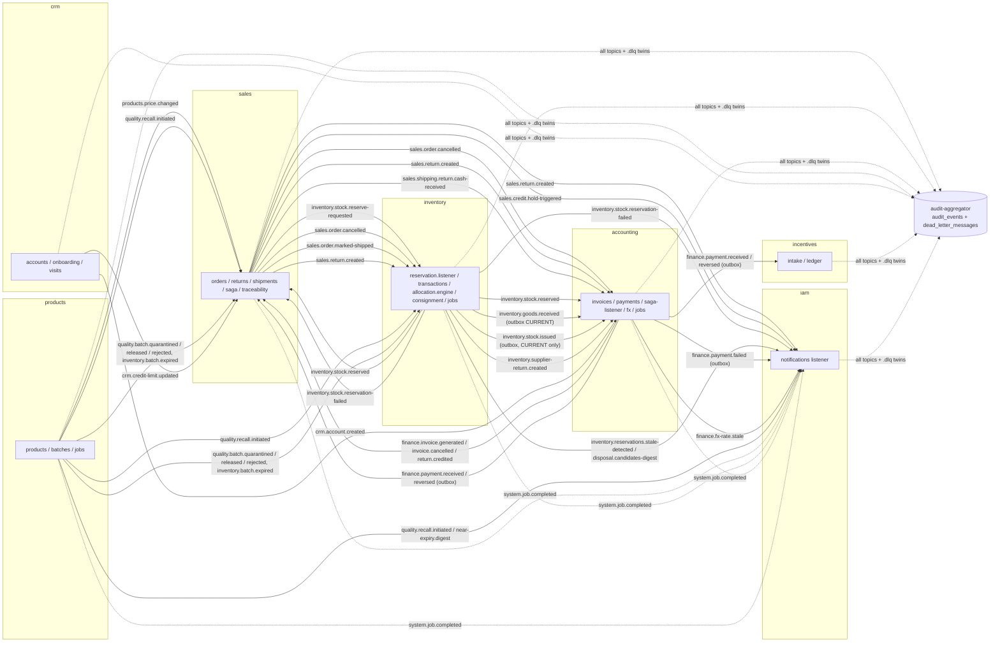

# WEB (BFF) · EVENT BACKBONE · AUDIT-AGGREGATOR — As-Is audit notes

Area owner: sub-agent "web-events". Snapshots: **BASELINE** = `base/` (89c2c31, candidate production), **CURRENT** = `cur/` (fa40270, not deployed).
All paths are relative to the snapshot named. Static reading only — "the code does X" ≠ "production does X".
Classification tags: **[V]** Verified in code/evidence · **[I]** Inferred · **[U]** Unknown.

---

## 1. Scope covered / not covered

| Item | Coverage | Notes |
|---|---|---|
| `apps/web/next.config.js` rewrites, headers, CSP | Full | both snapshots identical |
| `apps/web/Dockerfile`, build-vs-runtime env, compose `web` service | Full | |
| `middleware.ts` | Full | **does not exist** in either snapshot |
| `app/api/*` BFF routes (13 route files) | Full | dashboard, tasks, search, system-health, system-jobs, credit-exposure, customer/inventory/sales reports, inventory-overview/shrinkage, order-detail, recall-trace |
| `lib/bff.ts`, `lib/api.ts` (3115 lines), `lib/workspace-api.ts`, `lib/current-user.ts`, session components | Full for auth/token/refresh; Partial for per-method semantics | |
| Copilot / AI (web + IAM provider layer) | Partial | provider routing, key storage, default opt-in; prompt/tool catalogue not reviewed (IAM area) |
| Web page inventory `app/dashboard/**` (105 CURRENT / 95 BASELINE pages) → API namespaces | Full (static grep, imports followed 2 levels) | method lists truncated; dynamic URLs not resolved |
| Sentry (web + backend wrapper), logging, metrics | Full (config level) | |
| `packages/events` (publisher, consumer, signature, dedup, inbox, DLQ script) | Full | |
| `packages/contracts` (asyncapi → generated events) | Full for events; `api.ts` DTOs not reviewed | |
| Event catalogue (producers/consumers/handlers) | Full (static scan of `buildEnvelope('X')` and `consumer.on('X')`) | |
| Outbox implementations (accounting, crm, inventory) | Full | business correctness of each handler: not reviewed (domain agents) |
| `packages/scheduler` + all jobs | Full for mechanics; job bodies not reviewed | |
| `packages/audit` + local `AuditInterceptor` + `apps/audit-aggregator` (+ DLQ module) | Full | |
| Finance audit-timeline API (accounting) | Full | CURRENT only; not wired (see WEBEVT-01) |
| Health endpoints (`common/health.ts` ×9) | Full | |
| `apps/redpanda` + compose redpanda | Full | runtime topic config Unknown |
| Runtime confirmation (topics, lag, DLQ rows, Sentry DSN, AI provider in use) | Not reviewed | no evidence available → §7 evidence requests |
| `deploy/nginx` template, NPM runbook | Partial | template is a placeholder `api.example.com`; real edge is shared NPM → `web` |

---

## 2. Inventory & responsibilities

### 2.1 Web (Next.js 15.5, App Router, `output: 'standalone'`)

* **No server-side auth layer.** No `middleware.ts` [V]. `app/page.tsx` redirects to `/login`; `/dashboard/layout.tsx:36-40` checks `hasValidSession()` (client-side JWT decode, no signature check — explicitly "UX boundary, NOT a security control", `lib/current-user.ts` comments) and `router.replace('/login?next=…')`.
* **Two API paths from the browser:**
  1. **Rewrites (pass-through proxy)** `next.config.js:51-68`: `/api/{iam,org,products,inventory,crm,sales,accounting,incentives,audit}/:path*` → `${<SVC>_URL}/api/:path*` (env `IAM_URL`, `ORG_URL`, …, `AUDIT_URL`; fallback `http://localhost:300x/api`). No timeout/retry config of its own (Next proxy defaults) [I].
  2. **BFF route handlers** `app/api/*/route.ts` (server-side fan-out). Filesystem routes take precedence over rewrites; no name collision (BFF names are not service prefixes) [V].
* **Build vs runtime env** [V]:
  * Rewrites are resolved at `next build` and baked into `.next/routes-manifest.json`; Dockerfile passes the nine URLs as `ARG`s with compose-service defaults (`apps/web/Dockerfile:35-55` of the file, i.e. `ARG IAM_URL=http://iam:3000/api` …) and **fails the build** if the manifest has ≠9 rewrites or any `localhost` (`Dockerfile` RUN node -e check).
  * BFF routes read `process.env.*_URL` **at runtime**; `docker-compose.production.yml` `web.environment` sets the same nine URLs. Two sources of truth that currently agree [V].
  * `NEXT_PUBLIC_*`: only `NEXT_PUBLIC_SENTRY_DSN` is referenced (`sentry.client.config.ts:7`); it is not a Docker `ARG`, so it cannot be baked into the image build [V].
* **Security headers/CSP** `next.config.js:9-49`: CSP `script-src 'self' 'unsafe-inline'`, `connect-src 'self' https://tile.openstreetmap.org`, `frame-ancestors 'none'`, HSTS; `Cache-Control: private, no-store` on `/api/*` and `/dashboard/*` [V].
* **Container**: `CMD next start` although `output: 'standalone'` (standalone server not used) [V]; healthcheck fetches `/login` only (no backend dependency) [V].

### 2.2 Browser API client & session (`lib/api.ts`, `lib/workspace-api.ts`, `components/topbar.tsx`, `components/session-policy.tsx`)

* **Token storage: `localStorage`** — `accessToken` and `refreshToken` written at `app/login/page.tsx:35-36`; read by `authHeaders()` `lib/api.ts:40-43`, `svcHeaders()` `lib/api.ts:1199-1202`, `workspaceRequest()` `lib/workspace-api.ts:17`. No httpOnly cookie anywhere; BFF/rewrites forward `Authorization: Bearer` only [V].
* **Refresh/extend logic** [V]:
  * Tokens **without** `sid` claim: `topbar.tsx:51-67` calls `POST /api/iam/auth/refresh` every 10 min; failure → clears storage → `/login`.
  * Tokens **with** `sid` (managed sessions): `session-policy.tsx` polls `GET /api/iam/auth/session-check` every 30 s, counts down to `sessionExpiresAt`, auto-extends on user activity via `POST /api/iam/auth/extend` (rotates refresh token, `:47-51`), distinguishes revoked vs expired by 401 `code` (`SESSION_REVOKED`, `INVALID_TOKEN`, `INVALID_REFRESH_TOKEN`).
  * No interceptor-style "401 → refresh → retry" in `lib/api.ts`; errors map to Arabic status messages (`lib/api-error.ts`), `handle()` surfaces `body.message` from services (`lib/api.ts:45-65`).
* **Client-side permission gating**: `hasPermission()` reads `permissions` claim from the decoded JWT (`lib/current-user.ts:119-123`) [V].

### 2.3 BFF routes (CURRENT; BASELINE identical except `tasks`)

| Route | Upstreams (service → path) | Timeout | Partial failure | Auth propagation | Retries |
|---|---|---|---|---|---|
| `GET /api/dashboard` (`app/api/dashboard/route.ts`) | sales `/orders/summary`, `/orders/top-products?days=30`; products `/batches/near-expiry?days=60`; accounting `/collection/aging`; inventory `/stock` + products `/products` (stock value, `lib/inventory-value.ts`); inventory `/stock/by-product` + products `/products` (low stock, `lib/low-stock.ts`); audit `/audit-events?limit=15`, `/audit-events/alerts?limit=10` | 8 s each (`lib/bff.ts:14`) | per-widget `errors{}` bag, `null` data; alerts failure silently null | forwards incoming `Authorization` header; 401 if header absent (presence only) | none |
| `GET /api/tasks` | sales `/orders?status=PENDING_APPROVAL`; inventory `/transactions/adjustment-requests?status=PENDING`; org `/attendance/leaves?status=PENDING`, `/expenses?status=SUBMITTED`; accounting `/matching/discrepancies`, **CURRENT +** `/general-ledger/journals/drafts?status=SUBMITTED`; crm `/support/tickets?status=OPEN`, `/field-sales/follow-ups?overdue=true`; iam `/notifications/unread-count` | 6 s | per-bucket `error`; 403 on notifications hidden by regex (`tasks/route.ts:210`) | same | none |
| `GET /api/search?q=` | crm `/accounts?q=`, sales `/orders?q=`, products `/products?q=`, accounting `/invoices?q=` | 8 s | failed source → empty list (silent) | same | none |
| `GET /api/system-health` | `${base}/health` of 8 services — **Organization missing** (`system-health/route.ts:4-13`) | 4 s | per-service `offline` | requires header presence; `/health` itself is unauthenticated | none |
| `GET/POST /api/system-jobs` | products, inventory, accounting `/jobs`, `/jobs/runs?limit=100`; POST `/jobs/:name/run` — **Sales missing** (`system-jobs/route.ts:11-15`) though sales has a job | 6 s (GET), 120 s (POST) | per-service `errors`; POST fetch exception unhandled → 500 | same | none |
| `GET /api/credit-exposure` | crm `/accounts`, sales `/credit/exposures`, accounting `/collection/receivables?page=…` (paged loop) | 8 s each | all-or-nothing 502 except aging (degrades) | same | none |
| `GET /api/customer-reports?days=` | crm `/accounts/summary`, `/accounts`, `/visits?limit=20`; sales `/orders/top-customers`; accounting `/collection/outstanding-by-account` | 8 s | per-section errors | same | none |
| `GET /api/inventory-overview` | inventory `/stock/summary`; products `/batches/near-expiry`; stock value (as dashboard) | 8 s | per-section | same | none |
| `GET /api/inventory-reports?days=` | inventory `/stock/summary`, `/stock/movement-trend`; products near-expiry; stock value; by-warehouse (`lib/inventory-by-warehouse.ts`: inventory `/stock`, `/warehouses`, products `/products`) | 8 s | per-section | same | none |
| `GET /api/inventory-shrinkage?from&to` | inventory `/stock/shrinkage?from=…&to=…` (unencoded), products `/products` | 8 s | none — any failure → unhandled 500 | same | none |
| `GET /api/sales-reports?days=` | sales `/orders/summary|trend|top-reps|top-products|status-breakdown` | 8 s | per-section | same | none |
| `GET /api/order-detail/[id]` | sales `/orders/${id}` (id not encoded), accounting `/invoices?orderId=`, audit `/audit-events?aggregateId=&limit=50` | 8 s | per-section | same | none |
| `GET /api/recall-trace/[batchId]` | products `/batches/:id`, inventory `/stock/trace/:id`, sales `/traceability/batch/:id`, `/traceability/holds?open=true&batchId=` | 8 s | per-section | same | none |

Common seam `lib/bff.ts:16-29` (`bffGet`): `AbortSignal.timeout`, `cache:'no-store'`, upstream body never echoed (status-only Arabic message) [V].

### 2.4 Copilot / AI [V unless noted]

* Browser → `POST /api/iam/workspace/copilot` (`components/copilot/copilot-chat.tsx:73`) with `{message, allowExternal}`. All AI calls originate **server-side in IAM** (`apps/iam/src/modules/workspace/ai/ai-provider.service.ts`), OpenAI-compatible `/chat/completions`, `redirect:'error'`, timeout `AI_PROVIDER_TIMEOUT_MS` (default 20 s), Bearer key.
* Providers (`ai-router.service.ts:20-40`): Gemini (`generativelanguage.googleapis.com/v1beta/openai`, `gemini-2.5-flash` / `-pro`), Groq (`api.groq.com/openai/v1`, `openai/gpt-oss-120b`), OpenAI (DB setting). Keys: env `AI_GEMINI_API_KEY` / `AI_GROQ_API_KEY`, or DB-stored settings encrypted AES-256-GCM with `AI_CONFIG_ENCRYPTION_KEY` (`apps/iam/src/modules/ai-settings/secret-box.ts:4,20`). Compose passes `COPILOT_API_KEY/MODEL/BASE` and `AI_CONFIG_ENCRYPTION_KEY` to IAM, **not** `AI_GEMINI_API_KEY`/`AI_GROQ_API_KEY` (both snapshots) — so in production the provider is whatever is saved in the settings screen or the legacy `COPILOT_*` path [I]; which one is active is **Unknown**.
* Copilot tools call peer services server-side with the user's token via `*_INTERNAL_URL` (`copilot-tool-handlers.service.ts:20-23`, default `localhost`). **BASELINE compose does not set these** → tool calls hit IAM itself and fail; CURRENT compose adds them (`cur/docker-compose.production.yml:224-231`, with a comment documenting the failure) [V static; runtime U].
* Opt-in default: BASELINE checkbox `external=false` (`base/apps/web/components/copilot/copilot-chat.tsx:45`); CURRENT `external=true` ("owner decision 2026-09-26", `cur/…/copilot-chat.tsx:47`). Server treats `allowExternal !== false` as allowed (`cur/apps/iam/src/modules/workspace/copilot.service.ts:209`).
* Sentry scrubs request bodies for `/workspace/ai-settings` and auth URLs (`sentry.*.config.ts`).

### 2.5 Event backbone

* **Broker:** Redpanda single node, `--smp 1 --overprovisioned`, PLAINTEXT internal only, image pinned via `REDPANDA_IMAGE` (`docker-compose.production.yml` redpanda block); `apps/redpanda/Dockerfile` uses `redpandadata/redpanda:latest` (unused by production compose) [V]. No topic-creation script, no partition/retention/replication config in repo → topics are auto-created with broker defaults [V absence; effective config U].
* **Client:** kafkajs. `EventsModule.forRoot` (`packages/events/src/events.module.ts`) — global singleton `EventPublisher` + `EventConsumer` per service; production refuses to boot without `EVENT_SIGNATURE_PEPPER` (`:13-18`).
* **Envelope** (`packages/contracts/src/generated/events.ts:890-901`): `event_id, event_type, aggregate_id, occurred_at, actor_id, reason_code?, correlation_id, trace_id?, payload, signature?`. **No schema/version field**; AsyncAPI `info.version: 1.0.0` only (`asyncapi.yaml:4`).
* **Topic naming:** `<domain>.<entity>.<event>` (e.g. `finance.payment.received`), DLQ twin `<topic>.dlq` (`publisher.ts:132`). 70 topics in `TOPICS` (CURRENT; 69 BASELINE — `inventory.stock.issued` added).
* **Publisher** (`packages/events/src/publisher.ts`): idempotent producer, `allowAutoTopicCreation:true` (`:129`), **message key = `event_id`** (`:233`), HMAC-SHA256 signing (`signature.ts`), 3 attempts with 200/400 ms backoff, then route to `<topic>.dlq` and **throw `EventPublishError`**; full envelope (incl. payload) logged at error level when lost (`:323-342`).
* **Consumer** (`packages/events/src/consumer.ts`): one group per service (`start()` once), `fromBeginning:false` (`:266`), verify signature → topic-handler (DLQ intake) → `idempotency.seen(event_id)` → handler by `event_type` (1 + 3 retries, 200/400/800 ms; `TypeError` etc. non-retriable) → on failure publish raw message to `<topic>.dlq` with `x-consumer-group/x-error/x-attempts/x-original-topic` headers, **event not marked**, offset advances; if DLQ publish fails → rethrow → Kafka redelivery. Invalid signature → log + counter, **dropped** (no DLQ) (`:333-351`).
* **Dedup:** `PrismaProcessedEventStore` over `processed_events(event_id PK)` (`processed-event-store.ts`) — check-then-act, `mark()` after handler, outside handler's transaction. `runInInboxTransaction` (marker + effect in one tx) used only by `accounting/src/modules/supplier-ledger/supplier-ledger.service.ts:31` (CURRENT). Incentives uses handler-owned marker (`incentives/src/modules/intake/intake.service.ts:17-22`).

### 2.6 Scheduler (`packages/scheduler`)

* `JobRunner.runLocked` (`job-runner.ts:43-87`): interactive Prisma transaction holding `pg_try_advisory_xact_lock(hashtext('nile:<svc>:<job>'))`; job body runs on the normal pool while the lock transaction stays open (timeout `maxRunMs` 30 min, `maxWait` 10 s). Not locked → `SKIPPED_LOCKED` row. Each run writes `job_runs` and publishes `JobCompleted` (`system.job.completed`).
* Cron via `@nestjs/schedule` + `cron`, default TZ **Africa/Cairo**; `SCHEDULER_ENABLED=false` disables cron (manual still possible).
* HTTP: `GET /api/jobs`, `GET /api/jobs/runs`, `POST /api/jobs/:name/run` with `system.jobs.read/run` (`jobs.controller.ts`).

| Service | Job | Cron (Africa/Cairo) | File | Emits |
|---|---|---|---|---|
| products | `expire-batches` | `15 0 * * *` | `apps/products/src/modules/jobs/batch-jobs.ts:29` | BatchExpired (per batch) |
| products | `near-expiry-digest` | `30 6 * * *` | `batch-jobs.ts:30` | NearExpiryDigest |
| inventory | `stale-reservations` | `0 * * * *` | `apps/inventory/src/modules/jobs/inventory-jobs.ts:25` | StaleReservationsDetected |
| inventory | `disposal-candidates` | `0 7 * * *` | `inventory-jobs.ts:26` | DisposalCandidatesDigest |
| inventory | `stock-conservation` | `30 3 * * *` | `inventory-jobs.ts:27` | — |
| accounting | `fx-rate-reminder` | `0 9 * * *` | `apps/accounting/src/modules/jobs/fx-jobs.ts:26` | FxRateStale |
| accounting | `nightly-reconciliation` | `0 2 * * *` | `apps/accounting/src/modules/jobs/reconciliation-jobs.ts:35` | — |
| sales | `sales-reconciliation` | `0 3 * * *` | `apps/sales/src/modules/jobs/sales-jobs.ts:34` | — |

All jobs identical BASELINE/CURRENT (`diff -rq` of each `modules/jobs` empty) [V]. User-reported runtime: `nile_inventory.job_runs≈39` (approx `n_live_tup`, docx.txt:467) — secondary evidence that the inventory scheduler fires.

### 2.7 Audit

* **Local `audit_logs` (every service)** — `common/interceptors/audit.interceptor.ts` (byte-identical in 6 services, variants in crm/sales/iam): for POST/PATCH/PUT/DELETE, **after a successful response**, fire-and-forget insert `{userId, action=method, entity=route path, entityId=response.id, after=response body (top-level keys redacted), reasonCode=x-reason-code, correlationId, ipAddress=req.ip}`; errors only logged. No `before`, failures/denials not recorded, not in the business transaction [V]. No immutability trigger in any service DB except `nile_audit` (`grep reject_audit_mutation */prisma/migrations` → only audit-aggregator) [V]. `app.set('trust proxy')` absent → `req.ip` is the proxy/web container address [I].
* **Central `audit_events` (audit-aggregator)** — consumes **every** `TOPICS` value (`EVENT_TOPICS` map `aggregator.service.ts:26-109`, CI spec `aggregator.coverage.spec.ts` enforces parity) plus every `.dlq` twin; classifies via `@nile/audit` taxonomy (domain, severity, impact flags), lifts `before/after`, writes hash-chained row: `hash = sha256(prev_hash + canonical(content))` (`packages/audit/src/chain.ts`), concurrency guarded by partial unique index on `prev_hash` + 3 retries (`aggregator.service.ts:225-273`). DB trigger blocks UPDATE/DELETE on `audit_events` and `audit_logs` (`migrations/20260909130000_audit_immutable_chain/migration.sql`).
* **APIs** (`audit-events.controller.ts`, guard `PermissionsGuard`, `audit.events.read`): `GET /audit-events` (filters, limit/offset), `/critical`, `/alerts`, `/returns`, `/verify?limit≤20000`. DLQ: `GET /dlq`, `/dlq/stats`, `/dlq/:id`, `POST /dlq/:id/replay`, `/dlq/replay-batch`, `/dlq/:id/discard` (`audit.events.manage`).
* **Finance audit timeline (CURRENT only)** `apps/accounting/src/modules/audit-timeline/*`: `GET /audit-timeline` reads **accounting's local `audit_logs`** (limit ≤500). Module is **not imported in `AppModule`** and controller has no `PermissionsGuard` (WEBEVT-01/02).
* **Retention:** no deletion/retention code for `audit_events`, `audit_logs`, `processed_events`, outbox tables, `job_runs`, `dead_letter_messages` [V absence].

### 2.8 Health / logging / monitoring

* `GET /health` (outside `/api` prefix and auth) on all 9 services (`common/health.ts:105-114`): `SELECT 1` with 3 s timeout + Kafka state from publisher/consumer connection flags. 503 if DB down; Kafka down → 503 only where `criticalKafka:true` (accounting, audit-aggregator, incentives, inventory, sales) else `degraded` 200 (crm, iam, organization, products) (`apps/*/src/main.ts`). `GET /health/details` adds DLQ count (in-memory since boot) and signature-rejection counter; always 200; unauthenticated. No outbox-backlog, consumer-lag or scheduler checks [V].
* Logging: Nest default `Logger` (text). `JsonLogger` exists in `packages/events/src/json-logger.ts` but no `main.ts` uses it [V]. Docker json-file 20 MB×5 rotation (compose).
* Sentry: backend `common/observability/sentry.ts` (`SENTRY_DSN` env, error-only, `tracesSampleRate:0`), consumer `onHandlerFailure` → `captureException`. Web: `sentry.client.config.ts` / `sentry.server.config.ts` exist but no `instrumentation.ts`, no `withSentryConfig` in `next.config.js`, compose `web` env has no `SENTRY_DSN` (WEBEVT-12).
* Metrics: none (`prom-client`/`/metrics`/OpenTelemetry absent) [V].

---

## 3. How it works

### 3.1 Request path browser → NPM → web → service

```mermaid
sequenceDiagram
    autonumber
    participant B as Browser (React, token in localStorage)
    participant NPM as Nginx Proxy Manager (shared w/ HLOS, TLS)
    participant W as web (Next.js :3000)
    participant S as Service (e.g. sales :3000 /api)
    participant DB as Service DB (Postgres)
    B->>NPM: HTTPS GET /api/sales/orders  (Authorization: Bearer <access>)
    NPM->>W: proxy to web:3000 (compose default network)
    Note over W: rewrite baked at build:<br/>/api/sales/:path* → http://sales:3000/api/:path*
    W->>S: GET /api/orders (headers forwarded incl. Authorization)
    S->>S: JwtAuthGuard (JWT_ACCESS_SECRET) → PermissionsGuard (@Permissions)
    S->>DB: Prisma query
    DB-->>S: rows
    S-->>W: 200 JSON (AuditInterceptor writes audit_logs only for mutations)
    W-->>B: 200 JSON (Cache-Control private,no-store + CSP headers)
    Note over B,W: BFF variant: B→W GET /api/tasks; W fans out server-side with the same Bearer (bffGet, 6–8 s timeout)
```
Evidence: `next.config.js:51-68`, `docker-compose.production.yml` header comment (NPM container reaches `web` on `nile-pharma-erp_default`), `web.ports 127.0.0.1:${WEB_PORT}:3000`; guards in `apps/*/src/app.module.ts` (`APP_GUARD JwtAuthGuard`) and per-controller `@UseGuards(PermissionsGuard)`.

### 3.2 Aggregate route fan-out — `GET /api/tasks` (CURRENT)

```mermaid
sequenceDiagram
    autonumber
    participant B as Browser /dashboard/tasks
    participant T as web BFF /api/tasks
    participant SA as sales
    participant IN as inventory
    participant OR as organization
    participant AC as accounting
    participant CR as crm
    participant IA as iam
    B->>T: GET /api/tasks (Bearer)
    alt no Authorization header
        T-->>B: 401
    end
    par Promise.all, each bffGet timeout 6 s, no retry
        T->>SA: GET /orders?status=PENDING_APPROVAL
        T->>IN: GET /transactions/adjustment-requests?status=PENDING
        T->>OR: GET /attendance/leaves?status=PENDING
        T->>OR: GET /expenses?status=SUBMITTED
        T->>AC: GET /matching/discrepancies
        T->>CR: GET /support/tickets?status=OPEN
        T->>CR: GET /field-sales/follow-ups?overdue=true
        T->>IA: GET /notifications/unread-count
        T->>AC: GET /general-ledger/journals/drafts?status=SUBMITTED (CURRENT only)
    end
    Note over T: failure of one call → that bucket {items:[],count:0,error:"<Arabic status msg>"}<br/>count = rows.length of the returned page; items = first 5; ageHours computed server-side
    T-->>B: {checkedAt,total,buckets[],errors[]}
    Note over B: read-only inbox; each bucket links to the owning screen
```
Evidence: `cur/apps/web/app/api/tasks/route.ts:72-222`.

### 3.3 Event flow map (business consumers; audit-aggregator subscribes to every topic + `.dlq` twin and is omitted for readability)



### 3.4 Event catalogue (CURRENT; 68 event types). Audit-aggregator (`audit-aggregator-group`, handler `apps/audit-aggregator/src/modules/aggregator/aggregator.service.ts:155-157`) consumes **every** row below and is not repeated in the consumer column.

Handler files for the consumer groups: sales-saga → `apps/sales/src/modules/saga/saga.orchestrator.ts:55-93`; accounting-saga → `apps/accounting/src/modules/saga-listener/saga-listener.service.ts:48-63`; inventory-reservation → `apps/inventory/src/modules/allocation/reservation.listener.ts:35-59`; incentives-intake → `apps/incentives/src/modules/intake/intake.service.ts:61-64`; iam-notifications → `apps/iam/src/modules/notifications/notifications-events.listener.ts:40-162` (ROUTES map). Publish mode: DIRECT = `EventPublisher.publish()` after the DB transaction (dual write); OUTBOX = row written in the business transaction, relayed by a poller.

| Event | Topic | Producer | Publish mode | Business consumers (group) | Producer location (CURRENT) |
|---|---|---|---|---|---|
| OrderCreated | `sales.order.created` | sales | DIRECT | — | sales/…/orders/orders.service.ts:784 |
| OrderApproved | `sales.order.approved` | sales | DIRECT | — | sales/…/orders/orders.service.ts:1198 |
| OrderCancelled | `sales.order.cancelled` | sales | DIRECT | accounting-saga, inventory-reservation | sales/…/orders/orders.service.ts:1352; sales/…/traceability/traceability.service.ts:285 |
| OrderRejected | `sales.order.rejected` | sales | DIRECT | — | sales/…/orders/orders.service.ts:1207 |
| OrderShipped | `sales.order.shipped` | **none (dead contract)** | — | — | — |
| OrderMarkedShipped | `sales.order.marked-shipped` | sales | DIRECT | inventory-reservation | sales/…/orders/orders.service.ts:1263 |
| OrderMarkedDelivered | `sales.order.marked-delivered` | sales | DIRECT | — | sales/…/orders/orders.service.ts:1288 |
| ShippingReturnCashReceived | `sales.shipping.return.cash-received` | sales | DIRECT | accounting-saga | sales/…/shipments/shipments.service.ts:255 |
| OrderHeldForRecall | `sales.order.held-for-recall` | sales | DIRECT | — | sales/…/traceability/traceability.service.ts:189 |
| OrderRecallHoldReleased | `sales.order.recall-hold-released` | sales | DIRECT | — | sales/…/traceability/traceability.service.ts:279 |
| CreditHoldTriggered | `sales.credit.hold-triggered` | sales | DIRECT | iam-notifications | sales/…/orders/orders.service.ts:1107; sales/…/orders/orders.service.ts:817 |
| CreditHoldOverridden | `sales.credit.hold-overridden` | sales | DIRECT | — | sales/…/credit/credit.service.ts:396 |
| SalesReturnCreated | `sales.return.created` | sales | DIRECT | accounting-saga, inventory-reservation, iam-notifications | sales/…/returns/returns.service.ts:153 |
| DiscountOverridden | `sales.discount.overridden` | sales | DIRECT | — | sales/…/orders/orders.service.ts:802 |
| StockReserved | `inventory.stock.reserved` | inventory | DIRECT | sales-saga, accounting-saga | inventory/…/allocation/reservation.listener.ts:219; inventory/…/allocation/reservation.listener.ts:315 |
| StockReleased | `inventory.stock.released` | inventory | DIRECT | — | inventory/…/allocation/reservation.listener.ts:111 |
| StockReserveRequested | `inventory.stock.reserve-requested` | sales | DIRECT | inventory-reservation | sales/…/saga/saga.orchestrator.ts:264 |
| StockReservationFailed | `inventory.stock.reservation-failed` | inventory | DIRECT | sales-saga, iam-notifications | inventory/…/allocation/reservation.listener.ts:306 |
| StockAdjusted | `inventory.stock.adjusted` | inventory | DIRECT | — | inventory/…/transactions/transactions.service.ts:227; inventory/…/transactions/transactions.service.ts:407 |
| StockTransferred | `inventory.stock.transferred` | inventory | DIRECT | — | inventory/…/transfers/transfers.service.ts:116 |
| GoodsReceived | `inventory.goods.received` | inventory | OUTBOX (CURRENT) / DIRECT (BASELINE) | accounting-saga | inventory/…/transactions/transactions.service.ts:110 |
| StockIssued | `inventory.stock.issued` | inventory | OUTBOX (CURRENT only) | accounting-saga | inventory/…/allocation/allocation.engine.ts:531 |
| BatchExpired | `inventory.batch.expired` | products | DIRECT | sales-saga, inventory-reservation | products/…/batches/batches.service.ts:232 |
| BatchCreated | `inventory.batch.created` | products | DIRECT | — | products/…/batches/batches.service.ts:67 |
| SupplierReturnCreated | `inventory.supplier-return.created` | inventory | DIRECT | accounting-saga | inventory/…/transactions/transactions.service.ts:148 |
| ConsignmentCreated | `inventory.consignment.created` | inventory | DIRECT | — | inventory/…/consignment/consignment.service.ts:34 |
| ConsignmentStockAdded | `inventory.consignment.stock-added` | inventory | DIRECT | — | inventory/…/consignment/consignment.service.ts:182 |
| ConsignmentStockConsumed | `inventory.consignment.stock-consumed` | **none (dead contract)** | — | — | — |
| ConsignmentStockReturned | `inventory.consignment.stock-returned` | inventory | DIRECT | — | inventory/…/consignment/consignment.service.ts:242 |
| ConsignmentRecallHold | `inventory.consignment.recall-hold` | inventory | DIRECT | — | inventory/…/allocation/reservation.listener.ts:144 |
| QuarantineBlockedReservations | `inventory.quarantine.blocked-reservations` | inventory | DIRECT | — | inventory/…/allocation/reservation.listener.ts:458 |
| StaleReservationsDetected | `inventory.reservations.stale-detected` | inventory | DIRECT | iam-notifications | inventory/…/jobs/inventory-jobs.ts:128 |
| DisposalCandidatesDigest | `inventory.disposal.candidates-digest` | inventory | DIRECT | iam-notifications | inventory/…/jobs/inventory-jobs.ts:167 |
| AdjustmentDecided | `inventory.adjustment.decided` | inventory | DIRECT | — | inventory/…/transactions/transactions.service.ts:322; inventory/…/transactions/transactions.service.ts:358 |
| InvoiceGenerated | `finance.invoice.generated` | accounting | DIRECT | sales-saga | accounting/…/invoices/invoices.service.ts:1110; accounting/…/invoices/invoices.service.ts:545; accounting/…/invoices/invoices.service.ts:884 |
| InvoiceCancelled | `finance.invoice.cancelled` | accounting | DIRECT | sales-saga | accounting/…/invoices/invoices.service.ts:1239 |
| PaymentReceived | `finance.payment.received` | accounting | OUTBOX | sales-saga, incentives-intake | accounting/…/payments/payments.service.ts:189; accounting/…/payments/payments.service.ts:654 |
| PaymentFailed | `finance.payment.failed` | accounting | OUTBOX | iam-notifications | accounting/…/payments/payments.service.ts:470 |
| PaymentReversed | `finance.payment.reversed` | accounting | OUTBOX | sales-saga, incentives-intake | accounting/…/payments/payments.service.ts:409 |
| SalesReturnCredited | `finance.return.credited` | accounting | DIRECT | sales-saga | accounting/…/saga-listener/saga-listener.service.ts:286 |
| ExchangeRateRecorded | `finance.exchange-rate.recorded` | accounting | OUTBOX | — | accounting/…/fx/fx.service.ts:251-261 |
| FxRateStale | `finance.fx-rate.stale` | accounting | DIRECT | iam-notifications | accounting/…/jobs/fx-jobs.ts:64 |
| RecallInitiated | `quality.recall.initiated` | products | DIRECT | sales-saga, inventory-reservation, iam-notifications | products/…/batches/batches.service.ts:257 |
| BatchQuarantined | `quality.batch.quarantined` | products | DIRECT | sales-saga, inventory-reservation | products/…/batches/batches.service.ts:209 |
| BatchReleased | `quality.batch.released` | products | DIRECT | sales-saga, inventory-reservation | products/…/batches/batches.service.ts:171 |
| BatchRejected | `quality.batch.rejected` | products | DIRECT | sales-saga, inventory-reservation | products/…/batches/batches.service.ts:194 |
| NearExpiryDigest | `quality.near-expiry.digest` | products | DIRECT | iam-notifications | products/…/jobs/batch-jobs.ts:55 |
| ProductPriceChanged | `products.price.changed` | products | DIRECT | sales-saga | products/…/products/products.service.ts:87 |
| ProductCostChanged | `products.cost.changed` | products | DIRECT | — | products/…/products/products.service.ts:132 |
| CommissionCalculated | `incentives.commission.calculated` | incentives | DIRECT | — | incentives/…/ledger/ledger.service.ts:80 |
| BonusTriggered | `incentives.bonus.triggered` | incentives | DIRECT | — | incentives/…/ledger/ledger.service.ts:89 |
| IncentiveEvaluationRequested | `incentives.evaluation.requested` | **none (dead contract)** | — | — | — |
| IncentiveLedgerRecorded | `incentives.ledger.recorded` | incentives | DIRECT | — | incentives/…/ledger/ledger.service.ts:72 |
| UserCreated | `iam.user.created` | iam | DIRECT | — | iam/…/users/users.service.ts:143 |
| UserStatusChanged | `iam.user.status-changed` | iam | DIRECT | — | iam/…/users/users.service.ts:184; iam/…/users/users.service.ts:201 |
| RoleAssigned | `iam.role.assigned` | iam | DIRECT | — | iam/…/users/users.service.ts:258 |
| PermissionChanged | `iam.permission.changed` | iam | DIRECT | — | iam/…/roles/roles.service.ts:140; iam/…/roles/roles.service.ts:71; iam/…/users/users.service.ts:289 |
| DepartmentCreated | `org.department.created` | organization | DIRECT | — | organization/…/departments/departments.service.ts:65 |
| TerritoryAssigned | `org.territory.assigned` | organization | DIRECT | — | organization/…/territories/territories.service.ts:69 |
| ContractCreated | `org.contract.created` | organization | DIRECT | — | organization/…/contracts/contracts.service.ts:223 |
| ContractUpdated | `org.contract.updated` | organization | DIRECT | — | organization/…/contracts/contracts.service.ts:302 |
| ContractRenewed | `org.contract.renewed` | organization | DIRECT | — | organization/…/contracts/contracts.service.ts:371 |
| ContractTerminated | `org.contract.terminated` | organization | DIRECT | — | organization/…/contracts/contracts.service.ts:409 |
| AccountCreated | `crm.account.created` | crm | DIRECT/OUTBOX | accounting-saga | crm/…/accounts/accounts.service.ts:259; crm/…/accounts/customer-onboarding.service.ts:283-292 |
| VisitLogged | `crm.visit.logged` | crm | DIRECT | — | crm/…/visits/visits.service.ts:121 |
| CreditLimitUpdated | `crm.credit-limit.updated` | crm | DIRECT | sales-saga | crm/…/accounts/accounts.service.ts:292 |
| JobCompleted | `system.job.completed` | products,inventory,accounting,sales | DIRECT (best-effort) | iam-notifications | packages/scheduler/src/job-runner.ts:92 |
| BulkOperationCompleted | `system.bulk-operation.completed` | products | DIRECT | — | products/…/products/products.service.ts:150 |

BASELINE differences: no `StockIssued`/`inventory.stock.issued` (contract, producer, accounting consumer, aggregator map all absent); `GoodsReceived` published DIRECT after commit (`base/apps/inventory/src/modules/transactions/transactions.service.ts:99-108`) — BASELINE has **no inventory outbox**. Everything else identical (contracts diff limited to `StockIssued` and `GoodsReceived.purchase_order_id/_line_id`).

### 3.5 Outbox relays (three different implementations) [V]

| | accounting `outbox_events` | crm `customer_event_outbox` | inventory `inventory_outbox_events` (CURRENT only) |
|---|---|---|---|
| File | `apps/accounting/src/modules/outbox/outbox.service.ts` | `apps/crm/src/modules/accounts/customer-outbox.service.ts` | `cur/apps/inventory/src/modules/transactions/inventory-outbox.service.ts` |
| Interval | 5 s, `running` guard | 10 s (`unref`), `running` guard | 2 s, **no guard** (overlapping flushes possible) |
| Batch | 20 rows `findMany` then per-row optimistic claim (`leaseUntil` 120 s) | 1 row × up to 10, `FOR UPDATE SKIP LOCKED`, lock 5 min | 1 row × up to 50, `FOR UPDATE SKIP LOCKED`, lease 60 s |
| Order | `createdAt, id` | `available_at` | `created_at` |
| On failure | backoff `min(300 s, 2^attempts s)` | retry after 60 s, stop batch | **lease cleared, no backoff → same row re-claimed in same loop** |
| `OUTBOX_DISPATCH_ENABLED=false` honoured | yes (`:21`) | yes (`:30`) | **no** |
| Max attempts / parking | none | none | none |
| Published events | PaymentReceived/Reversed/Failed, ExchangeRateRecorded | AccountCreated (onboarding path only) | GoodsReceived, StockIssued |

Publish failure inside the relay first goes through `EventPublisher.publish` (3 tries → `.dlq`), so a transient broker send failure produces a `.dlq` copy **and** a later successful outbox retry [I].

### 3.6 DLQ lifecycle [V]

1. Consumer handler exhausts retries → raw message to `<topic>.dlq` with headers; or publisher send exhausts → message to `<topic>.dlq` without `x-consumer-group`.
2. Audit-aggregator topic-handler on every `.dlq` twin → `DlqService.recordDeadLetter` upsert on `(event_id, consumer_group)` (`publisher` when header absent), status `PENDING` (`dlq.service.ts:69-107`).
3. Operator (`audit.events.manage`) on `/dashboard/audit` → `POST /dlq/:id/replay` → re-publishes **stored original envelope** (same `event_id`, re-signed) to the live topic → groups that already processed it skip via `processed_events`; failed group re-executes; row → `RESOLVED` (= re-published, not re-processed). `replay-batch`, `discard(reason)` also exist. CLI alternative `packages/events/scripts/dlq-replay.ts` (reads Kafka `.dlq` directly, dry-run default).
4. Signature-rejected messages never reach the DLQ.

### 3.7 Audit chain write/verify [V]
`persistEnvelope` reads head `ORDER BY seq DESC`, computes hash, inserts; unique partial index `audit_events_prev_hash_key WHERE prev_hash <> 'GENESIS'` makes concurrent writers collide, loser retries ×3 then throws → consumer retry → `.dlq`. `GET /audit-events/verify` recomputes the last N (≤20 000) rows.

---

## 4. Business processes found (in this area)

| Process | Trigger / actor | Steps & controls | APIs / tables / events | Status |
|---|---|---|---|---|
| **Sign-in & session keeping** | any user | login → tokens in localStorage → periodic refresh (no-`sid`) or session-check/extend (`sid`); revoked vs expired messaging; logout revokes refresh token | `/api/iam/auth/{login,refresh,extend,session-check,logout}` | Complete (client side); security posture see WEBEVT-13 |
| **Approval / exception inbox (مهامي)** | manager/approver | read-only aggregation of 8 (BASELINE) / 9 (CURRENT) queues, links to owning screens | `/api/tasks` (§3.2) | Partial: counts page-capped, not per-approver (WEBEVT-21) |
| **Executive overview dashboard** | management | orders summary, top products, near-expiry, AR aging, stock value, low stock, recent audit, operational alerts | `/api/dashboard` | Partial: stock value truncated & not cost-layer based (WEBEVT-04) |
| **Global search** | any user | 4 sources searched server-side, 6 hits each | `/api/search` | Complete (silent source failure) |
| **Recall trace** | QA/recall officer | batch + stock locations + distribution + holds in one call | `/api/recall-trace/:batchId` | Complete (read) |
| **Credit exposure review** | credit controller | CRM accounts × Sales exposure × AR aging | `/api/credit-exposure` | Partial: only first 200 accounts alphabetically (WEBEVT-04) |
| **Event-driven order saga** (cross-service) | system | OrderCreated → StockReserveRequested → StockReserved/Failed → InvoiceGenerated → PaymentReceived …; cancellation, returns, recall holds | §3.3/3.4 | Implemented; delivery guarantees vary per event (WEBEVT-05) |
| **Dead-letter triage & replay** | admin with `audit.events.manage` | list/inspect/replay/discard | `/api/audit/dlq/*`, `dead_letter_messages` | Complete; signature drops excluded (WEBEVT-08) |
| **Scheduled jobs & manual run** | system / admin `system.jobs.run` | cron under advisory lock, `job_runs`, `JobCompleted` → notifications | `/api/<svc>/jobs*`, `/api/system-jobs` | Complete for products/inventory/accounting; sales job invisible in UI (WEBEVT-15) |
| **Audit trail query & integrity verification** | auditor `audit.events.read` | filter, critical/alerts, verify chain | `/api/audit/audit-events*` | Complete for event-sourced audit; local `audit_logs` weaker (WEBEVT-17/18) |
| **Finance audit timeline** | accountant `accounting.audit.read` | timeline over accounting `audit_logs` | `/api/accounting/audit-timeline` | CURRENT only, **not wired** (WEBEVT-01) |
| **AI copilot Q&A** | any user with page access | message → IAM → external LLM (Gemini/Groq/OpenAI) with read tools → answer + links | `/api/iam/workspace/copilot` | Partial: BASELINE tool calls broken by missing env; CURRENT external-by-default (WEBEVT-14) |
| **Ops health view** | admin | per-service `/health` latency/status + job runs | `/api/system-health`, `/api/system-jobs` | Partial: Organization & Sales omitted (WEBEVT-15) |

---

## 5. BASELINE vs CURRENT differences (this area)

| Item | BASELINE (89c2c31) | CURRENT (fa40270) | Evidence |
|---|---|---|---|
| Web pages | 95 | 105: + `accounting/journals`, `audit-timeline`, `bank-reconciliation`, `finance`, `finance-dashboard`, `general-ledger`, `gl-workbench`, `matching`, `period-close`, `warehouses/[id]` | `diff -rq base/apps/web cur/apps/web` |
| Nav | — | quick actions per area; `audit-timeline`, `finance-dashboard`, `gl-workbench`, `general-ledger` **not in nav** (orphan routes) | `cur/apps/web/lib/nav-routes.ts` grep |
| `/api/tasks` | 8 queues | + journal drafts queue | `tasks/route.ts:98-100,189-197` |
| `lib/api.ts` | — | + `/api/accounting/{gl-workbench,audit-timeline,finance-dashboard,supplier-payments,…}` | diff |
| Copilot default | external **off** | external **on** | `copilot-chat.tsx:45` vs `:47` |
| Copilot tools URLs (compose) | not set → localhost | set | `cur/docker-compose.production.yml:224-231` |
| Contracts | 69 topics | + `inventory.stock.issued`/`StockIssued`; GoodsReceived + PO refs | `diff` contracts |
| Inventory outbox | none (direct publish) | `inventory_outbox_events` relay; GoodsReceived & StockIssued via outbox | `cur/…/inventory-outbox.service.ts` |
| Accounting consumer | 7 topics | + `inventory.stock.issued` | `saga-listener.service.ts:54,62` |
| Aggregator map / taxonomy | — | + StockIssued (CRITICAL, inventory+financial) | `aggregator.service.ts:50`, `taxonomy.ts:164-168` |
| `runInInboxTransaction` users | 0 | 1 (supplier-ledger) | grep |
| Finance audit timeline | absent | present but unwired | §2.7 |
| packages/events, scheduler, redpanda, audit chain, health | identical | identical | `diff -rq` empty |

---

## 6. Findings

### WEBEVT-01 — CURRENT web calls four accounting features whose Nest modules are not registered (404)
- Domain: Finance UI ↔ Accounting API wiring ; Affected: **CURRENT**
- Verification: Verified (static) — module registration read directly; runtime not executed
- Type: Confirmed defect
- Severity: **High** — release-blocking for CURRENT: the Payables "pay supplier" action and three finance screens cannot work; no effect on BASELINE.
- Evidence (cur): `apps/accounting/src/app.module.ts:39-51` imports list contains no `GlWorkbenchModule`, `AuditTimelineModule`, `FinanceDashboardModule`, `SupplierPaymentsModule`; these classes are defined only in `modules/gl-workbench/gl-workbench.module.ts:6`, `modules/audit-timeline/audit-timeline.module.ts:5`, `modules/finance-dashboard/finance-dashboard.module.ts:5`, `modules/supplier-ledger/supplier-payments.module.ts:12` and `modules/supplier-payments/supplier-payments.module.ts:12` (two modules, both `@Controller('supplier-payments')`), never imported anywhere (`grep -rn "<Module>"`). Web callers: `apps/web/lib/api.ts:264-272` (gl-workbench), `:2477` (finance-dashboard), `:2479-2483` (audit-timeline), `:2652-2653` (supplier-payments) used by `app/dashboard/payables/page.tsx:344`.
- Trigger: deploy CURRENT; user opens `/dashboard/payables` → pay, or `/dashboard/gl-workbench`, `/dashboard/audit-timeline`, `/dashboard/finance-dashboard`.
- Impact: 404 → Arabic "item not found" toast; supplier payment from Payables impossible in CURRENT UI.
- To verify/close: start CURRENT accounting locally and `GET /api/accounting/supplier-payments` (expect 404); decide which of the two duplicate `SupplierPaymentsModule`s is canonical; coordinate with the accounting-area findings.

### WEBEVT-02 — Latent authorization bypass: same four accounting controllers have no `PermissionsGuard`
- Domain: Security / Finance ; Affected: **CURRENT** (latent until wired)
- Verification: Verified (static)
- Type: Potential risk
- Severity: **High** (if WEBEVT-01 is "fixed" by just importing the modules) — any authenticated user could create/approve/post/reverse GL journals (`gl-workbench`) and create/reverse supplier payments; `@Permissions()` is metadata only.
- Evidence (cur): accounting global guards are only `JwtAuthGuard`, `ThrottlerGuard` (`apps/accounting/src/app.module.ts:54-55`); `PermissionsGuard` is applied per controller via `@UseGuards` elsewhere (e.g. `modules/general-ledger/*.controller.ts:7`). Missing in `modules/gl-workbench/gl-workbench.controller.ts:6-25`, `modules/audit-timeline/audit-timeline.controller.ts:4-8`, `modules/finance-dashboard/finance-dashboard.controller.ts:4-8`, `modules/supplier-ledger/supplier-payments.controller.ts:6-31`.
- Trigger: module imported without adding guard.
- Impact: SoD bypass on GL posting and AP payments.
- To verify/close: add a CI check that every controller (or the app) has `PermissionsGuard`; or register it as `APP_GUARD`.

### WEBEVT-03 — CURRENT `/dashboard/general-ledger` fetches without Authorization header
- Domain: Finance UI ; Affected: **CURRENT**
- Verification: Verified (static)
- Type: Confirmed defect
- Severity: Medium — page always fails (401) for every user; read-only screen, no data impact.
- Evidence (cur): `apps/web/app/dashboard/general-ledger/page.tsx:6` — `fetch(url)` with no headers; accounting `JwtAuthGuard` is global (`app.module.ts:54`). Page not in nav (`lib/nav-routes.ts`).
- Trigger: open the page.
- Impact: trial balance / P&L / balance sheet screen unusable (same data available elsewhere?).
- To verify/close: use `accountingApi` helpers; confirm whether the page is meant to ship.

### WEBEVT-04 — BFF aggregates are silently truncated by upstream list caps
- Domain: Reporting / Credit control / Inventory valuation ; Affected: **BOTH**
- Verification: Verified (static)
- Type: Potential risk (becomes defect once data exceeds caps)
- Severity: Medium — management/credit screens show incomplete numbers without any warning; user-reported production row counts are currently low (docx.txt:464-476, approximate), so likely not yet triggered.
- Evidence: `apps/web/lib/inventory-value.ts:24-37` and `lib/inventory-by-warehouse.ts:26` call `${INVENTORY}/stock` with no `take` → `apps/inventory/src/modules/stock/stock.service.ts:30` defaults to **200 balance rows** (ordered by expiry); valuation uses master `costPrice` (inactive products → 0), not cost layers (`stock.service.ts:43-54` `valuation()` exists but is unused by BFF). `lib/credit-exposure.ts:74-77` and `app/api/customer-reports/route.ts:48,87` use `${CRM}/accounts` → `apps/crm/src/modules/accounts/accounts.service.ts:119-120` `orderBy nameAr, take: 200` → credit-exposure report lists only the first 200 accounts alphabetically; `accountCount` max 200. `tasks` counts = `rows.length` of upstream page (e.g. sales orders `take: 200`, `apps/sales/src/modules/orders/orders.service.ts:100`).
- Trigger: >200 stock balance rows / >200 customer accounts.
- Impact: understated "Inventory Value", missing over-limit customers in credit exposure, wrong counts.
- To verify/close: `SELECT count(*) FROM stock_balances` (nile_inventory), `SELECT count(*) FROM accounts WHERE is_active` (nile_crm); add server-side aggregate endpoints.

### WEBEVT-05 — Most domain events are dual-written (DB commit, then direct publish); no outbox outside 3 services
- Domain: Integration / data consistency ; Affected: **BOTH** (BASELINE also for `GoodsReceived`)
- Verification: Inferred (static reading of publish sites; failure not reproduced)
- Type: Potential risk
- Severity: Medium — a broker outage or send failure between commit and publish leaves downstream services permanently out of sync (e.g. order created but `StockReserveRequested` never sent; credit limit changed but sales projection not updated; in BASELINE stock received with no AP posting) — only recoverable from error logs / `.dlq`.
- Evidence: catalogue §3.4 "DIRECT" rows, e.g. `cur/apps/sales/src/modules/orders/orders.service.ts:782-788` (publish after transaction result), `apps/sales/src/modules/saga/saga.orchestrator.ts:263-264` (StockReserveRequested), `apps/crm/src/modules/accounts/accounts.service.ts:259,292`; `base/apps/inventory/src/modules/transactions/transactions.service.ts:99-108` (GoodsReceived after commit). Publisher behaviour `packages/events/src/publisher.ts:241-270` (throws after DLQ attempt). README itself: "There is no DB outbox yet" (`packages/events/README.md`).
- Mitigations present: sales stalled-saga detection (`salesApi.stalledSagas`, `/dashboard/system/health`), consumer-side redelivery for handlers that publish inside their handler, accounting tombstone for cancel-before-invoice (`saga-listener.service.ts:184-207`).
- Trigger: Redpanda restart/unavailable >~0.6 s during a business write.
- Impact: lost/partial saga steps; HTTP 500 to the user after the write already committed (retry may duplicate where no idempotency key).
- To verify/close: grep production logs for `EVENT NOT DELIVERED`; count `dead_letter_messages WHERE consumer_group='publisher'`.

### WEBEVT-06 — CURRENT inventory outbox relay: no backoff, no overlap guard, ignores kill-switch
- Domain: Integration ; Affected: **CURRENT**
- Verification: Inferred (static)
- Type: Potential risk
- Severity: Medium — a single poison/oversized envelope (or broker send error) is retried up to 50× per flush every 2 s (each attempt itself 3 sends + a `.dlq` publish), producing DLQ/log floods and blocking newer rows (head-of-line by `created_at`); `OUTBOX_DISPATCH_ENABLED=false` cannot pause it.
- Evidence (cur): `apps/inventory/src/modules/transactions/inventory-outbox.service.ts:12` (2 s interval, no `running` flag), `:35-55` (claim oldest by `created_at`), `:58-80` (on failure `processingUntil:null`, no `nextAttempt`), absence of `OUTBOX_DISPATCH_ENABLED` (grep: only crm/accounting honour it).
- Trigger: persistent publish error for one row (e.g. message > broker max size, topic ACL, malformed envelope).
- Impact: GoodsReceived/StockIssued (AP and COGS postings) delayed indefinitely; Kafka `.dlq` growth.
- To verify/close: `SELECT count(*), max(attempts), min(created_at) FROM inventory_outbox_events WHERE published_at IS NULL` after CURRENT deploy.

### WEBEVT-07 — CURRENT rollout gap: new `inventory.stock.issued` consumer starts at "latest"
- Domain: Integration / Finance (COGS) ; Affected: **CURRENT** (deployment step)
- Verification: Inferred
- Type: Operational uncertainty
- Severity: Medium — consumers subscribe with `fromBeginning:false`; if CURRENT inventory publishes `StockIssued` before CURRENT accounting has (re)joined `accounting-saga-group` with the new topic, those events are skipped by accounting (only the aggregator may have them) → missing COGS postings.
- Evidence: `packages/events/src/consumer.ts:266`; `cur/apps/accounting/src/modules/saga-listener/saga-listener.service.ts:54,62`; topic auto-created on first publish (`publisher.ts:129`).
- Trigger: rolling deploy order inventory → accounting.
- Impact: inventory/COGS GL mismatch.
- To verify/close: deploy accounting before inventory, or pre-create topic and reset group offset to earliest for the new topic; reconcile `StockIssued` audit_events vs accounting COGS entries.

### WEBEVT-08 — Signature-rejected events are dropped without durable trace
- Domain: Integration / audit integrity ; Affected: **BOTH**
- Verification: Verified (code path)
- Type: Potential risk
- Severity: Medium — a single service deployed with a different `EVENT_SIGNATURE_PEPPER` silently loses all its events at every consumer (no handler, no DLQ, no aggregator row); only an in-memory counter on `/health/details` (reset on restart) and an error log.
- Evidence: `packages/events/src/consumer.ts:282,333-351`; `apps/*/src/common/health.ts:133-142`.
- Trigger: pepper rotation not applied to all nine services simultaneously.
- Impact: missing business effects and audit gaps.
- To verify/close: grep logs for `REJECTED envelope`; consider routing rejections to a quarantine table.

### WEBEVT-09 — Idempotency marker is written after the handler, outside its transaction
- Domain: Integration ; Affected: **BOTH**
- Verification: Verified (mechanism) / Inferred (impact)
- Type: Potential risk
- Severity: Low — duplicates are only possible on crash/DB error between handler commit and `mark()`, or during rebalance; then correctness depends on each handler's own business-key idempotency (not reviewed here; domain agents).
- Evidence: `packages/events/src/consumer.ts:290-316`, `processed-event-store.ts:31-45`; transactional inbox only in `cur/apps/accounting/src/modules/supplier-ledger/supplier-ledger.service.ts:31` and incentives custom store `intake.service.ts:17-22`.
- To verify/close: domain review of each handler's duplicate behaviour (sales saga, accounting invoice-on-StockReserved, inventory reservation).

### WEBEVT-10 — Event contracts unversioned; payload drift and dead event types
- Domain: Contracts ; Affected: **BOTH**
- Verification: Verified
- Type: Improvement
- Severity: Low — no consumer currently depends on the drifted fields.
- Evidence: envelope has no version field (`packages/contracts/src/generated/events.ts:890-901`); `OrderCreatedPayload` declares `lines, total_amount, currency` (`events.ts:26-35`) but sales publishes `{order_id, account_id, sales_rep_id, grand_total, line_count}` (`cur/apps/sales/src/modules/orders/orders.service.ts:782-788`); `OrderShipped`, `ConsignmentStockConsumed`, `IncentiveEvaluationRequested` have topics but no producer (grep). Payloads are not validated at consume time (`envelope.payload as {...}` casts).
- To verify/close: add `schema_version` and runtime validation for financial events.

### WEBEVT-11 — Broker topology & topic config undeclared (single broker, auto-created topics)
- Domain: Infrastructure ; Affected: **BOTH**
- Verification: Unknown (runtime) / Verified (absence in repo)
- Type: Operational uncertainty
- Severity: Medium — RF=1 single node with one volume: broker disk loss = loss of un-consumed events and DLQ topics; retention (broker default) bounds Kafka-level replay; if any topic has >1 partition, key=`event_id` gives no per-aggregate ordering (e.g. PaymentReceived vs PaymentReversed for one invoice).
- Evidence: compose redpanda block (no topic init, `--smp 1`), `publisher.ts:129,233`, `consumer.ts:477`; user-observed Redpanda ≈2 GiB RAM (docx.txt:487-498).
- To verify/close: evidence requests §7.

### WEBEVT-12 — Web error tracking is effectively off; no metrics anywhere; JSON logger unused
- Domain: Observability ; Affected: **BOTH**
- Verification: Inferred (Sentry SDK loading rules) / Verified (config absence)
- Type: Operational uncertainty
- Severity: Medium — BFF/SSR/browser errors are not reported; only container logs; backend Sentry depends on `SENTRY_DSN` being non-empty in `.env` (Unknown).
- Evidence: no `apps/web/instrumentation.ts`/`instrumentation-client.ts`, no `withSentryConfig` in `next.config.js`; `NEXT_PUBLIC_SENTRY_DSN` not a Dockerfile `ARG`; compose `web.environment` lacks `SENTRY_DSN`; `packages/events/src/json-logger.ts` not referenced by any `main.ts`; no prom-client/OTel.
- To verify/close: `docker exec web env | cut -d= -f1 | grep -i sentry`; `grep -rl "ingest.*sentry" .next/static` inside the web container; check `.env` has `SENTRY_DSN` set (name only).

### WEBEVT-13 — Long-lived refresh token in localStorage with `script-src 'unsafe-inline'`
- Domain: Security ; Affected: **BOTH**
- Verification: Verified
- Type: Potential risk
- Severity: Medium — any XSS yields both tokens (refresh default TTL `7d`, compose `JWT_REFRESH_TTL`); CSP allows inline scripts so it does not mitigate injected inline script. No XSS was found in this review.
- Evidence: `apps/web/app/login/page.tsx:35-36`, `lib/api.ts:40-43`, `next.config.js:11`; `docker-compose.production.yml` `JWT_REFRESH_TTL: "${JWT_REFRESH_TTL:-7d}"`.
- To verify/close: security-area decision (httpOnly cookie via BFF, or nonce-based CSP).

### WEBEVT-14 — Copilot: CURRENT sends user prompts to an external LLM by default; BASELINE tool calls cannot reach services
- Domain: AI / data protection ; Affected: CURRENT (default-on) / BASELINE (broken tools)
- Verification: Verified (code + compose); runtime provider Unknown
- Type: Question (business/privacy decision) + Confirmed defect (BASELINE tools, static)
- Severity: Medium — CURRENT: free-text questions (may contain customer/pharma data) and tool-read ERP data go to Gemini/Groq/OpenAI unless the user unticks; BASELINE: copilot tools hit `localhost:300x` inside IAM and fail, so answers degrade to model-only/guided.
- Evidence: `cur/apps/web/components/copilot/copilot-chat.tsx:47`; `cur/apps/iam/src/modules/workspace/copilot.service.ts:209`; `apps/iam/src/modules/workspace/copilot-tool-handlers.service.ts:20-23` (both); `base/docker-compose.production.yml` iam env (no `*_INTERNAL_URL`) vs `cur/docker-compose.production.yml:224-231` (comment states every tool call failed).
- To verify/close: business owner sign-off on external AI processing/data residency; IAM logs for `تعذر الاتصال بالخدمة المعنية`; which provider row is enabled in IAM AI settings.

### WEBEVT-15 — Ops pages miss services: health omits Organization, jobs omit Sales
- Domain: Operations ; Affected: **BOTH**
- Verification: Verified
- Type: Confirmed defect
- Severity: Low — monitoring blind spots (Organization outage; failed `sales-reconciliation` job) in the in-app health/log screens.
- Evidence: `apps/web/app/api/system-health/route.ts:4-13`; `apps/web/app/api/system-jobs/route.ts:11-15` vs `apps/sales/src/modules/jobs/jobs.module.ts:9`, `sales-jobs.ts:34`.

### WEBEVT-16 — BFF "authentication" is header presence only
- Domain: Security ; Affected: **BOTH**
- Verification: Verified
- Type: Potential risk
- Severity: Low — `/api/system-health` returns per-service status/latency/health body to anyone sending any `Authorization` value (data routes are still protected by backend JWT checks).
- Evidence: `system-health/route.ts:23-24`; other BFF routes same pattern but rely on upstream validation.

### WEBEVT-17 — Local `audit_logs` are best-effort, success-only and mutable; central audit only covers events
- Domain: Audit / compliance ; Affected: **BOTH**
- Verification: Verified (code) / Inferred (req.ip)
- Type: Potential risk
- Severity: Medium — HTTP mutations that do not emit an event (many master-data endpoints) are only in per-service `audit_logs`, written after the response outside the transaction (lost on DB error), without `before`, without failed/denied attempts, and editable by the service DB role (no trigger outside `nile_audit`); IP is likely the proxy's. Two audit stores can diverge (user observation docx.txt:446-449).
- Evidence: `apps/accounting/src/common/interceptors/audit.interceptor.ts:36-60` (identical in 6 services); trigger only in `apps/audit-aggregator/prisma/migrations/20260909130000_audit_immutable_chain/migration.sql`; no `trust proxy` in `apps/*/src/main.ts`.
- To verify/close: business definition of the "system of record" for audit; check DB role privileges on `audit_logs`.

### WEBEVT-18 — Audit chain limits: unkeyed hash, no anchoring, TRUNCATE unprotected, no retention policy
- Domain: Audit integrity ; Affected: **BOTH**
- Verification: Verified
- Type: Improvement
- Severity: Low — a DB superuser can drop the trigger and recompute an internally consistent chain (plain SHA-256, no external anchor/HMAC); migration comment claims Postgres has no TRUNCATE triggers (statement-level `BEFORE TRUNCATE` triggers do exist); `verify` covers at most the last 20 000 rows; no retention/archival for `audit_events`, `processed_events`, outbox tables, `job_runs`, `dead_letter_messages`.
- Evidence: `packages/audit/src/chain.ts` (createHash sha256), migration `20260909130000_audit_immutable_chain/migration.sql:8-12`, `audit-events.service.ts:198-214`; grep for deleteMany/retention → none.

### WEBEVT-19 — Scheduler lock semantics and stuck RUNNING rows
- Domain: Operations ; Affected: **BOTH**
- Verification: Inferred
- Type: Potential risk
- Severity: Low — advisory xact lock prevents *concurrent* runs only; a replica whose tick fires after another finished re-runs the job (comment claims "exactly once per tick"); job body runs while a 30-min interactive transaction pins a pool connection; if the lock transaction times out, `runLocked` throws before updating `job_runs` → row stays `RUNNING` forever and no `JobCompleted`. Production compose runs one replica per service (no `deploy.replicas`) so duplicates are currently unlikely.
- Evidence: `packages/scheduler/src/job-runner.ts:6-12,43-87`.
- To verify/close: `SELECT name,status,started_at FROM job_runs WHERE status='RUNNING' AND started_at < now()-interval '1 hour'` per service.

### WEBEVT-20 — Web build/runtime configuration drift points
- Domain: Deployment ; Affected: **BOTH**
- Verification: Verified
- Type: Improvement
- Severity: Info — rewrites baked from build ARGs while BFF routes read runtime env (two sources of truth, currently equal); image built with `output:'standalone'` but started with `next start`; `apps/redpanda/Dockerfile` (`:latest`) unused by production; no `middleware.ts` (client-only route gating — acceptable because backend guards are the control).
- Evidence: `apps/web/Dockerfile` ARG/ENV block and CMD; `next.config.js:40,51-68`; compose `web.environment`.

### WEBEVT-21 — Tasks inbox is not approver-specific and counts are page-limited
- Domain: Workflow ; Affected: **BOTH**
- Verification: Verified
- Type: Improvement
- Severity: Low — every user sees the same queues filtered only by their service read permissions/ownership scopes; counts capped by upstream page size; 403 on notifications masked by regex on the Arabic message.
- Evidence: `apps/web/app/api/tasks/route.ts:82-100,112-119,210`.

### WEBEVT-22 — Unencoded parameters interpolated into upstream URLs
- Domain: Security hygiene ; Affected: **BOTH**
- Verification: Verified
- Type: Improvement
- Severity: Low — `id` (order-detail) and `from`/`to` (inventory-shrinkage) are not `encodeURIComponent`-ed; manipulation stays within the same service under the caller's own token.
- Evidence: `app/api/order-detail/[id]/route.ts:32-36`; `app/api/inventory-shrinkage/route.ts:31`. (recall-trace encodes correctly, `:30`.)

### WEBEVT-23 — Outbox relays have no attempt ceiling and publisher-DLQ copies outlive successful retries
- Domain: Integration ; Affected: **BOTH** (accounting, crm) + CURRENT (inventory)
- Verification: Inferred
- Type: Improvement
- Severity: Low — a row retried after a publisher `.dlq` routing becomes a `dead_letter_messages` row (`consumer_group='publisher'`, PENDING) even if a later retry delivered it; operator replay is then redundant (deduped by `processed_events`, so harmless) but misleading; three relays implement different semantics (§3.5) and accounting relay can reorder events for one aggregate after a backoff.
- Evidence: `apps/accounting/src/modules/outbox/outbox.service.ts:79-91`; `crm/.../customer-outbox.service.ts:48-60`; `apps/audit-aggregator/src/modules/dlq/dlq.service.ts:69-107`.

---

## 7. Open questions & evidence requests

### Business owner
1. Is sending copilot questions/ERP data to external LLM providers (Gemini/Groq/OpenAI) approved, and was "external on by default" (CURRENT) an explicit decision? Any data-residency constraint (Egypt/KSA)?
2. Which audit store is the system of record for regulators/auditors: central `audit_events` (event-based) or per-service `audit_logs` (HTTP-based)? Required retention period?
3. Should the tasks inbox be per-approver (approval matrix) or a shared departmental view?
4. Are `audit-timeline`, `finance-dashboard`, `gl-workbench`, `general-ledger` screens meant to ship in the next release (they are orphan, unwired)?
5. Expected scale: number of active customers and stock-balance rows within 12 months (to size WEBEVT-04).

### Server evidence (read-only, metadata only)
- Redpanda: `docker exec <redpanda> rpk topic list`; `rpk topic describe finance.payment.received -p`; `rpk cluster config get auto_create_topics_enabled`; `rpk cluster config get log_retention_ms`; `rpk group list`; `rpk group describe accounting-saga-group sales-saga-group inventory-reservation-group incentives-intake-group iam-notifications-group audit-aggregator-group` (lag only).
- DLQ / outbox backlog (counts only):
  `SELECT status, consumer_group, count(*) FROM dead_letter_messages GROUP BY 1,2;` (nile_audit)
  `SELECT count(*) FILTER (WHERE published_at IS NULL), max(attempts) FROM outbox_events;` (nile_accounting)
  `SELECT count(*) FILTER (WHERE sent_at IS NULL), max(attempts) FROM customer_event_outbox;` (nile_crm)
- Scheduler: `SELECT name, status, count(*), max(started_at) FROM job_runs GROUP BY 1,2;` in nile_products, nile_inventory, nile_accounting, nile_sales.
- Audit chain: `GET /api/audit/audit-events/verify?limit=5000` with an auditor token (summary only); `SELECT count(*), min(seq), max(seq), count(*) FILTER (WHERE hash='') FROM audit_events;`.
- Web: `docker exec nile-pharma-erp-web-1 node -e "const m=require('/app/apps/web/.next/routes-manifest.json');console.log(JSON.stringify(m.rewrites).replace(/\/\/[^/]+@/g,'//***@'))"` (confirms baked rewrite targets); `docker exec nile-pharma-erp-web-1 env | cut -d= -f1 | sort` (names only).
- Sentry: `docker exec <each> sh -c 'test -n "$SENTRY_DSN" && echo set || echo empty'` (no value printed).
- Copilot: IAM AI settings — `SELECT provider, enabled, updated_at FROM <ai settings table>` (no key columns); IAM logs grep count `provider .* unreachable|auth rejected`.
- Logs: `docker compose logs --since 30d <svc> | grep -c "EVENT NOT DELIVERED\|REJECTED envelope\|Routed poison message"` per service.
- Data volume for WEBEVT-04: `SELECT count(*) FROM stock_balances` (nile_inventory); `SELECT count(*) FROM accounts` (nile_crm).

---

## Appendix A — Web page inventory (CURRENT, 105 pages; static scan of page + imported components, 2 levels)

"Backend targets" = service prefixes reached via `lib/api.ts` namespaces or raw `/api/...` literals; `BFF:` = Next route handler. Namespace→service: `api`/`notificationsApi`/`workspaceApi`→iam (note `api.gl*` → `/api/accounting/gl-workbench`), `orgApi`/`payrollApi`→organization, `productsApi`/`priceListsApi`→products, `inventoryApi`→inventory (+BFF overview/reports/shrinkage), `crmApi`→crm (+BFF customer-reports), `salesApi`/`promotionsApi`/`pricingRulesApi`/`discountsApi`→sales (+BFF credit-exposure, order-detail, recall-trace, sales-reports), `accountingApi`→accounting, `incentivesApi`→incentives, `auditApi`→audit-aggregator (+`/api/iam/audit`), `dashboardApi`/`searchApi`→BFF. Pages with "—" are redirects (`consignment`→accounts, `financial-reports`→reports/financial), placeholders (`stock-counts`, `purchase-requests`, `settings/company`), or delegate to components not resolved by the scan (`field-sales/{calendar,reports,proposals}` → `components/field-sales/*-workspace.tsx`).


**Home / Tasks / Reports** (7 pages)

| Page | Backend targets | API calls (namespace.{methods}, truncated) |
|---|---|---|
| `/dashboard` | /api/dashboard, sales | salesApi.{reportOverview} |
| `/dashboard/reports/analytics` | BFF:/api/dashboard | dashboardApi.{overview} |
| `/dashboard/reports/customers` | crm | crmApi.{reportOverview} |
| `/dashboard/reports/financial` | accounting, sales | accountingApi.{aging,collectionByRep,summary} salesApi.{creditExposures} |
| `/dashboard/reports/inventory` | inventory | inventoryApi.{reportOverview} |
| `/dashboard/reports/sales` | sales | salesApi.{reportOverview} |
| `/dashboard/tasks` | /api/tasks | — |

**Sales & Orders** (12 pages)

| Page | Backend targets | API calls (namespace.{methods}, truncated) |
|---|---|---|
| `/dashboard/approvals/history` | audit | auditApi.{recent} |
| `/dashboard/approvals/requests` | sales | salesApi.{approve,orders,reject} |
| `/dashboard/credit-exposure` | sales | salesApi.{creditExposureBreakdown,creditExposureReport} |
| `/dashboard/credit-limits` | accounting, crm, sales | accountingApi.{outstandingByAccount,statement} crmApi.{accounts,updateCreditLimit} salesApi.{creditExposures} |
| `/dashboard/discounts` | sales | discountsApi.{create,duplicate,impact,kpis,list,matrix,replaceMatrix,setReview…} |
| `/dashboard/orders` | crm, iam, products, sales | api.{listUsers} crmApi.{accounts} productsApi.{list} salesApi.{approve,cancel,createReturn,deliver,detail,importOrders,orderSaga,orders…} |
| `/dashboard/orders/new` | crm, iam, inventory, products, sales | crmApi.{accounts,linkFieldSalesVisitOrder,visits} inventoryApi.{addConsignmentDelivery,addConsignmentStock,consignmentAgreements,createConsignmentAgreement,prev… |
| `/dashboard/pricing-rules` | products, sales | pricingRulesApi.{create,duplicate,list,move,setEngine,simulate,toggle,update} productsApi.{list} |
| `/dashboard/promotions` | products, sales | productsApi.{list} promotionsApi.{create,duplicate,list,performance,setPaused,simulate,update} |
| `/dashboard/recalls` | products, sales | productsApi.{batches,serialization,serializeBatch,traceSerial} salesApi.{recallHolds,recallTrace,releaseRecallHold} |
| `/dashboard/returns` | accounting, crm, products, sales | accountingApi.{creditNote,creditNotes,invoices} crmApi.{accounts} productsApi.{batches} salesApi.{approveReturn,cancelReturn,createReturn,detail,orders,rejectRe… |
| `/dashboard/shipping` | accounting, crm, sales | accountingApi.{invoices} crmApi.{accounts} salesApi.{bulkAssignShipments,cancelShipment,capturePod,completeShipmentReturn,deliver,orders,podBlobUrl,ship…} |

**CRM & Field sales** (21 pages)

| Page | Backend targets | API calls (namespace.{methods}, truncated) |
|---|---|---|
| `/dashboard/accounts` | accounting, crm, iam, products, sales | accountingApi.{financialAccounts,invoices,ledgerBalance,outstandingByAccount,recordAccountCollection,recordPayment,statement} api.{listUsers} crmApi.{account,ac… |
| `/dashboard/accounts/[id]` | /api/crm/accounts, accounting, crm, inventory, org, products, sales | accountingApi.{invoices,ledgerBalance,purchaseOrders,statement,supplierLedger,supplierLedgerBalance,supplierPayables} crmApi.{account,tickets,updateAccount} inv… |
| `/dashboard/consignment` | — | — |
| `/dashboard/customer-gifts` | crm, org | crmApi.{accounts} orgApi.{createCustomerGift,customerGiftAction,customerGifts,payCustomerGift,rejectCustomerGift} |
| `/dashboard/field-sales` | accounting, crm, sales | accountingApi.{invoices,payments} crmApi.{fieldSalesDashboard,fieldSalesVisits} salesApi.{orders} |
| `/dashboard/field-sales/calendar` | — | — |
| `/dashboard/field-sales/customers` | crm, iam | api.{listUsers} crmApi.{accounts,createFieldSalesAssignment,createNextFieldSalesVisit,fieldSalesAssignments} notificationsApi.{send} |
| `/dashboard/field-sales/customers/[accountId]` | accounting, crm, sales | accountingApi.{invoices} crmApi.{account,fieldSalesCalls,fieldSalesFollowUps,fieldSalesVisits,logFieldSalesCall,tickets} salesApi.{orders,returnsRegister} |
| `/dashboard/field-sales/follow-ups` | /api/crm/accounts, crm, iam, org | api.{listUsers} crmApi.{accounts,cancelFieldSalesFollowUp,completeFieldSalesFollowUp,fieldSalesDashboard,fieldSalesFollowUps,fieldSalesPlans,fieldSalesVisits,up… |
| `/dashboard/field-sales/my-day` | crm | crmApi.{completeFieldSalesVisit,fieldSalesMyDay,startFieldSalesVisit} |
| `/dashboard/field-sales/performance` | /api/crm/accounts, crm, iam, org | api.{listUsers} crmApi.{accounts,cancelFieldSalesFollowUp,completeFieldSalesFollowUp,fieldSalesDashboard,fieldSalesFollowUps,fieldSalesPlans,fieldSalesVisits,up… |
| `/dashboard/field-sales/plans` | /api/crm/accounts, crm, iam, org | api.{listUsers} crmApi.{accounts,cancelFieldSalesFollowUp,completeFieldSalesFollowUp,fieldSalesDashboard,fieldSalesFollowUps,fieldSalesPlans,fieldSalesVisits,up… |
| `/dashboard/field-sales/proposals` | — | — |
| `/dashboard/field-sales/reports` | — | — |
| `/dashboard/field-sales/reps` | /api/crm/accounts, crm, iam, org | api.{listUsers} crmApi.{accounts,cancelFieldSalesFollowUp,completeFieldSalesFollowUp,fieldSalesDashboard,fieldSalesFollowUps,fieldSalesPlans,fieldSalesVisits,up… |
| `/dashboard/field-sales/reschedules` | /api/crm/field-operations | — |
| `/dashboard/field-sales/routes` | /api/crm/accounts, crm, iam, org | api.{listUsers} crmApi.{accounts,cancelFieldSalesFollowUp,completeFieldSalesFollowUp,fieldSalesDashboard,fieldSalesFollowUps,fieldSalesPlans,fieldSalesVisits,up… |
| `/dashboard/field-sales/territories` | /api/crm/accounts, crm, iam, org | api.{listUsers} crmApi.{accounts,cancelFieldSalesFollowUp,completeFieldSalesFollowUp,fieldSalesDashboard,fieldSalesFollowUps,fieldSalesPlans,fieldSalesVisits,up… |
| `/dashboard/field-sales/visits` | crm | crmApi.{cancelFieldSalesVisit,fieldSalesVisits,missFieldSalesVisit} |
| `/dashboard/leads` | crm | crmApi.{accounts,createLead,leads,updateLeadStatus} |
| `/dashboard/support` | crm, iam | crmApi.{accounts,createFieldSalesComplaint,createSupportCategory,createTicket,slaStats,ticket,tickets,updateTicketStatus} workspaceApi.{draft,saveDraft} |

**Finance / Accounting** (29 pages)

| Page | Backend targets | API calls (namespace.{methods}, truncated) |
|---|---|---|
| `/dashboard/accounting` | accounting | accountingApi.{account,closeFiscalPeriod,coaTree,collectionByRep,createAccount,createFiscalPeriod,createLandedCostVoucher,fiscalPeriod…} |
| `/dashboard/accounting/journals` (CURRENT only) | accounting | accountingApi.{accounts,approveJournalDraft,createJournalDraft,journalDrafts,postJournalDraft,rejectJournalDraft,submitJournalDraft} |
| `/dashboard/audit-timeline` (CURRENT only) | accounting | accountingApi.{auditTimeline} |
| `/dashboard/bank-reconciliation` (CURRENT only) | /api/accounting | — |
| `/dashboard/cash-banks` | accounting | accountingApi.{createFinancialAccount,financialAccounts,payments} |
| `/dashboard/collection` | accounting, products | accountingApi.{aging,cancelInvoice,checks,collectionByRep,invoice,invoices,recordPayment,reissueInvoice…} productsApi.{createSupplier,suppliers,updateSupplierCr… |
| `/dashboard/finance` (CURRENT only) | accounting | accountingApi.{cashBanksOverview,fiscalPeriods,journalDrafts,payables,receivables,summary} |
| `/dashboard/finance-dashboard` (CURRENT only) | accounting | accountingApi.{financeDashboard} |
| `/dashboard/financial-reports` | — | — |
| `/dashboard/fixed-assets` | accounting | accountingApi.{createFixedAsset,disposeFixedAsset,fixedAsset,fixedAssets,runMonthlyDepreciation} |
| `/dashboard/fx` | accounting | accountingApi.{fxCreateCurrency,fxCreateRate,fxCurrencies,fxExposure,fxRate,fxRates,fxRevalue} |
| `/dashboard/general-ledger` (CURRENT only) | /api/accounting/general-ledger | — |
| `/dashboard/general-purchases` | accounting | accountingApi.{createGeneralPurchase,generalPurchaseHistory,generalPurchases,updateGeneralPurchase} |
| `/dashboard/gl-workbench` (CURRENT only) | iam | api.{glApprove,glJournal,glJournals,glPost,glReject,glReverse} |
| `/dashboard/invoices` | accounting | accountingApi.{cancelInvoice,invoices,recordPayment,reversePayment} |
| `/dashboard/invoices/[id]` | accounting, products, sales | accountingApi.{cancelInvoice,invoice,recordPayment,reversePayment} productsApi.{list} salesApi.{detail} |
| `/dashboard/invoices/[id]/print` | accounting | accountingApi.{invoice} |
| `/dashboard/invoices/new` | accounting, crm, iam, inventory, products | accountingApi.{createInvoice,invoice,shippingCatalog,shippingQuote} crmApi.{accounts} inventoryApi.{previewDirectAllocation} productsApi.{batches,list} workspac… |
| `/dashboard/matching` (CURRENT only) | accounting | accountingApi.{overrideMatch,rejectMatch,threeWayMatches} |
| `/dashboard/overdue` | accounting, crm, iam | accountingApi.{financialAccounts,invoices,recordPayment,statement} crmApi.{updateCreditLimit} notificationsApi.{catalogue,send} |
| `/dashboard/payables` | accounting, products | accountingApi.{financialAccounts,payables,supplierPayables,supplierPayment} productsApi.{suppliers} |
| `/dashboard/period-close` (CURRENT only) | accounting | accountingApi.{closeChecks,closeFiscalPeriod,fiscalPeriods,reopenFiscalPeriod,yearEndClosing} |
| `/dashboard/purchase-orders` | accounting | accountingApi.{approvePurchaseOrder,cancelPurchaseOrder,createPurchaseOrder,createVendorInvoice,purchaseOrder,purchaseOrders,rejectPurchaseOrder,submitPurchaseO… |
| `/dashboard/purchase-requests` | — | — |
| `/dashboard/receivables` | accounting, crm, iam | accountingApi.{cancelInvoice,financialAccounts,invoices,outstandingByAccount,recordPayment,statement} crmApi.{updateCreditLimit} notificationsApi.{catalogue,sen… |
| `/dashboard/settings/taxes` | accounting | accountingApi.{form41,markForm41Reported,recordTaxEntry,vatSummary} |
| `/dashboard/supplier-accounts` | accounting, products | accountingApi.{supplierLedgerBalance} productsApi.{suppliers} |
| `/dashboard/suppliers` | crm, products | crmApi.{updateAccount} productsApi.{archiveSupplier,createSupplier,suppliers,updateSupplier} |
| `/dashboard/suppliers/[id]` | /api/crm/accounts, accounting, crm, inventory, org, products, sales | accountingApi.{invoices,ledgerBalance,purchaseOrders,statement,supplierLedger,supplierLedgerBalance,supplierPayables} crmApi.{account,tickets,updateAccount} inv… |

**Inventory & Products** (10 pages)

| Page | Backend targets | API calls (namespace.{methods}, truncated) |
|---|---|---|
| `/dashboard/batches` | iam, products, sales | api.{createSignature} productsApi.{batches,createBatch,createQc,list,qcRecords,quarantineQueue,rejectBatch,release…} salesApi.{batchDistribution} |
| `/dashboard/inventory` | accounting, iam, inventory, products | accountingApi.{purchaseOrder,purchaseOrders,supplierLedgerBalance} inventoryApi.{adjustStock,adjustmentRequests,approveAdjustmentRequest,createTransfer,createWa… |
| `/dashboard/price-lists` | products | priceListsApi.{bulkAdjust,create,importItems,items,list,removeItem,setItem,update} productsApi.{activate,archive,brands,bulkAdjustPrices,bulkUpdate,categories,i… |
| `/dashboard/products` | inventory, products | inventoryApi.{stock} productsApi.{activate,archive,batches,bulkImport,bulkUpdate,create,createBatch,get…} |
| `/dashboard/receiving` | accounting, inventory, products | accountingApi.{purchaseOrder,purchaseOrders,supplierLedgerBalance} inventoryApi.{quarantinePools,receiveStock,transactions,warehouses} productsApi.{batches,crea… |
| `/dashboard/settings/uom` | products | productsApi.{addUomConversion,breakdownUom,convertUom,list,productUoms,seedUnits,uomUnits} |
| `/dashboard/stock-counts` | — | — |
| `/dashboard/stock-movements` | inventory, products | inventoryApi.{transactions} productsApi.{list} |
| `/dashboard/warehouses` | inventory | inventoryApi.{createWarehouse,stockByWarehouse,updateWarehouse,warehouses} |
| `/dashboard/warehouses/[id]` (CURRENT only) | inventory, products | inventoryApi.{addBin,adjustStock,createTransfer,deleteBin,stock,transactions,transfers,updateWarehouse…} productsApi.{batches,list} |

**HR / Organization** (7 pages)

| Page | Backend targets | API calls (namespace.{methods}, truncated) |
|---|---|---|
| `/dashboard/hr/attendance` | org | orgApi.{attendanceReport,egyptianTaxCalc,employees,recordAttendance} |
| `/dashboard/hr/contracts` | org | orgApi.{contracts,contractsExpiring,createContract,employees,renewContract,terminateContract,updateContract} |
| `/dashboard/hr/expenses` | org | orgApi.{createExpense,departments,employees,expense,expenseAction,expenses,payExpense,rejectExpense} |
| `/dashboard/hr/leaves` | org | orgApi.{applyLeave,approveLeave,employees,leaveBalance,leaves,rejectLeave} |
| `/dashboard/hr/payroll` | org | orgApi.{departments,employees} payrollApi.{adjustEntry,approveRun,calculateRun,cancelRun,components,createComponent,createPeriod,createRun…} |
| `/dashboard/organization` | accounting, iam, org | accountingApi.{shippingCatalog} api.{listUsers} orgApi.{assignTerritoryRep,branch,branches,contract,contracts,contractsByEmployee,createBranch,createContract…} |
| `/dashboard/settings/master-data` | org | orgApi.{createLookup,lookupCategories,lookups} |

**Incentives** (4 pages)

| Page | Backend targets | API calls (namespace.{methods}, truncated) |
|---|---|---|
| `/dashboard/commissions` | incentives | incentivesApi.{activeRuleSet,ledger} |
| `/dashboard/incentive-rules` | incentives | incentivesApi.{activateRuleSet,createRuleSet,ruleSets} |
| `/dashboard/incentives` | incentives | incentivesApi.{approve,ledger,pay,reverse} |
| `/dashboard/leaderboard` | incentives | incentivesApi.{leaderboard,leaderboardSummary} |

**IAM / Admin / System / Audit** (15 pages)

| Page | Backend targets | API calls (namespace.{methods}, truncated) |
|---|---|---|
| `/dashboard/audit` | audit | auditApi.{critical,dlqDiscard,dlqItem,dlqList,dlqReplay,dlqReplayAll,dlqStats,iamLog…} |
| `/dashboard/copilot` | /api/iam/workspace | — |
| `/dashboard/notifications` | iam | api.{listRoles,listUsers} notificationsApi.{broadcast,catalogue,markAllRead,markRead,preferences,send,updatePreferences} |
| `/dashboard/roles` | iam | api.{assignRolePermissions,assignUserRole,createRole,deleteRole,getRole,listPermissions,listRoles,listUsers…} |
| `/dashboard/settings/app` | — | — |
| `/dashboard/settings/company` | — | — |
| `/dashboard/settings/integrations` | /api/system-health, audit, iam | auditApi.{dlqStats} notificationsApi.{channels} |
| `/dashboard/settings/notifications` | iam | notificationsApi.{catalogue,dispatch,preferences,queueStats,updatePreferences} |
| `/dashboard/settings/security` | iam | api.{changePassword,signature,sodRules,sodScan,verifySignature} |
| `/dashboard/settings/session-policy` | /api/iam/workspace | — |
| `/dashboard/settings/support-categories` | crm | crmApi.{createSupportCategory,updateSupportCategory} |
| `/dashboard/system/events` | audit | auditApi.{recent} |
| `/dashboard/system/health` | /api/system-health, /api/system-jobs, sales | salesApi.{sagaDistribution,stalledSagas} |
| `/dashboard/system/logs` | /api/system-jobs, audit | auditApi.{recent,verify} |
| `/dashboard/users` | iam | api.{createUser,deleteUser,getUser,listUsers,sodEvaluate,updateUserStatus} |
